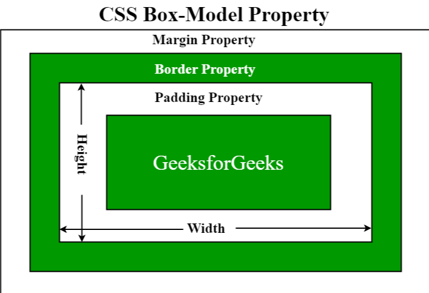

# 盒子模型

文档流(normal flow)

* 网页是一个多层结构，一层叠着一层。
* 通过CSS可以分别为每一层设计样式。
* 作为用户只能看到最上面的一层。
* 这些层中，最底下的一层叫做文档流，文档流是网页的基础，我们所创建的元素默认都是在文档流中排列。
* 元素主要有两个状态：
  * 在文档流中。
  * 不在文档流中（脱离文档流）。
* 元素在文档流中的特点：
  * 块元素：
    * 在页面中独占一行（自上向下垂直排列）。
    * 默认宽度是父元素的全部（会把父元素撑满）。
    * 默认高度是被内容（子元素）撑开的。
  * 行内元素：
    * 行内元素不会独占一行，只占自身的大小。
    * 行内元素在页面中自左向右水平排列，如果一行中不能容纳下所有的行内元素，泽元素会换到第二行继续自左向右排列。

## 盒子模型(box model)

* CSS中页面所有的元素都可以看做是一个矩形的盒子。
* 将元素设置为矩形的盒子后，对页面的布局就将变成不同的盒子摆放到不同的位置。
* 每一个盒子都由以下部分组成：
  * 内容区(content)
  * 内边距(padding)
  * 边框(border)
  * 外边距(margin)

## 盒子模型-内容区

内容区(content)，元素中所有的子元素和文本内容都在内容区中排列，常见的属性：
        大小由height和width两个属性来设置：
			height：设置内容区高度
			width：设置内容区宽度
        设置背景颜色：
			background-color

~~~html
<!DOCTYPE html>
<html lang="en">
<head>
    <meta charset="UTF-8">
    <meta http-equiv="X-UA-Compatible" content="IE=edge">
    <meta name="viewport" content="width=device-width, initial-scale=1.0">
    <title>Document</title>
    

</head>
<body>
    
    

</body>
</html>
~~~

## 盒子模型-边框

边框(border)，边框属于盒子边缘，边缘联盟属于盒子内部，出了边框都是盒子外部，要设置边框，要设置三个样式：

* 边框的宽度：border-width
* 边框的颜色：border-color
* 边框的样式：border-style

border-width：

* 不设置时一般有默认值（可以不设置），不同浏览器不同，一般为3px。
* 设置时有两种设置方式：
  * 指定四个方向边框的宽度 border-width:;
    * 四个值：上  右  下  左
    * 三个值： 上  左右  下
    * 两个值：  上下  左右
    * 一个值：   上下左右
  * 指定单独某一个边的宽度 border-xxx-width:;
    * border-top-width
    * border-right-width
    * border-bottom-width
    * border-left-width

border-color：同border-width的设置方法，默认值设置的color值，color值默认为black（可以不设置）。

border-style：同样的设置方法，但是border-style的默认值为none表示没有边框，因此border-style必须设置，否则将会没有边框。

| border-style常用值 | 样式     |
| ------------------ | -------- |
| solid              | 实线     |
| dotted             | 点状虚线 |
| dashed             | 虚线     |
| double             | 双线     |

~~~html
<!DOCTYPE html>
<html lang="en">
<head>
    <meta charset="UTF-8">
    <meta http-equiv="X-UA-Compatible" content="IE=edge">
    <meta name="viewport" content="width=device-width, initial-scale=1.0">
    <title>Document</title>
    

</head>
<body>
    
    

    

    

    

</body>
</html>
~~~

边框的简便设置方式：border: 宽度 颜色 样式;（顺序可以变），同样的道理，宽度和颜色可以不写，为默认值。

~~~html
<!DOCTYPE html>
<html lang="en">
<head>
    <meta charset="UTF-8">
    <meta http-equiv="X-UA-Compatible" content="IE=edge">
    <meta name="viewport" content="width=device-width, initial-scale=1.0">
    <title>Document</title>
    

</head>
<body>
    
    

</body>
</html>
~~~

## 盒子模型-内边距

内边距(padding),是指内容区与边框之间的距离，一共有四个方向的内边距：

* padding-top
* padding-right
* padding-bottom
* padding-left

内边距的设置会影响到盒子的大小。(盒子可见框大小由内容区、内边距、边框共同决定)

背景颜色(background-color)会延伸到内边距上。

~~~html
<!DOCTYPE html>
<html lang="en">
<head>
    <meta charset="UTF-8">
    <meta http-equiv="X-UA-Compatible" content="IE=edge">
    <meta name="viewport" content="width=device-width, initial-scale=1.0">
    <title>Document</title>
    
</head>
<body>
    
    

        

    

</body>
</html>
~~~

## 盒子模型-外边距

外边距(margin)，不会影响可见框的大小，但是会影响盒子的位置，影响盒子实际空间的大小。

一共有四个方向的外边距：

设置左上外边距，可以移动自己。

* margin-top：上外边距，设置一个正值，元素会向下移动。
* margin-left：左外边距，设置一个正值，元素会向右移动。

设置右下外边距，可以移动自己。

* margin-bottom：下外边距，设置一个正值，其下方的元素会向下移动。

~~~html
<!DOCTYPE html>
<html lang="en">
<head>
    <meta charset="UTF-8">
    <meta http-equiv="X-UA-Compatible" content="IE=edge">
    <meta name="viewport" content="width=device-width, initial-scale=1.0">
    <title>Document</title>
    
</head>
<body>
    

    

</body>
</html>
~~~

* margin-right：见水平方向的布局。

## 盒子模型-水平方向的布局

元素在其父元素中水平方向的位置由以下几个属性共同决定：

* margin-left
* border-left
* padding-left
* width：其默认值为auto，其他六个属性的默认值为0。
* padding-right
* border-right
* margin-right

水平布局满足的等式：

margin-left+border-left+padding-left+width+padding-right+border-right+margin-right = 父元素的内容区宽度（必须满足！）

在设置完后，若上述等式不成立，则浏览器会进行调整使其成立：

* 没有属性为auto的情况：
  * 对 margin-right进行调整，使等式成立。
* 有属性为auto的情况（width、margin-left、margin-right三个值可以设置为auto）：
  * 有一个值为auto：对设置为auto的那个值进行调整，使等式成立。
  * 有两个值为auto：
    * 宽度和一个外边距为auto，则宽度会调整到最大，调整为auto的外边距调整为0。
    * 两个外边距为auto，则会将两个外边距调整为相同的值。
  * 三个值均为auto：两个外边距调整为0，宽度调整到最大。

~~~html
<!DOCTYPE html>
<html lang="en">
<head>
    <meta charset="UTF-8">
    <meta http-equiv="X-UA-Compatible" content="IE=edge">
    <meta name="viewport" content="width=device-width, initial-scale=1.0">
    <title>Document</title>
    
</head>
<body>
    

        

    

</body>
</html>
~~~

## 盒子模型-垂直方向的布局

无水平方向上的布局的要求的等式。

需要注意一下两点：

①盒子的高度(height)：默认情况下被内容撑开。

~~~html
<!DOCTYPE html>
<html lang="en">
<head>
    <meta charset="UTF-8">
    <meta http-equiv="X-UA-Compatible" content="IE=edge">
    <meta name="viewport" content="width=device-width, initial-scale=1.0">
    <title>Document</title>
    
</head>
<body>
    

        
        

        

    
    

</body>
</html>
~~~

②子元素是在父元素的内容区排列的，在父元素确定了大小后，如果子元素的大小超过了父元素，则默认情况下子元素会从父元素中溢出(overflow)。

~~~html
<!DOCTYPE html>
<html lang="en">
<head>
    <meta charset="UTF-8">
    <meta http-equiv="X-UA-Compatible" content="IE=edge">
    <meta name="viewport" content="width=device-width, initial-scale=1.0">
    <title>Document</title>
    

</head>
<body>
    

        

    

</body>
</html>
~~~

可以通过overflow（或者overflow-x、overflow-y）属性，处理溢出后子元素的样式：

* visible：默认值，子元素会从父元素中溢出，在父元素外部的位置显示。
* hidden：溢出的内容将会被裁剪，将不会被显示。
* scroll：生成水平、垂直方向两个滚动条，通过滚动条查看完整的内容。
* auto：根据需要生成滚动条。

~~~html
<!DOCTYPE html>
<html lang="en">
<head>
    <meta charset="UTF-8">
    <meta http-equiv="X-UA-Compatible" content="IE=edge">
    <meta name="viewport" content="width=device-width, initial-scale=1.0">
    <title>Document</title>
    

</head>
<body>
    

        
伯父鲁迅先生在世的时候，我年纪还小，根本不知道
            鲁迅是谁，以为伯父就是伯父，跟任何人的伯父一样
            ，没有什么特别了不起 。伯父死了，他的遗体躺 在
            万国殡仪馆的大礼堂里，许多人都来向他致敬，有的
            甚至于失声痛哭。数不清的挽联、花圈围绕着 他，堆
            满了整间屋子。送挽联、花圈的有工人，有学生，各色
            各样的人都有。那时候我有点惊异了，为什么伯父得到
            这么多人的爱戴?我呆呆地望着来来往往吊唁的人，想
            到我就要永远见不到伯父的面了，听不到他的声音了，
            也得不到他的爱抚了，泪珠就一滴一滴地掉下来。
        

    

</body>
</html>
~~~

## 盒子模型-外边距的折叠

相邻的垂直方向外边距会发生重叠现象。

* 兄弟元素：
  * 兄弟元素间相邻外边距会取两者之间的较大值（两者都是正值）
  * 特殊情况（尽量避免）：
    * 如果相邻的边距一正一负，则外边距取两者的和。
    * 如果相邻的外边距都是负值，则取两者中绝对值较大的外边距。

~~~html
<!DOCTYPE html>
<html lang="en">
<head>
    <meta charset="UTF-8">
    <meta http-equiv="X-UA-Compatible" content="IE=edge">
    <meta name="viewport" content="width=device-width, initial-scale=1.0">
    <title>Document</title>
    
</head>
<body>
    

    

</body>
</html>
~~~

* 父子元素：
  * 父子元素相邻外边距，子元素会传递给父元素（上外边距）。
  * 父子外边距的折叠会影响到页面的布局，必须要进行处理。

~~~mysql
<!DOCTYPE html>
<html lang="en">
<head>
    <meta charset="UTF-8">
    <meta http-equiv="X-UA-Compatible" content="IE=edge">
    <meta name="viewport" content="width=device-width, initial-scale=1.0">
    <title>Document</title>
    
</head>
<body>
    

        

    

    
</body>
</html>
~~~

处理方式：不让父子元素有相邻的外边距。

* 设置一个上内边距。
* 设置一个上边框。

## 盒子模型-行内元素

行内元素盒子模型的特点：

* 不可以设置高度和宽度，而是由内容决定。
* 可以设置margin，但是不会影响垂直方向上的布局。
* 可以设置padding，但是不会影响垂直方向上的布局。
* 可以设置border，但是不会影响垂直方向上的布局。

~~~html
<!DOCTYPE html>
<html lang="en">
<head>
    <meta charset="UTF-8">
    <meta http-equiv="X-UA-Compatible" content="IE=edge">
    <meta name="viewport" content="width=device-width, initial-scale=1.0">
    <title>Document</title>
    
</head>
<body>
    
        我是一个行内元素
    
     
     
     
    
        我是一个行内元素
    
    
        我是一个行内元素
    
    

</body>
</html>
~~~

两个属性：

* display：用来设置元素类型，可选值有：
  * inline：将元素设置为行内元素。
  * block：将元素设置为块元素。
  * inline-block：将元素设置为行内块元素。（既可以设置高度和宽度，又不会独占一行）
  * table：将元素设置为一个表格。
  * none：在页面中删除元素。
* visibility：用来设置元素的显示状态，可选值有：
  * visable：默认值，元素在页面正常显示。
  * hidden：隐藏该元素（区别display中的none）。

~~~html
<!DOCTYPE html>
<html lang="en">
<head>
    <meta charset="UTF-8">
    <meta http-equiv="X-UA-Compatible" content="IE=edge">
    <meta name="viewport" content="width=device-width, initial-scale=1.0">
    <title>Document</title>
    
</head>
<body>
    

    

</body>
</html>
~~~

