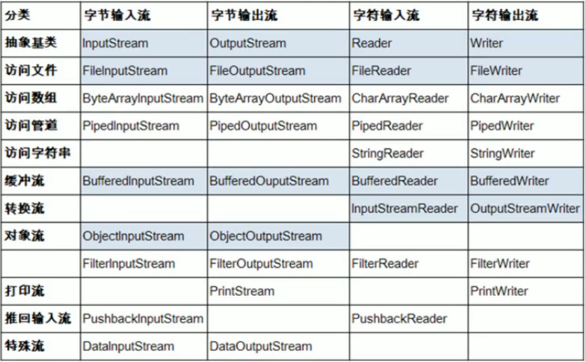

# IO流

## File类的使用

File类一个对象，就代表一个文件或者一个文件目录（文件夹）。

### File类的实例化

常用的构造器：

* File(String pathname); pathname可以是绝对路径或者相对路径。
* File(String parent,String child); 以parent为父路径，child为子路径。
* File(File parent,String child); 根据一个父File对象和子文件路径创建File对象。

~~~java
import java.io.File;

public class FileTest {
    public static void main(String[] args) {
        File file1 = new File("hello.txt");//相对路径，相对于当前module
        File file2 = new File("D:\\develop_tools\\untitled\\he.txt");//绝对路径。
        System.out.println(file1);
        System.out.println(file2);

        File file3 = new File("D:\\develop_tools","untitled");

        File file4 = new File(file3,"he.txt");
    }
}
~~~

### File类中的常用方法

* getAbsolutePath(); 获取绝对路径。
* getPath(); 获取路径。
* getName(); 获取名称。
* getParent(); 获取上层文件目录路径，若不存在返回null。
* length(); 获取文件长度（字节数）。
* lastModified(); 获取最后一次的修改时间，时间戳。

如下两个方法适用于文件目录。

* list(); 获取指定目录下的所有文件或者文件目录的名称数组。
* listFiles(); 获取指定目录下的所有文件或者文件目录的File数组。

* renameTo(File file); 将调用此方法的文件对象移动到file文件的位置，并且将名字改为file的名字（调用此方法的文件必须存在，file必须不存在）。

~~~java
import java.io.File;

public class methodTest {
    public static void main(String[] args) {
        File file1 = new File("hello.txt");
        File file2 = new File("hi.txt");

        boolean b = file1.renameTo(file2);
        System.out.println(b);
    }
}
~~~

* isDiretory(); 判断是否是文件目录。
* isFile(); 判断是否是文件。
* exists(); 判断是否存在。
* canRead(); 是否可读。
* canWrite(); 是否可写。
* isHidden(); 是否隐藏。

文件或文件目录的创建相关方法。

* createNewFile(); 创建文件，若文件存在，则不创建，返回false。
* mkdir();  创建文件目录，若文件存在目录，则不创建；如果上层目录不存在，则不创建。
* mkdirs(); 创建文件目录，若文件存在目录，则不创建；如果上层目录不存在，则将上层所有目录一并创建创建。
* delete(); 删除文件或文件目录。

## IO原理及其流的分类

流的分类：

* 按照操作数据单位不同：字节流（8bit，使用于非文本文件：图片、视频）、字符流（16bit，适合文本文件）。
* 按照流向不同：输入流、输出流。
* 按照角色不同：节点流、处理流。

## IO流的体系结构

## 常用IO流讲解

### 使用FileReader读入数据

FileReader类的read(); 返回读入的一个字符对应的ASCII码，如果文件达到末尾，返回-1。

为了保证流资源一定可以执行关闭操作，需要使用try-catch-finally处理。

读入的文件一定要存在，否则就要报异常。

~~~java
import org.testng.annotations.Test;
import java.io.File;
import java.io.FileReader;
import java.io.IOException;

public class FileReaderTest {
    @Test
    public void test() {
        FileReader fileReader = null;
        try {
            File file = new File("hello.txt");
            fileReader = new FileReader(file);

            int data;
            while((data=fileReader.read()) != -1){
                System.out.print((char)data);
            }
        } catch (IOException e) {
            e.printStackTrace();
        } finally {
            try {
                if(fileReader != null)
                fileReader.close();
            } catch (IOException e) {
                e.printStackTrace();
            }
        }
    }
}
~~~

对read(); 进行操作升级。

* read(char[] cbuf);

~~~java
import org.testng.annotations.Test;
import java.io.File;
import java.io.FileReader;
import java.io.IOException;

public class FileReaderTest {
    @Test
    public void test() {
        FileReader fileReader = null;
        try {
            File file = new File("hello.txt");
            fileReader = new FileReader(file);

            int len;
            char[] cubf = new char[5];
            while ((len = fileReader.read(cubf))!=-1){
                for (int i = 0; i < len; i++) {
                    System.out.print(cubf[i]);
                }
//                或者：
//                String str = new String(cubf,0,len);
//                System.out.print(str);
            }
        } catch (IOException e) {
            e.printStackTrace();
        } finally {
            if(fileReader!=null) {
                try {
                    fileReader.close();
                } catch (IOException e) {
                    e.printStackTrace();
                }
            }
        }
    }
}
~~~

### 使用FileWriter读入数据

~~~java
import org.testng.annotations.Test;
import java.io.File;
import java.io.FileWriter;
import java.io.IOException;

public class FileWriterTest {
    @Test
    public void test() throws IOException {
        //1.提供File类的对象，指明写出到的文件。
        File file = new File("hello1.txt");
        //2.提供FileWriter的对象，用于数据的写出。
        FileWriter fileWriter = new FileWriter(file);
        //FileWriter fileWriter = new FileWriter(file,true);
        //3.进行写出操作。
        fileWriter.write("I have a dream\n");
        fileWriter.write("You need to have a dream!");
        //流资源的关闭。
        fileWriter.close();
    }
}
~~~

注意：

* 输出操作，对应的File可以不存在，并不会报异常。
* File对应的硬盘中的文件如果不存在，在输出的过程中，会自动创建文件。
* File对应的硬盘中的文件如果存在：
  * 如果流使用的构造器是：FileWriter(file,false); / FileWriter(file); 则会覆盖原有的文件。
  * 如果流使用的构造器是：FileWriter(file,true); 不会覆盖原有文件，会在原有文件上进行追加操作。

### 使用FileReader和FileWriter实现对文本文件的复制

~~~java
import org.testng.annotations.Test;
import java.io.*;

public class FileReaderWriterTest {
    @Test
    public void test() {
        FileReader fileReader = null;
        FileWriter fileWriter = null;
        try {
            //提供File类的对象，指明读入和写出到的文件。
            File file1 = new File("hello1.txt");
            File file2 = new File("hello2.txt");

            //提供FileReader和FileWriter的对象，用于数据的读入和写出。
            fileReader = new FileReader(file1);
            fileWriter = new FileWriter(file2);

            //进行读入和写出操作。
            char[] cbuf = new char[5];
            int len;
            while((len=fileReader.read(cbuf))!=-1){
                fileWriter.write(cbuf,0,len);
            }
        } catch (IOException e) {
            e.printStackTrace();
        } finally {
            if(fileWriter!=null){

                try {
                    fileWriter.close();
                } catch (IOException e) {
                    e.printStackTrace();
                } finally {
                    if(fileReader!=null) {
                        try {
                            fileReader.close();
                        } catch (IOException e) {
                            e.printStackTrace();
                        }
                    }
                }
            }
        }

    }
}
~~~

### 不能用字符流处理非文本文件

* 对于文本文件（.txt、.java、.c、.cpp...），使用字符流处理。
* 对于非文本文件（.jpg、.mp3、.mp4、.avi、.doc、.ppt...），使用字符流处理。
* 使用字节流处理文本文件，可能出现乱码。
* 不能用字符流处理非文本文件。

### 使用字节流实现对非文本文件的复制

~~~java
import org.testng.annotations.Test;
import java.io.*;

public class FileInputOutputStreamTest {
    @Test
    public void test() {
        FileInputStream fileInputStream = null;
        FileOutputStream fileOutputStream = null;
        try {
            File file1 = new File("图片.png");
            File file2 = new File("图片（复制）.png");

            fileInputStream = new FileInputStream(file1);
            fileOutputStream = new FileOutputStream(file2);

            byte[] buffer = new byte[5];
            int len;
            while((len=fileInputStream.read(buffer))!=-1){
                fileOutputStream.write(buffer,0,len);
            }
        } catch (IOException e) {
            e.printStackTrace();
        } finally {
            if(fileInputStream!=null) {
                try {
                    fileInputStream.close();
                } catch (IOException e) {
                    e.printStackTrace();
                }
            }
            if(fileOutputStream!=null) {
                try {
                    fileOutputStream.close();
                } catch (IOException e) {
                    e.printStackTrace();
                }
            }
        }
    }
}
~~~

----------------------

### 缓冲流的使用

作用：提供流的读取、写入的速度。

使用缓冲流对图片进行复制：

~~~java
import org.testng.annotations.Test;
import java.io.*;

public class BufferedTest {
    @Test
    public void test(){
        BufferedInputStream bufferedInputStream = null;
        BufferedOutputStream bufferedOutputStream = null;
        try {
            //1.造文件
            File srcFile = new File("图片.png");
            File destFile = new File("图片（复制2）.png");
            //2.造流
            //2.1.造节点流
            FileInputStream fileInputStream = new FileInputStream(srcFile);
            FileOutputStream fileOutputStream = new FileOutputStream(destFile);
            //2.2.造处理流（缓冲流）
            bufferedInputStream = new BufferedInputStream(fileInputStream);
            bufferedOutputStream = new BufferedOutputStream(fileOutputStream);

            //3.对文件的复制
            byte[] buffer = new byte[10];
            int len;
            while((len=bufferedInputStream.read(buffer))!=-1){
                bufferedOutputStream.write(buffer,0,len);
            }
        } catch (IOException e) {
            e.printStackTrace();
        } finally {
            //4.流资源的关闭。
            //要求：先关闭外层的流，再关闭内层的流，但是在关闭外层流的同时，内层流也会自动关闭，可以不进行内层流的关闭。
            if(bufferedInputStream!=null){
                try {
                    bufferedInputStream.close();
                } catch (IOException e) {
                    e.printStackTrace();
                }
            }
            if(bufferedOutputStream!=null){
                try {
                    bufferedOutputStream.close();
                } catch (IOException e) {
                    e.printStackTrace();
                }
            }
        }
    }
}
~~~

使用缓冲流对文本文件进行复制：

~~~java
import org.testng.annotations.Test;
import java.io.*;

public class FileInputOutputStreamTest {
    @Test
    public void test() {
        FileInputStream fileInputStream = null;
        FileOutputStream fileOutputStream = null;
        try {
            File file1 = new File("图片.png");
            File file2 = new File("图片（复制）.png");

            fileInputStream = new FileInputStream(file1);
            fileOutputStream = new FileOutputStream(file2);

            byte[] buffer = new byte[5];
            int len;
            while((len=fileInputStream.read(buffer))!=-1){
                fileOutputStream.write(buffer,0,len);
            }
        } catch (IOException e) {
            e.printStackTrace();
        } finally {
            if(fileInputStream!=null) {
                try {
                    fileInputStream.close();
                } catch (IOException e) {
                    e.printStackTrace();
                }
            }
            if(fileOutputStream!=null) {
                try {
                    fileOutputStream.close();
                } catch (IOException e) {
                    e.printStackTrace();
                }
            }
        }
    }
}
~~~

### 转换流的使用

转换流：

* InputStreamReader：将字节的输入流转换为字符的输入流。
* OutputStreamWriter：将字符的输出流转换为字符的输出流。

转换流属于字符流。

~~~java
//使用转换流，将一个用utf-8存储的文本文件创建一个用gbk存储的文本文件。
import org.testng.annotations.Test;
import java.io.*;

public class InputStreamReaderTest {
    @Test
    public void test() throws Exception {
        InputStreamReader inputStreamReader = new InputStreamReader(new FileInputStream("dbcp.txt"),"utf-8");
        OutputStreamWriter outputStreamWriter = new OutputStreamWriter(new FileOutputStream("dbcp_gbk.txt"), "gbk");

        char[] chars = new char[10];
        int len;
        while((len=inputStreamReader.read(chars))!=-1){
            outputStreamWriter.write(chars,0,len);
        }
        outputStreamWriter.close();
        inputStreamReader.close();
    }

}
~~~

### 输入流、输出流

* System类下的两个属性 System.in 和 System.out分别代表了系统标准的输入和输出设备。
* 默认输入设备和输出设备分别为：键盘和显示器。
* System.in的类型为InputStream。
* System.out的类型为PrintStream，是OutputStream的子类。
* 重定向：可以通过System类中的setIn();和setOut();对默认的设备进行改变。

~~~java
import java.io.BufferedReader;
import java.io.IOException;
import java.io.InputStreamReader;

//使用标准输入流，从键盘输入字符串，要求将读到的整行字符串转换为大写输出，然后继续执行输入操作，直到输入“e”或者“exit”时，退出程序。
public class SystemInOutTest {
    public static void main(String[] args) throws IOException {
        InputStreamReader inputStreamReader = new InputStreamReader(System.in);
        BufferedReader bufferedReader = new BufferedReader(inputStreamReader);
        String s = new String();
        while(true){
            s = bufferedReader.readLine();
            if(s.equalsIgnoreCase("e")||s.equalsIgnoreCase("exit")){
                System.out.println("程序结束");
                break;
            }else{
                System.out.println(s.toUpperCase());
            }
        }
    }
}
~~~

### 数据流

DataInputStream和DataOutputStream

作用：用于读取或写出基本数据类型的变量或字符串。

~~~java
import org.testng.annotations.Test;
import java.io.*;

public class DataInputOutputStream {
    @Test
    public void test() throws IOException {
        DataOutputStream dataOutputStream = new DataOutputStream(new FileOutputStream("data.txt"));

        dataOutputStream.writeUTF("沈浩阳");
        dataOutputStream.writeInt(18);
        dataOutputStream.writeBoolean(true);

        dataOutputStream.close();
    }
    @Test
    public void test2() throws IOException {
        DataInputStream dataInputStream = new DataInputStream(new FileInputStream("data.txt"));
        String s = dataInputStream.readUTF();
        int i = dataInputStream.readInt();
        boolean b = dataInputStream.readBoolean();
        System.out.println("name = " + s);
        System.out.println("age = " + i);
        System.out.println("isMale = " + b);
    }

}
~~~

### 对象流

* 用于存储和读取基本数据类型或对象的处理流。他的强大之处就是可以把Java中的对象写入到数据源中，也能把对象从数据源中还原回来。
  * 序列化：用ObjectInputStream类保存基本数据类型或对象机制。
  * 反序列化：ObjectOutputStream类读取基本数据类型或对象的机制。

#### String类的对象序列化与反序列化过程

~~~java
import org.testng.annotations.Test;
import java.io.*;

public class ObjectInputOutputStream {
    @Test
    public void test1() {
        ObjectOutputStream objectOutput = null;
        try {
            objectOutput = new ObjectOutputStream(new FileOutputStream("object.dat"));

            objectOutput.writeObject(new String("我爱北京天安门"));
            objectOutput.flush();
        } catch (IOException e) {
            e.printStackTrace();
        } finally {
            if(objectOutput!=null) {
                try {
                    objectOutput.close();
                } catch (IOException e) {
                    e.printStackTrace();
                }
            }
        }

    }
    @Test
    public void test2()  {
        ObjectInputStream objectInputStream = null;
        try {
            objectInputStream = new ObjectInputStream(new FileInputStream("object.dat"));
            Object o = objectInputStream.readObject();

            o = (String)o;
            System.out.println(o);
        } catch (IOException e) {
            e.printStackTrace();
        } catch (ClassNotFoundException e) {
            e.printStackTrace();
        } finally {
            try {
                objectInputStream.close();
            } catch (IOException e) {
                e.printStackTrace();
            }
        }
    }
}
~~~

#### 自定义类的对象序列化与反序列化过程

~~~java
import org.testng.annotations.Test;
import java.io.*;

public class ObjectStreamTest {
    @Test
    public void out()  {
        ObjectOutputStream objectOutputStream = null;
        try {
            objectOutputStream = new ObjectOutputStream(new FileOutputStream("object.dat"));

            objectOutputStream.writeObject(new Person("Tom",23));
            objectOutputStream.flush();
        } catch (IOException e) {
            e.printStackTrace();
        } finally {
            if (objectOutputStream != null) {
                try {
                    objectOutputStream.close();
                } catch (IOException e) {
                    e.printStackTrace();
                }
            }
        }
    }
    @Test
    public void in(){
        ObjectInputStream objectInputStream = null;
        Object o = null;
        try {
            objectInputStream = new ObjectInputStream(new FileInputStream("object.dat"));

            o = objectInputStream.readObject();
        } catch (IOException e) {
            e.printStackTrace();
            System.out.println(o);
        } catch (ClassNotFoundException e) {
            e.printStackTrace();
        } finally {
            try {
                objectInputStream.close();
            } catch (IOException e) {
                e.printStackTrace();
            }
        }
    }
}

class Person implements Serializable {
    public static final long serialVerionUID = 2131421415L;
    private String name;
    private int age;

    public Person() {
    }

    public Person(String name, int age) {
        this.name = name;
        this.age = age;
    }

    public String getName() {
        return name;
    }

    public void setName(String name) {
        this.name = name;
    }

    public int getAge() {
        return age;
    }

    public void setAge(int age) {
        this.age = age;
    }

    @Override
    public String toString() {
        return "Person{" +
                "name='" + name + '\'' +
                ", age=" + age +
                '}';
    }
}
~~~

#### serialVersionUID深入理解

### 随机存储文件流

RandomAccessFile类的使用：

* RandomAccessFile类直接继承于Object类，实现了DataInput和DataOutput接口。
* RandomAccessFile类既可以作为一个输入流，也可以作为一个输出流，取决于实例化时，构造器中第二个mode参数：
  * "r": 以只读方式打开。
  * "rw":打开以便读取和写入。
  * ...

~~~java
import org.testng.annotations.Test;
import java.io.IOException;
import java.io.RandomAccessFile;

public class RandomAccessFileTest {
    @Test
    public void test() {
        RandomAccessFile randomAccessFile = null;
        RandomAccessFile randomAccessFile1 = null;
        try {
            randomAccessFile = new RandomAccessFile("图片.png","r");
            randomAccessFile1 = new RandomAccessFile("图片(copy).png", "rw");

            byte[] bytes = new byte[1024];
            int len;
            while ((len=randomAccessFile.read(bytes))!=-1){
                randomAccessFile1.write(bytes,0,len);
            }
        } catch (IOException e) {
            e.printStackTrace();
        } finally {
            if(randomAccessFile1!=null){

                try {
                    randomAccessFile1.close();
                } catch (IOException e) {
                    e.printStackTrace();
                }
            }
            if(randomAccessFile!=null){

                try {
                    randomAccessFile.close();
                } catch (IOException e) {
                    e.printStackTrace();
                }
            }
        }
    }
}
~~~

