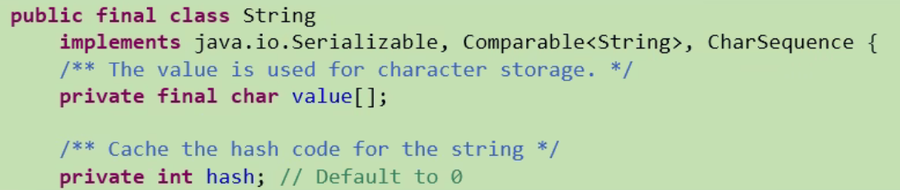
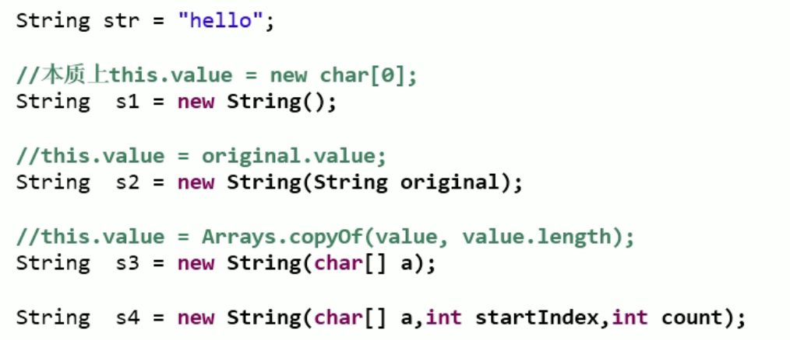
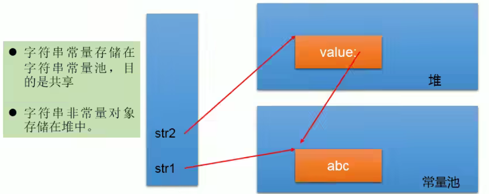
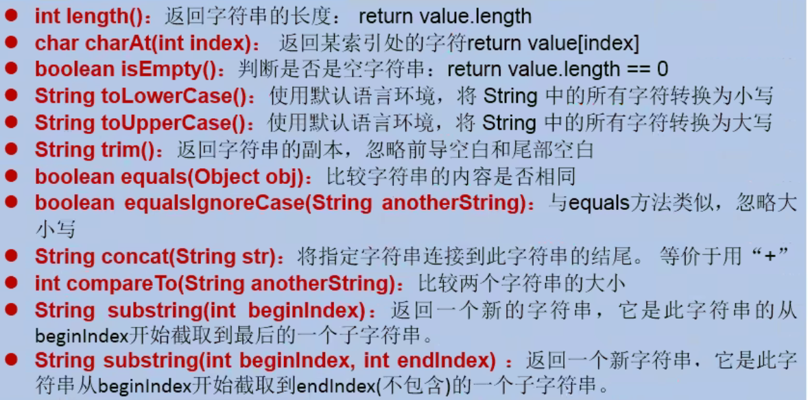
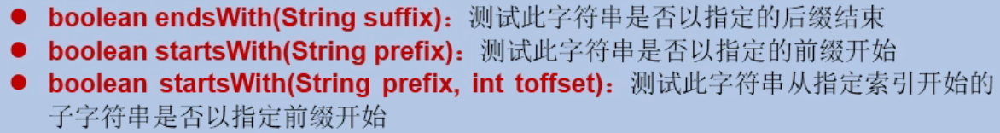
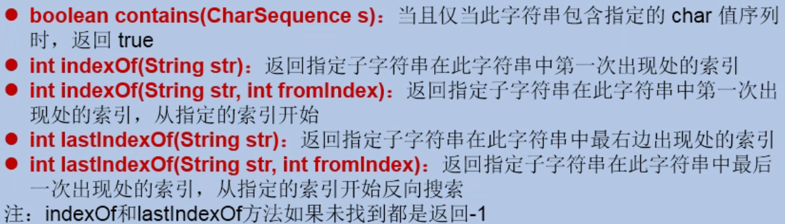
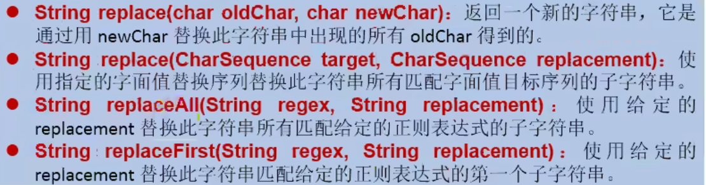
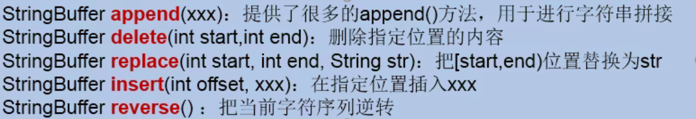

 


# JDK 8以前的时间日期API

## System类

JDK 8 以前获取时间的方法：

使用System类中的方法：

* currentTimeMillis();

```java
import org.junit.Test;

public class DateTimeTest {
    //JDK 8 之前获取时间的API测试。
    @Test
    public void test(){
        //使用System类中的currentTimeMillis();
        //返回一个时间戳。
        long l = System.currentTimeMillis();
        System.out.println(l);

    }
}
```

## Date类

java中有两个Date类：

* java.util.Date
  * java.sql.Date

二者为子父类的关系。

Date类中掌握两个构造器，两个方法的使用。

### Date类中常用构造器

* Date(); 创建一个对应当前时间的Date对象。
* Date(long l); 创建指定时间戳的Date对象。

### Date类中常用方法

* toString(); 显示当前对象的年、月、日、分、秒...
* getTime(); 获取当前对象的时间戳。

~~~java
import org.junit.Test;
import java.util.Date;

public class DateTest {
    @Test
    public void test(){
        Date date1 = new Date();//Date(); 创建一个对应当前时间的Date对象。
        System.out.println(date1.toString());//显示当前对象的年、月、日、分、秒...  Thu Feb 03 15:32:23 CST 2022
        System.out.println(date1.getTime());//getTime(); 获取当前对象的时间戳。 1643873543347

        Date date2 = new Date(1643873543347L);
        System.out.println(date2);
        System.out.println(date2.getTime());
    }
}
~~~

### 关于 java.sql.Date 类

如何创建对象：

如何将 java.util.Date 转化为 java.sql.Date:

~~~java
import org.junit.Test;
import java.sql.Date;

public class DateTest {
    @Test
    public void test(){
        //创建 java.sql.Date类的对象。
        Date date = new Date(1643873732514L);//只有这一个构造器
        System.out.println(date);//2022-02-03

        //如何将 java.util.Date 转换为 java.sql.Date。
        //法一：
        java.util.Date date1 = new Date(1643873732514L);
        Date date2 = (Date) date1;
        System.out.println(date2);
        //法二：
        java.util.Date date3 = new Date(1643873732514L);
        Date date4 = new Date(date.getTime());
        System.out.println(date4);
    }
}
~~~

## SimpleDateFormat类

SimpleDateFormat类：对日期 Date 类的格式化和解析。

两个常见方法：

* format(); 对Date类的对象进行格式化，返回一个字符串类的对象。
* parse(); 对字符串类型的对象进行解析，返回一个Date类的对象。

1.两个操作：
	1.1  格式化：日期 转换为 字符串
	1.2  解析： 格式化的逆过程 字符串 转化为 日期

2.SimpleDateFormat类的实例化。

~~~java
import org.junit.Test;
import java.text.ParseException;
import java.text.SimpleDateFormat;
import java.util.Date;

public class SimpleDateFormatTest {
    @Test
    public void test() throws ParseException {
        //实例化SimpleDateFormat类：使用默认的构造器，格式化及解析操作的格式为默认形式，
        SimpleDateFormat sdf = new SimpleDateFormat();

        //格式化：
        Date date = new Date();
        String format = sdf.format(date);
        System.out.println(format);//22-2-3 下午9:00

        //解析：字符串的格式必须按规定书写。
        Date parse = sdf.parse("22-2-3 下午9:00");
        System.out.println(parse);

        System.out.println("*********按照指定的方式格式化和解析：调用带参的构造器***********");
        //实例化一个常用的构造器：
        SimpleDateFormat sdf1 = new SimpleDateFormat("yyyy-MM-dd hh:mm:ss");

        //格式化：
        String format1 = sdf1.format(date);
        System.out.println(format1);//2022-02-03 09:05:56

        //解析：要求字符串必须是符合SimpleDateFormat识别的格式（通过构造器提现）。
        //否则，抛异常。
        Date parse1 = sdf1.parse(format1);
        System.out.println(parse1);
    }
}
~~~

## Calendar日历类

Calendar日历类为抽象类。

### Calendar类实例化的两种方式

方式一：创建其子类 GregorianCalendar 的对象。

方式二：调用静态方法 getInstance();

### Calendar类常用方法

* get(); 获取当前日期的一些数据。如本年的第几天 本月的第几天。
* set(); 将当前日期的一些数据，修改为其他数据。
* add(); 在指定的数据上增加指定的天数。
* getTime(); 将Calendar类的对象转换为对应的Date类型的对象。
* setTime(); 将当前的Calendar对象修改为参数中对应的Date类型的对象。

~~~java
import org.junit.Test;
import java.util.Calendar;
import java.util.Date;

public class CalendarTest {
    @Test
    public void test(){
        //实例化Calendar类
        Calendar instance = Calendar.getInstance();

        //常用方法：
        //get(); 获取当前日期的一些数据。如本年的第几天 本月的第几天。
        System.out.println(instance.get(Calendar.DAY_OF_MONTH));
        System.out.println(instance.get(Calendar.DAY_OF_YEAR));

        //set(); 将当前日期的一些数据，修改为其他数据。
        instance.set(Calendar.DAY_OF_YEAR,41);
        System.out.println(instance.get(Calendar.DAY_OF_MONTH));
        System.out.println(instance.get(Calendar.DAY_OF_YEAR));

        //add(); 在指定的数据上增加指定的天数。
        instance.add(Calendar.DAY_OF_YEAR,2);
        System.out.println(instance.get(Calendar.DAY_OF_MONTH));
        System.out.println(instance.get(Calendar.DAY_OF_YEAR));

        //getTime(); 将当前Calendar类的对象转换为对应的Date类型的对象。
        Date time = instance.getTime();
        System.out.println(time);

        //setTime(); 将当前的Calendar对象修改为参数中对应的Date类型的对象。
        instance.setTime(new Date());
        System.out.println(instance.get(Calendar.DAY_OF_YEAR));
    }
}
~~~

使用Calendar类时的注意点：

* 获取月份时：一月是0，二月是1，以此类推。
* 获取星期时：周日是1，周一是2，以此类推。

# JDK 8的时间日期API

## LocalDate 、LocalTime 、LcalDateTime类的使用

### 实例化的两种方式：

* now(); 静态方法获取当前 日期，时间，时间+日期的的对象。 
* of(); 获取指定的的时间的对象。

### 其他常用方法

* getXxx(); 获取指定的年月日.....
* withXxx(); 修改指定的年月日，调用此方法会返回一个新对象，新对象为修改后的数据，而原先的对象不发生改变，提现了新API的不可变性。
* plusXxx(); 在原有时间增加指定数量的年月日，依然体现不可变性。
* MinusXxx(); 在原有时间减少指定数量的年月日，依然体现不可变性。

~~~java
import org.junit.Test;
import java.time.LocalDate;
import java.time.LocalDateTime;
import java.time.LocalTime;

public class LocalDateTimeTest{
    @Test
    public void test(){
        //now(); 获取当前时间对象。
        LocalDate localDate = LocalDate.now();
        LocalTime localTime = LocalTime.now();
        LocalDateTime localDateTime = LocalDateTime.now();

        System.out.println(localDate);
        System.out.println(localTime);
        System.out.println(localDateTime);
        //LocalDateTime类为最常用类。
        //of(); 获取指定时间对象。
        LocalDateTime localDateTime1 = LocalDateTime.of(2022, 2, 4, 13, 27);
        System.out.println(localDateTime1);

        //getXxx(); 获取指定的年月日.....
        System.out.println(localDateTime.getDayOfMonth());
        System.out.println(localDateTime.getDayOfWeek());
        System.out.println(localDateTime.getHour());
        System.out.println(localDateTime.getMonth());
        System.out.println(localDateTime.getMonthValue());

        //withXxx(); 修改指定的年月日，调用此方法会返回一个新对象，新对象为修改后的数据，而原先的对象不发生改变，提现了新API的不可变性。
        LocalDateTime localDateTime2 = localDateTime.withDayOfYear(40);
        System.out.println(localDateTime2);
        System.out.println(localDateTime);

        //plusXxx(); 在原有时间增加指定数量的年月日，依然体现不可变性。
        LocalDateTime localDateTime3 = localDateTime.plusYears(1);
        System.out.println(localDateTime3);
        System.out.println(localDateTime);

        //MinusXxx(); 在原有时间减少指定数量的年月日，依然体现不可变性。
        LocalDateTime localDateTime4 = localDateTime.minusYears(1);
        System.out.println(localDateTime4);
        System.out.println(localDateTime);
    }
}
~~~

## Instant类*

* now(); 获取本初子午线对应的标准时间。
* atOffSet(); 添加时间的偏移量。
* toEpochMilli(); 获取当前实例的时间戳。
* ofEpochMilli(); 通过指定的时间戳创建实例。

~~~java
import org.junit.Test;
import java.time.Instant;
import java.time.OffsetDateTime;
import java.time.ZoneOffset;

public class InstantTest {
    @Test
    public void test(){
        //now(); 获取本初子午线对应的标准时间。
        Instant instant = Instant.now();
        System.out.println(instant);

        //atOffSet(); 添加时间的偏移量。
        OffsetDateTime offsetDateTime = instant.atOffset(ZoneOffset.ofHours(8));
        System.out.println(offsetDateTime);

        //toEpochMilli(); 获取当前实例的时间戳。
        System.out.println(instant.toEpochMilli());

        //ofEpochMilli(); 通过指定的时间戳创建实例。
        Instant instant1 = Instant.ofEpochMilli(1231241512);
        System.out.println(instant1);
    }
}
~~~

## DateTimeFormatter类

DateTimeFormatter类：对LocalDate 、LocalTime 、LcalDateTime类进行格式化和解析：

DateTimeFormatter类实例化的三种方式：

方式一 *** **：预定义的标准格式：......

方式二 ***** ：本地化相关的格式：......

方式三：自定义格式。

使用方式三时常用的方法：

* ofPattern(); 创建DateTimeFormatter对象，如：ofPattern("yyyy-MM-dd hh:mm:ss");
* format(); 格式化
* parse(); 解析

~~~java
import org.junit.Test;
import java.time.LocalDateTime;
import java.time.format.DateTimeFormatter;
import java.time.temporal.TemporalAccessor;

public class DateTimeFormatterTest {
    @Test
    public void test(){
        LocalDateTime localDateTime = LocalDateTime.now();

        //ofPattern(); 创建DateTimeFormatter对象，如：ofPattern("yyyy-MM-dd hh:mm:ss");
        DateTimeFormatter dateTimeFormatter = DateTimeFormatter.ofPattern("yyyy-MM-dd hh:mm:ss");

        //format(); 格式化
        String str = dateTimeFormatter.format(localDateTime);
        System.out.println(str);//2022-02-04 05:47:40

        //parse(); 解析
        TemporalAccessor parse = dateTimeFormatter.parse("2022-02-04 05:47:40");
        System.out.println(parse);
    }
}
~~~

# java比较器

说明：java中的对象，正常情况下，只能进行比较：== 或 != 。不能使用 > 或 < 但在实际开发场景中，我们需要对多个对象进行排序，言外之意，就需要比较对象的大小。如何实现？使用接口： Comparable 或 Comparator。

## Comparable接口的使用

Comparable接口实现自然排序：

* 使用举例：

  像String、包装类等实现了Comparable接口，重写了compareTo(obj)方法，给出了两个对象比较的规则。

* 重写compareTo(obj);方法的规则：

  如果当前对象this大于形参对象obj，则返回正整数，

  如果当前对象this小于形参对象obj，则返回负整数，

  如果当前对象this等于形参对象obj，则返回零。

* 自定义类排序：

  让自定义类实现Comparable接口，重写comparaTo();方法，在方法中指明如何排序。

~~~java
//创建5个物品自定义类的对象,将5个物品按价格的顺序从小到大排序。
import org.junit.Test;
import java.util.Arrays;

public class ComparableTest{
    @Test
    public void test(){
        Goods[] goods = new Goods[5];
        goods[0] = new Goods("huawei",30);
        goods[1] = new Goods("lianxiang",40);
        goods[2] = new Goods("xiaomi",10);
        goods[3] = new Goods("dell",41);
        goods[4] = new Goods("apple",35);

        Arrays.sort(goods); //对数组进行从小到大的排列
        for (Object obj : goods){
            System.out.println(obj);
        }
    }
}

class Goods implements Comparable {
    private String name;
    private int price;

    public Goods() {
    }

    public Goods(String name, int price) {
        this.name = name;
        this.price = price;
    }

    public String getName() {
        return name;
    }

    public void setName(String name) {
        this.name = name;
    }

    public int getPrice() {
        return price;
    }

    public void setPrice(int price) {
        this.price = price;
    }

    @Override
    public int compareTo(Object o) {
        if (o instanceof Goods) {
            Goods goods = (Goods) o;
            if (this.price > goods.price) {
                return 1;
            } else if (this.price < goods.price) {
                return -1;
            } else {
                return 0;
            }
        }
        throw new RuntimeException("传入的数据类型错误");
    }

    @Override
    public String toString() {
        return "Goods{" +
                "name='" + name + '\'' +
                ", price=" + price +
                '}';
    }
}
~~~

## Comparator接口的使用

Comparator接口实现定值排序：

* 背景：

  元素类型没有实现java.lang.Comparable接口而又不方便修改代码，或者实现了java.lang.Comparable接口的排序规则不适合当前的操作，那么可以考虑使用Comparator的对象来排序。

* 使用方法：

  重写compare(Object o1,Object o2); 方法，比较o1和o2的大小：

  如果方法返回正整数，则表示o1>o2；

  如果方法返回零，则表示o1=o2；

​	   如果方法返回负整数，则表示o1<o2；

~~~java
import org.junit.Test;
import java.util.Arrays;
import java.util.Comparator;

public class ComparatorTest {
    //以String类为例：
    @Test
    public void test1() {
        String[] str = new String[]{"AA", "CC", "KK", "BB", "DD"};
        Arrays.sort(str, new Comparator() {
                    @Override
                    public int compare(Object o1, Object o2) {
                        if (o1 instanceof String && o2 instanceof String) {
                            String s1 = (String) o1;
                            String s2 = (String) o2;
                            return s1.compareTo(s2);
                        }
                        throw new RuntimeException("传入数据异常");
                    }
                }
        );
        for (Object obj : str) {
            System.out.println(obj);
        }
    }
    //自定义类：
    //将产品名字从低到高排列，相同名字的按价格从高到低排列。
    @Test
    public void test2() {
        Goods[] goods = new Goods[5];
        goods[0] = new Goods("huawei",30);
        goods[1] = new Goods("lianxiang",40);
        goods[2] = new Goods("xiaomi",10);
        goods[3] = new Goods("huawei",41);
        goods[4] = new Goods("apple",35);

        Arrays.sort(goods, new Comparator() {
            @Override
            public int compare(Object o1, Object o2) {
                if(o1 instanceof Goods && o2 instanceof  Goods){
                    Goods g1 = (Goods) o1;
                    Goods g2 = (Goods) o2;
                    if(g1.getName().equals(g2.getName())){
                        return -Double.compare(g1.getPrice(),g2.getPrice());
                    }else{
                        return g1.getName().compareTo(g2.getName());
                    }
                }
                throw new RuntimeException("输入的数据非法");
            }
        });
        for(Object obj : goods){
            System.out.println(obj);
        }
    }
}

class Goods {
    private String name;
    private int price;

    public Goods() {
    }

    public Goods(String name, int price) {
        this.name = name;
        this.price = price;
    }

    public String getName() {
        return name;
    }

    public void setName(String name) {
        this.name = name;
    }

    public int getPrice() {
        return price;
    }

    public void setPrice(int price) {
        this.price = price;
    }

    @Override
    public String toString() {
        return "Goods{" +
                "name='" + name + '\'' +
                ", price=" + price +
                '}';
    }
}
~~~

总结：

* Comparable接口一旦一定，保证Comparable接口实现类的对象在任何位置都可以比较大小。
* Comparator接口属于临时性比较。

# String类



* String类不可继承。
* 可序列化的
* 可比的
* 由于：final char value[] ，因此String是"不可变的"

## 不可变性的理解

* 不可变性的体现：
  * 当对字符串重新赋值时，需要重写指定内存区域赋值，不能使用原有的value进行赋值
  * 当对现有的字符串进行连接操作时，也需要重新指定内存区域赋值，不能使用原有的value进行赋值
  * 当调用String的replace();进行修改指定字符或者字符串时，也需要重新指定内存区域赋值，不能使用原有的value进行赋值

```java
public class StringTest {
    public static void main(String[] args) {
        String s1 = "abc";
        String s2 = "abc";
        System.out.println(s1 == s2);//true

        s2 += "def";
        System.out.println(s2);

        s1.replace('a','d');
        System.out.println(s1);
    }
}
```

## String对象的创建



* String str = "hello"; 与 String str = new String("hello"); 的区别

  

  ```java
  public class StringTest {
      public static void main(String[] args) {
          String s1 = "abc";
          String s2 = "abc";
  
          String s3 = new String("abc");
          String s4 = new String("abc");
  
          System.out.println(s1 == s2);//true
          System.out.println(s1 == s3);//false
          System.out.println(s1 == s4);//false
          System.out.println(s3 == s4);//false
      }
  }
  ```

* 字面量各种拼接操作对比

```java
public class StringTest {
    public static void main(String[] args) {
        String s1 = "abc";
        String s2 = "def";

        String s3 = "abcdef";
        String s4 = "abc" + "def";
        String s5 = s1 + "def";
        String s6 = "abc" + s2;
        String s7 = s1 + s2;

        System.out.println(s3 == s4);//true
        System.out.println(s3 == s5);//false
        System.out.println(s3 == s6);//false
        System.out.println(s3 == s7);//false
        System.out.println(s5 == s6);//false
        System.out.println(s5 == s7);//false

        String s8 = s5.intern();
        System.out.println(s3 == s8);//true
        
        final String s8 = "abc";
        String s9 = s8 + "def";
        System.out.println(s3 == s9);//true
    }
}
```

* 结论：
  * 常量与常量的拼接结果在常量池，且常量池不会存在相同内容。
  * 如果有一个变量，结果就在堆中。
  * 如果调用intern();返回值就在常量池中

## String类常用方法









## String与数组之间的转换

* String 与 char[] 转换

```java
public class StringTest {
    public static void main(String[] args) {
        String s1 = new String("abc");
        char[] chars = s1.toCharArray();
        System.out.println(chars);

        String s2 = new String(chars);
        System.out.println(s2);
    }
}
```

* String 与 byte[]转换

```java
public class StringTest {
    public static void main(String[] args) throws UnsupportedEncodingException {
        String s1 = new String("123中国");
        byte[] bytes = s1.getBytes();//获取byte[],默认使用utf-8编码
        System.out.println(Arrays.toString(bytes));
        byte[] bytes1 = s1.getBytes("GBK");//使用指定字符集编码
        System.out.println(Arrays.toString(bytes1));

        String s = new String(bytes);//使用utf8解码
        System.out.println(s);
        String s2 = new String(bytes, "gbk");//使用指定字符集解码
        System.out.println(s2);
    }
}
```

# StringBuffer、StringBuilder

* String、StringBuffer、StringBuilder的异同？
  * String：是不可变的字符串，底层使用char[]存储
  * StringBuffer：可变的字符序列，线程安全效率低，底层使用char[]存储
  * StringBuilder：可变的字符序列，线程不安全效率高，底层使用char[]存储

## 源码分析

* StringBuffer、StringBuilder源码几乎一样，但是StringBuilder使用了大量synchronized

```java
public AbstractStringBuilder append(String str) {
    if (str == null)
        return appendNull();
    int len = str.length();
    ensureCapacityInternal(count + len);
    str.getChars(0, len, value, count);
    count += len;
    return this;
}
```

```java
private void ensureCapacityInternal(int minimumCapacity) {
        // overflow-conscious code
        if (minimumCapacity - value.length > 0) {
            value = Arrays.copyOf(value,
                    newCapacity(minimumCapacity));
        }
    }
```

```java
private int newCapacity(int minCapacity) {
        // overflow-conscious code
        int newCapacity = (value.length << 1) + 2;
        if (newCapacity - minCapacity < 0) {
            newCapacity = minCapacity;
        }
        return (newCapacity <= 0 || MAX_ARRAY_SIZE - newCapacity < 0)
            ? hugeCapacity(minCapacity)
            : newCapacity;
    }
```

```java
StringBuffer sb1 = new StringBuffer();//底层创建了一个长度为16的char[]:
									  //	                char[] value = new char[16];
StringBuffer sb2 = new StringBuffer("abc");//char[] value = new char[16 + "abc".length];
```

* 扩容问题：
  * 如果添加字符串长度：使用append();等，char[]盛不下了，就需要进行扩容
  * 默认情况下：扩容为原先的二倍加二，如果新的长度还是不行，就将新字符串的长度作为新数组的长度，并且将内容拷贝到新数组
* 建议：
  * 创建StringBuffer时，使用StringBuffer(int capacity);创建，减少扩容次数

## StringBuffer、StringBuilder常用方法



