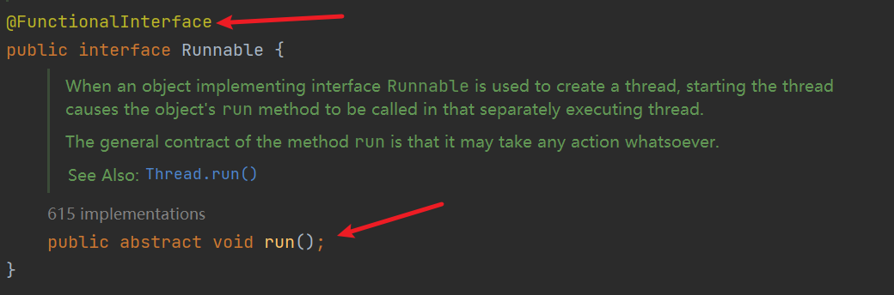

# lambda表达式

* 举例1：

```java
package com.shy;

public class test {
    public static void main(String[] args) {
        //原先的写法：
        Runnable runnable = new Runnable() {
            @Override
            public void run() {
                System.out.println("lambda表达式");
            }
        };
        runnable.run();
        System.out.println("------------------------");
        
        //使用lambda表达式
        Runnable runnable1 = () -> System.out.println("lambda表达式");        
        runnable1.run();

    }
}
```

* 举例2：

```java
package com.shy;

import java.util.Comparator;

public class test2 {
    public static void main(String[] args) {
        //原先的写法
        Comparator<Integer> comparator = new Comparator<Integer>() {
            @Override
            public int compare(Integer o1, Integer o2) {
                return Integer.compare(o1,o2);
            }
        };
        int compare = comparator.compare(12, 19);
        System.out.println(compare);
        
        //使用lambda表达式
        Comparator<Integer> comparator1 = (Integer o1, Integer o2) -> Integer.compare(o1,o2);
        int compare1 = comparator1.compare(12, 19);
        System.out.println(compare);
    }
}
```

* 基本格式
  * ->：lambda操作符/箭头操作符
  * ->左边：lambda形参列表（重写接口抽象方法的形参列表）
  * ->右边：lambda体（重写抽象方法的方法体）
* lambda表达式的本质：作为函数式接口的实例

* 下面以六种情况详细介绍lambda表达式

## 无参数无返回值

```java
package com.shy;

public class test {
    public static void main(String[] args) {
        //原先的写法：
        Runnable runnable = new Runnable() {
            @Override
            public void run() {
                System.out.println("lambda表达式");
            }
        };
        runnable.run();
        System.out.println("------------------------");
        
        //使用lambda表达式
        Runnable runnable1 = () -> {
            System.out.println("lambda表达式");
        };     
        runnable1.run();
    }
}
```

## 有参数无返回值

```java
package com.shy;

import java.util.function.Consumer;

public class test3 {
    public static void main(String[] args) {
        //原先写法
        Consumer<String> consumer = new Consumer<String>() {
            @Override
            public void accept(String s) {
                System.out.println(s);
            }
        };
        consumer.accept("我自横刀向天笑");
        
        System.out.println("----------------------");
        
        //使用lambda表达式
        Consumer<String> consumer1 = (String s) -> {
            System.out.println(s);
        };
        consumer1.accept("去留肝胆两昆仑");
    }
}
```

## 形参类型可以省略，编译器可以进行类型推断

```java
package com.shy;

import java.util.function.Consumer;

public class test3 {
    public static void main(String[] args) {
        //原先写法
        Consumer<String> consumer = new Consumer<String>() {
            @Override
            public void accept(String s) {
                System.out.println(s);
            }
        };
        consumer.accept("我自横刀向天笑");
        System.out.println("----------------------");
        //使用lambda表达式
        Consumer<String> consumer1 = (s) -> {
            System.out.println(s);
        };
        consumer1.accept("去留肝胆两昆仑");
    }
}
```

## 形参列表中只有一个参数时，括号可以省略

```java
package com.shy;

import java.util.function.Consumer;

public class test3 {
    public static void main(String[] args) {
        //原先写法
        Consumer<String> consumer = new Consumer<String>() {
            @Override
            public void accept(String s) {
                System.out.println(s);
            }
        };
        consumer.accept("我自横刀向天笑");
        System.out.println("----------------------");
        //使用lambda表达式
        Consumer<String> consumer1 = s -> {
            System.out.println(s);
        };
        consumer1.accept("去留肝胆两昆仑");
    }
}
```

## 有两个以上的参数，方法体有多条语句且有返回值

```java
package com.shy;

import java.util.Comparator;

public class test2 {
    public static void main(String[] args) {
        //原先的写法
        Comparator<Integer> comparator = new Comparator<Integer>() {
            @Override
            public int compare(Integer o1, Integer o2) {
                System.out.println(o1);
                System.out.println(o2);
                return Integer.compare(o1,o2);
            }
        };
        int compare = comparator.compare(12, 19);
        System.out.println(compare);

        //使用lambda表达式
        Comparator<Integer> comparator1 = ( o1,  o2) -> {
            System.out.println(o1);
            System.out.println(o2);
            return Integer.compare(o1,o2);
        };
        int compare1 = comparator1.compare(12, 19);
        System.out.println(compare);
    }
}
```

## 方法体只有一条语句，可以省略大括号与return	

```java
package com.shy;

import java.util.Comparator;

public class test2 {
    public static void main(String[] args) {
        //原先的写法
        Comparator<Integer> comparator = new Comparator<Integer>() {
            @Override
            public int compare(Integer o1, Integer o2) {
                return Integer.compare(o1,o2);
            }
        };
        int compare = comparator.compare(12, 19);
        System.out.println(compare);

        //使用lambda表达式
        Comparator<Integer> comparator1 = ( o1,  o2) -> Integer.compare(o1,o2);

        int compare1 = comparator1.compare(12, 19);
        System.out.println(compare);
    }
}
```

# 函数式接口

* 如果一个接口中，只声明了一个抽象方法，则此接口就称为函数式接口。
* 以Runnable接口为例： 



* 可以通过@FunctionalInterface注解对函数式接口进行一个校验
* 在java.lang.function包下定义了丰富的函数式接口

## java内置的函数式接口

* 消费型接口：Consumer<T>          void accept(T t);
* 供给型接口：Supplier<T>              T get();
* 函数式接口：Function<T,R>           R apply(T t);
* 断定型接口：Predicate<T>             boolean test(T t);  

# 方法引用

* 使用的情景，在lambda表达式的基础之上，当lambda体已经有某个方法实现了的时候，可以引用方法引用引用该方法。
* 方法引用本质就是lambda表达式，而lambda表达式又是作为函数式接口的实例，所以方法引用也是函数式接口的实例。
* 格式：类/对象 :: 方法名
* 具体分三种情况：
  * 类 :: 静态方法
  * 类 :: 非静态方法
  * 对象 :: 非静态方法
* 方法引用使用的要求：接口中的抽象方法的形参列表和返回值类型与引用的方法的形参列表和返回值类型相同针对以下前两种方法。

## 对象 :: 非静态方法

* Consumer接口中的 void accept(T t);
* PrintStream中的void println(T t);

```java
package com.shy;

import java.util.function.Consumer;

public class test4 {
    public static void main(String[] args) {
        //使用lambda表达式
        Consumer<String> consumer = str -> System.out.println(str);
        consumer.accept("我自横刀向天笑");

        System.out.println("-----------------------------------------");

        Consumer<String> consumer1 = System.out::println;
        consumer1.accept("去留肝胆两昆仑");
    }
}
```

* User类中的String getName();
* Supplier中的 T get();

```java
package com.shy;

import java.util.function.Supplier;

public class test5 {
    public static void main(String[] args) {
        //使用lambda表达式
        User user = new User("Tom");
        Supplier<String> supplier = () -> user.getName();
        System.out.println(supplier.get());
        System.out.println("----------------------------------");
        //使用方法的引用
        Supplier<String> supplier1 = user::getName;
        System.out.println(supplier1.get());
    }
}

class User{
    private String name;
    User(String name){
        this.name = name;
    }
    public String getName(){
        return name;
    }
}
```

## 类::静态方法

* Comparator中的int compare(Object o1,Object o2);
* Integer中的int compare(Object o1,Object o2);

```java
package com.shy;

import java.util.Comparator;

public class test6 {
    public static void main(String[] args) {
        //使用lambda表达式
        Comparator<Integer> comparator = (integer1,integer2) -> Integer.compare(integer1,integer2);
        int compare = comparator.compare(17, 19);
        System.out.println(compare);
        System.out.println("-------------------------");
        //使用方法引用
        Comparator<Integer> comparator1 = Integer::compareTo;
        int compare1 = comparator1.compare(17, 19);
        System.out.println(compare1);
    }
}
```

* Function中的R test(T t);
* Math中的int round(double d);

```java
package com.shy;

import java.util.function.Function;

public class test7 {
    public static void main(String[] args) {
        //使用lambda表达式
        Function<Double,Long> function = d1 -> Math.round(d1);
        Long apply = function.apply(12.3);
        System.out.println(apply);
        System.out.println("----------------------------------");
        //使用方法引用
        Function<Double,Long> function1 = Math::round;
        Long apply1 = function1.apply(12.3);
        System.out.println(apply1);
    }
}
```

## 类::非静态方法

...

# 构造器引用

* 使用背景：与方法引用相似，函数式接口的抽象方法的形参列表和构造器的形参列表一致，抽象方法的返回值类型，即为构造器所属的类类型。

* Supplier中的 T get();

```java
package com.shy;

import java.util.function.Supplier;

public class test5 {
    public static void main(String[] args) {
        Supplier<User> supplier = () -> new User();
        User user = supplier.get();
        System.out.println(user);
        //构造器引用
        Supplier<User> supplier1 = User::new;
        User user1 = supplier1.get();
        System.out.println(user1);

    }
}

class User{
    private String name;

    User(){
    }

    @Override
    public String toString() {
        return "User{" +
                "name='" + name + '\'' +
                '}';
    }

    User(String name){
        this.name = name;
    }
    public String getName(){
        return name;
    }
}
```

* Function中的R apply(T t);

```java
package com.shy;

import java.util.function.Function;
import java.util.function.Supplier;

public class test5 {
    public static void main(String[] args) {
        Function<String,User> function = s1 -> new User(s1);
        User tom = function.apply("Tom");
        System.out.println(tom);
        //构造器引用：
        Function<String,User> function1 = User::new;
        User jerry = function1.apply("Jerry");
        System.out.println(jerry);
    }
}

class User{
    private String name;

    User(){
    }

    @Override
    public String toString() {
        return "User{" +
                "name='" + name + '\'' +
                '}';
    }

    User(String name){
        this.name = name;
    }
    public String getName(){
        return name;
    }
}
```

* 数组引用：

```java
package com.shy;

import java.util.Arrays;
import java.util.function.Function;

public class test8 {
    public static void main(String[] args) {
        //创建指定大小的数组：使用Function中的apply();
        Function<Integer,String[]> function = (s1) -> new String[s1];
        String[] apply = function.apply(5);
        System.out.println(Arrays.toString(apply));
        //使用构造器引用：
        Function<Integer,String[]> function1 = String[]::new;
        String[] apply1 = function1.apply(10);
        System.out.println(Arrays.toString(apply1));
    }
}
```

