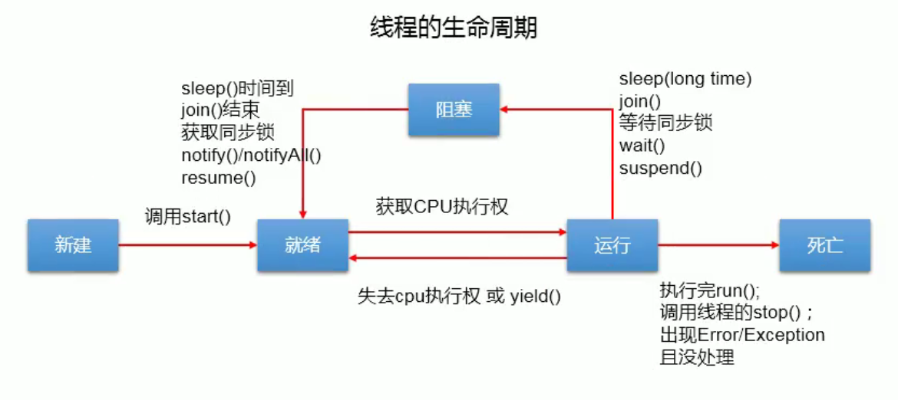

# 多线程

## 线程的创建和使用

### 继承Thread类创建多线程

步骤：	

* 创建一个继承于Thread类的子类。
* 重写Thread类中的run(); 将该线程执行的操作声明在run();
* 创建Thread类的子类的对象。
* 通过该对象调用start();

~~~java
//例子：两个线程分别遍历100以内的奇数和偶数。
class my_Thread extends Thread{
    @Override
    public void run() {
        for (int i = 0; i < 100; i++) {
            if(i%2 == 0)
                System.out.println(i);
        }
    }
}

public class ThreadTest {
    public static void main(String[] args) {
        my_Thread my_thread = new my_Thread();
        my_thread.start();
        for (int i = 0; i < 100; i++) {
            if(i%2 != 0)
                System.out.println(i + "*****main();****");
        }
    }
}
~~~

两个问题的说明：

* 我们不能通过直接调用run();的方式启动线程，而是调用start();。

  start();的两个作用：①启动当前线程。

  ​								   ②调用当前线程的run();

* 同一个对象不能调用两次start();

### 实现Runnable接口创建多线程

* 创建一个实现了Runnable接口的类。
* 实现类去实现Runnable中的抽象方法：run();
* 创建实现类的对象。
* 将此对象作为参数传递到Thread类的构造器中，创建Thread类的对象。
* 通过Thread类的对象调用start();

~~~java
public class RunnableTest {
    public static void main(String[] args) {
        myThread myThread = new myThread();
        Thread thread = new Thread(myThread);
        thread.start();
    }
}

class myThread implements Runnable {
    @Override
    public void run() {
        for(int i = 0;i<100;i++)
            if(i%2 == 0)
                System.out.println(Thread.currentThread().getName() + ":" + i);
    }
}
~~~

前两种创建多线程的方式推荐使用实现Runnable接口的方式创建多线程。

优点：没有类的单继承的局限性。

​			适合处理多个线程有共享数据的情况。

### JDK5.0新增Callable接口创建多线程

步骤：

* 创建Callable接口的实现类。
* 重写call();将该线程要执行的操作声明在call();中。
* 创建Callable接口实现类的对象。
* 将此对象作为参数传递到FutureTask类的构造器中，创建FutureTask的对象。
* 将FutureTask的对象作为参数，传递到Thread类的构造器中，创建Tread类的对象，并调用start();

~~~java
import java.util.concurrent.Callable;
import java.util.concurrent.ExecutionException;
import java.util.concurrent.FutureTask;

//用实现Callable接口的方式创建一个线程，输出1-100之间的偶数，并且将总和输出。
public class CallableTest {
    public static void main(String[] args) throws ExecutionException, InterruptedException {
        callThread callThread = new callThread();
        FutureTask futureTask = new FutureTask(callThread);
        Thread thread = new Thread(futureTask);
        thread.start();
        //get(); 的返回值即为该创建的线程的返回值。
        System.out.println(futureTask.get());
    }
}

class callThread implements Callable{

    @Override
    public Object call() throws Exception {
        int sum = 0;
        for (int i = 0; i <= 100; i++) {
            if (i % 2 == 0) {
                System.out.println(i);
                sum += i;
            }
        }
        return sum;
    }
}
~~~

Callable接口创建多线程比Runnable接口创建多线程的方式更强大：

* call(); 是可以有返回值的。
* call(); 是可以抛出异常的。
* Callable接口是支持泛型的。

### JDK5.0新增使用线程池创建多线程

相关的API：

* ExecutorService：线程池接口，常用子类：TreadPoolExecutor。

  常见方法：

  * void execute(); 一般用来执行通过Runnable接口创建的线程，没有返回值。
  * <T>Future<T>  submit(); 一般用来执行通过Callable接口创建的线程,有返回值。
  * void shutdown(); 关闭线程池

* Executors：线程池的工具类，用于创建并且返回不同类型的线程池。

  常用方法：

  * newCachedThreadPool(); 创建一个根据需要创建新线程的线程池。
  * newFixedThreadPool(n); 创建一个可重用固定线程数的线程池，
  * ...

~~~java
import java.util.concurrent.Executors;
import java.util.concurrent.ThreadPoolExecutor;

//创建一个含有两个线程的线程池，分别输出0-100以内的偶数和奇数。
public class ThreadPoolTest {
    public static void main(String[] args) {
        //提供指定线程数量的线程池。
        ThreadPoolExecutor executorService = (ThreadPoolExecutor) Executors.newFixedThreadPool(10);
        //设置线程池的属性。
        executorService.setCorePoolSize(15);

        //执行线程的操作，需要提供Runnable接口或者Callable接口实现类的对象。
        executorService.execute(new Thread1());
        executorService.execute(new Thread2());

        //关闭线程池。
        executorService.shutdown();
    }
}

class Thread1 implements Runnable{
    @Override
    public void run() {
        for(int i = 0;i<=100;i++){
            if(i%2 == 0){
                System.out.println(Thread.currentThread().getName() + ":" + i);
            }
        }
    }
}

class Thread2 implements Runnable{
    @Override
    public void run() {
        for(int i = 0;i<=100;i++){
            if(i%2 != 0){
                System.out.println(Thread.currentThread().getName() + ":" + i);
            }
        }
    }
}
~~~

使用线程池的好处：

* 提高响应速度（减少了创建新线程的时间）
* 降低资源消耗（重复利用线程池中线程，不需要每次都创建）
* 便于线程管理：
  * corePoolSize：核心池的大小。
  * maximumPoolSize：最大线程数。
  * keepAliveTime：线程没有任务时最多保持多长时间后会终止。

## Thread类中的常用方法

* run();
* start();
* currentThread(); 静态方法，返回执行当前代码的线程。
* getName(); 获取当前线程的名字。
* setName(); 设置当前线程的名字。

* yield(); 释放当前cpu的执行权。

* join(); 在线程a中调用线程b的join();，此时线程a就进入阻塞状态，直到线程b完全执行完以后，线程a才会结束阻塞状态。
* stop(); 已过时，调用该方法，强制结束当前线程。
* sleep(long millitime); 让当前线程睡眠指定毫秒，在睡眠时，当前线程是阻塞状态。
* isAlive(); 判断当前线程是否存活。

## 线程的优先级

涉及到的两个方法：

* setPriority(); 设置线程的优先级。

* gerPriority(); 获取线程的优先级。

线程优先级的等级：

MAX_PRIORITY 10

MIN_PRIORITY 1

NORM_PRIORITY 5

说明：高优先级的线程要抢占低优先级线程cpu执行权，但是从概率上来讲，高优先级的线程高概率的情况下被执行，并不意味着只有当高优先级的线程执行完后，低优先级的线程才执行。

~~~java
public class PriorityTest {
    public static void main(String[] args) {
        myThread1 myThread1 = new myThread1();
        myThread2 myThread2 = new myThread2();
        myThread1.setPriority(Thread.MAX_PRIORITY);
        myThread2.setPriority(Thread.MIN_PRIORITY);
        myThread1.start();
        myThread2.start();
    }
}
class myThread1 extends Thread{
    @Override
    public void run() {
        for(int i = 0;i<100;i++)
            if(i%2 == 0)
                System.out.println(Thread.currentThread().getName() + " " +i);
    }
}

class myThread2 extends Thread{
    @Override
    public void run() {
        for(int i = 0;i<100;i++)
            if(i%2 != 0)
                System.out.println(Thread.currentThread().getName() + " " +i);
    }
}
~~~

经过多次测试结果：myThread1线程比myThread2线程执行优先级高。

## 线程的生命周期

JDK中用Thread.State类中定义了线程的几种状态。

下图为简图：

## 线程的同步

当多个线程有共享数据时，有可能会出现线程安全问题。

例子：创建三个窗口进行卖票。

~~~java
public abstract class ticket {
    public static void main(String[] args) {
        Window w1 = new Window();
        Thread t1 = new Thread(w1);
        Thread t2 = new Thread(w1);
        Thread t3 = new Thread(w1);

        t1.setName("窗口1");
        t2.setName("窗口2");
        t3.setName("窗口3");

        t1.start();
        t2.start();
        t3.start();
    }
}

class Window implements Runnable{
    private int ticket = 100;

    @Override
    public void run() {
        while (true){
            if(ticket>0){
                    try {
                        Thread.sleep(100);
                    } catch (InterruptedException e) {
                        e.printStackTrace();
                    }
                System.out.println(Thread.currentThread().getName() + "票号为" + ticket);
                ticket--;
            }else{
                break;
            }
        }
    }
}
~~~

* 问题：卖票的过程中，出现了重票、错票（线程的安全问题）。

* 问题出现的原因：当某个线程操作车票的过程中，尚未操作完成时，其他线程参与进来，也操作车票。

* 如何解决：当一个线程a在操作ticket的时候，其他线程不能参与进来。直到线程a操作完ticket时，其他线程才可以操作ticket。这种情况即使线程a出现了阻塞，也不能被改变。

* 在java中，我们通过同步机制来解决线程安全问题。
  * 同步代码块
  * 同步方法

* 使用同步机制解决了线程安全问题，但是在操作同步代码时，只能有一个线程操作，其他线程等待，效率低。

### 使用同步代码块解决线程安全问题

synchronized(同步监视器){

需要被同步的代码

}

说明：操作共享数据的代码即为需要被同步的代码，上述例子中的ticket

​			同步监视器：俗称锁。任何一个类的对象都可以充当锁。（要求：多个线程必须用同一把锁）

#### 解决第一种创建多线程的线程安全问题

~~~java
package ThreadTest;

public class ticket {
    public static void main(String[] args) {
        Window w1 = new Window();
        Window w2 = new Window();
        Window w3 = new Window();

        w1.setName("窗口1：");
        w2.setName("窗口2：");
        w3.setName("窗口3：");

        w1.start();
        w2.start();
        w3.start();
    }
}

class Window extends Thread{
    private static int ticket = 100;
    static Object obj = new Object();

    @Override
    public void run() {
        while (true) {
            synchronized (obj) {//此时锁可用当前类 this.getClass() 唯一
                if (ticket > 0) {
                    System.out.println(currentThread().getName() + "票号为:" + ticket);
                    ticket--;
                } else {
                    break;
                }
            }
        }
    }
}
~~~

#### 解决第二种创建多线程的线程安全问题

~~~java
public abstract class ticket {
    public static void main(String[] args) {
        Window w1 = new Window();
        Thread t1 = new Thread(w1);
        Thread t2 = new Thread(w1);
        Thread t3 = new Thread(w1);

        t1.setName("窗口1");
        t2.setName("窗口2");
        t3.setName("窗口3");

        t1.start();
        t2.start();
        t3.start();
    }
}

class Window implements Runnable{
    private int ticket = 100;
    Object obj = new Object();
    @Override
    public void run() {
        while (true){
            synchronized (obj) {//此时锁可用当前对象 this 唯一
                if (ticket > 0) {
                    try {
                        Thread.sleep(100);
                    } catch (InterruptedException e) {
                        e.printStackTrace();
                    }
                    System.out.println(Thread.currentThread().getName() + "票号为" + ticket);
                    ticket--;
                } else {
                    break;
                }
            }
        }
    }
}
~~~

### 使用同步代码块解决线程安全问题

如果操作共享数据的代码完整的声明在一个方法中，我们不妨将此方法声明为同步的。

#### 解决第一种创建多线程的线程安全问题

~~~java
public class ticket {
    public static void main(String[] args) {
        Window w1 = new Window();
        Window w2 = new Window();
        Window w3 = new Window();

        w1.setName("窗口1：");
        w2.setName("窗口2：");
        w3.setName("窗口3：");

        w1.start();
        w2.start();
        w3.start();
    }
}

class Window extends Thread {
    private static int ticket = 100;

    @Override
    public void run() {
        while (ticket > 0) {
            show();
        }
    }

    public static synchronized void show() {//声明为static的同步方法所用的锁为this.getClass()
        if (ticket > 0) {
            System.out.println(currentThread().getName() + "票号为:" + ticket);
            ticket--;
        }
    }
}
~~~

#### 解决第二种创建多线程的线程安全问题

~~~java
public class ticket {
    public static void main(String[] args) {
        Window w1 = new Window();
        Thread t1 = new Thread(w1);
        Thread t2 = new Thread(w1);
        Thread t3 = new Thread(w1);

        t1.setName("窗口1");
        t2.setName("窗口2");
        t3.setName("窗口3");

        t1.start();
        t2.start();
        t3.start();
    }
}

class Window implements Runnable{
    private int ticket = 100;

    @Override
    public void run() {
        while (ticket>0){
                show();
        }
    }

    public synchronized void show(){//没有声明为static的同步方法的锁为this
        if (ticket > 0) {
            System.out.println(Thread.currentThread().getName() + "票号为" + ticket);
            ticket--;
        }
    }
}
~~~

### 通过线程同步解决单例设计模式中的懒汉式

~~~java
public class BackTest {

}

class Back{
    private Back(){
    }

    private static Back instance = null;
    //方式一：效率不高
    public static synchronized Back getInstance1(){
        if(instance == null){
            instance = new Back();
        }
        return instance;
    }
    //方式二：推荐
    public static Back getInstance12(){
        if(instance == null){
            synchronized (Back.class) {
                if(instance == null){
                    instance = new Back();
                }
                
            }
        }
        return instance;
    }
}
~~~

### 线程的死锁

死锁的理解：不同的线程分别占用对方需要的同步资源不放弃，都在等待对方放弃自己需要的同步资源，就形成了线程的死锁。

* 出现死锁，不会出现异常，不会出现提示，只是所有的线程都处于阻塞状态，无法继续。
* 我们使用同步时，要避免出现死锁。

死锁举例：

~~~java
public class ThreadTest {
    public static void main(String[] args) {
        StringBuffer s1 = new StringBuffer();
        StringBuffer s2 = new StringBuffer();

        new Thread(){
            @Override
            public void run() {
                synchronized (s1){
                    s1.append("a");
                    s2.append("1");
                    try {
                        Thread.sleep(1000);
                    } catch (InterruptedException e) {
                        e.printStackTrace();
                    }
                }
                synchronized (s2){
                    s1.append("b");
                    s2.append("2");
                }
            }
        }.start();

        new Thread(new Runnable() {
            @Override
            public void run() {
                synchronized (s2) {
                    s1.append("c");
                    s2.append("3");
                    try {
                        Thread.sleep(1000);
                    } catch (InterruptedException e) {
                        e.printStackTrace();
                    }
                }
                synchronized (s1) {
                    s1.append("d");
                    s2.append("4");
                    System.out.println(s1);
                    System.out.println(s2);
                }
            }
        }).start();
    }
}
~~~

解决方案：

* 专门的算法、原则
* 减少同步资源的定义
* 尽量避免嵌套同步

### JDK5.0Lock锁解决线程安全问题

步骤：

* 实例化ReentrantLock
* 在需要同步的代码前后调用 lock(); 和unlock();

~~~java
import java.util.concurrent.locks.ReentrantLock;

public class LockTest {
    public static void main(String[] args) {
        Window window = new Window();

        Thread t1 = new Thread(window);
        Thread t2 = new Thread(window);
        Thread t3 = new Thread(window);

        t1.setName("窗口1");
        t2.setName("窗口2");
        t3.setName("窗口3");

        t1.start();
        t2.start();
        t3.start();
    }
}

class  Window implements Runnable{
    private int ticket = 100;
    private ReentrantLock lock = new ReentrantLock(true);
    @Override
    public void run() {
        while(true){
            try {
                lock.lock();
                if(ticket>0) {
                    try {
                        Thread.sleep(100);
                    } catch (InterruptedException e) {
                        e.printStackTrace();
                    }
                    System.out.println(Thread.currentThread().getName() + "票号为:" + ticket);
                    ticket--;
                }else{
                    break;
                }
            } finally {

                lock.unlock();
            }
        }
    }
}
~~~

Lock锁与使用Synchronized解决线程安全问题的区别：

* Synchronized在执行完相应的同步代码后，自动释放同步监视器；Lock需要手动的启动锁和释放锁。

## 线程的通信

涉及到的方法：

* wait(); 调用该方法的线程会进入阻塞状态，并且释放同步监视器。
* notify(); 随机唤醒一个线程，优先唤醒优先级高的线程。
* notifyAll(); 唤醒所有的线程。

举例：创建两个线程，交互打印出1到100之间的整数。

~~~java
public class WaitTest {
    public static void main(String[] args) {
        prac prac = new prac();

        Thread t1 = new Thread(prac);
        Thread t2 = new Thread(prac);

        t1.setName("线程1");
        t2.setName("线程2");

        t1.start();
        t2.start();
    }
}

class prac implements Runnable{
    private int num = 1;

    @Override
    public void run() {
        while (true){
            synchronized (this) {
                notify();
                if(num<=100){
                    try {
                        Thread.sleep(100);
                    } catch (InterruptedException e) {
                        e.printStackTrace();
                    }
                    System.out.println(Thread.currentThread().getName() + "数字为：" + num);
                    num++;
                    try {
                        wait();
                    } catch (InterruptedException e) {
                        e.printStackTrace();
                    }
                }else{
                    break;
                }
            }
        }
    }
}
~~~

注意：

* wait(); notify(); notifyAll(); 三个方法必须使用在同步代码块或同步方法中。
* wait(); notify(); notifyAll(); 三个方法的调用者必须是同步代码块或同步方法中的同步监视器。
* wait(); notify(); notifyAll(); 三个方法是定义在Object类中的。