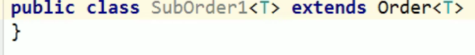

# 为什么需要泛型？

* jdk5.0新增
* 所谓泛型，就是允许在定义类、接口时通过一个标识表示类中某个属性的类型或者是某个方法的返回值以及参数类型。这个类型参数将在使用时，例如：继承或实现这个接口，用这个类型声明变量、创建对象时确定即传入的实际的参数，也称为类型实参

# 集合中使用泛型

* 集合接口或集合类在jdk5.0时都修改为带泛型的结构
* 在实例化集合类时，可以指明具体的泛型类型
* 在指明以后，在集合类或接口中凡是使用到泛型的地方，都指定实例化为泛型类型
  * 比如 add(E e); ---->  add(Integer e);
* 泛型类型必须为引用数据类型，不能是基本数据类型
* 实例化时如果没有指定泛型类型，默认为Object

# 泛型类/接口

* 类或者接口声明泛型


* 声明后类/接口中的属性和方法就可以使用泛型

  * 一旦定义了泛型，就强烈建议指明泛型类型
  * 若没有指明泛型，则认为该泛型就是Object

* 子类继承父类时泛型的处理方式：

  * 在继承时就指明父类的泛型类型：子类在实例化时就不再需要指定泛型类型

  

  * 在继承时不指明泛型类型：子类在实例化时可以指定泛型类型

  

# 泛型方法

* 泛型方法：在方法中出现了泛型的结构，泛型参数与类的泛型泛型参数没有任何关系。
* 换句话说，泛型方法所属的类是不是泛型都没有关系
* 泛型方法，可以是静态的


# 泛型在继承方面的体现

* 以下程序是正确的：

```java
String[] str = new String[3];
Object[] obj = new Object[3];
str = obj;
```

* 但是下面的程序不正确

```java
List<Object> list1 = null;
List<String> list2 = null;
list1 = list2;
```

* 此时的list1与list2的类型不具有子父类的关系，编译不通过

# 通配符的使用

* 使用通配符可以解决上述问题

```java
List<Object> list1 = null;
List<String> list2 = null;
List<?> list3 = null;
list3 = list1;
list3 = list2;
```

* 获取到的返回值为Object

```java
List<?> list = null;
Iterator<?> iterator = list.iterator();
Object o = iterator.next();
```

* 但是不能再添加值,可以添加null

```java
List<?> list = null;
//list.add(new Object());
list.add(null);
```

# 有限制条件的通配符