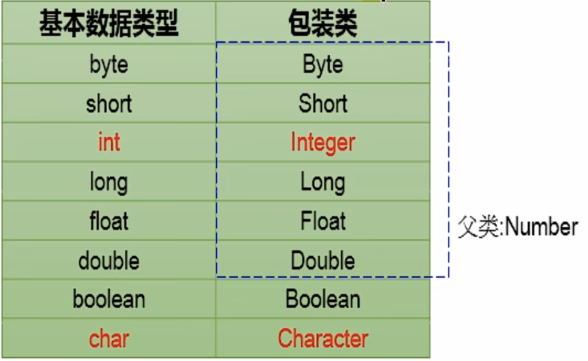
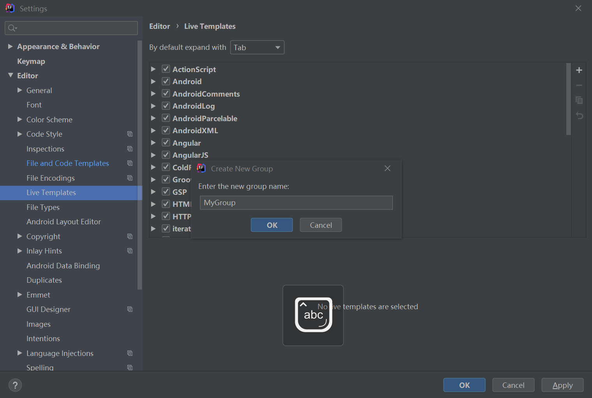
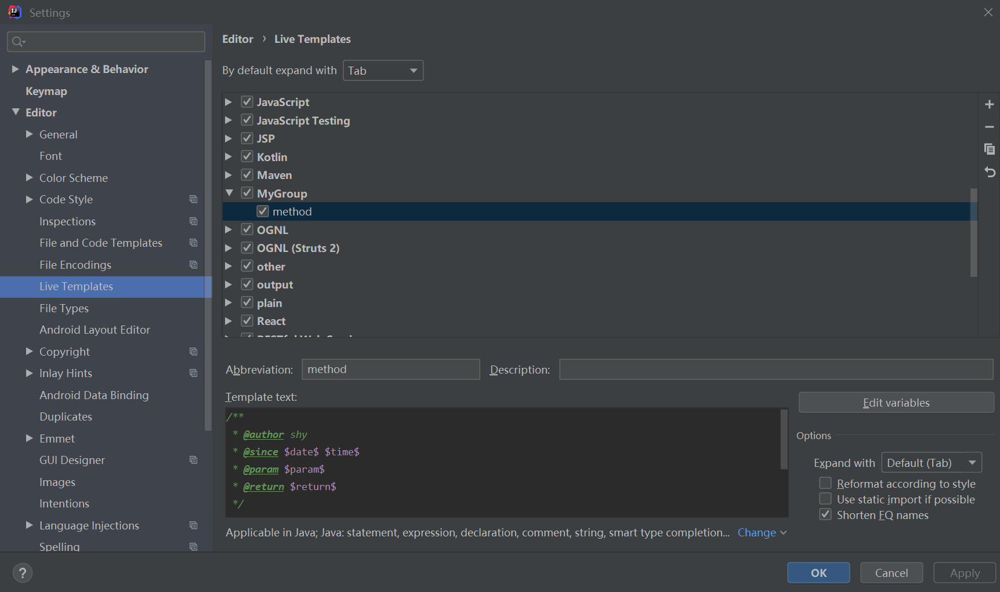

# 包装类

* 针对8大基本数据类型定义相应的引用类型---包装类（封装类）



* 基本数据类型与包装类之间的转换
  * 基本数据类型--->包装类：
    * 直接使用包装类的构造器
    * 自动装箱
  * 包装类--->基本数据类型：
    * 自动拆箱
    * 使用XxxValue();
* 基本数据类型、包装类与String之间的转换
  * 基本数据类型、包装类--->String
    * 使用+""连接运算
    * 调用String类中的valueOf();
  * String--->基本数据类型、包装类
    * 调用包装类中的parseXxx();

# 接口

## 接口的使用

* 接口使用interface关键字来定义。
* java中，接口和类是并列的两个结构。
* 如何定义接口：定义接口中的成员。

* 在jdk7以前，接口中只能定义全局常量和抽象方法：接口中不能定义其他结构包括构造器，因此接口不能实例化。
  * 全局常量：public static final
  * 抽象方法：public abstract
* 在java开发中，接口都是通过让类去实现（implements）的方式来使用。
  * 如果实现类覆盖了接口中的所有抽象方法，则此实现类就可以实例化。
  * 如果实现类没有覆盖接口中所有的抽象方法，则此实现类仍是一个抽象类。
* java类可以实现多个接口，弥补了单继承的缺点。
* 接口和接口直接也可以有继承的关系，而且可以多继承。
* 接口的使用是可以体现多态性的。
* 接口实际上可以看做是一种规范。

~~~java
public class interfaceTest {
    public static void main(String[] args) {
        Plane plane = new Plane();
        plane.fly();
        plane.stop();
    }

}
interface Flyable{
    public static final int MAX_SPEED = 7900;
    int MIN_SPEED = 0;//因为接口中的属性都是全局常量，因此可以省去public static final。

    public abstract void fly();

    void stop();//接口中的方法为抽象方法，因此可以省去public abstract
}

class Plane implements Flyable{
    @Override
    public void fly() {
        System.out.println("通过引擎起飞");
    }

    @Override
    public void stop() {
        System.out.println("驾驶员减速停止");
    }
}
~~~

## 代理模式

~~~java
package com.shy.interfa;

public class NetWorkTest {
    public static void main(String[] args) {
        Server server = new Server();
        ProxyServer proxyServer = new ProxyServer(server);
        proxyServer.browse();
    }
}

interface NetWork{
    void browse();
}
//被代理类
class Server implements NetWork{

    @Override
    public void browse() {
        System.out.println("被代理类的服务器访问");
    }
}
//代理类
class ProxyServer implements NetWork{
    private NetWork work;

    public ProxyServer(NetWork work){
        this.work = work;
    }

    public void check(){
        System.out.println("代理类进行校验");
    }
    @Override
    public void browse() {
        check();
        work.browse();
    }
}
~~~

## 工厂模式

# 注解

* 注解的理解：
  * jdk5.0新增
  * Annotation就是代码中的特殊标记，这些标记可以在编译、类加载、运行时被读取，并且执行相应的处理。通过使用Annotation，程序员可以在不改变原有逻辑的情况下，在源文件中嵌入一些补充信息。
  * 在javase中，可以用来标记过时的功能，忽略警告。在javaEE中可以用来配置程序的任何切面，代替了繁琐的代码和XML配置。
* 使用示例：
  * 文档注释的相关注解
  * jdk内置三个注解
    * @Override：限定重写父类方法，该注解只能用于方法
    * @Deprecated：用于表示所修饰的元素（类、方法）已经过时。通常是因为所修饰的结构有危险或者有更好的选择
    * @SuppressWarnings：抑制编译器警告
  * 跟踪代码依赖性，实现替代配置文件功能

## 文档注释

* 文档注释也被称为说明注释，在程序中以`/**`做为开始，`*/`作为结束，其他和多行注释一样。
  这里说明：文档注释一行或几行都是关于类、变量和方法的主要描述。

```java
public class Test {
	/**
 	* 这是文档注释
 	*/
	public static void main(String[] args) {
	}
}
```

* 允许你在程序中嵌入关于程序的信息。你可以使用 javadoc 工具软件来生成信息，并输出生成api文档，供开发者及相关人士阅读。总结即为：文档注释使你更加方便的记录你的程序信息，但是我们常常不会像例子中那样直接文字：这是一个文档注释，而是使用一些 javadoc 工具能够识别的标签，具体的标签我们往下看:

**javadoc标签**

| 标签         | 描述                                                   | 示例                                                         |
| ------------ | ------------------------------------------------------ | ------------------------------------------------------------ |
| @author      | 标识一个类的作者                                       | @author simon                                                |
| @deprecated  | 指名一个过期的类或成员                                 | @deprecated description                                      |
| @docRoot     | 指明当前文档根目录的路径                               | Directory Path                                               |
| @exception   | 标志一个类抛出的异常                                   | @exception exception-name explanation                        |
| @inheritDoc  | 从直接父类继承的注释                                   | Inherits a comment from the immediate surperclass.           |
| @link        | 插入一个到另一个主题的链接                             | {@link name text}                                            |
| @linkplain   | 插入一个到另一个主题的链接，但是该链接显示纯文本字体   | Inserts an in-line link to another topic.                    |
| @param       | 说明一个方法的参数                                     | @param parameter-name explanation                            |
| @return      | 说明返回值类型                                         | @return explanation                                          |
| @see         | 指定一个到另一个主题的链接                             | @see anchor                                                  |
| @serial      | 说明一个序列化属性                                     | @serial description                                          |
| @serialData  | 说明通过writeObject( ) 和 writeExternal( )方法写的数据 | @serialData description                                      |
| @serialField | 说明一个ObjectStreamField组件                          | @serialField name type description                           |
| @since       | 标记当引入一个特定的变化时                             | @since release                                               |
| @throws      | 和 @exception标签一样.                                 | The @throws tag has the same meaning as the @exception tag.  |
| @value       | 显示常量的值，该常量必须是static属性。                 | Displays the value of a constant, which must be a static field. |
| @version     | 指定类的版本                                           | @version 1.0                                                 |

* 进行设置文档注释模板





## 自定义注解

* 使用@interface关键字
* 自定义注解自动继承java.lang.annotation.Annotation接口
* 注解的成员以无参方法的形式来声明，其方法的返回值定义了该成员的名字和类型。称为配置参数，类型只能是八种基本数据类型、String类、Class类、Enum类型、Annotation类型
* 可以使用default关键字为成员赋予默认值
* 如果只有一个成员，成员名建议为value
* 没有成员的注解称为标记

```java
//定义
public @interface MyAnnotation{
    String value();
}
//使用
@MyAnnotation("value")
class Person{
    
}
//定义
public @interface MyAnnotation{
    String value() default "value";
}
//使用
@MyAnnotation
class Person{
    
}
```

## 元注解

* jdk中4个元注解用于修饰其他注解

* @Retention：

  * 只能用于修饰一个Annotation，用于指定该Annotation的生命周期，@Rentention时必须为value成员变量指定值
  * 可用的几个值：

  ```java
  package java.lang.annotation;
  
  /**
   * Annotation retention policy.  The constants of this enumerated type
   * describe the various policies for retaining annotations.  They are used
   * in conjunction with the {@link Retention} meta-annotation type to specify
   * how long annotations are to be retained.
   *
   * @author  Joshua Bloch
   * @since 1.5
   */
  public enum RetentionPolicy {
      /**
       * Annotations are to be discarded by the compiler.
       */
      SOURCE,
  
      /**
       * Annotations are to be recorded in the class file by the compiler
       * but need not be retained by the VM at run time.  This is the default
       * behavior.
       */
      CLASS,
  
      /**
       * Annotations are to be recorded in the class file by the compiler and
       * retained by the VM at run time, so they may be read reflectively.
       *
       * @see java.lang.reflect.AnnotatedElement
       */
      RUNTIME
  }
  ```

* @Target

  * 用于指定被修饰的Annotation能用于修饰哪些程序元素
  * 可选值：

  ```java
  package java.lang.annotation;
  
  /**
   * @author  Joshua Bloch
   * @since 1.5
   * @jls 9.6.4.1 @Target
   * @jls 4.1 The Kinds of Types and Values
   */
  public enum ElementType {
      /** Class, interface (including annotation type), or enum declaration */
      TYPE,
  
      /** Field declaration (includes enum constants) */
      FIELD,
  
      /** Method declaration */
      METHOD,
  
      /** Formal parameter declaration */
      PARAMETER,
  
      /** Constructor declaration */
      CONSTRUCTOR,
  
      /** Local variable declaration */
      LOCAL_VARIABLE,
  
      /** Annotation type declaration */
      ANNOTATION_TYPE,
  
      /** Package declaration */
      PACKAGE,
  
      /**
       * Type parameter declaration
       *
       * @since 1.8
       */
      TYPE_PARAMETER,
  
      /**
       * Use of a type
       *
       * @since 1.8
       */
      TYPE_USE
  }
  ```

* @Documented：表示所修饰的注解在被javadoc解析时保留下来

* @Inherited：修饰的注解将具有继承性，如果某个类使用了被@Inherited修饰的注解，那么这个类可以继承父类级别的注解