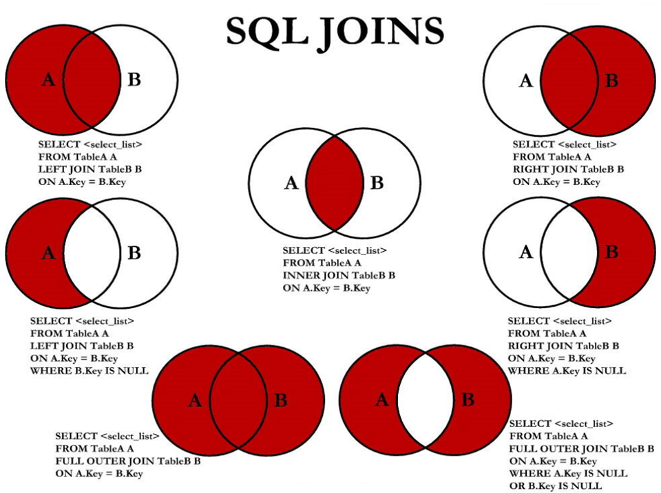

# MySQL

## 基本的SELECT语句

~~~mysql
 -- 最基本的SELECT语句

	SELECT 1,2,3,4,5,1000;  #SELECT  字段1,字段2,...  FROM  表名

	SELECT 1,2,3,4,5,1000
	FROM DUAL;  #dual可理解为伪表。
	
	SELECT *
    FROM employees; 			 # * 表示所有字段。
	
	SELECT first_name,last_name 
	FROM employees; 			 #查询部分字段。
	
	#SELECT 语句查询返回一个结果集
~~~

## 列的别名

~~~mysql
	SELECT employees_id AS emp_id,last_name lname,department_id "dept_id" FROM employees;
	#在字段后 + AS + 别名（AS可以省略）。
	#列的别名可以用一对""引起来（不能使用单引号）。
	#""在名字中有空格时使用防止冲突。
~~~

### 除重复行

使用 `DISTINCT` 关键字

~~~mysql
	SELECT DISTINCT department_id 
	FROM employees;
	# DISTINCT 只能在SELECT之后
	
	#不会报错，去重两个字段都相同的行，实际没有意义
	SELECT DISTINCT department_id,salary 
	FROM employees;
~~~

#### 空值参与运算

空值：null 

空值参与运算（加减乘除）结果是null

~~~mysql
SELECT employee_id,salary "月工资",salary * (1 + commission_pct) * 12 "年工资",commission_pct 
FROM employees;
# commission_pct 为null时 年工资也为null
~~~

解决方案：

~~~mysql
SELECT employee_id,salary "月工资",salary * (1 + IFNULL(commission_pct,0)) * 12 "年工资",commission_pct
FROM employees;
~~~

#### 着重号

着重号``

当表名和字段为关键字时，需要用``对其修饰。

~~~mysql
SELECT * FROM `ORDER`
~~~

#### 查询常数

~~~mysql
SELECT '查询常数',first_name,last_name 
FROM employees;
~~~

#### 显示表的结构

~~~mysql
DESCRIBE employees;#显示了表中字段的详细信息。
DESC employees;

SHOW CREATE TABLE employees; #查看创建表的语句结构。
~~~

#### 过滤数据

过滤数据：查询符合某些条件的，信息。

使用`WHERE`关键字，声明在`FROM`关键字后面。

`WHERE`+过滤条件

~~~ mysql
#查询90号部门的员工信息
SELECT *
FROM employees
WHERE department_id = 90;
#查询last_name为'King'的员工信息
SELECT * 
FROM employees
WHERE last_name = 'King';
~~~

## 运算符

### 算术运算符

+-*/    DIV   %   MOD 

~~~mysql
SELECT 100, 100+0,100-0,100+50-30,100+35.5,100-35.5
FROM DUAL;

SELECT 100 + '1'   #在SQL中，+没有连接作用，此时表示加法运算。此时字符串会转换为数值。
FROM DUAL;   #在java中结果为1001，SQL中为101。

SELECT 100 + 'a'
FROM DUAL;  #此时将 'a' 看做0。

SELECT 100 / 2
FROM DUAL; #结果为50.0000，整型做除法(/)结果默认为浮点型。

SELECT 100 DIV 10;
FROM DUAL;#结果为50。

SELECT 100 / 0
FROM DUAL;  #结果为 null 
~~~

### 比较运算符

比较结果若为 真 返回1 假 返回0 其他结果返回null

#### 符号类型：

1. = （不同于赋值）

   ~~~mysql
   SELECT 1 = '1',0 = 'a'
   FROM DUAL;     #字符串存在隐式转换。如果不成功，看做0。
   
   SELECT 'a' = 'a','ab' = 'ab','a' = 'b'#两边都是字符串，按照ANSI比较
   FROM DUAL;
   
   SELECT 1 = NULL,NULL = NULL
   FROM DUAL;#NULL参与运算，结果为NULL。
   
   SELECT commission_pct
   FROM employees
   WHILE commission_pct = NULL; #不会有任何结果。
   ~~~

2. <=>(安全等于)

   解决NULL参与运算的情况， 两遍均为NULL，返回1，有一个是NULL，返回0。

   ~~~mysql
   SELECT 1 <=> NULL,NULL<=>NULL;
   ~~~

3.  <>   !=   不等于

4. <   <=   >   >=

#### 非符号类型：

| 关键字           | 作用                                 |
| ---------------- | ------------------------------------ |
| `ISNULL`         | 函数，判断是否为NULL                 |
| `IS` `NOT` `NUL` | 判断不为NULL返回1                    |
| `IS` `NULL`      | 判断为NULL返回1                      |
| `LEAST`          | 函数，求最小值                       |
| `GREATEST`       | 函数，求最大值                       |
| `BETWEEN...AND`  | 查询区间（包括边界）                 |
| `IN`             | 函数，判断一个值是否为表中任意一个值 |
| `NOT`  `IN`      | 判断一个值是否不是一个表中任意一个值 |
| `LIKE`           | 模糊查询                             |
| REGEXP/RLIKE     | 正则表达式                           |

### 逻辑运算符

| 运算符     | 作用     |
| ---------- | -------- |
| NOT 或  !  | 逻辑非   |
| AND 或 &&  | 逻辑与   |
| OR 或 \|\| | 逻辑或   |
| XOR        | 逻辑异或 |

注意：AND和OR可以一起使用，优先级AND>OR

### 位运算符

| 运算符 | 作用     |
| ------ | -------- |
| &      | 按位与   |
| \|     | 按位或   |
| ^      | 按位异或 |
| ~      | 按位取反 |
| >>     | 按位右移 |
| <<     | 按位左移 |

### 运算符的优先级

略

## 排序

### 排序

注：没有使用排序操作，默认情况下查询返回的数据是按照添加数据的顺序显示的。

排序使用 `ORDER` `BY`

升序 `ASC`

降序 `DESC`

~~~MYSQL
#将员工信息按照salary从高到低排序
SELECT employees_id,last_name,salary
FROM employees
ORDER BY salary DESC;

#将员工信息按照salary从低到高排序
SELECT employees_id,last_name,salary
FROM employees
ORDER BY salary ASC;

#若ORDER BY 后没有显示声明排序方式，默认为 ASC .
SELECT employees_id,last_name,salary
FROM employees
ORDER BY salary;
~~~

我们可以使用列的别名，进行排序：

~~~mysql
SELECT employees_id,salary,salary * 12 annual_sal
FROM employees
ORDER BY annual_sal;
~~~

列的别名不能在`WHILE`中使用，如下操作会报错：

~~~mysql
SELECT employees_id,salary,salary * 12 annual_sal
FROM employees
WHILE annual_sal > 81600;
~~~

解释：程序执行顺序：`FROM` -`WHILE` -`SELECT`- `ORDER` `BY`

~~~mysql
SELECT employees_id,salary,salary * 12 annual_sal
FROM employees
WHILE department_id IN(50,60,70)
ORDER BY annual_sal DESC;#WHILE 需要声明在FROM之后，ORDER BY 之前。
~~~

### 二级排序

~~~mysql
#员工信息按照，department_id 的降序排序，department_id相同的按照salary升序排序
SELECT employees_id,salary,department_id
FROM employees
ORDER BY department_id DESC,salary ASC;
~~~

## 分页

使用关键字 `LIMIT`

~~~mysql
#每页显示二十条，显示第一页
SELECT employee_id,last_name
FROM employees
LIMIT 0,20;  # LIMIT 偏移量,每页的条数

#每页显示二十条，显示第二页
SELECT employee_id,last_name
FROM employees
LIMIT 20,20;
~~~

MySQL80新特性：`LIMIT` `OFFSET`

~~~mysql
#每页显示二十条，显示第一页
SELECT employee_id,last_name
FROM employees
LIMIT 20 OFFSET 0;
~~~

## SQL脚本

* sql语句可以写在一个以.sql结尾的文件中：

* 在命令行使用source sql文件路径进行执行

* 在sqlyog中执行sql脚本

## 多表查询

熟悉三张表

~~~mysql
DESCRIBE employees;

DESCRIBE departments;

DESCRIBE locations;
~~~

查询结果为笛卡尔积的错误情况：

~~~mysql
SELECT employee_id,department_name
FROM empolyees,departments;#一共出现107*27条数据
~~~

解决方案：加入过滤条件

~~~mysql
SELECT employee_id,department_name
FROM employees,departments
WHERE employees.`department_id` = departments.`department_id`;
~~~

如果查询语句中出现了多个表中都存在的字段，则必须指明此字段所在的表：

~~~mysql
SELECT employee_id,department_name,employees.department_id
FROM employees,departments
WHERE employees.`department_id` = departments.`department_id`;
#从sql优化的角度，建议每次多表查询时，每个字段前都指明其所在的表。
~~~

上述连接为等值连接

### 多表查询常见案例

1. 等值连接vs非等值连接

   非等值连接：

   ~~~mysql
   SELECT e.last_name,e.salary,j.grade_level
   FROM employees e,job_grades j
   WHERE e.salary BETWEEN j.lowest_sal AND j.highest_sal;
   ~~~

2. 自连接vs非自连接

   以上连接方式均为非自连接。

   ~~~mysql
   #查询员工id，员工姓名及其管理者的id和姓名
   SELECT emp.employee_id,emp.last_name,mgr.employee_id,mgr.last_name
   FROM employees emp,employees mgr
   WHERE emp.manager_id = mgr.employee_id;
   ~~~

3. 内连接vs外连接

   内连接：合并具有同一列的两个以上的表的行，结果集中不包含一个表与另一个表不匹配的行。
   
   ~~~mysql
SELECT employee_id,department_id
   FROM employees e,departments d
   WHERE e.department_id = d.department_id;
   #只有106条记录。
   ~~~
   
   外连接：合并具有同一列的两个以上的表的行，结果集中除了包含一个表与另一个表匹配的行，还查询到了左表或右表不匹配的行。

外连接分类：

* 左外连接
* 右外连接
* 满外连接

SQL92语法实现内连接：见上。

SQL92语法实现外连接：使用 (+) --- MySQL不支持SQL92语法中外连接的写法。

SQL99语法实现内连接：

使用关键字：`JOIN ` ... `ON` 或 `INNER` `JOIN` ...  `ON` 

~~~mysql
SELECT last_name,department_name,city
FROM employees e JOIN departments d
ON e.department_id = d.department_id
JOIN locations l
ON d.location_id = l.location_id;
~~~

SQL99语法实现外连接：

使用关键字：`JOIN ` ... `ON` 或 `OUTER` `JOIN` ...  `ON` 

左外连接加 `LEFT` 右外连接加 `RIGHT` 满外连接加` `

~~~mysql
#查询所以员工的last_name,department_name信息(使用左外连接)。
SELECT last_name,department_name
FROM employees e LEFT JOIN departments d
ON e.department_id = d.department_id;
~~~

### MySQL实现满外连接：

`UNION`关键字的使用：

`UNION`：会执行去重操作。

`UNION` `ALL`：不执行去重操作。

结论：如果明确知道合并数据后的结果数据不存在重复数据，或者不需要去除重复的数据，则尽量使用`UNION` `ALL`关键字，以提高数据查询的效率。

7种JOIN的实现。

中间图：内连接

~~~mysql
SELECT employee_id,department_name
FROM employees e JOIN departments d
ON e.`department_id` = d.`department_id`;
~~~

左上图：左外连接

~~~mysql
SELECT employee_id,department_name
FROM employees e LEFT JOIN departments d
ON e.`department_id` = d.`department_id`;
~~~

右上图：右外连接

~~~mysql
SELECT employee_id,department_name
FROM employees e RIGHT JOIN departments d
ON e.`department_id` = d.`department_id`;
~~~

左中图：

~~~mysql
SELECT employee_id,department_name
FROM employees e LEFT JOIN departments d
ON e.`department_id` = d.`department_id`
WHERE d.`department_id` IS NULL;
~~~

右中图：

~~~mysql
SELECT employee_id,department_name
FROM employees e RIGHT JOIN departments d
ON e.`department_id` = d.`department_id`
WHERE e.`department_id` IS NULL;
~~~

左下图：满外连接，使用左上图和右中图 或者 右上图和左中图连接。

~~~mysql
SELECT employee_id,department_name
FROM employees e LEFT JOIN departments d
ON e.`department_id` = d.`department_id`
UNION ALL
SELECT employee_id,department_name
FROM employees e RIGHT JOIN departments d
ON e.`department_id` = d.`department_id`
WHERE e.`department_id` IS NULL;
~~~

右下图：使用左中图和右中图连接。

~~~mysql
SELECT employee_id,department_name
FROM employees e LEFT JOIN departments d
ON e.`department_id` = d.`department_id`
WHERE d.`department_id` IS NULL
UNION ALL
SELECT employee_id,department_name
FROM employees e RIGHT JOIN departments d
ON e.`department_id` = d.`department_id`
WHERE e.`department_id` IS NULL;
~~~

