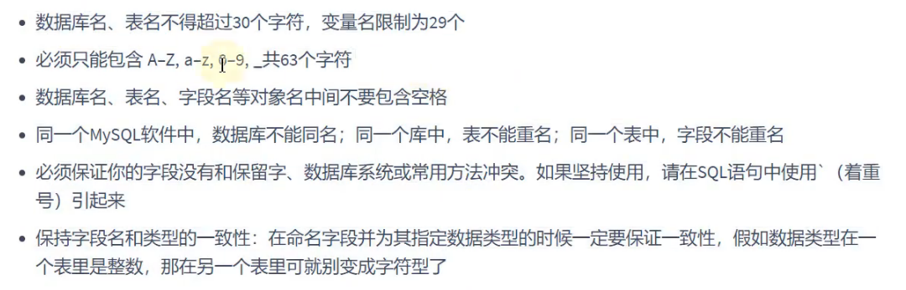

# 创建和管理表

## 基础知识

### 一条数据的存储过程

### 标识符的命名规则

## 创建和管理数据库

### 创建数据库

* 方式1：CREATE DATABASE 数据库名;

~~~mysql
CREATE DATABASE mysql1;#创建的此数据库，使用的是默认的字符集。

SHOW DATABASES;#查看所有的数据库。

SHOW VARIABLES LIKE 'CHARACTER_%';#可以查询到默认情况下的字符集。
~~~

* 方式2：CREATE DATABASE 数据库名 CHARACTER SET '该数据库使用的字符集';

~~~mysql
CREATE DATABASE mysql2 CHARACTER SET 'gbk';

SHOW DATABASES;

SHOW CREATE DATABASE mysql2；#查询指定数据库的相关资料：字符集...
SHOW CREATE DATABASE mysql2\G；#另外一种形式查看资料。
~~~

* 方式3：CREATE DATABASE IF NOT EXISTS 数据库名 (CHARACTER SET '该数据库使用的字符集');

~~~MYSQL
CREATE DATABASE IF NOT EXISTS mysql3;#创建数据库，如果该数据库已经存在，则创建不成功，但不会报错。
~~~

推荐使用方式3。

### 管理数据库

* 查看当前所有数据库。

~~~mysql
SHOW DATABASES;
~~~

* 查看当前正在使用的数据库。

~~~mysql
SHOW DATABASE();#使用一个函数。
~~~

* 查看指定数据库下的所有表。

~~~mysql
SHOW TABLES FROM mysql; #查看mysql数据库下的所有表。
~~~

* 查看数据库相关信息。

~~~mysql
SHOW CREATE DATABASE mysql;
SHOW CREATE DATABASE mysql\G;
~~~

* 切换数据库。

~~~mysql
USE mysql; #切换为mysql数据库。
~~~

### 修改数据库

注意：大多数情况下不会修改。

修改数据库字符集。

~~~mysql
ALTER DATABASE 数据库名 CHARACTER SET '字符集';
~~~

数据库不能修改名字。

### 删除数据库

* 方式1：DROP DATABASE 数据库名;

~~~mysql
DROP DATABASE mysql1;#如果数据库不存在，会报错。
~~~

* 方式2：DROP DATABASE IF EXISTS 数据库名;

~~~MYSQL
DROP DATABASE mysql2;#如果数据库不存在，删除不成功，不会报错，推荐使用。
~~~

## 创建和管理表

### 创建表

方式1：CREATE TABLE IF NOT EXISTS 表名;

~~~mysql
CREATE TABLE IF NOT EXISTS my_sql1(
id INT,
emp_name VARCHAR(15),#在使用VARCHAR定义字符串时，必须指明其长度。
hire_date DATE
);

DESC my_sql1;

SHOW CREATE TABLE my_sql1;
~~~

方式2：通过查询语句根据已经存在的表创建新的表，新的表会有对应的数据，

~~~mysql
create table if not exists my_sql2
as
select e.employee_id emp_id,e.last_name lname,d.department_name#使用字段的别名可以为新的表中的字段命名。
from employees e join departments d
on e.department_id = d.department_id;

desc my_sql2;

show create table my_sql2;
~~~

### 修改表的字段

#### 添加

~~~mysql
ALTER TABLE my_sql1
ADD salary DOUBLE(10,2);#添加salary字段，默认添加在表的最后面。

ALTER TABLE my_sql1
ADD email VARCHAR(45) FIRST;#在首位置添加字段email。

ALTER TABLE my_sql1
ADD phone_number VARCHAR(45) AFTER id;#在id之后添加字段phone_number。

DESC my_sql1;
~~~

#### 修改(数据类型、长度、默认值)

~~~mysql
ALTER TABLE my_sql1
MODIFY email VARCHAR(30) DEFAULT 'aaa';#将email修改为30长度的字符串，默认值改为aaa。

DESC my_sql1;
~~~

#### 重命名

~~~mysql
ALTER TABLE my_sql1
CHANGE email my_email VARCHAR(20);#在修改名字的同时可以修改表。
~~~

#### 删除

~~~mysql
ALTER TABLE my_sql1
DROP COLUMN email;
~~~

### 重命名表

方式1：

~~~mysql
RENAME TABLE my_sql1
TO my_sql11;
~~~

方式2：

~~~mysql
ALTER TABLE my_sql11
RENAME TO my_sql1;
~~~

### 删除表

~~~MYSQL
DROP TABLE my_sql1;
~~~

### 清空表

~~~mysql
TRUNCATE TABLE my_sql1;
~~~

# commit和rollback

* commit：提交数据；一旦执行，数据就永久的保存在了数据库，此后回滚会回到commit操作时。
* rollback：回滚数据；一旦执行，数据就会回滚到最近的一次commit时。

## truncate table和delete from对比

* truncate table：一旦执行，表中数据全部清除，并且执行一次commit，数据无法回滚到清除之前。

* delete from：一旦执行，表中数据通过过滤数据进行删除，数据是“可以”回滚的。

## DDL和DML的说明

* DDL一旦执行（truncate table...）数据不可回滚（相当于执行了一次commit）。
* DML一旦执行（delete from），数据“可以”回滚（必须进行设置：set autocommit = false;），否则数据也是不可以回滚的。