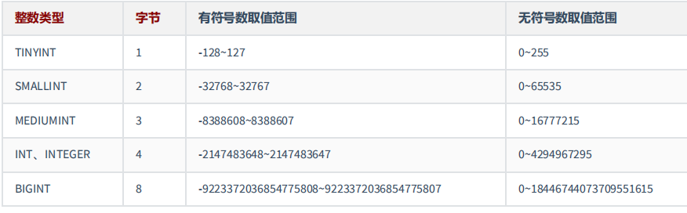

# MySQL字符集的设置

* 我们可以在创建数据库、创建表、声明字段的时候指定字符集

```mysql
create database mydatabase character set 'utf8';#创建数据库的时候指明

create table t1(id int,name varchar(20)) character set 'utf8';#创建表的时候指明

create table t1(id int,name varchar(20) character set 'gbk');#声明字段的时候指明
```

* 当我们创建字段没有指明的时候默认与创建表时一致，创建表没有指明，默认与创建数据库时一致，创建数据库没有指明，默认与my.ini一致

* 查看配置文件中的声明：

```mysql
show variables lik 'character_%';
```

# 整型

## 简单使用

* 整型数据类型共有一下几个：

  * tinyint、smallint、mediumint、int（integer）、bigint

* 区别如下,当我们插入的范围超过取值范围时，会直接报错

  

* 举例：

```mysql
CREATE TABLE test_int1 ( 
x TINYINT,
y SMALLINT,
z MEDIUMINT,
m INT,
n BIGINT );
```

## 显示指明宽度：

* 整型数据类型可以在定义表结构时指定所需要的显示宽度，如果不指定，则系统为每一种类型指定默认

  的宽度值。

* M : 表示显示宽度，M的取值范围是(0, 255)。例如，int(5)：当数据宽度小于5位的时候在数字前面需要用

  字符填满宽度。该项功能需要配合“ ZEROFILL ”使用，表示用“0”填满宽度，否则指定显示宽度无效。

  ```mysql
  create table t1(
  f2 INT(5),
  f3 INT(5) ZEROFILL )
  ```

* 如果设置了显示宽度，那么插入的数据宽度超过显示宽度限制，不会对插入的数据有任何影响，还是按照类型的实际宽度进行保存，即 显示宽度与类型可以存储的值范围无关 。从**MySQL 8.0.17**开始，整数数据类型不推荐使用显示宽度属性。

* 在查询表信息的时候可以发现字段后面的宽度


* 该显示宽度在mysql8以后已经取消

## 无符号类型

* UNSIGNED : 无符号类型（非负），所有的整数类型都有一个可选的属性UNSIGNED（无符号属性），无

  符号整数类型的最小取值为0。所以，如果需要在MySQL数据库中保存非负整数值时，可以将整数类型设

  置为无符号类型。

* int类型默认显示宽度为int(11)，无符号int类型默认显示宽度为int(10)。 


## 0填充

* ZEROFILL : 0填充,（如果某列是ZEROFILL，那么MySQL会自动为当前列添加UNSIGNED属性），如果指

  定了ZEROFILL只是表示不够M位时，用0在左边填充，如果超过M位，只要不超过数据存储范围即可。

  原来，在 int(M) 中，M 的值跟 int(M) 所占多少存储空间并无任何关系。 int(3)、int(4)、int(8) 在磁盘上都

  是占用 4 bytes 的存储空间。也就是说，**int(M)**，必须和**UNSIGNED ZEROFILL**一起使用才有意义。如果整

  数值超过M位，就按照实际位数存储。只是无须再用字符 0 进行填充。

## 适用场景or如何选择

* 适用场景

  * TINYINT ：一般用于枚举数据，比如系统设定取值范围很小且固定的场景。

  * SMALLINT ：可以用于较小范围的统计数据，比如统计工厂的固定资产库存数量等。

  * MEDIUMINT ：用于较大整数的计算，比如车站每日的客流量等。

  * INT、INTEGER ：取值范围足够大，一般情况下不用考虑超限问题，用得最多。比如商品编号。

  * BIGINT ：只有当你处理特别巨大的整数时才会用到。比如双十一的交易量、大型门户网站点击量、证

    券公司衍生产品持仓等。

*  如何选择？

  在评估用哪种整数类型的时候，你需要考虑 存储空间 和 可靠性 的平衡问题：一方 面，用占用字节数少

  的整数类型可以节省存储空间；另一方面，要是为了节省存储空间， 使用的整数类型取值范围太小，一

  旦遇到超出取值范围的情况，就可能引起 系统错误 ，影响可靠性。

  举个例子，商品编号采用的数据类型是 INT。原因就在于，客户门店中流通的商品种类较多，而且，每

  天都有旧商品下架，新商品上架，这样不断迭代，日积月累。

  如果使用 SMALLINT 类型，虽然占用字节数比 INT 类型的整数少，但是却不能保证数据不会超出范围

  65535。相反，使用 INT，就能确保有足够大的取值范围，不用担心数据超出范围影响可靠性的问题。

  你要注意的是，在实际工作中，**系统故障产生的成本远远超过增加几个字段存储空间所产生的成本**。因

  此，我建议你首先确保数据不会超过取值范围，在这个前提之下，再去考虑如何节省存储空间。

# **浮点类型**

## 简单使用

* 浮点数和定点数类型的特点是可以 处理小数 ，你可以把整数看成小数的一个特例。因此，浮点数和定点

  数的使用场景，比整数大多了。 MySQL支持的浮点数类型，分别是 FLOAT、DOUBLE、REAL。 

  * FLOAT 表示单精度浮点数；
  * DOUBLE 表示双精度浮点数；

  

  * REAL默认就是 DOUBLE。如果你把 SQL 模式设定为启用“ REAL_AS_FLOAT ”，那 么，MySQL 就认为

    REAL 是 FLOAT。如果要启用“REAL_AS_FLOAT”，可以通过以下 SQL 语句实现：

  ```mysql
  SET sql_mode = “REAL_AS_FLOAT”;
  ```

## **数据精度说明**

对于浮点类型，在MySQL中单精度值使用 4 个字节，双精度值使用 8 个字节。

* MySQL允许使用 非标准语法 （其他数据库未必支持，因此如果涉及到数据迁移，则最好不要这么

  用）： FLOAT(M,D) 或 DOUBLE(M,D) 。这里，M称为 精度 ，D称为 标度 。(M,D)中 M=整数位+小数

  位，D=小数位。 D<=M<=255，0<=D<=30。

  例如，定义为FLOAT(5,2)的一个列可以显示为-999.99-999.99。如果超过这个范围会报错。

* FLOAT和DOUBLE类型在不指定(M,D)时，默认会按照实际的精度（由实际的硬件和操作系统决定）

  来显示。

* 说明：浮点类型，也可以加 UNSIGNED ，但是不会改变数据范围，例如：FLOAT(3,2) UNSIGNED仍然

  只能表示0-9.99的范围。

* 不管是否显式设置了精度(M,D)，这里MySQL的处理方案如下：

  * 如果存储时，整数部分超出了范围，MySQL就会报错，不允许存这样的值

  * 如果存储时，小数点部分若超出范围，就分以下情况：

    * 若四舍五入后，整数部分没有超出范围，则只警告，但能成功操作并四舍五入删除多余

      的小数位后保存。例如在FLOAT(5,2)列内插入999.009，近似结果是999.01。

    * 若四舍五入后，整数部分超出范围，则MySQL报错，并拒绝处理。如FLOAT(5,2)列内插入999.995和-999.995都会报错。

* 从**MySQL 8.0.17**开始，**FLOAT(M,D)** 和**DOUBLE(M,D)**用法在官方文档中已经明确不推荐使用，将来可

  能被移除。另外，关于浮点型FLOAT和DOUBLE的UNSIGNED也不推荐使用了，将来也可能被移除。

```mysql
CREATE TABLE test_double1(
f1 FLOAT,
f2 FLOAT(5,2),
f3 DOUBLE,
f4 DOUBLE(5,2) );DESC test_double1; INSERT INTO test_double1 VALUES(123.456,123.456,123.4567,123.45); 
#Out of range value for column 'f2' at row 1 INSERT INTO test_double1 #VALUES(123.456,1234.456,123.4567,123.45); SELECT * FROM test_double1;
```

## 数据不精准的举例

浮点数类型有个缺陷，就是不精准。下面我来重点解释一下为什么 MySQL 的浮点数不够精准。比如，我

们设计一个表，有f1这个字段，插入值分别为0.47,0.44,0.19，我们期待的运行结果是：0.47 + 0.44 + 0.19 = 

1.1。而使用sum之后查询：

```mysql
CREATE TABLE test_double2(
f1 DOUBLE );

INSERT INTO test_double2 
VALUES
(0.47),(0.44),(0.19);

SELECT SUM(f1)
FROM test_double2;
```


```mysql
SELECT SUM(f1) = 1.1,1.1 = 1.1
FROM test_double2;
```


查询结果是 1.0999999999999999。看到了吗？虽然误差很小，但确实有误差。 你也可以尝试把数据类型

改成 FLOAT，然后运行求和查询，得到的是， 1.0999999940395355。显然，误差更大了。

那么，为什么会存在这样的误差呢？问题还是出在 MySQL 对浮点类型数据的存储方式上。

MySQL 用 4 个字节存储 FLOAT 类型数据，用 8 个字节来存储 DOUBLE 类型数据。无论哪个，都是采用二

进制的方式来进行存储的。比如 9.625，用二进制来表达，就是 1001.101，或者表达成 1.001101×2^3。如

果尾数不是 0 或 5（比如 9.624），你就无法用一个二进制数来精确表达。进而，就只好在取值允许的范

围内进行四舍五入。

在编程中，如果用到浮点数，要特别注意误差问题，**因为浮点数是不准确的，所以我们要避免使用“=”**来

**判断两个数是否相等。**同时，在一些对精确度要求较高的项目中，千万不要使用浮点数，不然会导致结

果错误，甚至是造成不可挽回的损失。那么，MySQL 有没有精准的数据类型呢？当然有，这就是定点数

类型： DECIMAL 

# 定点数类型

MySQL中的定点数类型只有 decimal一种类型。

* DECIMAL(M,D),DEC,NUMERIC：大小为M+2，范围由M、D决定

* 使用 DECIMAL(M,D) 的方式表示高精度小数。其中，M被称为精度，D被称为标度。0<=M<=65， 

  0<=D<=30，D<M。例如，定义DECIMAL（5,2）的类型，表示该列取值范围是-999.99~999.99。

* **DECIMAL(M,D)**的最大取值范围与**DOUBLE**类型一样，但是有效的数据范围是由M和D决定的。

  DECIMAL 的存储空间并不是固定的，由精度值M决定，总共占用的存储空间为M+2个字节。也就是

  说，在一些对精度要求不高的场景下，比起占用同样字节长度的定点数，浮点数表达的数值范围可

  以更大一些。

* 定点数在MySQL内部是以 字符串 的形式进行存储，这就决定了它一定是精准的。

* 当DECIMAL类型不指定精度和标度时，其默认为DECIMAL(10,0)。当数据的精度超出了定点数类型的

  精度范围时，则MySQL同样会进行四舍五入处理。

  **浮点数** **vs** **定点数**

  * 浮点数相对于定点数的优点是在长度一定的情况下，浮点类型取值范围大，但是不精准，适用于需要取值范围大，又可以容忍微小误差的科学计算场景（比如计算化学、分子建模、流体动力学等）

  * 定点数类型取值范围相对小，但是精准，没有误差，适合于对精度要求极高的场景 （比如涉及金额计算的场景）

```mysql
CREATE TABLE test_decimal1(
f1 DECIMAL,
f2 DECIMAL(5,2) );DESC test_decimal1; INSERT INTO test_decimal1(f1,f2) VALUES(123.123,123.456); 
#Out of range value for column 'f2' at row 1 INSERT INTO test_decimal1(f2) VALUES(1234.34);
```

```mysql
SELECT * FROM test_decimal1;
```


```mysql
# 我们运行下面的语句，把test_double2表中字段“f1”的数据类型修改为 DECIMAL(5,2)：
ALTER TABLE test_double2 
MODIFY f1 DECIMAL(5,2);
```


* 总结：

  * “由于 DECIMAL 数据类型的精准性，在我们的项目中，除了极少数（比如商品编号）用到整数类型

    外，其他的数值都用的是 DECIMAL，原因就是这个项目所处的零售行业，要求精准，一分钱也不能

    差。 ” 

# 位类型

略

# 字符串类型

MySQL中，文本字符串总体上分为 CHAR 、 VARCHAR 、 TINYTEXT 、 TEXT 、 MEDIUMTEXT 、 

LONGTEXT 、 ENUM 、 SET 等类型。


## char与varchar类型

CHAR和VARCHAR类型都可以存储比较短的字符串。


* **CHAR**类型：
  * CHAR(M) 类型一般需要预先定义字符串长度。如果不指定(M)，则表示长度默认是1个字符。
  * 如果保存时，数据的实际长度比CHAR类型声明的长度小，则会在 右侧填充 空格以达到指定的长度。当MySQL检索CHAR类型的数据时，CHAR类型的字段会去除尾部的空格。
  * 定义CHAR类型字段时，声明的字段长度即为CHAR类型字段所占的存储空间的字节数。

```mysql
create table test_char1(
c1 char,
c2 char(5)
);

INSERT INTO test_char1 
VALUES
('a','Tom'); 

SELECT c1,CONCAT(c2,'***') 
FROM test_char1;

INSERT INTO test_char1(c2) 
VALUES
('a ');

SELECT CHAR_LENGTH(c2) 
FROM test_char1;
```

* **VARCHAR**类型：

  * VARCHAR(M) 定义时， 必须指定 长度M，否则报错。

  * MySQL4.0版本以下，varchar(20)：指的是20字节，如果存放UTF8汉字时，只能存6个（每个汉字3字节） ；MySQL5.0版本以上，varchar(20)：指的是20字符。

  * 检索VARCHAR类型的字段数据时，会保留数据尾部的空格。VARCHAR类型的字段所占用的存储空间

    为字符串实际长度加1个字节。

```mysql
CREATE TABLE test_varchar1
( NAME VARCHAR);#错误

CREATE TABLE test_varchar3(
NAME VARCHAR(5) 
);

INSERT INTO test_varchar3 
VALUES
('爱扎哇'),('我最爱扎哇');

#Data too long for column 'NAME' at row 1 
INSERT INTO test_varchar3 
VALUES
('我最爱学扎哇');
```

* **哪些情况使用** **CHAR** **或** **VARCHAR** 更好


* 存储很短的信息。比如门牌号码101，201……这样很短的信息应该用char，因为varchar还要占个

  byte用于存储信息长度，本来打算节约存储的，结果得不偿失。

* 十分频繁改变的column。因为varchar每次存储都要有额外的计算，得到长度等工作，如果一个

  非常频繁改变的，那就要有很多的精力用于计算，而这些对于char来说是不需要的。

* 固定长度的。比如使用uuid作为主键，那么使用char更合适。因为长度固定，varchar动态根据长度的特性就消失了，而且还要占个长度信息。

* 具体存储引擎中的情况：

  * MyISAM 数据存储引擎和数据列：MyISAM数据表，最好使用固定长度(CHAR)的数据列代替可变长度(VARCHAR)的数据列。这样使得整个表静态化，从而使 数据检索更快 ，用空间换时间。

  * MEMORY 存储引擎和数据列：MEMORY数据表目前都使用固定长度的数据行存储，因此无论使用CHAR或VARCHAR列都没有关系，两者都是作为CHAR类型处理的。

  * InnoDB 存储引擎，建议使用VARCHAR类型。因为对于InnoDB数据表，内部的行存储格式并没有区

    分固定长度和可变长度列（所有数据行都使用指向数据列值的头指针），而且**主要影响性能的因素**

    **是数据行使用的存储总量**，由于char平均占用的空间多于varchar，所以除了简短并且固定长度的，

    其他考虑varchar。这样节省空间，对磁盘I/O和数据存储总量比较好。

## **TEXT**类型

* 在MySQL中，TEXT用来保存文本类型的字符串，总共包含4种类型，分别为TINYTEXT、TEXT、 MEDIUMTEXT 和 LONGTEXT 类型。
* 在向TEXT类型的字段保存和查询数据时，系统自动按照实际长度存储，不需要预先定义长度。这一点和VARCHAR类型相同。
* 每种TEXT类型保存的数据长度和所占用的存储空间不同，如下：


* **由于实际存储的长度不确定，**MySQL **不允许** **TEXT** **类型的字段做主键**。遇到这种情况，你只能采用

  CHAR(M)，或者 VARCHAR(M)。

```mysql
CREATE TABLE test_text
(tx TEXT);

INSERT INTO test_text VALUES('shy ');

SELECT CHAR_LENGTH(tx) FROM test_text; #10
```

* **开发中经验：**

  TEXT文本类型，可以存比较大的文本段，搜索速度稍慢，因此如果不是特别大的内容，建议使用CHAR， 

  VARCHAR来代替。还有TEXT类型不用加默认值，加了也没用。而且text和blob类型的数据删除后容易导致

  “空洞”，使得文件碎片比较多，所以频繁使用的表不建议包含TEXT类型字段，建议单独分出去，单独用

  一个表。

## **ENUM**类型

* ENUM类型也叫作枚举类型，ENUM类型的取值范围需要在定义字段时进行指定。设置字段值时，ENUM类型只允许从成员中选取单个值，不能一次选取多个值。
* 其所需要的存储空间由定义ENUM类型时指定的成员个数决定。


* 当ENUM类型包含1～255个成员时，需要1个字节的存储空间；
* 当ENUM类型包含256～65535个成员时，需要2个字节的存储空间。
* ENUM类型的成员个数的上限为65535个。

```mysql
CREATE TABLE test_enum
( season ENUM('春','夏','秋','冬','unknow') );

INSERT INTO test_enum VALUES('春'),('秋');

# 忽略大小写 
INSERT INTO test_enum VALUES('UNKNOW'); 

# 允许按照角标的方式获取指定索引位置的枚举值 
INSERT INTO test_enum VALUES('1'),(3); 

# Data truncated for column 'season' at row 1 
INSERT INTO test_enum VALUES('ab'); 

# 当ENUM类型的字段没有声明为NOT NULL时，插入NULL也是有效的 
INSERT INTO test_enum VALUES(NULL);
```

## **SET**类型

* 与enum有些类似，当SET类型包含的成员个数不同时，其所占用的存储空间也是不同的，具体如下：


* SET类型在存储数据时成员个数越多，其占用的存储空间越大。注意：SET类型在选取成员时，可以一次

  选择多个成员，这一点与ENUM类型不同。

```mysql
CREATE TABLE test_set( s SET ('A', 'B', 'C') );

INSERT INTO test_set (s) VALUES ('A'), ('A,B'); 

#插入重复的SET类型成员时，MySQL会自动删除重复的成员 
INSERT INTO test_set (s) VALUES ('A,B,C,A'); 

#向SET类型的字段插入SET成员中不存在的值时，MySQL会抛出错误。 
INSERT INTO test_set (s) VALUES ('A,B,C,D'); SELECT * FROM test_set;


CREATE TABLE temp_mul( gender ENUM('男','女'), hobby SET('吃饭','睡觉','打豆豆','写代码') );

INSERT INTO temp_mul VALUES('男','睡觉,打豆豆'); #成功 

# Data truncated for column 'gender' at row 1 
INSERT INTO temp_mul VALUES('男,女','睡觉,写代码'); #失败 

# Data truncated for column 'gender' at row 1 
INSERT INTO temp_mul VALUES('妖','睡觉,写代码')#失败 

INSERT INTO temp_mul VALUES('男','睡觉,写代码,吃饭'); #成功
```

# 二进制字符串类型

略

## **BINARY**与**VARBINARY**类型 

## BLOB类型

# **JSON** **类型**

在MySQL 5.7中，就已经支持JSON数据类型。在MySQL 8.x版本中，JSON类型提供了可以进行自动验证的

JSON文档和优化的存储结构，使得在MySQL中存储和读取JSON类型的数据更加方便和高效。 创建数据

表，表中包含一个JSON类型的字段 js 。 

```mysql
CREATE TABLE test_json
( js json );

INSERT INTO test_json (js) 
VALUES
('{"name":"shy", "age":18, "address":{"province":"beijing", "city":"beijing"}}');

SELECT *
FROM test_json;
```

