# 依赖

```xml
<?xml version="1.0" encoding="UTF-8"?>

<project xmlns="http://maven.apache.org/POM/4.0.0" xmlns:xsi="http://www.w3.org/2001/XMLSchema-instance"
  xsi:schemaLocation="http://maven.apache.org/POM/4.0.0 http://maven.apache.org/xsd/maven-4.0.0.xsd">
  <modelVersion>4.0.0</modelVersion>

  <groupId>com.shy</groupId>
  <artifactId>ssm</artifactId>
  <version>1.0-SNAPSHOT</version>
  <packaging>war</packaging>


  <dependencies>
    <dependency>
      <groupId>org.mybatis</groupId>
      <artifactId>mybatis</artifactId>
      <version>3.5.7</version>
    </dependency>
    <dependency>
      <groupId>mysql</groupId>
      <artifactId>mysql-connector-java</artifactId>
      <version>5.1.3</version>
    </dependency>
    <dependency>
      <groupId>junit</groupId>
      <artifactId>junit</artifactId>
      <version>4.11</version>
      <scope>test</scope>
    </dependency>
    <dependency>
      <groupId>org.springframework</groupId>
      <artifactId>spring-webmvc</artifactId>
      <version>5.3.1</version>
    </dependency>
    <dependency>
      <groupId>javax.servlet</groupId>
      <artifactId>javax.servlet-api</artifactId>
      <version>3.1.0</version>
      <scope>provided</scope>
    </dependency>
    <dependency>
      <groupId>org.mybatis</groupId>
      <artifactId>mybatis-spring</artifactId>
      <version>2.0.6</version>
    </dependency>
    <dependency>
      <groupId>org.springframework</groupId>
      <artifactId>spring-jdbc</artifactId>
      <version>5.3.18</version>
    </dependency>
    <dependency>
      <groupId>com.alibaba</groupId>
      <artifactId>druid</artifactId>
      <version>1.1.10</version>
    </dependency>
    <dependency>
      <groupId>com.fasterxml.jackson.core</groupId>
      <artifactId>jackson-databind</artifactId>
      <version>2.13.1</version>
    </dependency>
  </dependencies>
</project>
```

# Maven分模块开发

* 将原始的模块拆分成若干个子模块，方便模块之间的相互调用，接口共享。

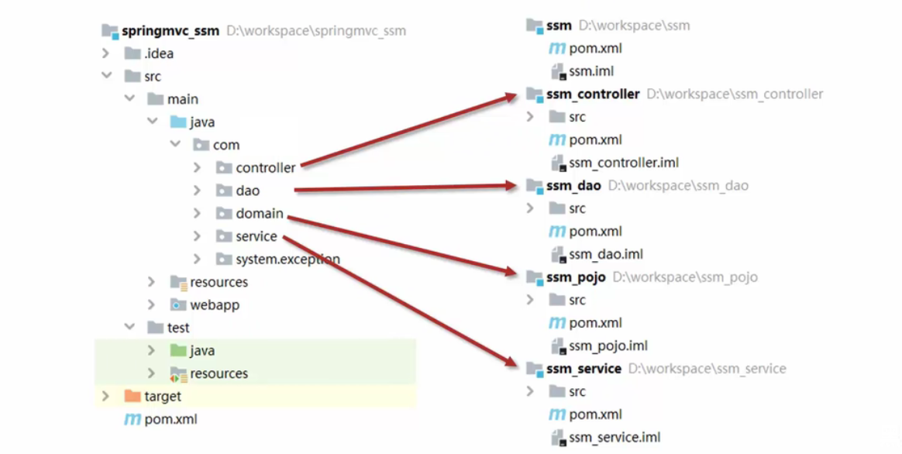

* 1.创建各个maven模块
* 2.书写模块代码
* 3.通过maven指令安装模块到本地仓库（install）

# 依赖的传递性

* 项目可以使用所使用的依赖的依赖，按此可以分为之间依赖与间接依赖。

## 可选依赖

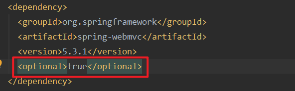

* 可选依赖是隐藏当前工程所依赖的资源，隐藏后对应资源将不具有传递性

## 排除依赖

 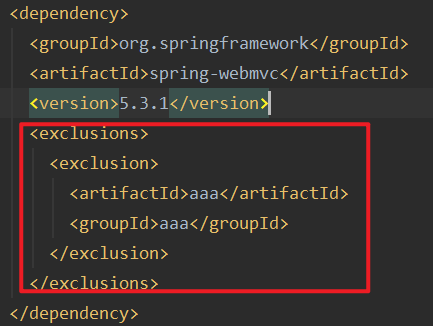

* 排除依赖是隐藏当前资源对应的依赖关系

# 聚合与继承

## 聚合

* 将多个模块组织成一个整体，同时进行项目构建的过程称为聚合

* 步骤：

  * 创建maven工程，设置打包方式为pom

  ```xml
  <packaging>war</packaging>
  ```

  * 使用module标签，选入使用的模块

  ```xml
  <modules>
      <module>m1</module>
      <module>m2</module>
      <module>...</module>
  </modules>
  ```

## 继承

* 继承描述的是两个工程间的关系，与java中的继承相似，子工程可以继承工程中的配置信息，常见于依赖关系的继承
* 作用：
  * 简化配置
  * 减少版本冲突

* 步骤：继承工程中的父工程一般与聚合管理的过程为同一个过程

  * 在子工程中通过<parent>引入父工程

  ```xml
  <parent>
    <groupId></groupId>
    <artifactId></artifactId>
    <version></version>
    <relativePath></relativePath><!--填写父工程pom.xml的路径-->
  </parent>
  ```

  * 在父工程中可以直接配置依赖,该依赖可以在子工程中直接继承

  ```xml
  <dependencies>
    <dependency>
      <groupId></groupId>
      <artifactId></artifactId>
      <version></version>
    </dependency>
  </dependencies>
  ```

  * 在父工程中也可以配置可选依赖。

    * 此时子工程不会直接继承该依赖

    ```xml
    <dependencyManagement>
      <dependencies>
        <dependency>
          <groupId></groupId>
          <artifactId></artifactId>
          <version></version>
        </dependency>
      </dependencies>
    </dependencyManagement>
    ```

    * 此时可以在需要对应依赖的子工程中声明需要此依赖，不需要指定依赖版本号，默认为父工程中的版本号

    ```xml
    <dependencies>
      <dependency>
        <groupId></groupId>
        <artifactId></artifactId>
      </dependency>
    </dependencies>
    ```

# 属性

* 属性的定义与使用

```xml
 <properties>
    <junit.version>4.12</junit.version>
  </properties>

  <dependencies>
    <dependency>
      <groupId>junit</groupId>
      <artifactId>junit</artifactId>
      <version>${junit.version}</version>
      <scope>test</scope>
    </dependency>
  </dependencies>
```

## 配置文件加载属性

* 在pom.xml中定义如下属性

```xml
  <properties>
      <jdbc.url>jdbc:mysql://localhost:3306/mysql</jdbc.url>
  </properties>
```

* 想在jdbc.properties中引入

```properties
jdbc.url=${jdbc.properties}
```

* 此时必须扩大pom.xml的范围

```xml
  <build>
    <resources>
      <resource>
        <directory>../文件目录</directory>
        <filtering>true</filtering>
      </resource>
    </resources>
  </build>
```

# 多环境开发

```xml
<jdbc.url>jdbc:mysql://localhost:3306/mysql</jdbc.url>
```

* 真实环境非localhost可能为：127.0.0.1  ... 测试服务器地址 程序上线的服务器地址...
* 因此要配置多种环境

```xml
<!--多种环境-->
  <profiles>
    <!--开发环境-->
    <profile>
      <id>env_dep</id>
      <properties>
        <jdbc.url>jdbc:mysql://127.0.0.1:3306/mysql</jdbc.url>
      </properties>
      <activation>
        <activeByDefault>true</activeByDefault><!--设置为默认环境-->
      </activation>
    </profile>
    <!--生产环境-->
    <profile>
      <id>env_pro</id>
      <properties>
        <jdbc.url>jdbc:mysql://127.1.1.1:3306/mysql</jdbc.url>
      </properties>
    </profile>
    <!--测试环境-->
    <profile>
      <id>env_test</id>
      <properties>
        <jdbc.url>jdbc:mysql://127.2.2.2:3306/mysql</jdbc.url>
      </properties>
    </profile>
  </profiles>
```

* 指定环境打包

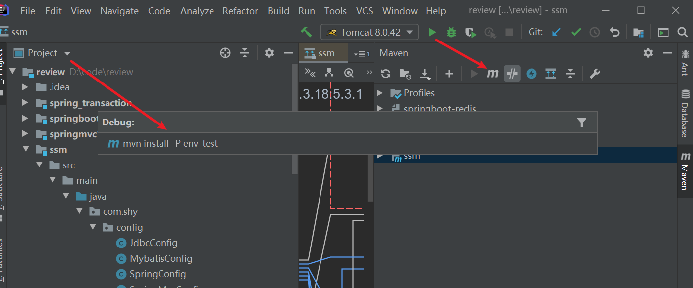

## 跳过测试

* 打包时需要测试消耗时间，如果需要跳过测试：

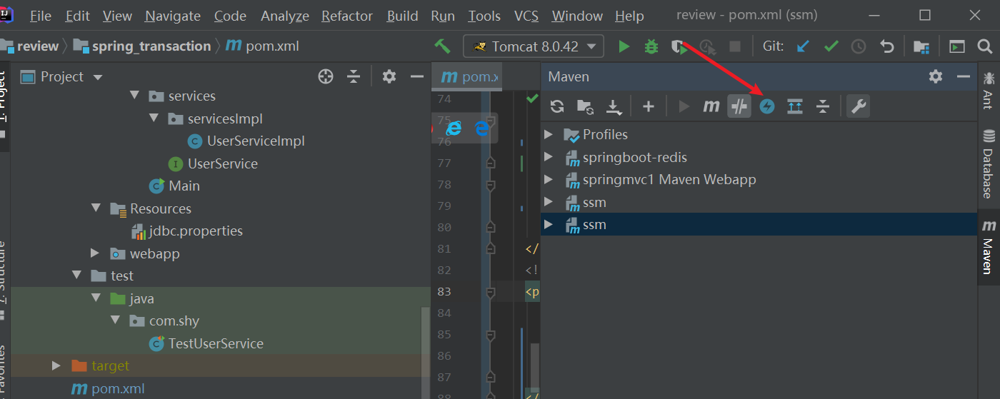

# 私服

* 私服是一台独立的服务器，用于解决团队内部的资源共享与资源同步问题
* Nexus
  * Sonattype公司下的一款maven私服产品
  * 下载地址：https://help.sonatype.com/repomanager3/product-information/download

* Nexus的启动：nexus.exe /run nexus

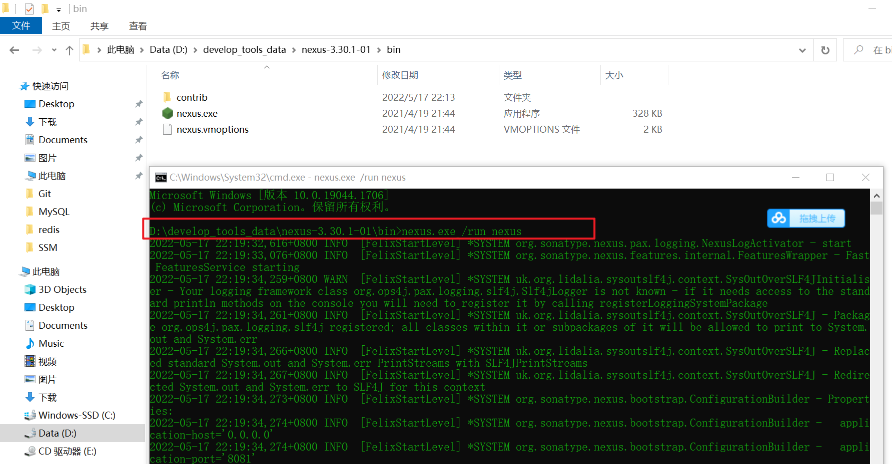

* 访问：localhost:8081

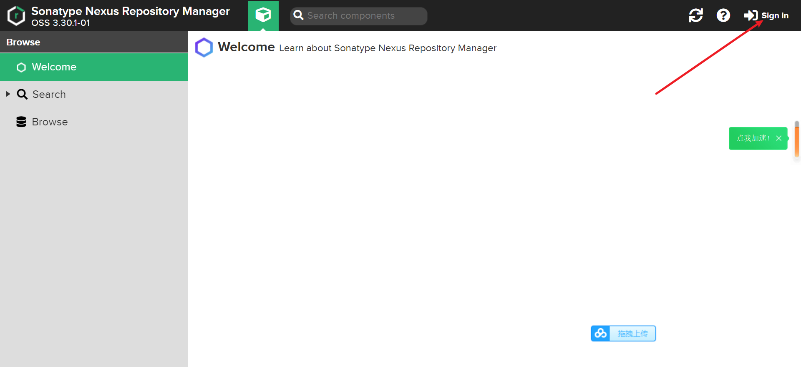

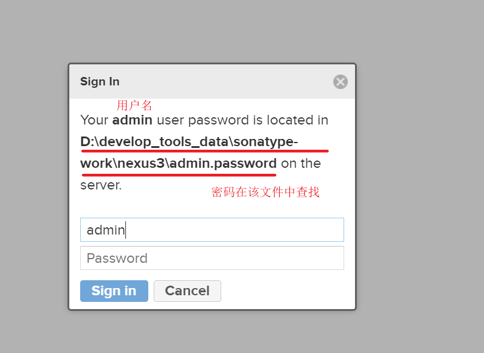

* 设置新的密码

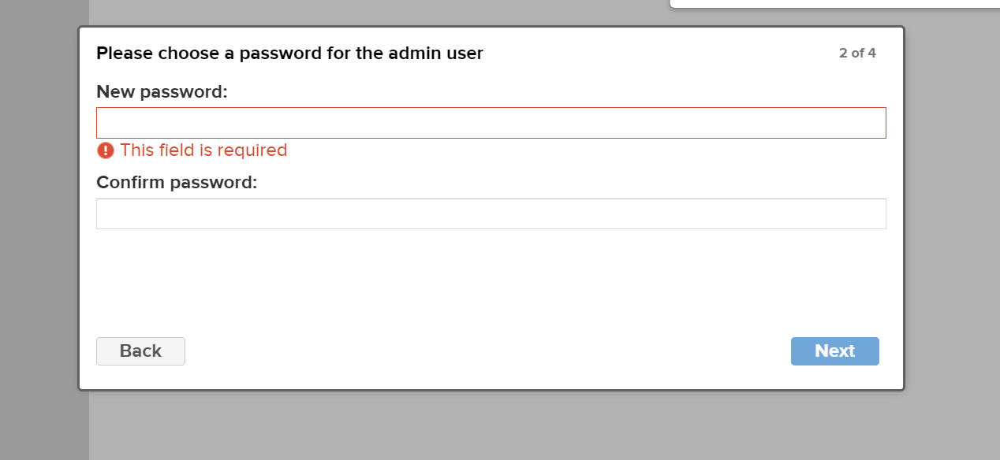

## 私服仓库分类

* 宿主仓库：保存自主研发与第三方资源 上传使用
* 代理仓库：代理连接中央仓库 下载使用
* 仓库组：为仓库组简化下载操作 下载使用

## 本地仓库访问私服配置

* 创建两个私服仓库 snapshot

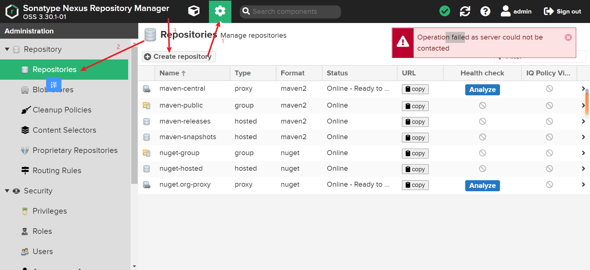

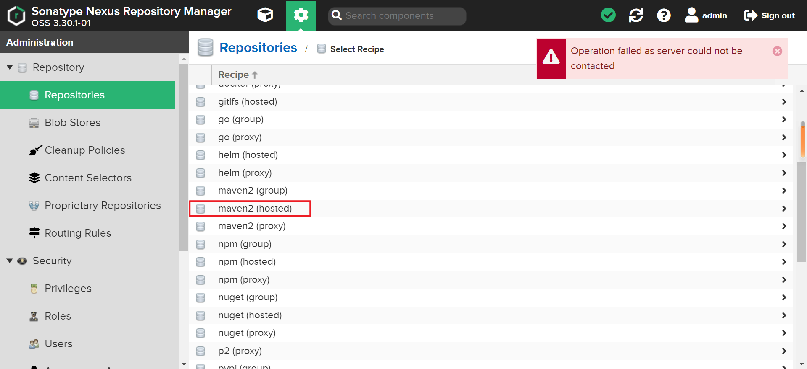

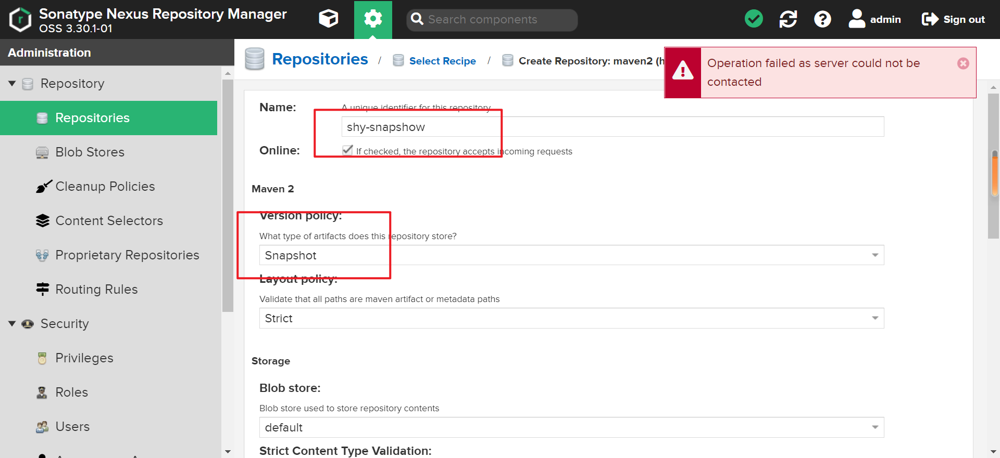

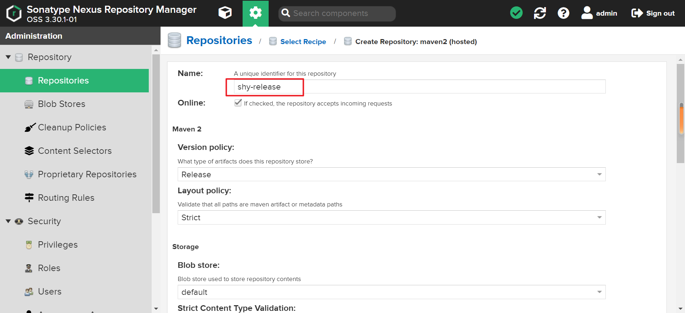

* 在本地仓库的配置文件中设置访问私服的相关信息：
  * 配置两个仓库，id为仓库名

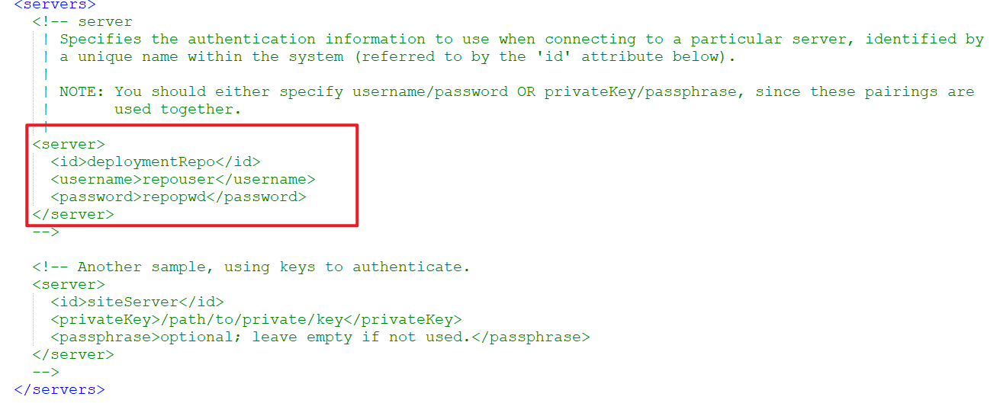

* 配置私服的镜像

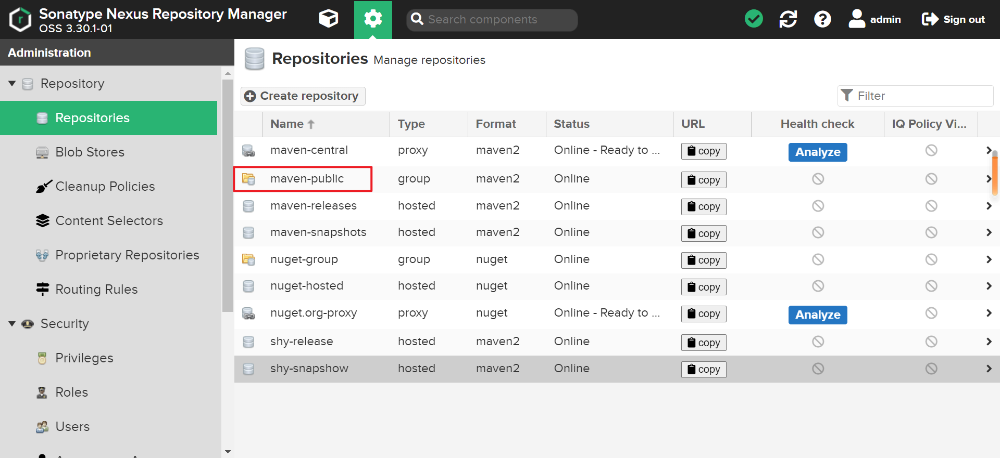

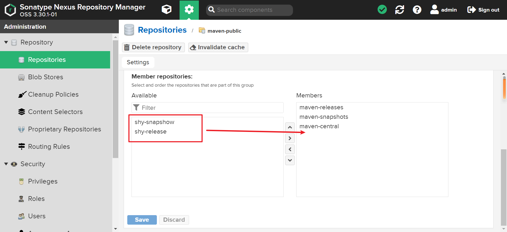

* 在配置文件中配置

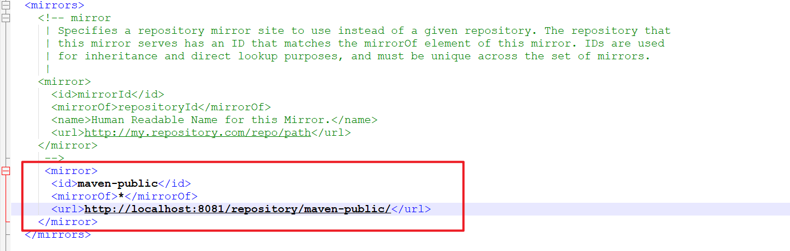

## 私服资源的上传与下载

* 在pom.xml中配置当前工程上传私服的位置

```xml
  <distributionManagement>
    <repository>
      <id>maven-releases</id>
      <url>http://localhost:8081/repository/maven-releases/</url>
    </repository>
    <snapshotRepository>
      <id>maven-snapshots</id>
      <url>http://localhost:8081/repository/maven-snapshots/</url>
    </snapshotRepository>
  </distributionManagement>
```

* 上传时是正式版还是快照版取决于当前项目的版本

```xml
  <groupId>com.com.shy</groupId>
  <artifactId>ssm</artifactId>
  <version>1.0-SNAPSHOT</version><!--快照版，将被上传到maven-snapshots-->
  <packaging>war</packaging>
```

* 上传

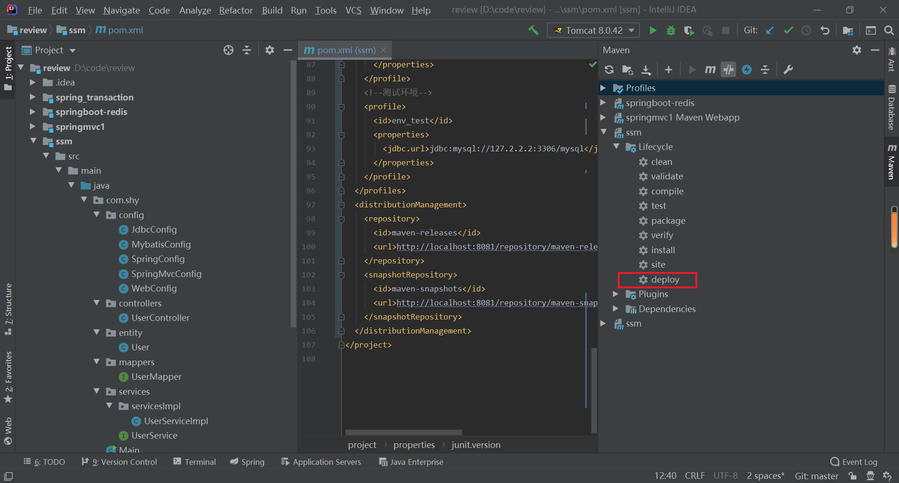

# springboot入门

## springboot项目快速启动

```xml
<build>
        <plugins>
            <plugin>
                <groupId>org.springframework.boot</groupId>
                <artifactId>spring-boot-maven-plugin</artifactId>
            </plugin>
        </plugins>
    </build>
```

* 插件的作用：
  * 将springboot项目打包后，可以使用指令直接启动springboot项目
  * java -jar springboot.jar

## springboot的起步依赖

* starter：springboot中常见项目名称，定义了当前项目使用的所有项目坐标，以达到减少依赖配置的目的。
* parent：所有springboot项目需要继承的项目，定义了若干个坐标版本（依赖管理，而非依赖），以达到减少依赖冲突的目的

### 将tomcat服务器换为jetty服务器

```xml
<?xml version="1.0" encoding="UTF-8"?>
<project xmlns="http://maven.apache.org/POM/4.0.0" xmlns:xsi="http://www.w3.org/2001/XMLSchema-instance"
         xsi:schemaLocation="http://maven.apache.org/POM/4.0.0 https://maven.apache.org/xsd/maven-4.0.0.xsd">
    <modelVersion>4.0.0</modelVersion>
    <parent>
        <groupId>org.springframework.boot</groupId>
        <artifactId>spring-boot-starter-parent</artifactId>
        <version>2.6.7</version>
        <relativePath/> <!-- lookup parent from repository -->
    </parent>
    <groupId>com.shy</groupId>
    <artifactId>springboot</artifactId>
    <version>0.0.1-SNAPSHOT</version>
    <properties>
        <java.version>1.8</java.version>
    </properties>
    <dependencies>
        <dependency>
            <groupId>org.springframework.boot</groupId>
            <artifactId>spring-boot-starter-web</artifactId>
            <exclusions>
                <exclusion>
                    <groupId>org.springframework.boot</groupId>
                    <artifactId>spring-boot-starter-tomcat</artifactId>
                </exclusion>
            </exclusions>
            <!--排除tomcat的依赖-->
        </dependency>
        <dependency>
            <groupId>org.springframework.boot</groupId>
            <artifactId>spring-boot-starter-jetty</artifactId>
        </dependency>
        <!--使用jetty的依赖-->
        <dependency>
            <groupId>org.springframework.boot</groupId>
            <artifactId>spring-boot-starter-test</artifactId>
            <scope>test</scope>
        </dependency>
    </dependencies>

    <build>
        <plugins>
            <plugin>
                <groupId>org.springframework.boot</groupId>
                <artifactId>spring-boot-maven-plugin</artifactId>
            </plugin>
        </plugins>
    </build>

</project>

```

## springboot配置多环境开发

```yaml
#设置启用的环境
spring:
  profiles:
    active: dev

---
#开发环境
spring:
  config:
    activate:
      on-profile: dev
server:
  port: 80

---
#生成环境
spring:
  config:
    activate:
      on-profile: pro
server:
  port: 81

---
#测试环境
spring:
  config:
    activate:
      on-profile: test
server:
  port: 82
```

* 多环境命令行启动设置
  * java -jar springboot.jar --spring.profiles.active=test


