# 准备工作

## 创建springboot项目

## 添加依赖

```xml
        <!--mybatis-plus启动器-->
        <dependency>
            <groupId>com.baomidou</groupId>
            <artifactId>mybatis-plus-boot-starter</artifactId>
            <version>3.5.1</version>
        </dependency>
        <!--lombok-->
        <dependency>
            <groupId>org.projectlombok</groupId>
            <artifactId>lombok</artifactId>
            <optional>true</optional>
        </dependency>
        <!--mysql驱动-->
        <dependency>
            <groupId>mysql</groupId>
            <artifactId>mysql-connector-java</artifactId>
            <scope>runtime</scope>
        </dependency>
```

## 配置application.yaml

```yaml
spring:
  # 配置数据源信息
  datasource:
    #配置数据库连接池信息
    driver-class-name: com.mysql.cj.jdbc.Driver
    url: jdbc:mysql://localhost:13306/mybatis_plus?characterEncoding=utf-8&useSSL=false
    password: abc123
    username: root
```

注意：

* 驱动类使用

  * driver-class-name: com.mysql.jdbc.Driver    spring boot 2.0（内置jdbc5驱动）
  * driver-class-name: com.mysql.jdbc.Driver     spring boot 2.1及以上（内置jdbc8驱动）

* 连接地址url

  * MySQL5.7版本的url：

    jdbc:mysql://localhost:3306/mybatis_plus?characterEncoding=utf-8&useSSL=false

  * MySQL8.0版本的url：jdbc:mysql://localhost:3306/mybatis_plusserverserverTimezone=GMT%2B8

## 配置类型别名

```yaml
mybatis-plus:
 type-aliases-package: com.shy.mybatisplus.entity
```

## 创建User类并且使用lombok生成相应结构

```java
package com.shy.mybatisplus1.beans;

import lombok.AllArgsConstructor;
import lombok.Data;

@Data
@AllArgsConstructor
public class User {
    private Long id;
    private String name;
    private Integer age;
    private String email;
}
```

## 创建mapper接口

* 创建UserMapper接口继承于BaseMapper并且指定泛型：

```java
package com.shy.mybatisplus1.mappers;

import com.baomidou.mybatisplus.core.mapper.BaseMapper;
import com.shy.mybatisplus1.beans.User;
import org.springframework.stereotype.Repository;

@Repository
public interface UserMapper extends BaseMapper<User> {
}
```

* 使用@MapperScan扫描mapper接口所在的包

```java
package com.shy.mybatisplus1;

import org.mybatis.spring.annotation.MapperScan;
import org.springframework.boot.SpringApplication;
import org.springframework.boot.autoconfigure.SpringBootApplication;

@SpringBootApplication
@MapperScan("com.shy.mybatisplus1.mappers")
public class Mybatisplus1Application {
    public static void main(String[] args) {
        SpringApplication.run(Mybatisplus1Application.class, args);
    }

}
```

## 进行测试select

```java
package com.shy.mybatisplus1;

import com.shy.mybatisplus1.beans.User;
import com.shy.mybatisplus1.mappers.UserMapper;
import org.junit.jupiter.api.Test;
import org.springframework.beans.factory.annotation.Autowired;
import org.springframework.boot.test.context.SpringBootTest;

import java.util.Iterator;
import java.util.List;

@SpringBootTest
public class MybatisPlusTest {
    @Autowired
    private UserMapper userMapper;

    @Test
    public void testSelect(){
        List<User> users = userMapper.selectList(null);
        Iterator<User> iterator = users.iterator();
        while (iterator.hasNext()){
            System.out.println(iterator.next());
        }
    }
}
```

## 加入日志功能

```yaml
# 配置MyBatis日志
mybatis-plus:
  configuration:
    log-impl: org.apache.ibatis.logging.stdout.StdOutImpl
```


## 测试insert


* 如果id!=null，此时id就是设置的值，不会通过雪花算法生成

## 测试delete

* deleteById();


* deleteByMap();


* deleteBatchIds();


## 测试update

* updateById();


## 测试原生的mybatis自定义sql语句

* 创建mapper接口：可以通过配置设置mapper接口的存放目录，默认情况下为resources/mapper/


* 创建映射文件：

```xml
<?xml version="1.0" encoding="UTF-8" ?>
<!DOCTYPE mapper
        PUBLIC "-//mybatis.org//DTD Mapper 3.0//EN"
        "http://mybatis.org/dtd/mybatis-3-mapper.dtd">

<!--namespace和mapper接口的全类名保持一致-->
<mapper namespace="com.shy.mybatisplus1.mappers.UserMapper">
<!--    Map<String,Object> selectByIdToMap();-->
    <select id="selectByIdToMap" resultType="map">
        select * from user where id = #{id};
    </select>

</mapper>
```

* 创建mapper接口：

```java
package com.shy.mybatisplus1.mappers;

import com.baomidou.mybatisplus.core.mapper.BaseMapper;
import com.shy.mybatisplus1.beans.User;
import org.apache.ibatis.annotations.Param;
import org.springframework.stereotype.Repository;

import java.util.Map;

@Repository
public interface UserMapper extends BaseMapper<User> {
    Map<String,Object> selectByIdToMap(@Param("id") Integer id);
}
```

* 进行测试：

```java
    @Test
    public void testSelectByIdToMap(){
        Map<String, Object> map = userMapper.selectByIdToMap(4);
        System.out.println(map);
    }
```

# 通用Service接口

* mybatis-plus为我们提供了IService接口以及接口的实现类ServiceImpl，但是在实际项目中，ServiceImpl不足以为我们提供足够的方法实现目的，因此我们可以自己创建Service接口继承于IService，并提供接口的实现类，这样既可以使用mybatis-plus为我们提供的方法，我们也可以自定义方法。

* 创建UserService继承IService接口

```java
package com.shy.mybatisplus1.services;

import com.baomidou.mybatisplus.extension.service.IService;
import com.shy.mybatisplus1.beans.User;

public interface UserService extends IService<User> {
}
```

* 创建UserService接口的实现类UserServiceImpl

```java
package com.shy.mybatisplus1.services.Impl;

import com.baomidou.mybatisplus.extension.service.impl.ServiceImpl;
import com.shy.mybatisplus1.beans.User;
import com.shy.mybatisplus1.mappers.UserMapper;
import com.shy.mybatisplus1.services.UserService;
import org.springframework.stereotype.Service;

@Service
public class UserServiceImpl extends ServiceImpl<UserMapper, User> implements UserService {
}
```

* 进行测试

```java
package com.shy.mybatisplus1;

import com.shy.mybatisplus1.services.UserService;
import org.junit.jupiter.api.Test;
import org.springframework.beans.factory.annotation.Autowired;
import org.springframework.boot.test.context.SpringBootTest;

@SpringBootTest
public class ServiceTest {
    @Autowired
    private UserService userService;
	//查询总记录数
    @Test
    public void selectCount(){
        long count = userService.count();
        System.out.println(count);
    }
}
```

* 测试批量添加

```java
    @Test
    public void testSave(){
        ArrayList<User> arrayList = new ArrayList<>();
        for (int i = 0; i < 10; i++) {
            User user = new User(null, "shy" + i, 23 + i, "shy" + i + "@123.com");
            arrayList.add(user);
        }
        boolean b = userService.saveBatch(arrayList);
        System.out.println(b);

    }
```

# MybatisPlus常用注解

## @TableName

* mybatisplus在选择表时的表名是根据表对应的实体类的类名去寻找的，如果实体类与表名不同，则无法查找

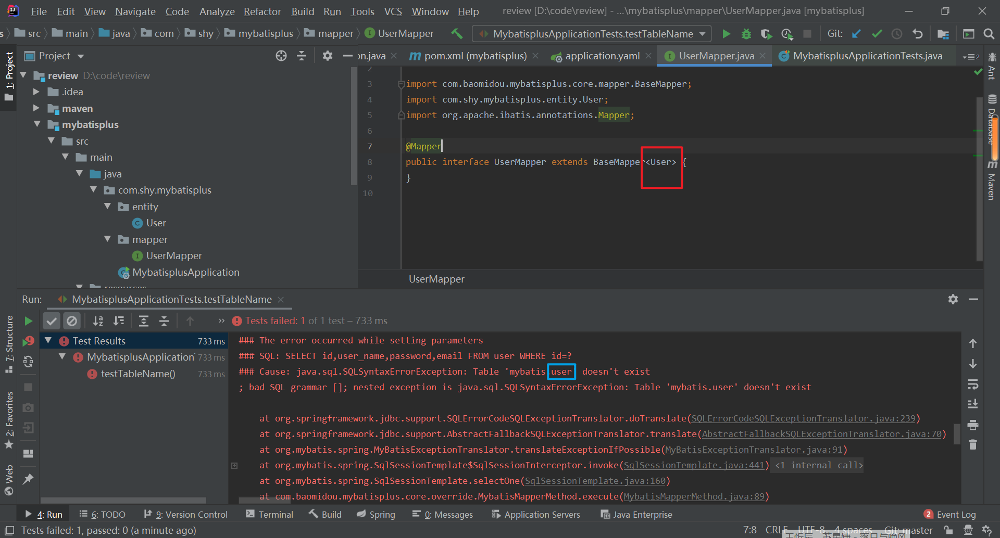

* 需要在实体类上使用@TableName("表名")

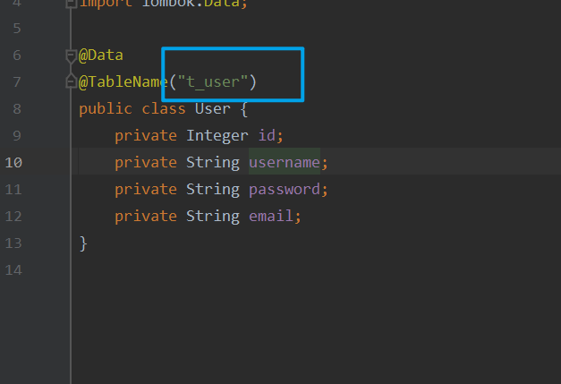

* 为所有的表名统一设置前缀t_

```yaml
mybatis-plus:
  global-config:
    db-config:
      table-prefix: t_
```

使用@TableName该功能不起作用

## @TableId

* mybatis_plus默认认为数据库中的表id是主键，因此每次会给id一个值（通过雪花算法）
* 但是如果主键名不是id就不会，因此此时需要在实例类中主键对应的属性添加@TableId

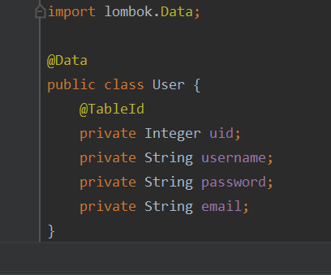

* TableId的value属性
  
* 当@TableId对应的属性与表中的主键的字段名不同时，还可以通过@TableId中的value设置相同的名字
  
* TableId的type属性（用于设置主键的生成策略）

  * mybatisplus默认是通过雪花算法生成主键的，如果想通过自增生成id，可以修改type的属性值

  * type属性常用值

    | 值                     | 描述                                                         |
    | ---------------------- | ------------------------------------------------------------ |
    | IdType.ASSIGN_ID(默认) | 基于雪花算法策略生成id，与数据库id是否设置自增无关           |
    | IdType.AUTO            | 使用数据库的自增策略，注意需要确保数据库设置了id自增，否则无效 |

### 通过全局配置主键的生成策略

```yaml
mybatis-plus:
  global-config:
    db-config:
      id-type: auto
```

## 雪花算法

雪花算法是由Twitter公布的分布式主键生成算法，它能够保证不同表的主键的不重复性，以及相同表的

主键的有序性。

核心思想：

* 长度共64bit（一个long型）。

* 首先是一个符号位，1bit标识，由于long基本类型在Java中是带符号的，最高位是符号位，正数是0，负

  数是1，所以id一般是正数，最高位是0。

* 41bit时间截(毫秒级)，存储的是时间截的差值（当前时间截 - 开始时间截)，结果约等于69.73年。

* 10bit作为机器的ID（5个bit是数据中心，5个bit的机器ID，可以部署在1024个节点）。

* 12bit作为毫秒内的流水号（意味着每个节点在每毫秒可以产生 4096 个 ID）。

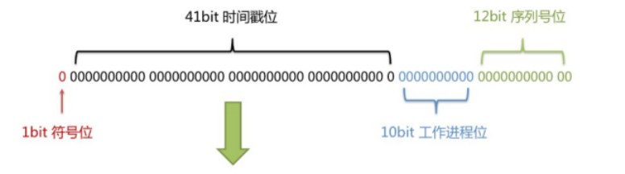

* 优点：整体上按照时间自增排序，并且整个分布式系统内不会产生ID碰撞，并且效率较高

## @TableFiled

* mybatisplus默认已经有了驼峰命名和_命名之间的转化

* 可以使用@TableFiled("表名")对类中非主键对应的属性进行命名，解决属性名与数据库中字段名不一致的问题

## @TableLogic

* 物理删除：真实删除，将对应数据从数据库中删除，之后查询不到此条被删除的数据

* 逻辑删除：假删除，将对应数据中代表是否被删除字段的状态修改为“被删除状态”，之后在数据库

  中仍旧能看到此条数据记录

* 使用场景：可以进行数据恢复

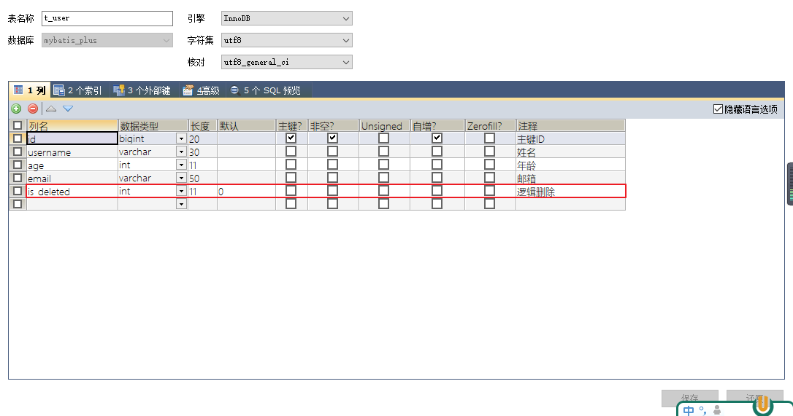

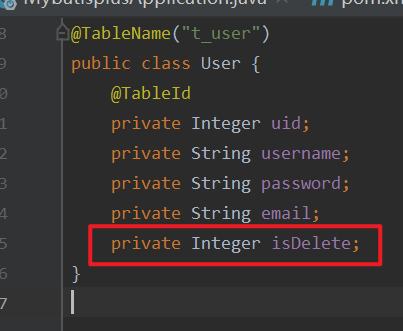

* 测试删除功能，真正执行的是修改

  UPDATE t_user SET is_deleted=1 WHERE id=? AND is_deleted=0

  测试查询功能，被逻辑删除的数据默认不会被查询

  SELECT id,username AS name,age,email,is_deleted FROM t_user WHERE is_deleted=0

# 条件构造器

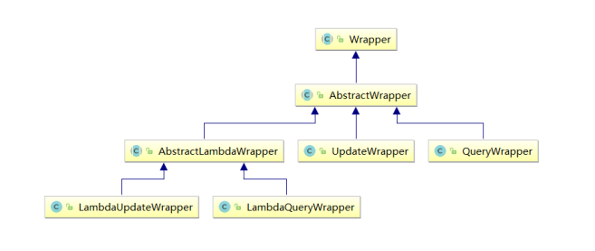

* Wrapper ： 条件构造抽象类，最顶端父类
  * AbstractWrapper ： 用于查询条件封装，生成 sql 的 where 条件
    * QueryWrapper ： 查询条件封装
    * UpdateWrapper ： Update 条件封装
    * AbstractLambdaWrapper ： 使用Lambda 语法
      * LambdaQueryWrapper ：用于Lambda语法使用的查询Wrapper
      * LambdaUpdateWrapper ： Lambda 更新封装Wrapper

## QueryWrapper

### 条件查询演示

* 查询：
  * 年龄30-40
  * 男性
  * 邮箱中含有a

```java
 	@Test
    void testQueryWrapper(){
        QueryWrapper<User> userQueryWrapper = new QueryWrapper<>();
        userQueryWrapper.between("age",30,40).like("sex","男").like("email","a");
        List<User> list = userMapper.selectList(userQueryWrapper);
    }
```

### 排序演示

* 查询所有人
  * 按照年龄降序排序
  * 如果年龄相同，按照id升序排序

```java
	@Test
    void testQueryWrapper(){
        QueryWrapper<User> userQueryWrapper = new QueryWrapper<>();
        userQueryWrapper.orderByDesc("age").orderByAsc("uid");
        List<User> list = userMapper.selectList(userQueryWrapper);
        System.out.println(list);
    }
```

### 条件删除演示

* 删除字段email为空的数据

```java
    @Test
    void testQueryWrapper(){
        QueryWrapper<User> userQueryWrapper = new QueryWrapper<>();
        userQueryWrapper.isNull("email");
        int delete = userMapper.delete(userQueryWrapper);
        System.out.println("删除数："+delete);
    }
```

* 当我们设置了逻辑删除之后，进行上述删除操作实际是执行了update操作

### 条件修改演示

* 将年龄小于30且邮箱中含有t的数据的邮箱改为shy@123.com

```java
    @Test
    void testQueryWrapper(){
        QueryWrapper<User> userQueryWrapper = new QueryWrapper<>();
        userQueryWrapper.lt("age",30).like("email","t");
        User user = new User();
        user.setEmail("shy@123.com");
        int update = userMapper.update(user, userQueryWrapper);
        System.out.println("result="+update);
    }
```

* 将年龄大于30并且（女性或者邮箱中含有e）的数据的密码改为987654

```java
	@Test
    void testQueryWrapper(){
        User user = new User();
        user.setPassword("987654");
        QueryWrapper<User> userQueryWrapper = new QueryWrapper<>();
        userQueryWrapper.gt("age",30)
                .and(i->i.like("sex","女").or().like("email","e"));
        int update = userMapper.update(user, userQueryWrapper);
        System.out.println("result"+update);
    }
```

### 查询指定字段

```java
   @Test
    void testQueryWrapper(){
        QueryWrapper<User> userQueryWrapper = new QueryWrapper<>();
        userQueryWrapper.select("uid","username","password");
        List<Map<String, Object>> maps = userMapper.selectMaps(userQueryWrapper);
        System.out.println(maps);
    }
```

## UpdateWrapper

### 修改指定字段

* 将年龄大于30的人的所有密码修改为012345

```java
	@Test
    void TestUpdateWrapper(){
        UpdateWrapper<User> userUpdateWrapper = new UpdateWrapper<>();
        userUpdateWrapper.gt("age",30).set("password","012345");
        int update = userMapper.update(null, userUpdateWrapper);
        System.out.println("result="+update);
    }
```

### condition组装条件

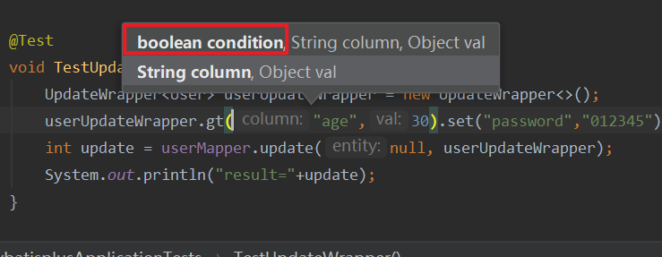

* 通过构造器中的condition可以判断该条件是否执行

## LambdaQueryWrapper

* 可以解决查询时字段名错误问题

* 查询uid大于5的所有人

```java
	@Test
    public void testLambdaQueryWrapper(){
        LambdaQueryWrapper<User> userLambdaQueryWrapper = new LambdaQueryWrapper<>();
        userLambdaQueryWrapper.ge(true,User::getUid,5);
        List<User> list = userMapper.selectList(userLambdaQueryWrapper);
        System.out.println(list);
    }
```

## LambdaUpdateWrapper

* 将uid大于5的人的email改为shy@123.com

```java
	@Test
    public void testLambdaQueryUpdate(){
        LambdaUpdateWrapper<User> userLambdaUpdateWrapper = new LambdaUpdateWrapper<>();
        userLambdaUpdateWrapper.ge(true,User::getUid,5).set(User::getEmail,"shy@123.com");
        int update = userMapper.update(null, userLambdaUpdateWrapper);
        System.out.println("result="+update);
    }
```

# mybatisplus分页插件

* 配置分页插件

```java
@Configuration
public class MybatisPlusConfig {
    @Bean
    public MybatisPlusInterceptor mybatisPlusInterceptor(){
        MybatisPlusInterceptor mybatisPlusInterceptor = new MybatisPlusInterceptor();
        mybatisPlusInterceptor.addInnerInterceptor(new PaginationInnerInterceptor(DbType.MYSQL));//指明使用的数据库
        return mybatisPlusInterceptor;
    }
}
```

* 测试

```java
	@Test
    void testPage(){
        Page<User> userPage = new Page<>(1,3);
        userMapper.selectPage(userPage,null);
        System.out.println(userPage);
    }
```

* Page类中的常用方法
  * getRecords(); 获取结果集
  * getPages(); 获取总页数
  * getTotal(); 获取总记录数，不算逻辑删除掉的数据
  * hasNext(); 查询是否有下一页
  * hasPrevious(); 查询是否有上一页

## 自定义分页功能

查询年龄大于30的数据，并且实现分页功能

* 在mapper接口中定义方法：

```java
@Mapper
@Repository
public interface UserMapper extends BaseMapper<User> {
    Page<User> selectByAge(Page<User> page,@Param("age") Integer age);
    //必须要保证第一个参数是Page
}
```

* 在映射文件中实现对应功能

```xml
<?xml version="1.0" encoding="UTF-8" ?>
<!DOCTYPE mapper
        PUBLIC "-//mybatis.org//DTD Mapper 3.0//EN"
        "http://mybatis.org/dtd/mybatis-3-mapper.dtd">

<!--namespace和mapper接口的全类名保持一致-->
<mapper namespace="com.shy.mybatisplus.mapper.UserMapper">
<!--    Page<User> selectByAge(Page<User> page,@Param("age") Integer age);-->
    <select id="selectByAge" resultType="User">
        select uid,username,password,email from t_user where age >= #{age}
    </select>
</mapper>
```

* 测试

```java
    @Test
    void testMyPage(){
        Page<User> userPage = new Page<>(1,3);
        userMapper.selectByAge(userPage,30);
        List<User> list = userPage.getRecords();
        System.out.println(list);
    }
```

# 乐观锁插件

## 场景

一件商品，成本价是80元，售价是100元。老板先是通知小李，说你去把商品价格增加50元。小

李正在玩游戏，耽搁了一个小时。正好一个小时后，老板觉得商品价格增加到150元，价格太

高，可能会影响销量。又通知小王，你把商品价格降低30元。

此时，小李和小王同时操作商品后台系统。小李操作的时候，系统先取出商品价格100元；小王

也在操作，取出的商品价格也是100元。小李将价格加了50元，并将100+50=150元存入了数据

库；小王将商品减了30元，并将100-30=70元存入了数据库。是的，如果没有锁，小李的操作就

完全被小王的覆盖了。

现在商品价格是70元，比成本价低10元。几分钟后，这个商品很快出售了1千多件商品，老板亏1

万多。

上面的故事，如果是乐观锁，小王保存价格前，会检查下价格是否被人修改过了。如果被修改过

了，则重新取出的被修改后的价格，150元，这样他会将120元存入数据库。

如果是悲观锁，小李取出数据后，小王只能等小李操作完之后，才能对价格进行操作，也会保证

最终的价格是120元。

## 模拟出现的上述错误

* 数据库

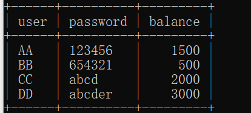

* 对应的实体类

```java
package com.shy.mybatisplus.entity;

import com.baomidou.mybatisplus.annotation.TableName;
import lombok.Data;

@Data
@TableName("user_table")
public class Product {
    private String user;
    private String password;
    private Integer balance;
}
```

* 创建mapper接口

```java
package com.shy.mybatisplus.mapper;

import com.baomidou.mybatisplus.core.mapper.BaseMapper;
import com.shy.mybatisplus.entity.Product;
import org.apache.ibatis.annotations.Mapper;
import org.springframework.stereotype.Repository;

@Mapper
@Repository
public interface ProductMapper extends BaseMapper<Product> {
}
```

* 进行测试

```java
    @Test
    void testProduct(){
        //小李先拿到数据
        Product product1 = productMapper.selectById("AA");
        //小王拿到数据
        Product product2 = productMapper.selectById("AA");
        //小李进行修改
        product1.setBalance(product1.getBalance()+50);
        productMapper.updateById(product1);
        //小王进行修改
        product2.setBalance(product2.getBalance()-30);
        productMapper.updateById(product2);
    }
```

## 使用乐观锁解决上述问题

* 配置乐观锁插件

```java
package com.shy.mybatisplus;

import com.baomidou.mybatisplus.annotation.DbType;
import com.baomidou.mybatisplus.extension.plugins.MybatisPlusInterceptor;
import com.baomidou.mybatisplus.extension.plugins.inner.OptimisticLockerInnerInterceptor;
import com.baomidou.mybatisplus.extension.plugins.inner.PaginationInnerInterceptor;
import org.springframework.context.annotation.Bean;
import org.springframework.context.annotation.Configuration;

@Configuration
public class MybatisPlusConfig {
    @Bean
    public MybatisPlusInterceptor mybatisPlusInterceptor(){
        MybatisPlusInterceptor mybatisPlusInterceptor = new MybatisPlusInterceptor();
        //添加的分页插件
        mybatisPlusInterceptor.addInnerInterceptor(new PaginationInnerInterceptor(DbType.MYSQL));//指明使用的数据库
        //添加乐观锁插件
        mybatisPlusInterceptor.addInnerInterceptor(new OptimisticLockerInnerInterceptor());
        return mybatisPlusInterceptor;
    }
}
```

* 给数据表中的version字段对应的实体类属性使用@Version，这里标注为password（懒）

```java
package com.shy.mybatisplus.entity;

import com.baomidou.mybatisplus.annotation.TableId;
import com.baomidou.mybatisplus.annotation.TableName;
import com.baomidou.mybatisplus.annotation.Version;
import lombok.Data;

@Data
@TableName("user_table")
public class Product {
    @TableId
    private String user;
    @Version
    private Integer password;
    private Integer balance;
}
```

* 再次测试

```java
    @Test
    void testProduct(){
        //小李先拿到数据
        Product product1 = productMapper.selectById("AA");
        //小王拿到数据
        Product product2 = productMapper.selectById("AA");
        //小李进行修改
        product1.setBalance(product1.getBalance()+50);
        productMapper.updateById(product1);
        //小王进行修改
        product2.setBalance(product2.getBalance()-30);
        productMapper.updateById(product2);
    }
```

* 此时小李可以成功修改数据，但是小王会修改失败，修改时的version与表中的version不同

# 通用枚举

* 表中的有些字段值是固定的，例如性别（男或女），此时我们可以使用MyBatis-Plus的通用枚举

  来实现

* 表：

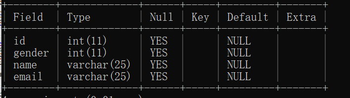

* 对gender进行枚举：

```java
package com.shy.mybatisplus.entity;

import lombok.Getter;

@Getter
public enum GenderEnum {
    MALE(0,"男"),
    FEMALE(1,"女");
    
    private final Integer gender;
    private final String genderName;

    GenderEnum(Integer gender, String genderName) {
        this.gender = gender;
        this.genderName = genderName;
    }
}
```

* 创建User类

```java
package com.shy.mybatisplus.entity;

import com.baomidou.mybatisplus.annotation.TableField;
import com.baomidou.mybatisplus.annotation.TableId;
import lombok.Data;

@Data
public class User {
    @TableId
    private Integer id;

    @TableField("name")
    private String userName;

    @TableField("gender")
    private GenderEnum genderEnum ;

    private String email;
}
```

* 向表中添加字段

```java
    @Test
    public void testEnum(){
        User user = new User(null,"tom", GenderEnum.MALE,"tom@123.com");
        userMapper.insert(user);
    }
```

* 因为表中的gender是int类型，而枚举类添加时实际添加的是枚举类的名，为字符串类型，所有会添加失败

* 此时需要在枚举类对应的int字段加上注解@EnumValue

```java
package com.shy.mybatisplus.entity;

import com.baomidou.mybatisplus.annotation.EnumValue;
import lombok.Getter;

@Getter
public enum GenderEnum {
    MALE(0,"男"),
    FEMALE(1,"女");
    @EnumValue
    private final Integer gender;
    private final String genderName;

    GenderEnum(Integer gender, String genderName) {
        this.gender = gender;
        this.genderName = genderName;
    }
}
```

* 并且配置扫描通用枚举

```yaml
mybatis-plus:
  type-enums-package: com.shy.mybatisplus.entity
```

* 此时添加即可成功

# 代码生成器

* 需要的依赖

```xml
<dependency> 
    <groupId>com.baomidou</groupId> 
    <artifactId>mybatis-plus-generator</artifactId> 
    <version>3.5.1</version> 
</dependency> 
<dependency> 
    <groupId>org.freemarker</groupId> 
    <artifactId>freemarker</artifactId> 
    <version>2.3.31</version> 
</dependency>
```

```java
FastAutoGenerator.create("url", "username", "password")
    .globalConfig(builder -> {
        builder.author("baomidou") // 设置作者
            .enableSwagger() // 开启 swagger 模式
            .fileOverride() // 覆盖已生成文件
            .outputDir("D://"); // 指定输出目录
    })
    .packageConfig(builder -> {
        builder.parent("com.baomidou.mybatisplus.samples.generator") // 设置父包名
            .moduleName("system") // 设置父包模块名
            .pathInfo(Collections.singletonMap(OutputFile.mapperXml, "D://")); // 设置mapperXml生成路径
    })
    .strategyConfig(builder -> {
        builder.addInclude("t_simple") // 设置需要生成的表名
            .addTablePrefix("t_", "c_"); // 设置过滤表前缀
    })
    .templateEngine(new FreemarkerTemplateEngine()) // 使用Freemarker引擎模板，默认的是Velocity引擎模板
    .execute();
```

# 测试多数据源

* 适用于多种场景：纯粹多库、 读写分离、 一主多从、 混合模式等

  目前我们就来模拟一个纯粹多库的一个场景，其他场景类似

* 场景说明：

  我们创建两个库，分别为：mybatis_plus（以前的库不动）与mybatis_plus_1（新建），将

  mybatis_plus库的product表移动到mybatis_plus_1库，这样每个库一张表，通过一个测试用例

  分别获取用户数据与商品数据，如果获取到说明多库模拟成功

* 多数据源的依赖

```xml
<dependency>
    <groupId>com.baomidou</groupId>
    <artifactId>dynamic-datasource-spring-boot-starter</artifactId> 			     		<version>3.5.0</version>
</dependency>
```

* 多数据源的配置

```yaml
spring:
  # 配置数据源信息
  datasource:
    dynamic:
      # 设置默认的数据源或者数据源组,默认值即为master
      primary: master
      # 严格匹配数据源,默认false.true未匹配到指定数据源时抛异常,false使用默认数据源
      strict: false
      datasource:
        master:
          url: jdbc:mysql://localhost:13306/test?characterEncoding=utf-8&useSSL=false
          driver-class-name: com.mysql.cj.jdbc.Driver
          username: root
          password: abc123
        slave_1:
          url: jdbc:mysql://localhost:13306/test?characterEncoding=utf-8&useSSL=false
          driver-class-name: com.mysql.cj.jdbc.Driver
          username: root
          password: abc123
```

* 实体类

```java
package com.shy.mybatisplus.entity;

import com.baomidou.mybatisplus.annotation.TableName;
import lombok.Data;

@Data
@TableName("user")
public class User1 {
    private Integer id;
    private String name;
    private String password;
    private String address;
    private String phone;
}
```

```java
package com.shy.mybatisplus.entity;

import com.baomidou.mybatisplus.annotation.TableId;
import com.baomidou.mybatisplus.annotation.TableName;
import lombok.Data;

@Data
@TableName("user_table")
public class User2 {
    @TableId
    private String user;
    private String password;
    private Integer balance;
}
```

* mapper接口

```java
package com.shy.mybatisplus.mapper;

import com.baomidou.mybatisplus.core.mapper.BaseMapper;
import com.shy.mybatisplus.entity.User1;
import org.apache.ibatis.annotations.Mapper;
import org.springframework.stereotype.Repository;

@Mapper
@Repository
public interface User1Mapper extends BaseMapper<User1> {
}
```

```java
package com.shy.mybatisplus.mapper;

import com.baomidou.mybatisplus.core.mapper.BaseMapper;
import com.shy.mybatisplus.entity.User2;
import org.apache.ibatis.annotations.Mapper;
import org.springframework.stereotype.Repository;

@Mapper
@Repository
public interface User2Mapper extends BaseMapper<User2> {
}
```

* service接口

```java
package com.shy.mybatisplus.service;

import com.baomidou.mybatisplus.extension.service.IService;
import com.shy.mybatisplus.entity.User1;

public interface User1Service extends IService<User1> {
}
```

```java
package com.shy.mybatisplus.service;

import com.baomidou.mybatisplus.extension.service.IService;
import com.shy.mybatisplus.entity.User2;

public interface User2Service extends IService<User2> {
}
```

* service的实现类
* 可以在service实现类或方法上使用@DS标注使用的数据源

```java
package com.shy.mybatisplus.service.impl;

import com.baomidou.dynamic.datasource.annotation.DS;
import com.baomidou.mybatisplus.extension.service.impl.ServiceImpl;
import com.shy.mybatisplus.entity.User1;
import com.shy.mybatisplus.mapper.User1Mapper;
import com.shy.mybatisplus.service.User1Service;
import org.springframework.stereotype.Service;

@Service
@DS("master")
public class User1ServiceImpl extends ServiceImpl<User1Mapper, User1> implements User1Service {
}
```

```java
package com.shy.mybatisplus.service.impl;

import com.baomidou.dynamic.datasource.annotation.DS;
import com.baomidou.mybatisplus.extension.service.impl.ServiceImpl;
import com.shy.mybatisplus.entity.User2;
import com.shy.mybatisplus.mapper.User2Mapper;
import com.shy.mybatisplus.service.User2Service;
import org.springframework.stereotype.Service;

@Service
@DS("slave_1")
public class User2ServiceImpl extends ServiceImpl<User2Mapper, User2> implements User2Service {
}
```

* 测试

```java
package com.shy.mybatisplus;

import com.shy.mybatisplus.entity.User1;
import com.shy.mybatisplus.entity.User2;
import com.shy.mybatisplus.service.impl.User1ServiceImpl;
import com.shy.mybatisplus.service.impl.User2ServiceImpl;
import org.junit.jupiter.api.Test;
import org.springframework.beans.factory.annotation.Autowired;
import org.springframework.boot.test.context.SpringBootTest;

@SpringBootTest
class MybatisplusApplicationTests {
    @Autowired
    User1ServiceImpl user1Service;
    @Autowired
    User2ServiceImpl user2Service;

    @Test
    void contextLoads() {
        User1 user1 = user1Service.getById(1);
        System.out.println(user1);
        User2 user2 = user2Service.getById("AA");
        System.out.println(user2);
    }
}
```

# MybatisX插件

* 在idea中安装

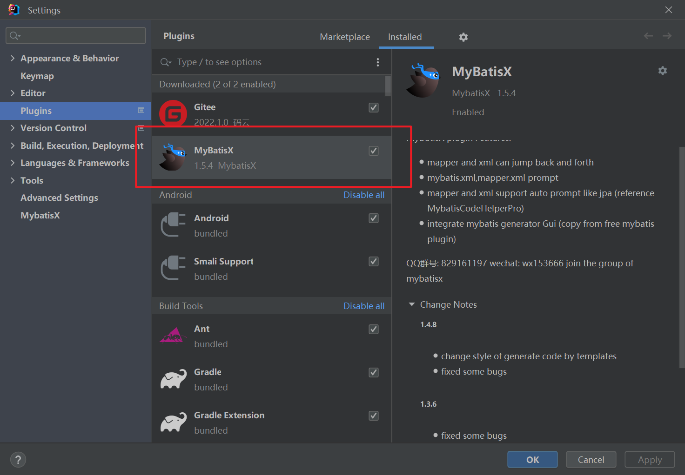

* 简便mapper接口与映射文件之间的跳转

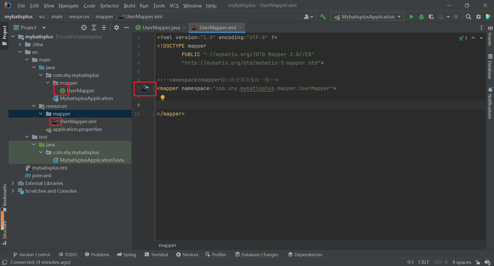

## 使用mybatisX快速生成代码

* 使用之前需要在idea中连接数据库

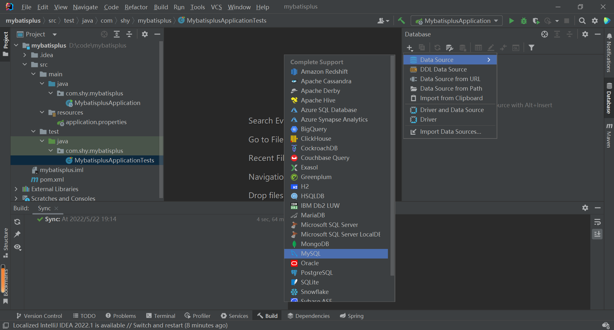

* 选中要生成的表

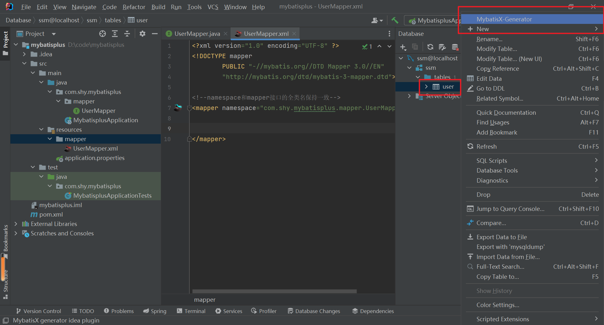

* 生成策略

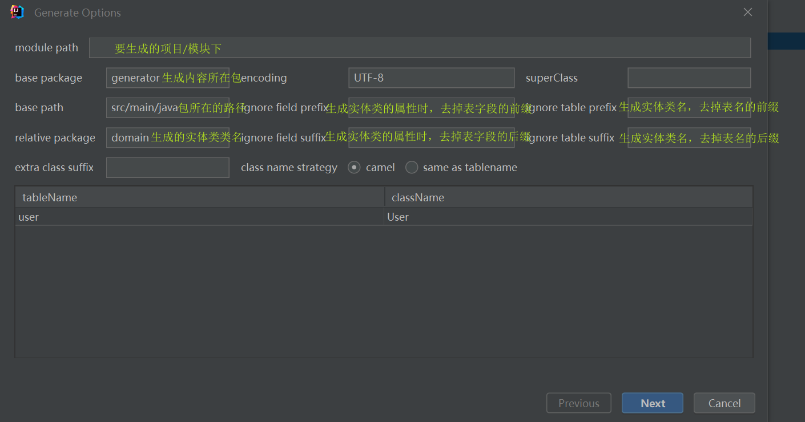

* 

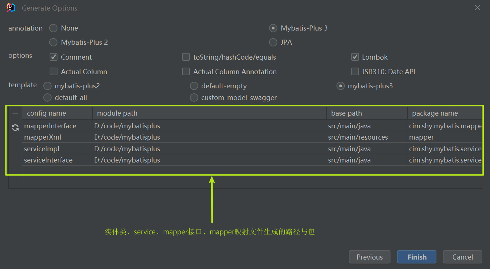