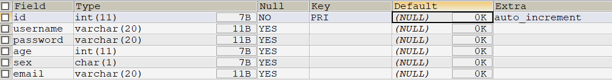
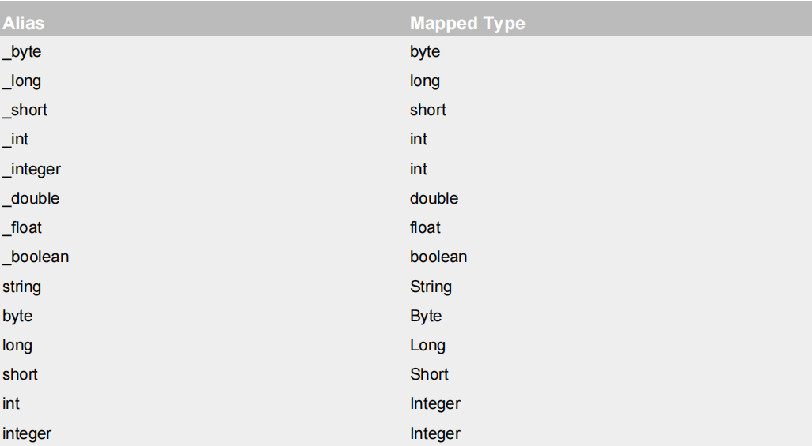
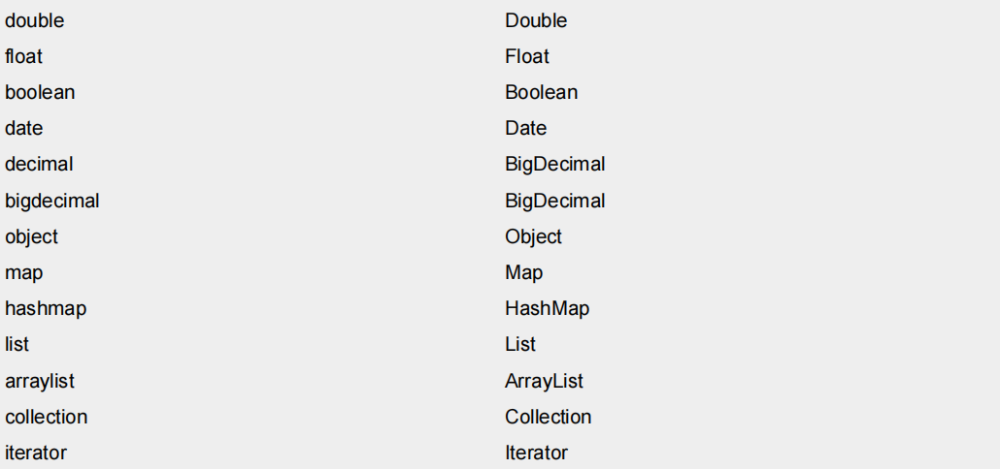
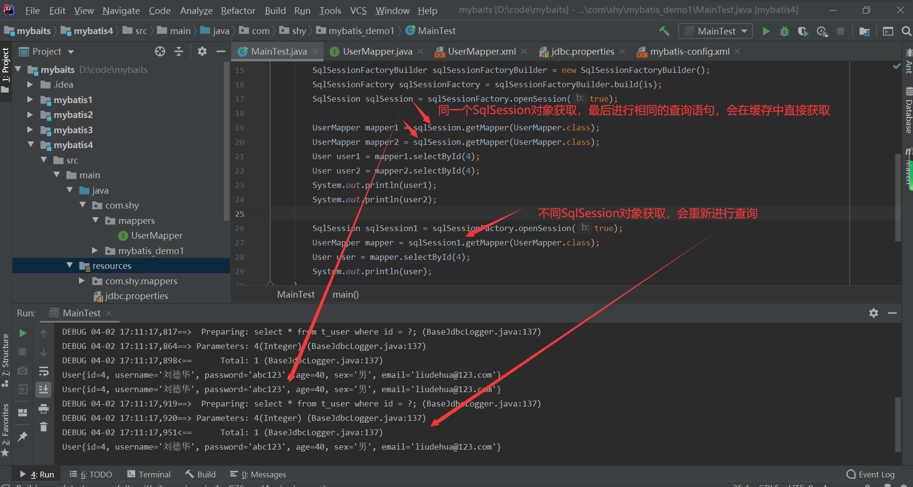
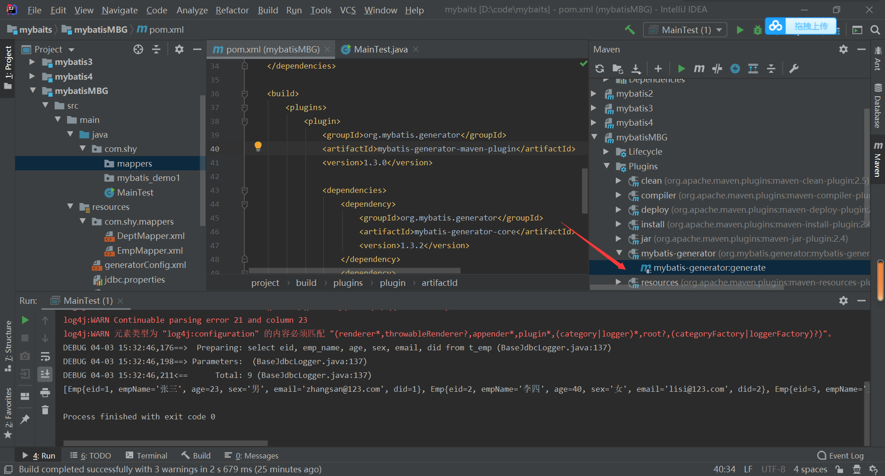

# MyBatis入门

## 创建maven工程

* 打包方式：jar
* 引入依赖

```xml
<dependencies>
  <!-- Mybatis核心 -->
  <dependency>
    <groupId>org.mybatis</groupId>
    <artifactId>mybatis</artifactId>
    <version>3.5.7</version>
  </dependency>
    
  <!-- MySQL驱动 -->
  <dependency>
    <groupId>mysql</groupId>
    <artifactId>mysql-connector-java</artifactId>
    <version>5.1.3</version>
  </dependency>
 
  <!-- junit测试 -->
  <dependency>
    <groupId>junit</groupId>
    <artifactId>junit</artifactId>
    <version>4.12</version>
    <scope>test</scope>
  </dependency>
</dependencies>
```

## 配置Mybatis的核心配置文件

src/main/resources/

mybatis-config.xml

```xml
<?xml version="1.0" encoding="UTF-8" ?>
<!DOCTYPE configuration
        PUBLIC "-//mybatis.org//DTD Config 3.0//EN"
        "http://mybatis.org/dtd/mybatis-3-config.dtd">

<configuration>
<!--配置数据库连接的环境-->
    <environments default="development">
        <environment id="development">
            <transactionManager type="JDBC"/>
            <dataSource type="POOLED">
                <property name="driver" value="com.mysql.jdbc.Driver"/>
                <property name="url" value="jdbc:mysql://localhost:13306/mybatis?useUnicode=true&amp;characterEncoding=utf8"/>
                <property name="username" value="root"/>
                <property name="password" value="abc123"/>
            </dataSource>
        </environment>
    </environments>
<!--引入映射文件-->
    <mappers>
        <mapper resource="org/mybatis/example/BlogMapper.xml"/>
    </mappers>
</configuration>
```

## 创建mapper接口

MyBatis的mapper接口相当于以前的dao，但是区别在于，mapper仅仅是接口，我们不需要提供实现类。

* 创建表。



* 创建实体类

```java
package com.shy.mybatis_demo1;

public class User {
    private Integer id;
    private String username;
    private String password;
    private Integer age;
    private String sex;
    private String email;

    public User() {
    }

    public User(Integer id, String username, String password, Integer age, String sex, String email) {
        this.id = id;
        this.username = username;
        this.password = password;
        this.age = age;
        this.sex = sex;
        this.email = email;
    }

    @Override
    public String toString() {
        return "User{" +
                "id=" + id +
                ", username='" + username + '\'' +
                ", password='" + password + '\'' +
                ", age=" + age +
                ", sex='" + sex + '\'' +
                ", email='" + email + '\'' +
                '}';
    }

    public Integer getId() {
        return id;
    }

    public void setId(Integer id) {
        this.id = id;
    }

    public String getUsername() {
        return username;
    }

    public void setUsername(String username) {
        this.username = username;
    }

    public String getPassword() {
        return password;
    }

    public void setPassword(String password) {
        this.password = password;
    }

    public Integer getAge() {
        return age;
    }

    public void setAge(Integer age) {
        this.age = age;
    }

    public String getSex() {
        return sex;
    }

    public void setSex(String sex) {
        this.sex = sex;
    }

    public String getEmail() {
        return email;
    }

    public void setEmail(String email) {
        this.email = email;
    }
}
```

## 创建mybatis的映射文件

Mybatis面向接口编程的两个一致：

* 映射文件的namespace和mapper接口的全类名保持一致。
* 映射文件中的SQL语句的标签的id属性与mapper接口中的方法名保持一致。

```xml
<?xml version="1.0" encoding="UTF-8" ?>
<!DOCTYPE mapper
        PUBLIC "-//mybatis.org//DTD Mapper 3.0//EN"
        "http://mybatis.org/dtd/mybatis-3-mapper.dtd">

<!--namespace和mapper接口的全类名保持一致-->
<mapper namespace="com.shy.mybatis_demo1.UserMapper">
    
<!--mapper接口中的方法和标签中的id保持一致-->
    <insert id="insertUser">
        insert into t_user(username,password,age,sex,email)
        values('Tom','123456',23,'男','tom@123.com');
    </insert>

</mapper>
```

```java
package com.shy.mybatis_demo1;

public interface UserMapper {
    int insertUser();
}
```

mybatis对应关系：

* 一张表 <> 一个实体类 <> 一个mapper接口 <> 一个映射文件

## 在mybatis核心配置文件中引入映射文件

```xml
<?xml version="1.0" encoding="UTF-8" ?>
<!DOCTYPE configuration
        PUBLIC "-//mybatis.org//DTD Config 3.0//EN"
        "http://mybatis.org/dtd/mybatis-3-config.dtd">

<configuration>
<!--配置数据库连接的环境-->
    <environments default="development">
        <environment id="development">
            <transactionManager type="JDBC"/>
            <dataSource type="POOLED">
                <property name="driver" value="com.mysql.jdbc.Driver"/>
                <property name="url" value="jdbc:mysql://localhost:13306/mybatis?useUnicode=true&amp;characterEncoding=utf8"/>
                <property name="username" value="root"/>
                <property name="password" value="abc123"/>
            </dataSource>
        </environment>
    </environments>
    
    
<!--引入映射文件-->
    <mappers>
        <mapper resource="mapper/UserMapper.xml"/>
    </mappers>
</configuration>
```

## 测试添加语句

```java
package com.shy.mybatis_demo1;

import org.apache.ibatis.io.Resources;
import org.apache.ibatis.session.SqlSession;
import org.apache.ibatis.session.SqlSessionFactory;
import org.apache.ibatis.session.SqlSessionFactoryBuilder;

import java.io.IOException;
import java.io.InputStream;

public class MainTest {
    public static void main(String[] args) throws IOException {
        //加载核心配置文件
        InputStream is = Resources.getResourceAsStream("mybatis-config.xml");
        //获取SqlSessionFactoryBuilder
        SqlSessionFactoryBuilder sqlSessionFactoryBuilder = new SqlSessionFactoryBuilder();
        //获取SqlSessionFactory
        SqlSessionFactory build = sqlSessionFactoryBuilder.build(is);
        //获取SqlSession
        SqlSession sqlSession = build.openSession();//默认有一个参数为false，不自动提交。
        //获取mapper接口对象
        UserMapper mapper = sqlSession.getMapper(UserMapper.class);
        //测试
        int i = mapper.insertUser();
        //提交数据
        sqlSession.commit();
        System.out.println(i);
    }
}
```

## 加入log4j日志功能

* 导入依赖

```xml
<!-- log4j日志 -->
<dependency>
  <groupId>log4j</groupId>
  <artifactId>log4j</artifactId>
  <version>1.2.17</version>
</dependency>
```

* 添加配置文件

log4j.xml

```xml
<?xml version="1.0" encoding="UTF-8" ?>
<!DOCTYPE log4j:configuration SYSTEM "log4j.dtd">
 
<log4j:configuration xmlns:log4j="http://jakarta.apache.org/log4j/">
 
  <appender name="STDOUT" class="org.apache.log4j.ConsoleAppender">
    <param name="Encoding" value="UTF-8" />
    <layout class="org.apache.log4j.PatternLayout">
      <param name="ConversionPattern" value="%-5p %d{MM-dd HH:mm:ss,SSS}
%m (%F:%L) \n" />
    </layout>
  </appender>
  <logger name="java.sql">
    <level value="debug" />
  </logger>
  <logger name="org.apache.ibatis">
    <level value="info" />
  </logger>
  <root>
    <level value="debug" />
    <appender-ref ref="STDOUT" />
  </root>
</log4j:configuration>
```

* 日志的级别：
  FATAL(致命)>ERROR(错误)>WARN(警告)>INFO(信息)>DEBUG(调试)
  从左到右打印的内容越来越详细

## 测试删除修改操作

```java
package com.shy.mybatis_demo1;

import org.apache.ibatis.io.Resources;
import org.apache.ibatis.session.SqlSession;
import org.apache.ibatis.session.SqlSessionFactory;
import org.apache.ibatis.session.SqlSessionFactoryBuilder;
import org.junit.Test;

import java.io.IOException;
import java.io.InputStream;

public class MainTest {
    public static void main(String[] args) throws IOException {
        //加载核心配置文件
        InputStream is = Resources.getResourceAsStream("mybatis-config.xml");
        //获取SqlSessionFactoryBuilder
        SqlSessionFactoryBuilder sqlSessionFactoryBuilder = new SqlSessionFactoryBuilder();
        //获取SqlSessionFactory
        SqlSessionFactory build = sqlSessionFactoryBuilder.build(is);
        //获取SqlSession
        SqlSession sqlSession = build.openSession();
        //获取mapper接口对象
        UserMapper mapper = sqlSession.getMapper(UserMapper.class);
        //测试
        int i = mapper.insertUser();
        //提交数据
        sqlSession.commit();
        System.out.println(i);
    }
    @Test
    public void update() throws IOException {
        InputStream is = Resources.getResourceAsStream("mybatis-config.xml");
        SqlSessionFactoryBuilder sqlSessionFactoryBuilder = new SqlSessionFactoryBuilder();
        SqlSessionFactory sqlSessionFactory = sqlSessionFactoryBuilder.build(is);
        SqlSession sqlSession = sqlSessionFactory.openSession(true);
        UserMapper mapper = sqlSession.getMapper(UserMapper.class);
        mapper.updateUser();
    }
    @Test
    public void delete() throws IOException {
        InputStream is = Resources.getResourceAsStream("mybatis-config.xml");
        SqlSessionFactoryBuilder sqlSessionFactoryBuilder = new SqlSessionFactoryBuilder();
        SqlSessionFactory sqlSessionFactory = sqlSessionFactoryBuilder.build(is);
        SqlSession sqlSession = sqlSessionFactory.openSession(true);
        UserMapper mapper = sqlSession.getMapper(UserMapper.class);
        mapper.deleteUser();
    }
}
```

```java
package com.shy.mybatis_demo1;

public interface UserMapper {
    int insertUser();
    void updateUser();
    void deleteUser();
}
```

```xml
<?xml version="1.0" encoding="UTF-8" ?>
<!DOCTYPE mapper
        PUBLIC "-//mybatis.org//DTD Mapper 3.0//EN"
        "http://mybatis.org/dtd/mybatis-3-mapper.dtd">

<!--namespace和mapper接口的全类名保持一致-->
<mapper namespace="com.shy.mybatis_demo1.UserMapper">
<!--mapper接口中的方法和标签中的id保持一致-->
    <insert id="insertUser">
        insert into t_user(username,password,age,sex,email)values('Tom','123456',23,'男','tom@123.com');
    </insert>

    <update id="updateUser">
        update t_user set username = 'Jim' where id = 3
    </update>

    <delete id="deleteUser">
        delete from t_user where id = 4;
    </delete>
</mapper>
```

## 测试查询操作

* getUserById();
* getAllUsers();

```java
@Test
    public void select() throws IOException {
        InputStream is = Resources.getResourceAsStream("mybatis-config.xml");
        SqlSessionFactoryBuilder sqlSessionFactoryBuilder = new SqlSessionFactoryBuilder();
        SqlSessionFactory sqlSessionFactory = sqlSessionFactoryBuilder.build(is);
        SqlSession sqlSession = sqlSessionFactory.openSession(true);
        UserMapper mapper = sqlSession.getMapper(UserMapper.class);
        User userById = mapper.getUserById();
        System.out.println(userById);
    }

    @Test
    public void selectAll() throws IOException {
        InputStream is = Resources.getResourceAsStream("mybatis-config.xml");
        SqlSessionFactoryBuilder sqlSessionFactoryBuilder = new SqlSessionFactoryBuilder();
        SqlSessionFactory sqlSessionFactory = sqlSessionFactoryBuilder.build(is);
        SqlSession sqlSession = sqlSessionFactory.openSession(true);
        UserMapper mapper = sqlSession.getMapper(UserMapper.class);
        List<User> allUsers = mapper.getAllUsers();
        Iterator<User> iterator = allUsers.iterator();
        while (iterator.hasNext()){
            System.out.println(iterator.next());
        }
    }
```

```java
public interface UserMapper {
    int insertUser();
    void updateUser();
    void deleteUser();
    User getUserById();
    List<User> getAllUsers();
}
```

```xml
	<select id="getUserById" resultType="com.shy.mybatis_demo1.User">
        select * from t_user where id = 5
    </select>

    <select id="getAllUsers" resultType="com.shy.mybatis_demo1.User">
        select * from t_user
    </select>
```

## 通过子查询(分布查询)解决一对多的映射关系

```java
@Test
    public void selectEmpDeptByIdStep() throws IOException {
        InputStream is = Resources.getResourceAsStream("mybatis-config.xml");
        SqlSessionFactoryBuilder sqlSessionFactoryBuilder = new SqlSessionFactoryBuilder();
        SqlSessionFactory sqlSessionFactory = sqlSessionFactoryBuilder.build(is);
        SqlSession sqlSession = sqlSessionFactory.openSession(true);
        EmpMapper mapper = sqlSession.getMapper(EmpMapper.class);
        Emp emp = mapper.selectEmpDeptStepOne("3");
        System.out.println(emp);
    }
```

```java
package com.shy.mappers;

import com.shy.mybatis_demo1.Emp;
import org.apache.ibatis.annotations.Param;

import java.util.List;

public interface EmpMapper {
    List<Emp> selectAll();
    List<Emp> selectAllToResultMap();

    Emp selectEmpDeptById(@Param("eid")String eid);

    Emp selectEmpDeptStepOne(@Param("eid")String eid);
}
```

EmpMapper.xml

```xml
<resultMap id="SelectSetpOneResultMap" type="Emp">
        <id property="eid" column="eid"></id>
        <result property="empName" column="emp_name"></result>
        <result property="age" column="age"></result>
        <result property="sex" column="sex"></result>
        <result property="email" column="email"></result>
        <association property="dept"
                     select="com.shy.mappers.DeptMapper.selectEmpDeptStepTwo"
                     column="did"></association>
    </resultMap>

<!--        Emp selectEmpDeptStepOne(@Param("id")String id);-->
    <select id="selectEmpDeptStepOne" resultMap="SelectSetpOneResultMap">
        select * from t_emp where eid = #{eid};
    </select>
```

```java
package com.shy.mappers;


import com.shy.mybatis_demo1.Dept;
import org.apache.ibatis.annotations.Param;

public interface DeptMapper {
    Dept selectEmpDeptStepTwo(@Param("did") String did);
}
```

DeptMapper.xml

```xml
<?xml version="1.0" encoding="UTF-8" ?>
<!DOCTYPE mapper
        PUBLIC "-//mybatis.org//DTD Mapper 3.0//EN"
        "http://mybatis.org/dtd/mybatis-3-mapper.dtd">


<mapper namespace="com.shy.mappers.DeptMapper">
<!--    Dept selectEmpDeptStepTwo(@Param("did") String did);-->
    <resultMap id="SelectSetpTwoResultMap" type="Dept">
        <id property="did" column="did"></id>
        <result property="deptName" column="dept_name"></result>
    </resultMap>

    <select id="selectEmpDeptStepTwo" resultMap="SelectSetpTwoResultMap">
        select * from t_dept where did = #{did}
    </select>
</mapper>
```

# 核心配置文件

根标签：

```xml
<configuration>
<!--
properties?,settings?,typeAliases?,
typeHandlers?,objectFactory?,objectWrapperFactory?,
reflectorFactory?,plugins?,environments?,
databaseIdProvider?,mappers?
-->
</configuration>
```

## environments标签

```xml
<!--environments：内有多个environment，每一个environment都是一个连接数据库的环境
                  属性：default="" 默认为指定environment的id的数据库连接环境
-->
    <environments default="development">

        <environment id="development">
            <!--
            transactionManager：设置事务管理方式
            属性：type=
                        "JDBC":表示当前环境中，执行SQL时，使用的是JDBC原生的事务管理方式，事务的提交或者回滚需要手动完成。
                        "MANAGED":表示被管理：例如spring
            -->
            <transactionManager type="JDBC"/>
            <!--
            dataSource:配置数据源
            属性：type：设置数据源类型=
                                        POOLED：表示使用数据库连接池缓存数据库连接
                                        UNPOOLED：表示不使用数据库连接池
                                        JNDI：表示使用上下文数据源
            -->
            <dataSource type="POOLED">
                <property name="driver" value="com.mysql.jdbc.Driver"/>
                <property name="url" value="jdbc:mysql://localhost:13306/mybatis?useUnicode=true&amp;characterEncoding=utf8"/>
                <property name="username" value="root"/>
                <property name="password" value="abc123"/>
            </dataSource>
        </environment>

    </environments>
```

## properties配置文件配置数据库连接池

jdbc.properties

```properties
jdbc.driver=com.mysql.jdbc.Driver
jdbc.url=jdbc:mysql://localhost:13306/mybatis?useUnicode=true&characterEncoding=utf8
jdbc.username=root
jdbc.password=abc123
```

核心配置文件：

```xml
<?xml version="1.0" encoding="UTF-8" ?>
<!DOCTYPE configuration
        PUBLIC "-//mybatis.org//DTD Config 3.0//EN"
        "http://mybatis.org/dtd/mybatis-3-config.dtd">

<configuration>
    <!--访问properties配置文件-->
    <properties resource="jdbc.properties"/>
    <environments default="development">
        <environment id="development">
            <transactionManager type="JDBC"/>
            <dataSource type="POOLED">
                <property name="driver" value="${jdbc.driver}"/>
                <property name="url" value="${jdbc.url}"/>
                <property name="username" value="${jdbc.username}"/>
                <property name="password" value="${jdbc.password}"/>
            </dataSource>
        </environment>

    </environments>

    <mappers>
        <mapper resource="mappers/UserMapper.xml"/>
    </mappers>

</configuration>
```

## typeAliases标签

改标签的作用是给映射文件中的<select>的resultType或者resultMap的值设置别名

```xml
<select id="getUserById" resultType="com.shy.mybatis_demo1.User">
        select * from t_user where id = 5
</select>
<!--查询语句过多时，resultType的值为全类名不方便-->
```

* 引入<typeAliases>标签

```xml
<typeAliases>
        <!--    为User类的全类名去一个别名User，不区分大小写，alias可以没有，默认为类名不区分大小写    -->
        <typeAlias type="com.shy.mybatis_demo1.User" alias="User"></typeAlias>

        <!--    以包为单位，将包内所有的类取别名，别名为类名，不区分大小写    -->
        <package name="com.shy.mybatis_demo1"/>
    </typeAliases>
```

* 映射文件中的<select> 标签可以修改为：

```xml
<select id="getUserById" resultType="User">
        select * from t_user where id = 5
</select>
```

## mappers标签

* 用于引入映射文件

```xml
<!--在当前目录下直接引入对应的映射文件-->
<mappers>
        <mapper resource="mappers/UserMapper.xml"/>
</mappers>
```

```xml
<!--
      以包为单位引入映射文件：
      要求：1.mapper接口所在的包要和映射文件所在的包一致
            2.mapper接口要和映射文件的名字一致
      -->
    <mappers>
        <package name="com.shy.mappers"/>
    </mappers>
```

# MyBatis获取参数值的两种方式

* ${} 本质是字符串拼接：部分情况必须使用该方式。
* #{} 本质是填充占位符：大多数情况下使用该方式。

## 情况一：mapper接口方法的参数为单个字面量类型

演示：根据User的id查询指定的user。

* Mapper接口：

```java
package com.shy.mappers;

import com.shy.mybatis_demo1.User;

public interface UserMapper {
    User selectUserById(int id);
}
```

* 映射文件

  * 使用#{}

  ```xml
  <!--User getUserById();-->
      <select id="getUserById" resultType="User">
          select * from t_user where id = ${id};
      </select>
  ```

  * 使用${}

  ```xml
  <!--User getUserById();-->
      <select id="getUserById" resultType="User">
          select * from t_user where id = '${id}'
      </select>
  ```

```java
package com.shy.mybatis_demo1;

import com.shy.mappers.UserMapper;
import org.apache.ibatis.io.Resources;
import org.apache.ibatis.session.SqlSession;
import org.apache.ibatis.session.SqlSessionFactory;
import org.apache.ibatis.session.SqlSessionFactoryBuilder;

import java.io.IOException;
import java.io.InputStream;

public class MainTest {
    public static void main(String[] args) throws IOException {
        InputStream is = Resources.getResourceAsStream("mybatis-config.xml");
        SqlSessionFactoryBuilder sqlSessionFactoryBuilder = new SqlSessionFactoryBuilder();
        SqlSessionFactory sqlSessionFactory = sqlSessionFactoryBuilder.build(is);
        SqlSession sqlSession = sqlSessionFactory.openSession(true);
        UserMapper mapper = sqlSession.getMapper(UserMapper.class);
        User userById = mapper.getUserById(5);
        System.out.println(userById);
    }
}
```

## 情况二：mapper接口方法的参数为多个字面量类型

* mapper接口方法的参数为多个字面量类型时：
  * 此时mybatis会将这些参数放在一个map集合中，以两种方式进行存储。
    * 方式一：以arg0，arg1...为键，以参数为值。
    * 方式二：以param1，param2...为键，以参数为值。
  * 因此只需要通过#{}和${}以键的方式访问值即可，但是要注意${}的单引号问题。

```java
@Test
    public void testLogin() throws IOException {
        InputStream is = Resources.getResourceAsStream("mybatis-config.xml");
        SqlSessionFactoryBuilder sqlSessionFactoryBuilder = new SqlSessionFactoryBuilder();
        SqlSessionFactory sqlSessionFactory = sqlSessionFactoryBuilder.build(is);
        SqlSession sqlSession = sqlSessionFactory.openSession(true);
        UserMapper mapper = sqlSession.getMapper(UserMapper.class);
        User tom = mapper.login("Jim", "123456");
        System.out.println(tom);
    }
```

```java
package com.shy.mappers;

import com.shy.mybatis_demo1.User;

public interface UserMapper {
    User getUserById(int id);

    User login(String username,String password);
}
```

#{}

```xml
<!--User login(String username,String password);-->
    <select id="login" resultType="User">
        <!--select * from t_user where username = #{arg0} and password = #{arg1} -->
        select * from t_user where username = #{param1} and password = #{param2}
    </select>
```

${}

```xml
<!--User login(String username,String password);-->
    <select id="login" resultType="User">
        select * from t_user where username = '${param1}' and password = '${param2}'
    </select>
```

## 情况三：

* mapper接口方法的参数有多个时，可以手动将这些参数放在一个map中存储。
* 只需要通过#{}和${}以键的方式访问即可。

```java
@Test
    public void testLoginByMap() throws IOException {
        InputStream is = Resources.getResourceAsStream("mybatis-config.xml");
        SqlSessionFactoryBuilder sqlSessionFactoryBuilder = new SqlSessionFactoryBuilder();
        SqlSessionFactory sqlSessionFactory = sqlSessionFactoryBuilder.build(is);
        SqlSession sqlSession = sqlSessionFactory.openSession(true);
        UserMapper mapper = sqlSession.getMapper(UserMapper.class);
        HashMap<String,String> map = new HashMap<String, String>();
        map.put("username","Jim");
        map.put("password","123456");
        User user = mapper.loginByMap(map);
        System.out.println(user);
    }
```

```java
public interface UserMapper {
    User getUserById(int id);

    User login(String username,String password);

    User loginByMap(Map<String,String> map);
}
```

```xml
<!--User loginByMap(Map<String,String> map);-->
    <select id="loginByMap" resultType="User">
        select * from t_user where username = #{username} and password = #{password}
    </select>
```

## 情况四：mapper接口方法的参数是自定义类型

* 只需要通过#{}和${}以属性名的方式访问即可。

```java
@Test
    public void insertUser() throws IOException {
        InputStream is = Resources.getResourceAsStream("mybatis-config.xml");
        SqlSessionFactoryBuilder sqlSessionFactoryBuilder = new SqlSessionFactoryBuilder();
        SqlSessionFactory sqlSessionFactory = sqlSessionFactoryBuilder.build(is);
        SqlSession sqlSession = sqlSessionFactory.openSession(true);
        UserMapper mapper = sqlSession.getMapper(UserMapper.class);
        int i = mapper.insertUser(new User(null, "刘德华", "abc123", 40, "男", "liudehua@123.com"));
        System.out.println(i);
    }
```

```java
public interface UserMapper {
    User getUserById(int id);

    User login(String username,String password);

    User loginByMap(Map<String,String> map);

    int insertUser(User user);
}
```

```xml
<!--int insertUser(User user);-->
    <insert id="insertUser">
        insert into t_user
        values(null,#{username},#{password},#{age},#{sex},#{email})
    </insert>
```

## 情况五：使用@Param注解命名参数

* 此时mybatis会将这些参数放在一个map集合中，以两种方式进行储存。
  * 第一种方式：以@Param注解的值为键，以参数值为值。
  * 第二种方式：以param1，param2...为键，以参数值为值。
* 因此只需要通过#{}或者${}以键的方式访问即可。

```java
@Test
    public void loginByParam() throws IOException {
        InputStream is = Resources.getResourceAsStream("mybatis-config.xml");
        SqlSessionFactoryBuilder sqlSessionFactoryBuilder = new SqlSessionFactoryBuilder();
        SqlSessionFactory sqlSessionFactory = sqlSessionFactoryBuilder.build(is);
        SqlSession sqlSession = sqlSessionFactory.openSession(true);
        UserMapper mapper = sqlSession.getMapper(UserMapper.class);
        User user = mapper.loginByParam("刘德华", "abc123");
        System.out.println(user);
    }
```

```java
public interface UserMapper {
    User getUserById(int id);

    User login(String username,String password);

    User loginByMap(Map<String,String> map);

    int insertUser(User user);

    User loginByParam(@Param("username") String username,@Param("password") String password);
}
```

```xml
<!--User loginByParam(@Param("username") String username,@Param("password") String password);-->
    <select id="loginByParam" resultType="User">
		<!--
		select * from t_user where username = #{username} and password = #{password}
		-->
        select * from t_user where username = #{param1} and password = #{param2}
    </select>
```

# MyBatis的各种查询功能

* 若查询的结果只有一条：
  * 可以通过实体类对象接收。
  * 可以通过list集合接收。
  * 可以通过map集合接收。

* 若查询结果有多条：
  * 可以通过list集合接收。
  * 可以通过map集合接收。
  * 不能通过实体类对象接收，会报异常TooManyResultsException.

```java
@Test
    public void selectAllReturnList() throws IOException {
        InputStream is = Resources.getResourceAsStream("mybatis-config.xml");
        SqlSessionFactoryBuilder sqlSessionFactoryBuilder = new SqlSessionFactoryBuilder();
        SqlSessionFactory sqlSessionFactory = sqlSessionFactoryBuilder.build(is);
        SqlSession sqlSession = sqlSessionFactory.openSession(true);
        SelectMapper mapper = sqlSession.getMapper(SelectMapper.class);
        List<User> users = mapper.selectAllReturnList();
        Iterator<User> iterator = users.iterator();
        while (iterator.hasNext()){
            System.out.println(iterator.next());
        }
```

```java
package com.shy.mappers;

import com.shy.mybatis_demo1.User;

import java.util.List;

public interface SelectMapper {
    List<User> selectAllReturnList();
}
```

```xml
<?xml version="1.0" encoding="UTF-8" ?>
<!DOCTYPE mapper
        PUBLIC "-//mybatis.org//DTD Mapper 3.0//EN"
        "http://mybatis.org/dtd/mybatis-3-mapper.dtd">


<mapper namespace="com.shy.mappers.SelectMapper">
<!--    List<User> selectAllReturnList();-->
    <select id="selectAllReturnList" resultType="User">
        select * from t_user;
    </select>
</mapper>
```

## 查询聚合函数

```java
@Test
    public void selectCount() throws IOException {
        InputStream is = Resources.getResourceAsStream("mybatis-config.xml");
        SqlSessionFactoryBuilder sqlSessionFactoryBuilder = new SqlSessionFactoryBuilder();
        SqlSessionFactory sqlSessionFactory = sqlSessionFactoryBuilder.build(is);
        SqlSession sqlSession = sqlSessionFactory.openSession(true);
        SelectMapper mapper = sqlSession.getMapper(SelectMapper.class);
        Integer integer = mapper.selectCount();
        System.out.println(integer);
    }
```

```java
public interface SelectMapper {
    List<User> selectAllReturnList();

    Integer selectCount();
}
```

```xml
<!--    Integer selectCount();-->
    <select id="selectCount" resultType="int">
        select count(*) from t_user;
    </select>
<!--
resultType="int" 其中int为mybatis已经设置的别名，还可以是integer Integer Int ....
mybatis设置的别名如下：
-->
```





## 查询一条结果用map集合封装

```java
@Test
    public void selectByIdToMap() throws IOException {
        InputStream is = Resources.getResourceAsStream("mybatis-config.xml");
        SqlSessionFactoryBuilder sqlSessionFactoryBuilder = new SqlSessionFactoryBuilder();
        SqlSessionFactory sqlSessionFactory = sqlSessionFactoryBuilder.build(is);
        SqlSession sqlSession = sqlSessionFactory.openSession(true);
        SelectMapper mapper = sqlSession.getMapper(SelectMapper.class);
        Map map = mapper.selectByIdToMap(4);
        System.out.println(map);
    }
```

```java
public interface SelectMapper {
    List<User> selectAllReturnList();

    Integer selectCount();

    Map selectByIdToMap(@Param("id") int id);
}
```

```xml
<!--        Map selectByIdToMap();-->
    <select id="selectByIdToMap" resultType="map">
        select * from t_user where id = #{id}
    </select>
```

## 查询多条结果用map集合封装

* 每条结果封装为一个map，将这些map封装到一个list中：

```java
@Test
    public void selectAllToMap() throws IOException {
        InputStream is = Resources.getResourceAsStream("mybatis-config.xml");
        SqlSessionFactoryBuilder sqlSessionFactoryBuilder = new SqlSessionFactoryBuilder();
        SqlSessionFactory sqlSessionFactory = sqlSessionFactoryBuilder.build(is);
        SqlSession sqlSession = sqlSessionFactory.openSession(true);
        SelectMapper mapper = sqlSession.getMapper(SelectMapper.class);
        List<Map> list = mapper.selectAllToMap();
        Iterator<Map> iterator = list.iterator();
        while (iterator.hasNext()){
            System.out.println(iterator.next());
        }
    }
```

```java
public interface SelectMapper {
    List<User> selectAllReturnList();

    Integer selectCount();

    Map selectByIdToMap(@Param("id") int id);

    List<Map> selectAllToMap();
}
```

```xml
<!--        List<Map> selectAllToMap();-->
<select id="selectAllToMap" resultType="map">
    select * from t_user
</select>
```

* 在mapper接口的方法上添加@Mapkey注解，此时可以将每条结果封装为一个map集合作为值，注解的值对应的结果字段作为键，封装为一个map集合。

```java
@Test
    public void selectAllToMap() throws IOException {
        InputStream is = Resources.getResourceAsStream("mybatis-config.xml");
        SqlSessionFactoryBuilder sqlSessionFactoryBuilder = new SqlSessionFactoryBuilder();
        SqlSessionFactory sqlSessionFactory = sqlSessionFactoryBuilder.build(is);
        SqlSession sqlSession = sqlSessionFactory.openSession(true);
        SelectMapper mapper = sqlSession.getMapper(SelectMapper.class);
        Map map = mapper.selectAllToMaps();
        System.out.println(map);
    }
```

```java
    @MapKey("id")
    Map selectAllToMaps();
```

```xml
<!--
    @MapKey("id")
    Map selectAllToMaps();
-->
    <select id="selectAllToMaps" resultType="map">
        select * from t_user;
    </select>
```

# 特殊的SQL语句

一下的SQL语句在使用#{}时容易出现错误，有时候必须要使用${}。

## 模糊查询

```java
package com.shy.mybatis_demo1;

import com.shy.mappers.SQLMapper;
import org.apache.ibatis.io.Resources;
import org.apache.ibatis.session.SqlSession;
import org.apache.ibatis.session.SqlSessionFactory;
import org.apache.ibatis.session.SqlSessionFactoryBuilder;

import java.io.IOException;
import java.io.InputStream;
import java.util.Iterator;
import java.util.List;

public class MainTest1 {
    public static void main(String[] args) throws IOException {
        InputStream is = Resources.getResourceAsStream("mybatis-config.xml");
        SqlSessionFactoryBuilder sqlSessionFactoryBuilder = new SqlSessionFactoryBuilder();
        SqlSessionFactory sqlSessionFactory = sqlSessionFactoryBuilder.build(is);
        SqlSession sqlSession = sqlSessionFactory.openSession(true);
        SQLMapper mapper = sqlSession.getMapper(SQLMapper.class);
        List<User> user = mapper.selectByLike("刘");
        Iterator<User> iterator = user.iterator();
        while (iterator.hasNext()){
            System.out.println(iterator.next());
        }
    }
}
```

```java
package com.shy.mappers;

import com.shy.mybatis_demo1.User;
import org.apache.ibatis.annotations.Param;

import java.util.List;

public interface SQLMapper {
    List<User> selectByLike(@Param("likeusername") String likeusername);
}
```

```xml
<?xml version="1.0" encoding="UTF-8" ?>
<!DOCTYPE mapper
        PUBLIC "-//mybatis.org//DTD Mapper 3.0//EN"
        "http://mybatis.org/dtd/mybatis-3-mapper.dtd">


<mapper namespace="com.shy.mappers.SQLMapper">
<!--List<User> selectByLike(@Param("likeusername") String likeusername);-->
    <select id="selectByLike" resultType="User">
        select * from t_user where username like '%#{likeusername}%'
    </select>

</mapper>
```

select * from t_user where username like '%#{likeusername}%'

此写法为错误写法，填充占位符?会被当做字符串中的一个符号，在填充时无法被识别。

正确写法：

```xml
<?xml version="1.0" encoding="UTF-8" ?>
<!DOCTYPE mapper
        PUBLIC "-//mybatis.org//DTD Mapper 3.0//EN"
        "http://mybatis.org/dtd/mybatis-3-mapper.dtd">


<mapper namespace="com.shy.mappers.SQLMapper">
<!--List<User> selectByLike(@Param("likeusername") String likeusername);-->
    <select id="selectByLike" resultType="User">
    <!--select * from t_user where username like '%${likeusername}%'  不推荐
        select * from t_user where username like concat('%',#{likeusername},'%')
    -->
        select * from t_user where username like "%"#{likeusername}"%"

    </select>

</mapper>
```

## 使用in进行批量删除

```java
@Test
    public void deleteByIn() throws IOException {
        InputStream is = Resources.getResourceAsStream("mybatis-config.xml");
        SqlSessionFactoryBuilder sqlSessionFactoryBuilder = new SqlSessionFactoryBuilder();
        SqlSessionFactory sqlSessionFactory = sqlSessionFactoryBuilder.build(is);
        SqlSession sqlSession = sqlSessionFactory.openSession(true);
        SQLMapper mapper = sqlSession.getMapper(SQLMapper.class);
        int i = mapper.deleteByIn("1,2,3");
        System.out.println(i);
    }
```

```java
package com.shy.mappers;

import com.shy.mybatis_demo1.User;
import org.apache.ibatis.annotations.Param;

import java.util.List;

public interface SQLMapper {
    List<User> selectByLike(@Param("likeusername") String likeusername);

    int deleteByIn(@Param("ids") String ids);
}
```

```xml
<!--    int deleteByIn(@Param("ids") String ids);-->
    <delete id="deleteByIn">
        delete from t_user where id in (#{ids});
    </delete>
```

delete from t_user where id in (#{ids}); 为错误写法

正确写法：

```xml
<!--    int deleteByIn(@Param("ids") String ids);-->
    <delete id="deleteByIn">
        delete from t_user where id in (${ids});
    </delete>
```

## 动态获取表名

同样不能使用#{}获取表名

```java
@Test
    public void selectByTableName() throws IOException {
        InputStream is = Resources.getResourceAsStream("mybatis-config.xml");
        SqlSessionFactoryBuilder sqlSessionFactoryBuilder = new SqlSessionFactoryBuilder();
        SqlSessionFactory sqlSessionFactory = sqlSessionFactoryBuilder.build(is);
        SqlSession sqlSession = sqlSessionFactory.openSession(true);
        SQLMapper mapper = sqlSession.getMapper(SQLMapper.class);
        List<User> t_user = mapper.selectAllByTableName("t_user");
        Iterator<User> iterator = t_user.iterator();
        while (iterator.hasNext()){
            System.out.println(iterator.next());
        }
    }
```

```java
public interface SQLMapper {
    List<User> selectByLike(@Param("likeusername") String likeusername);

    int deleteByIn(@Param("ids") String ids);

    //查询指定表名的表的所有字段
    List<User> selectAllByTableName(@Param("tablename") String tablename);
}
```

```xml
<!--
    //查询指定表名的表的所有字段
    List<User> selectAllByTableName(@Param("tablename") String tablename);
-->
    <select id="selectAllByTableName" resultType="User">
        select * from ${tablename}
    </select>
```

## 添加功能获取自增的主键

将User对象的添加到表中时，id为自增长的，将添加到表中的id获取到，并且封装到该User对象中。

```java
@Test
    public void insertUserGetId() throws IOException {
        InputStream is = Resources.getResourceAsStream("mybatis-config.xml");
        SqlSessionFactoryBuilder sqlSessionFactoryBuilder = new SqlSessionFactoryBuilder();
        SqlSessionFactory sqlSessionFactory = sqlSessionFactoryBuilder.build(is);
        SqlSession sqlSession = sqlSessionFactory.openSession(true);
        SQLMapper mapper = sqlSession.getMapper(SQLMapper.class);
        User user = new User(null, "王五", "zxcvbn", 31, "男", "wangwu@123.com");
        mapper.insertUserGetId(user);
        System.out.println(user);
    }
```

```java
public interface SQLMapper {
    List<User> selectByLike(@Param("likeusername") String likeusername);

    int deleteByIn(@Param("ids") String ids);

    //查询指定表名的表的所有字段
    List<User> selectAllByTableName(@Param("tablename") String tablename);

    void insertUserGetId(User user);
}
```

```xml
<!--
   void insertUserGetId(User user);
   useGeneratedKeys="true"  设置当前标签中的sql使用了自增的主键。
   keyProperty="id" 将自增的主键的值赋值给传输到映射文件中参数的某个属性。
-->
    <insert id="insertUserGetId" useGeneratedKeys="true" keyProperty="id">
        insert into t_user(username,password,age,sex,email)values(#{username},#{password},#{age},#{sex},#{email})
    </insert>
```

# 自定义映射resultMap

## 准备工作

* 创建emp表，且添加数据：

```mysql
CREATE TABLE t_emp(
eid INT PRIMARY KEY AUTO_INCREMENT,
emp_name VARCHAR(20),
age INT,
sex CHAR,
email VARCHAR(20),
did INT
);

INSERT INTO t_emp(emp_name,age,sex,email,did)
VALUES
('张三',23,'男','zhangsan@123.com',1),
('李四',40,'女','lisi@123.com',2),
('王五',13,'男','wangwu@123.com',3),
('赵六',33,'女','zhaoliu@123.com',1),
('田七',38,'男','tianqi@123.com',2);
```

* 创建dept表，且添加数据：

```mysql
CREATE TABLE t_dept(
did INT PRIMARY KEY AUTO_INCREMENT,
dept_name VARCHAR(20)
);

INSERT INTO t_dept(dept_name)
VALUES
('AA'),
('BB'),
('CC');
```

创建对应的实体类...

```java
package com.shy.mappers;

import com.shy.mybatis_demo1.Emp;

import java.util.List;

public interface EmpMapper {
    List<Emp> selectAll();

}
```

```xml
<?xml version="1.0" encoding="UTF-8" ?>
<!DOCTYPE mapper
        PUBLIC "-//mybatis.org//DTD Mapper 3.0//EN"
        "http://mybatis.org/dtd/mybatis-3-mapper.dtd">


<mapper namespace="com.shy.mappers.EmpMapper">
<!--    List<Emp> selectAll();-->
    <select id="selectAll" resultType="Emp">
        select * from t_emp;
    </select>
</mapper>
```

```java
package com.shy.mybatis_demo1;

import com.shy.mappers.EmpMapper;
import org.apache.ibatis.io.Resources;
import org.apache.ibatis.session.SqlSession;
import org.apache.ibatis.session.SqlSessionFactory;
import org.apache.ibatis.session.SqlSessionFactoryBuilder;

import java.io.IOException;
import java.io.InputStream;
import java.util.Iterator;
import java.util.List;

public class MainTest {
    public static void main(String[] args) throws IOException {
        InputStream is = Resources.getResourceAsStream("mybatis-config.xml");
        SqlSessionFactoryBuilder sqlSessionFactoryBuilder = new SqlSessionFactoryBuilder();
        SqlSessionFactory sqlSessionFactory = sqlSessionFactoryBuilder.build(is);
        SqlSession sqlSession = sqlSessionFactory.openSession(true);
        EmpMapper mapper = sqlSession.getMapper(EmpMapper.class);
        List<Emp> emps = mapper.selectAll();
        Iterator<Emp> iterator = emps.iterator();
        while (iterator.hasNext()){
            System.out.println(iterator.next());
        }
    }
}
```

可以发现empName的值均为null，因为实体类的属性与查询的字段不一致。

## 字段名和属性名的映射关系

### 通过字段别名解决字段名和属性名的映射关系

通过给字段起别名解决该问题：

```xml
<!--    List<Emp> selectAll();-->
    <select id="selectAll" resultType="Emp">
        select eid,emp_name empName,age,sex,email,did from t_emp;
    </select>
```

此时进行查询不会出现上述问题。

### 通过全局配置mapUndersoreToCamelCase解决字段名和属性名的映射关系

在mybatis-config.xml中添加标签：

```xml
<settings>
<!--通过此设置，可以将查询的字段名映射为对应的对象的属性名
对应关系： emp_name - empName
-->
    <setting name="mapUnderscoreToCamelCase" value="true"/>
</settings>
```

### 通过resultMap设置自定义的映射关系

```java
@Test
    public void selectAllToResultMap() throws IOException {
        InputStream is = Resources.getResourceAsStream("mybatis-config.xml");
        SqlSessionFactoryBuilder sqlSessionFactoryBuilder = new SqlSessionFactoryBuilder();
        SqlSessionFactory sqlSessionFactory = sqlSessionFactoryBuilder.build(is);
        SqlSession sqlSession = sqlSessionFactory.openSession(true);
        EmpMapper mapper = sqlSession.getMapper(EmpMapper.class);
        List<Emp> list = mapper.selectAllToResultMap();
        Iterator<Emp> iterator = list.iterator();
        while (iterator.hasNext()){
            System.out.println(iterator.next());
        }
    }
```

```java
package com.shy.mappers;

import com.shy.mybatis_demo1.Emp;

import java.util.List;

public interface EmpMapper {
    List<Emp> selectAll();
    List<Emp> selectAllToResultMap();
}
```

```xml
<!--
    resultMap:设置自定义映射关系
    两个属性：
        id：唯一标识
        type：设置映射关系中的实体类类型
    子标签：
        <id>：设置主键的映射关系
        <result>：设置普通字典的映射关系
        两个属性：
            property：设置映射关系中的属性名，必须是type属性所设置的实体类类型中的属性名。
            colum：设置映射关系中的字段名，必须是sql语句查询出的字段名。
-->
    <resultMap id="empResultMap" type="Emp">
        <id property="eid" column="eid"></id>
        <result property="empName" column="emp_name"></result>
        <result property="age" column="age"></result>
        <result property="sex" column="sex"></result>
        <result property="email" column="email"></result>
    </resultMap>

<!--        List<Emp> selectAllToResultMap();-->
    <select id="selectAllToResultMap" resultMap="empResultMap">
        select * from t_emp;
    </select>
```

## 多对一的映射关系

### 通过级联赋值解决多对一的映射关系

* 查询指定id的员工信息以及员工所在部门的信息。
* 员工类中有Dept类的对象作为属性，查询出来的字段did,dept_name无法作为Dept的对象，因此通过级联赋值解决该问题。

```java
@Test
    public void selectEmpDeptById() throws IOException {
        InputStream is = Resources.getResourceAsStream("mybatis-config.xml");
        SqlSessionFactoryBuilder sqlSessionFactoryBuilder = new SqlSessionFactoryBuilder();
        SqlSessionFactory sqlSessionFactory = sqlSessionFactoryBuilder.build(is);
        SqlSession sqlSession = sqlSessionFactory.openSession(true);
        EmpMapper mapper = sqlSession.getMapper(EmpMapper.class);
        Emp emp = mapper.selectEmpDeptById("3");
        System.out.println(emp);
    }
```

```java
package com.shy.mappers;

import com.shy.mybatis_demo1.Emp;
import org.apache.ibatis.annotations.Param;

import java.util.List;

public interface EmpMapper {
    List<Emp> selectAll();
    List<Emp> selectAllToResultMap();

    Emp selectEmpDeptById(@Param("id")String id);
}
```

```xml
    <resultMap id="EmpDeptResultMap" type="Emp">
        <id property="eid" column="eid"></id>
        <result property="empName" column="emp_name"></result>
        <result property="age" column="age"></result>
        <result property="sex" column="sex"></result>
        <result property="email" column="email"></result>
        <result property="dept.did" column="did"></result>
        <result property="dept.deptName" column="dept_name"></result>
    </resultMap>

<!--        Emp selectEmpDeptById(@Param("id")String id);-->
    <select id="selectEmpDeptById" resultMap="EmpDeptResultMap">
        select * from t_emp left join t_dept on t_emp.did = t_dept.did where eid = #{id};
    </select>
```

### 通过association解决多对一的映射关系

```xml
    <resultMap id="EmpDeptResultMap" type="Emp">
        <id property="eid" column="eid"></id>
        <result property="empName" column="emp_name"></result>
        <result property="age" column="age"></result>
        <result property="sex" column="sex"></result>
        <result property="email" column="email"></result>
<!--        <result property="dept.did" column="did"></result>-->
<!--        <result property="dept.deptName" column="dept_name"></result>-->
        <association property="dept" javaType="Dept">
            <id property="did" column="did"></id>
            <result property="deptName" column="dept_name"></result>
        </association>
    </resultMap>

<!--        Emp selectEmpDeptById(@Param("id")String id);-->
    <select id="selectEmpDeptById" resultMap="EmpDeptResultMap">
        select * from t_emp left join t_dept on t_emp.did = t_dept.did where eid = #{id};
    </select>
```

### 通过子查询（分布查询）解决多对一的映射关系

```java
@Test
    public void selectEmpDeptByIdStep() throws IOException {
        InputStream is = Resources.getResourceAsStream("mybatis-config.xml");
        SqlSessionFactoryBuilder sqlSessionFactoryBuilder = new SqlSessionFactoryBuilder();
        SqlSessionFactory sqlSessionFactory = sqlSessionFactoryBuilder.build(is);
        SqlSession sqlSession = sqlSessionFactory.openSession(true);
        EmpMapper mapper = sqlSession.getMapper(EmpMapper.class);
        Emp emp = mapper.selectEmpDeptStepOne("3");
        System.out.println(emp);
    }
```

```java
package com.shy.mappers;

import com.shy.mybatis_demo1.Emp;
import org.apache.ibatis.annotations.Param;

import java.util.List;

public interface EmpMapper {
    List<Emp> selectAll();
    List<Emp> selectAllToResultMap();

    Emp selectEmpDeptById(@Param("eid")String eid);

    Emp selectEmpDeptStepOne(@Param("eid")String eid);
}
```

EmpMapper.xml

```xml
    <resultMap id="SelectSetpOneResultMap" type="Emp">
        <id property="eid" column="eid"></id>
        <result property="empName" column="emp_name"></result>
        <result property="age" column="age"></result>
        <result property="sex" column="sex"></result>
        <result property="email" column="email"></result>
        <association property="dept"
                     select="com.shy.mappers.DeptMapper.selectEmpDeptStepTwo"
                     column="did"
                     fetchType="eager">
        </association>
    </resultMap>

<!--        Emp selectEmpDeptStepOne(@Param("id")String id);-->
    <select id="selectEmpDeptStepOne" resultMap="SelectSetpOneResultMap">
        select * from t_emp where eid = #{eid};
    </select>
```

```java
package com.shy.mappers;


import com.shy.mybatis_demo1.Dept;
import org.apache.ibatis.annotations.Param;

public interface DeptMapper {
    Dept selectEmpDeptStepTwo(@Param("did") String did);
}
```

DeptMapper.xml

```xml
<?xml version="1.0" encoding="UTF-8" ?>
<!DOCTYPE mapper
        PUBLIC "-//mybatis.org//DTD Mapper 3.0//EN"
        "http://mybatis.org/dtd/mybatis-3-mapper.dtd">


<mapper namespace="com.shy.mappers.DeptMapper">
<!--    Dept selectEmpDeptStepTwo(@Param("did") String did);-->
    <resultMap id="SelectSetpTwoResultMap" type="Dept">
        <id property="did" column="did"></id>
        <result property="deptName" column="dept_name"></result>
    </resultMap>

    <select id="selectEmpDeptStepTwo" resultMap="SelectSetpTwoResultMap">
        select * from t_dept where did = #{did}
    </select>
</mapper>
```

### 延迟加载

分布查询的优点：可以实现延迟加载，但是必须在核心配置文件中设置全局配置信息（默认不开启延迟加载）。

* lazyLoadingEnabled：延迟加载的全局开关，当开启时，所有关联对象都会延迟加载。

* aggressiveLazyLoading：当开启时，任何方法的调用都会加载该对象的所有属性。否则，每个属性都会按需加载。

  因此延迟加载需要lazyLoadingEnabled=true aggressiveLazyLoading=false（默认二者都为false）

  mybatis-config.xml

  ```xml
  <settings>
      <setting name="lazyLoadingEnabled" value="true"/>
  </settings>
  ```

  开启全局开关后，我们可以在association的fetchType手动设置对象是否为立即加载还是延迟加载

  ```xml
  <resultMap id="SelectSetpOneResultMap" type="Emp">
          <id property="eid" column="eid"></id>
          <result property="empName" column="emp_name"></result>
          <result property="age" column="age"></result>
          <result property="sex" column="sex"></result>
          <result property="email" column="email"></result>
          <association property="dept"
                       select="com.shy.mappers.DeptMapper.selectEmpDeptStepTwo"
                       column="did"
                       fetchType="eager"></association>
  			<!--fetchType="eager" 或者 "lazy"-->    
  </resultMap>
  ```

## 一对多的映射关系

### 通过collection解决一对多的映射关系

```java
public class Dept {
    private int did;
    private String deptName;
    private List<Emp> emps;
}//部门类
```

```java
  @Test
    public void selectDeptEmpBydid() throws IOException {
        InputStream is = Resources.getResourceAsStream("mybatis-config.xml");
        SqlSessionFactoryBuilder sqlSessionFactoryBuilder = new SqlSessionFactoryBuilder();
        SqlSessionFactory sqlSessionFactory = sqlSessionFactoryBuilder.build(is);
        SqlSession sqlSession = sqlSessionFactory.openSession(true);
        DeptMapper mapper = sqlSession.getMapper(DeptMapper.class);
        Dept dept = mapper.selectDeptEmpBydid("2");
        System.out.println(dept);
    }
```

```java
package com.shy.mappers;


import com.shy.mybatis_demo1.Dept;
import org.apache.ibatis.annotations.Param;

public interface DeptMapper {
    Dept selectEmpDeptStepTwo(@Param("did") String did);

    Dept selectDeptEmpBydid(@Param("did") String did);
}
```

```xml
    <resultMap id="selectDeptEmpBydid" type="Dept">
        <id property="did" column="did"></id>
        <result property="deptName" column="dept_name"></result>
        <collection property="emps" ofType="Emp">
            <id property="eid" column="eid"></id>
            <result property="empName" column="emp_name"></result>
            <result property="age" column="age"></result>
            <result property="sex" column="sex"></result>
            <result property="email" column="email"></result>
        </collection>
    </resultMap>
<!--    Dept selectDeptEmpBydid(@Param("did") String did);-->
    <select id="selectDeptEmpBydid" resultMap="selectDeptEmpBydid">
        select * from t_dept left join t_emp on t_dept.did = t_emp.did where t_dept.did = #{did};
    </select>
```

### 通过子查询(分布查询)解决一对多的映射关系

```java
    @Test
    public void selectDeptEmpBydidStep() throws IOException {
        InputStream is = Resources.getResourceAsStream("mybatis-config.xml");
        SqlSessionFactoryBuilder sqlSessionFactoryBuilder = new SqlSessionFactoryBuilder();
        SqlSessionFactory sqlSessionFactory = sqlSessionFactoryBuilder.build(is);
        SqlSession sqlSession = sqlSessionFactory.openSession(true);
        DeptMapper mapper = sqlSession.getMapper(DeptMapper.class);
        Dept dept = mapper.selectDeptEmpBydidStep1("2");
        System.out.println(dept);
    }
```

```java
public interface EmpMapper {
    List<Emp> selectAll();
    List<Emp> selectAllToResultMap();

    Emp selectEmpDeptById(@Param("eid")String eid);

    Emp selectEmpDeptStepOne(@Param("eid")String eid);

    List<Emp> selectDeptEmpBydidStep2(@Param("did") String did);
}
```

EmpMapper.xml

```xml
    <resultMap id="selectDeptEmpBydidStep2" type="Emp">
        <id property="eid" column="eid"></id>
        <result property="empName" column="emp_name"></result>
        <result property="age" column="age"></result>
        <result property="sex" column="sex"></result>
        <result property="email" column="email"></result>
    </resultMap>
<!--        List<Emp> selectDeptEmpBydidStep2(@Param("did") String did);-->
    <select id="selectDeptEmpBydidStep2" resultMap="selectDeptEmpBydidStep2">
        select * from t_emp where did = #{did};
    </select>
```

```java
public interface DeptMapper {
    Dept selectEmpDeptStepTwo(@Param("did") String did);

    Dept selectDeptEmpBydid(@Param("did") String did);

    Dept selectDeptEmpBydidStep1(@Param("did") String did);
}
```

DeptMapper.xml

```xml
    <resultMap id="selectDeptEmpBydidStep1" type="Dept">
        <id property="did" column="did"></id>
        <result property="deptName" column="dept_name"></result>
        <collection property="emps"
                    select="com.shy.mappers.EmpMapper.selectDeptEmpBydidStep2"
                    column="did">
        </collection>
    </resultMap>
<!--        Dept selectDeptEmpBydidStep1(@Param("did") String did);-->
    <select id="selectDeptEmpBydidStep1" resultMap="selectDeptEmpBydidStep1">
        select * from t_dept where did = #{did};
    </select>
```

# 动态SQL

MyBatis框架的动态SQL技术是一种根据特定条件动态拼装SQL语句的功能，它存在的意义是为了解决拼接SQL语句字符串时的痛点问题。

## 准备工作

```java
package com.shy.mappers;

public interface DynamicSQLMapper {
}
```

```xml
<?xml version="1.0" encoding="UTF-8" ?>
<!DOCTYPE mapper
        PUBLIC "-//mybatis.org//DTD Mapper 3.0//EN"
        "http://mybatis.org/dtd/mybatis-3-mapper.dtd">


<mapper namespace="com.shy.mappers.DynamicSQLMapper">

</mapper>
```


## if标签

* 根据emp_name,sex,age,email查询员工，如果这些字段为null或者为空字符串''则该字段不作为查询条件。

```java
    @Test
    public void testIf() throws IOException {
        InputStream is = Resources.getResourceAsStream("mybatis-config.xml");
        SqlSessionFactoryBuilder sqlSessionFactoryBuilder = new SqlSessionFactoryBuilder();
        SqlSessionFactory sqlSessionFactory = sqlSessionFactoryBuilder.build(is);
        SqlSession sqlSession = sqlSessionFactory.openSession(true);
        DynamicSQLMapper mapper = sqlSession.getMapper(DynamicSQLMapper.class);
        List<Emp> emps = mapper.testIf(new Emp(null, null, 23, "男", "zhangsan@123.com", null));
        System.out.println(emps);
    }
```

```java
public interface DynamicSQLMapper {
    List<Emp> testIf(Emp emp);
}
```

```xml
<!--    List<Emp> testIf(Emp emp);-->
<select id="testIf" resultType="Emp">
    select * from t_emp where 1=1
    <if test="empName!=null and empName!=''">and emp_name = #{empName}</if>
    <if test="age!=null and age!=''">and age = #{age}</if>
    <if test="sex!=null and sex!=''">and sex = #{sex}</if>
    <if test="email!=null and email!=''">and email = #{email}</if>
</select>
```

* if:根据标签中的test属性所对应的表达式决定标签中的内容是否需要拼接到SQL中。

## where标签

```xml
<mapper namespace="com.shy.mappers.DynamicSQLMapper">
<!--    List<Emp> testIf(Emp emp);-->
<select id="testIf" resultType="Emp">
    select * from t_emp 
  	<where>
        <if test="empName!=null and empName!=''">emp_name = #{empName}</if>
        <if test="age!=null and age!=''">and age = #{age}</if>
        <if test="sex!=null and sex!=''">and sex = #{sex}</if>
        <if test="email!=null and email!=''">and email = #{email}</if>
    </where>
</select>
```

* where：
  * 当where标签中有内容时，会自动生成where关键字，并且将内容 “前” 的and或or去掉。
  * 当where标签中没有内容时，此时where标签没有任何效果。
  * 注意：where标签不能将其内容后面多余的and或or去掉。

## trim标签

```xml
<mapper namespace="com.shy.mappers.DynamicSQLMapper">
<!--    List<Emp> testIf(Emp emp);-->
<select id="testIf" resultType="Emp">
    select * from t_emp
    <trim prefix="where" suffixOverrides="and|or">
        <if test="empName!=null and empName!=''">emp_name = #{empName} and </if>
        <if test="age!=null and age!=''">age = #{age} and </if>
        <if test="sex!=null and sex!=''">sex = #{sex} and </if>
        <if test="email!=null and email!=''">email = #{email} and </if>
    </trim>
```

* 若标签中有内容时：
  * prefix/suffix:将trim标签的内容前面/后面添加指定内容。
  * prefixOverrides/suffixOverrides:将trim标签中内容前面/后面去掉指定内容。
* 若标签中没有内容时：trim标签没有任何作用。

## choose、when、otherwise标签

相当于switch...case...defualt...

```xml
<!--    List<Emp> testIf(Emp emp);-->
<select id="testIf" resultType="Emp">
    select * from t_emp
    <where>
        <choose>
            <when test="empName!=null and empName!=''">
                emp_name = #{empName}
            </when>
            <when test="age!=null and age!=''">
                age = #{age}
            </when>
            <when test="sex!=null and sex!=''">
                sex = #{sex}
            </when>
            <when test="email!=null and email!=''">
                email = #{email}
            </when>
            <otherwise>

            </otherwise>
        </choose>
    </where>

</select>
```

* choose、when、otherwise标签中最多只会执行一条，因此不要加and or
* when至少有一个，otherwise最多有一个。

## foreach标签

* 属性：
  * collection：设置需要循环的数组或集合。
  * item：表示数组或集合中的每一个数据。
  * separator：循环体之间的分隔符。
  * open：标签所循环的所有内容的开始符。
  * close：标签所循环的所有内容的结束符。

* 通过数组实现批量删除

  ```java
  @Test
      public void testForeach() throws IOException {
          InputStream is = Resources.getResourceAsStream("mybatis-config.xml");
          SqlSessionFactoryBuilder sqlSessionFactoryBuilder = new SqlSessionFactoryBuilder();
          SqlSessionFactory sqlSessionFactory = sqlSessionFactoryBuilder.build(is);
          SqlSession sqlSession = sqlSessionFactory.openSession(true);
          DynamicSQLMapper mapper = sqlSession.getMapper(DynamicSQLMapper.class);
          int i = mapper.testForeach(new Integer[]{7, 8, 9});
          System.out.println(i);
      }
  ```

  ```java
  public interface DynamicSQLMapper {
      List<Emp> testIf(Emp emp);
      int testForeach(@Param("eids") Integer[] integer);
  }
  ```

  ```xml
  <!--        int testForeach(@Param("eids") Integer[] integer);-->
      <delete id="testForeach">
          delete from t_emp where eid in
          <foreach collection="eids" item="eid" separator="," open="(" close=")">
              #{eid}
          </foreach>
      </delete>
  <!--        int testForeach(@Param("eids") Integer[] integer);-->
      <delete id="testForeach">
          delete from t_emp
          <where>
              <foreach collection="eids" item="eid" separator="or">
                  eid = #{eid}
              </foreach>
          </where>
      </delete>
  ```

* 通过集合实现批量添加功能

```java
@Test
    public void testForeachInsert() throws IOException {
        InputStream is = Resources.getResourceAsStream("mybatis-config.xml");
        SqlSessionFactoryBuilder sqlSessionFactoryBuilder = new SqlSessionFactoryBuilder();
        SqlSessionFactory sqlSessionFactory = sqlSessionFactoryBuilder.build(is);
        SqlSession sqlSession = sqlSessionFactory.openSession(true);
        DynamicSQLMapper mapper = sqlSession.getMapper(DynamicSQLMapper.class);
        List<Emp> emps = Arrays.asList(new Emp(null, "Tom", 23, "男", "tom@123.com", null)
                , new Emp(null, "Jim", 32, "女", "jim@123.com", null)
                , new Emp(null, "Jerry", 40, "男", "jerry@123.com", null)
        );
        int i = mapper.testForeachInsert(emps);
        System.out.println(i);
    }
```

```java
public interface DynamicSQLMapper {
    List<Emp> testIf(Emp emp);
    int testForeach(@Param("eids") Integer[] integer);

    int testForeachInsert(@Param("emps") List<Emp> list);

}
```

```xml
<!--        int testForeachInsert(@Param("emps") List<Emp> list);-->
    <insert id="testForeachInsert">
        insert into t_emp(emp_name,age,sex,email)values
        <foreach collection="emps" item="emp" separator=",">
            (#{emp.empName},#{emp.age},#{emp.sex},#{emp.email})
        </foreach>
    </insert>
```

## SQL、include标签

设置SQL片段：<sql id="sqlId">eid,emp_name,age,sex,email</sql>

引用SQL片段：<include refid="sqlId"></include>

```xml
    <sql id="sqlId">eid,empName,sex,email,age</sql>
    <insert id="insert">
        insert into t_emp(<include refid="sqlId"></include>) values(...);
    </insert>
```

# MyBatis缓存机制

## MyBatis的一级缓存

一级缓存默认是被打开的

一级缓存是SqlSession级别的，通过同一个SqlSession查询的数据会被缓存，下次查询相同的数据，就会从缓存中直接获取，不会从数据库重新访问：



## 一级缓存失效

* 不同的SqlSession对应不同的一级缓存
* 同一个SqlSession但是查询条件不同
* 同一个SqlSession两次查询之间执行了任何因此增删改操作
* 同一个SqlSession两次查询期间手动清空了缓存（sqlSession.clearCache();）

## MyBatis的二级缓存

二级缓存默认是关闭的。

二级缓存是SqlSessionFactory级别，通过同一个SqlSessionFactory创建的SqlSession查询的结果会被缓存，此后若再次执行相同的查询语句，结果就会从缓存中获取，

二级缓存开启的条件：

* 在mybatis-config.xml中，设置全局配置属性 cacheEnabled="true"，默认为true，不需要设置。
* 在映射文件中设置标签<cache/>

```xml
<?xml version="1.0" encoding="UTF-8" ?>
<!DOCTYPE mapper
        PUBLIC "-//mybatis.org//DTD Mapper 3.0//EN"
        "http://mybatis.org/dtd/mybatis-3-mapper.dtd">


<mapper namespace="com.shy.mappers.UserMapper">
<cache/>
</mapper>
```

* 二级缓存必须在SqlSession关闭或者提交之后才有效。
* 查询的数据锁转换的实体类类型必须实现序列化接口。

## 二级缓存失效的情况

* 两次查询之间执行了任意的增删改，会使一级缓存和二级缓存同时清理。

## 二级缓存相关配置

在mapper配置文件中添加的cache标签可以设置一些属性：

* eviction属性：缓存回收策略
  * LRU（Least Recently Used） – 最近最少使用的：移除最长时间不被使用的对象。
  * FIFO（First in First out） – 先进先出：按对象进入缓存的顺序来移除它们。
  * SOFT – 软引用：移除基于垃圾回收器状态和软引用规则的对象。
  * WEAK – 弱引用：更积极地移除基于垃圾收集器状态和弱引用规则的对象。
  * 默认的是 LRU。
* flushInterval属性：刷新间隔，单位毫秒
  * 默认情况是不设置，也就是没有刷新间隔，缓存仅仅调用语句时刷新

* size属性：引用数目，正整数
  * 代表缓存最多可以存储多少个对象，太大容易导致内存溢出
* readOnly属性：只读，true/false
  * true：只读缓存；会给所有调用者返回缓存对象的相同实例。因此这些对象不能被修改。这提供了
    很重要的性能优势。
  * false：读写缓存；会返回缓存对象的拷贝（通过序列化）。这会慢一些，但是安全，因此默认是
    false。

## MyBatis缓存查询的顺序

* 先查询二级缓存，因为二级缓存中科院会有其他程序已经查出来的数据，可以拿来直接用。
* 二级查询没有命中，再查询一级缓存。
* 如果一级缓存也没有命中，则查询数据库。


* SqlSession关闭之后，一级缓存 中的数据会写入二级缓存。

## 整合第三方缓存EHCache

### 添加依赖

```xml
<!-- Mybatis EHCache整合包 -->
<dependency>
  <groupId>org.mybatis.caches</groupId>
  <artifactId>mybatis-ehcache</artifactId>
  <version>1.2.1</version>
</dependency>
<!-- slf4j日志门面的一个具体实现 -->
<dependency>
  <groupId>ch.qos.logback</groupId>
  <artifactId>logback-classic</artifactId>
  <version>1.2.3</version>
</dependency>
```

### 各jar包功能

| jar包名称       | 作用                            |
| --------------- | ------------------------------- |
| mybatis-ehcache | Mybatis和EHCache的整合包        |
| ehcache         | EHCache核心包                   |
| slf4j-api       | SLF4J日志门面包                 |
| logback-classic | 支持SLF4J门面接口的一个具体实现 |

### 创建EHCache的配置文件ehcache.xml

```xml
<?xml version="1.0" encoding="utf-8" ?>
<ehcache xmlns:xsi="http://www.w3.org/2001/XMLSchema-instance"
    xsi:noNamespaceSchemaLocation="../config/ehcache.xsd">
  <!-- 磁盘保存路径 -->
  <diskStore path="D:\atguigu\ehcache"/>
 
  <defaultCache
      maxElementsInMemory="1000"
      maxElementsOnDisk="10000000"
      eternal="false"
      overflowToDisk="true"
      timeToIdleSeconds="120"
      timeToLiveSeconds="120"
      diskExpiryThreadIntervalSeconds="120"
      memoryStoreEvictionPolicy="LRU">
  </defaultCache>
</ehcache>
```

### 设置二级缓存的类型

```xml
<cache type="org.mybatis.caches.ehcache.EhcacheCache"/>
```

### 加入logback日志

存在SLF4J时，作为简易日志的log4j将失效，此时我们需要借助SLF4J的具体实现logback来打印日志。
创建logback的配置文件logback.xml

```xml
<?xml version="1.0" encoding="UTF-8"?>
<configuration debug="true">
  <!-- 指定日志输出的位置 -->
  <appender name="STDOUT"
    class="ch.qos.logback.core.ConsoleAppender">
    <encoder>
      <!-- 日志输出的格式 -->
      <!-- 按照顺序分别是：时间、日志级别、线程名称、打印日志的类、日志主体内容、换行 -
->
      <pattern>[%d{HH:mm:ss.SSS}] [%-5level] [%thread] [%logger]
[%msg]%n</pattern>
    </encoder>
  </appender>
 
  <!-- 设置全局日志级别。日志级别按顺序分别是：DEBUG、INFO、WARN、ERROR -->
  <!-- 指定任何一个日志级别都只打印当前级别和后面级别的日志。 -->
  <root level="DEBUG">
    <!-- 指定打印日志的appender，这里通过“STDOUT”引用了前面配置的appender -->
    <appender-ref ref="STDOUT" />
  </root>
 
  <!-- 根据特殊需求指定局部日志级别 -->
  <logger name="com.atguigu.crowd.mapper" level="DEBUG"/>
 
</configuration
```

### EHCache配置文件说明

| 属性名                          | 是否必须 | 作用                                                         |
| ------------------------------- | -------- | ------------------------------------------------------------ |
| maxElementsInMemory             | 是       | 在内存中缓存的element的最大数目                              |
| maxElementsOnDisk               | 是       | 在磁盘上缓存的element的最大数目，若是0表示无穷大             |
| eternal                         | 是       | 设定缓存的elements是否永远不过期。 如果为true，则缓存的数据始终有效， 如果为false那么还要根据timeToIdleSeconds、timeToLiveSeconds判断 |
| overflowToDisk                  | 是       | 设定当内存缓存溢出的时候是否将过期的element缓存到磁盘上      |
| timeToIdleSeconds               | 否       | 当缓存在EhCache中的数据前后两次访问的时间超过timeToIdleSeconds的属性取值时， 这些数据便会删除，默认值是0,也就是可闲置时间无穷大 |
| timeToLiveSeconds               | 否       | 缓存element的有效生命期，默认是0.,也就是element存活时间无穷大 |
| diskSpoolBufferSizeMB           | 否       | DiskStore(磁盘缓存)的缓存区大小。默认是30MB。每个Cache都应该有自己的一个缓冲区 |
| diskPersistent                  | 否       | 在VM重启的时候是否启用磁盘保存EhCache中的数据，默认是false。 |
| diskExpiryThreadIntervalSeconds | 否       | 磁盘缓存的清理线程运行间隔，默认是120秒。每个120s， 相应的线程会进行一次EhCache中数据的清理工作 |
| memoryStoreEvictionPolicy       | 否       | 当内存缓存达到最大，有新的element加入的时候， 移除缓存中element的策略。 默认是LRU（最近最少使用），可选的有LFU（最不常使用）和FIFO（先进先出） |

# MyBatis的逆向工程

* 正向工程：西安创建java实体类，由框架负责根据实体类生成数据库表，Hibernate是支持正向工程的。
* 逆向工程：先创建数据库表，由框架负责根据数据库表，反向生成如下资源：
  * java实体类
  * Mapper接口
  * Mapper映射文件

## 添加依赖和插件

```xml
<!-- 依赖MyBatis核心包 -->
<dependencies>
  <dependency>
    <groupId>org.mybatis</groupId>
    <artifactId>mybatis</artifactId>
    <version>3.5.7</version>
  </dependency>
</dependencies>
 
<!-- 控制Maven在构建过程中相关配置 -->
<build>
   
  <!-- 构建过程中用到的插件 -->
  <plugins>
   
    <!-- 具体插件，逆向工程的操作是以构建过程中插件形式出现的 -->
    <plugin>
      <groupId>org.mybatis.generator</groupId>
      <artifactId>mybatis-generator-maven-plugin</artifactId>
      <version>1.3.0</version>
 
      <!-- 插件的依赖 -->
      <dependencies>
       
        <!-- 逆向工程的核心依赖 -->
        <dependency>
          <groupId>org.mybatis.generator</groupId>
          <artifactId>mybatis-generator-core</artifactId>
          <version>1.3.2</version>
        </dependency>
         
        <!-- 数据库连接池 -->
        <dependency>
          <groupId>com.mchange</groupId>
          <artifactId>c3p0</artifactId>
          <version>0.9.2</version>
        </dependency>
         
        <!-- MySQL驱动 -->
        <dependency>
          <groupId>mysql</groupId>
          <artifactId>mysql-connector-java</artifactId>
          <version>5.1.8</version>
        </dependency>
      </dependencies>
    </plugin>
  </plugins>
</build>
```

## 创建mybatis-config.xml

## 创建逆向工程的配置文件generatorConfig.xml

```xml
<?xml version="1.0" encoding="UTF-8"?>
<!DOCTYPE generatorConfiguration
        PUBLIC "-//mybatis.org//DTD MyBatis Generator Configuration 1.0//EN"
        "http://mybatis.org/dtd/mybatis-generator-config_1_0.dtd">
<generatorConfiguration>
    <!--
    targetRuntime: 执行生成的逆向工程的版本
    MyBatis3Simple: 生成基本的CRUD（清新简洁版）
    MyBatis3: 生成带条件的CRUD（奢华尊享版）
    -->
    <context id="DB2Tables" targetRuntime="MyBatis3Simple">
        <!-- 数据库的连接信息 -->
        <jdbcConnection driverClass="com.mysql.jdbc.Driver"
                        connectionURL="jdbc:mysql://localhost:13306/mybatis"
                        userId="root"
                        password="123456">
        </jdbcConnection>
        <!-- javaBean的生成策略-->
        <javaModelGenerator targetPackage="com.shy.mybatis_demo1" targetProject=".\src\main\java">
            <property name="enableSubPackages" value="true" />
            <property name="trimStrings" value="true" />
        </javaModelGenerator>
        <!-- SQL映射文件的生成策略 -->
        <sqlMapGenerator targetPackage="com.shy.mappers"
                         targetProject=".\src\main\resources">
            <property name="enableSubPackages" value="true" />
        </sqlMapGenerator>
        <!-- Mapper接口的生成策略 -->
        <javaClientGenerator type="XMLMAPPER"
                             targetPackage="com.shy.mappers" targetProject=".\src\main\java">
            <property name="enableSubPackages" value="true" />
        </javaClientGenerator>
        <!-- 逆向分析的表 -->
        <!-- tableName设置为*号，可以对应所有表，此时不写domainObjectName -->
        <!-- domainObjectName属性指定生成出来的实体类的类名 -->
        <table tableName="t_emp" domainObjectName="Emp"/>
        <table tableName="t_dept" domainObjectName="Dept"/>
    </context>
</generatorConfiguration>
```

## 使用插件生成响应的实体类和映射文件



## 进行测试

生成的实体类中没有 toString(); 构造器等，可以根据需要自己生成

```java
//查询所有数据：
public static void main(String[] args) throws IOException {
        InputStream is = Resources.getResourceAsStream("mybatis-config.xml");
        SqlSessionFactoryBuilder sqlSessionFactoryBuilder = new SqlSessionFactoryBuilder();
        SqlSessionFactory sqlSessionFactory = sqlSessionFactoryBuilder.build(is);
        SqlSession sqlSession = sqlSessionFactory.openSession(true);
        EmpMapper mapper = sqlSession.getMapper(EmpMapper.class);
        List<Emp> emps = mapper.selectByExample(null);
        System.out.println(emps);
    }
```

```java
//根据指定条件查询
    public static void main(String[] args) throws IOException {
        InputStream is = Resources.getResourceAsStream("mybatis-config.xml");
        SqlSessionFactoryBuilder sqlSessionFactoryBuilder = new SqlSessionFactoryBuilder();
        SqlSessionFactory sqlSessionFactory = sqlSessionFactoryBuilder.build(is);
        SqlSession sqlSession = sqlSessionFactory.openSession(true);
        EmpMapper mapper = sqlSession.getMapper(EmpMapper.class);
        EmpExample empExample = new EmpExample();
        EmpExample.Criteria criteria = empExample.createCriteria().andAgeEqualTo(23);
        List<Emp> emps = mapper.selectByExample(empExample);
        System.out.println(emps);
    }
```

## 测试修改

* updateByPrimaryKey(Emp emp);：根据主键修改，传入一个实体类对象含有主键，如果实体类对象的部分属性为null，则会修改数据库中相应字段为null.
* updateByPrimaryKeySelective(Emp emp);：根据主键修改，传入一个实体类对象含有主键，如果实体类对象的部分属性为null，则不会修改该数据库的相应字段.
* updateByExample(Emp emp,EmpExample example);：根据条件修改，传入一个实体类对象和条件，修改满足条件的数据库中的字段，如果实体类对象的部分属性为null，则会修改数据库中相应字段为null.
* updateByExampleSelective(Emp emp,EmpExample example);：根据条件修改，传入一个实体类对象和条件，修改满足条件的数据库中的字段，如果实体类对象的部分属性为null，则不会修改该数据库的相应字段.

## 测试查询

* selectByExample(EmpExample example);：根据传入的条件查询.
* selectByPrimaryKey();:根据传入的主键查询.

## 测试删除

与查询相似

* deleteByExample();
* deleteByPrimaryKey();

## 测试添加

* insert(Emp emp); 传入一个实体类对象进行添加，如果对象的某个属性为null，则会将数据库相应的字段添加为null.
* insertSelective(Emp emp)；传入一个实体类对象进行添加，如果对象的某个属性为null，则会将数据库相应的字段添加为默认值，如果没有默认值，则依然添加为null.

## 关于条件的使用Example

```java
		EmpExample empExample = new EmpExample();//创建条件对象
        empExample.createCriteria().andAgeBetween(10,20);//返回满足的一个条件10-20岁，如果继续.andXxx();将满足上述的所有条件。
        empExample.or().andAgeBetween(30,40);//将上一步的条件用括号括起来，将该步的方法用括号括起来，中间用or连接。
```

# 分页插件

## 分页插件使用步骤

### 添加依赖

```xml
<!-- https://mvnrepository.com/artifact/com.github.pagehelper/pagehelper -->
<dependency>
	<groupId>com.github.pagehelper</groupId>
	<artifactId>pagehelper</artifactId>
	<version>5.2.0</version>
</dependency>
```

### 配置分页插件

mybatis-config.xml中配置插件

```xml
<plugins>
	<!--设置分页插件-->
	<plugin interceptor="com.github.pagehelper.PageInterceptor"></plugin>
</plugins>
```

## 分页插件的使用

### 开启分页功能

* 在查询功能之前使用`PageHelper.startPage(int pageNum, int pageSize)`开启分页功能
  * pageNum：当前页的页码  
  * pageSize：每页显示的条数

```java
@Test
public void testPageHelper() throws IOException {
	InputStream is = Resources.getResourceAsStream("mybatis-config.xml");
	SqlSessionFactoryBuilder sqlSessionFactoryBuilder = new SqlSessionFactoryBuilder();
	SqlSessionFactory sqlSessionFactory = sqlSessionFactoryBuilder.build(is);
	SqlSession sqlSession = sqlSessionFactory.openSession(true);
	EmpMapper mapper = sqlSession.getMapper(EmpMapper.class);
	//访问第一页，每页四条数据
	PageHelper.startPage(1,4);
	List<Emp> emps = mapper.selectByExample(null);
	emps.forEach(System.out::println);
}
```

### 分页相关数据

#### 第一种获取数据的方法

```java
@Test
public void testPageHelper() throws IOException {
	InputStream is = Resources.getResourceAsStream("mybatis-config.xml");
	SqlSessionFactoryBuilder sqlSessionFactoryBuilder = new SqlSessionFactoryBuilder();
	SqlSessionFactory sqlSessionFactory = sqlSessionFactoryBuilder.build(is);
	SqlSession sqlSession = sqlSessionFactory.openSession(true);
	EmpMapper mapper = sqlSession.getMapper(EmpMapper.class);
	//访问第一页，每页四条数据
	Page<Object> page = PageHelper.startPage(1, 4);
	List<Emp> emps = mapper.selectByExample(null);
	//在查询到List集合后，打印分页数据
	System.out.println(page);
}
```

获取到的数据：

```
Page{count=true, pageNum=1, pageSize=4, startRow=0, endRow=4, total=8, pages=2, reasonable=false, pageSizeZero=false}[Emp{eid=1, empName='admin', age=22, sex='男', email='456@qq.com', did=3}, Emp{eid=2, empName='admin2', age=22, sex='男', email='456@qq.com', did=3}, Emp{eid=3, empName='王五', age=12, sex='女', email='123@qq.com', did=3}, Emp{eid=4, empName='赵六', age=32, sex='男', email='123@qq.com', did=1}]
```

#### 第二种获取数据的方法

- 在查询获取list集合之后，使用`PageInfo<T> pageInfo = new PageInfo<>(List<T> list, intnavigatePages)`获取分页相关数据
 - list：分页之后的数据  
   - navigatePages：导航分页的页码数

```java
@Test
public void testPageHelper() throws IOException {
	InputStream is = Resources.getResourceAsStream("mybatis-config.xml");
	SqlSessionFactoryBuilder sqlSessionFactoryBuilder = new SqlSessionFactoryBuilder();
	SqlSessionFactory sqlSessionFactory = sqlSessionFactoryBuilder.build(is);
	SqlSession sqlSession = sqlSessionFactory.openSession(true);
	EmpMapper mapper = sqlSession.getMapper(EmpMapper.class);
	PageHelper.startPage(1, 4);
	List<Emp> emps = mapper.selectByExample(null);
	PageInfo<Emp> page = new PageInfo<>(emps,5);
	System.out.println(page);
}
```

- 分页相关数据：

	```
	PageInfo{
	pageNum=1, pageSize=4, size=4, startRow=1, endRow=4, total=8, pages=2, 
	list=Page{count=true, pageNum=1, pageSize=4, startRow=0, endRow=4, total=8, pages=2, reasonable=false, pageSizeZero=false}[Emp{eid=1, empName='admin', age=22, sex='男', email='456@qq.com', did=3}, Emp{eid=2, empName='admin2', age=22, sex='男', email='456@qq.com', did=3}, Emp{eid=3, empName='王五', age=12, sex='女', email='123@qq.com', did=3}, Emp{eid=4, empName='赵六', age=32, sex='男', email='123@qq.com', did=1}], 
	prePage=0, nextPage=2, isFirstPage=true, isLastPage=false, hasPreviousPage=false, hasNextPage=true, navigatePages=5, navigateFirstPage=1, navigateLastPage=2, navigatepageNums=[1, 2]}
	```

- 其中list中的数据等同于方法一中直接输出的page数据

##### 常用数据：

- pageNum：当前页的页码  
- pageSize：每页显示的条数  
- size：当前页显示的真实条数  
- total：总记录数  
- pages：总页数  
- prePage：上一页的页码  
- nextPage：下一页的页码
- isFirstPage/isLastPage：是否为第一页/最后一页  
- hasPreviousPage/hasNextPage：是否存在上一页/下一页  
- navigatePages：导航分页的页码数  
- navigatepageNums：导航分页的页码，\[1,2,3,4,5]

