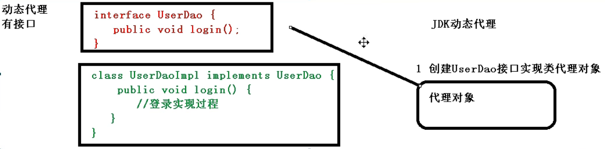
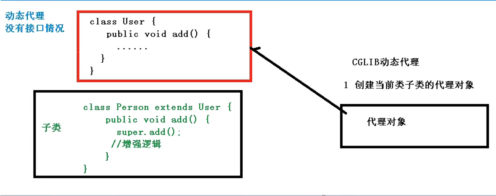
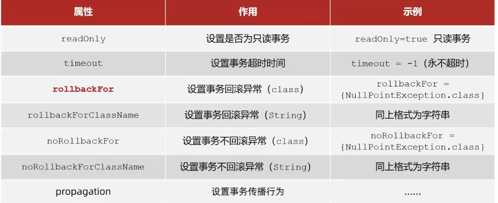
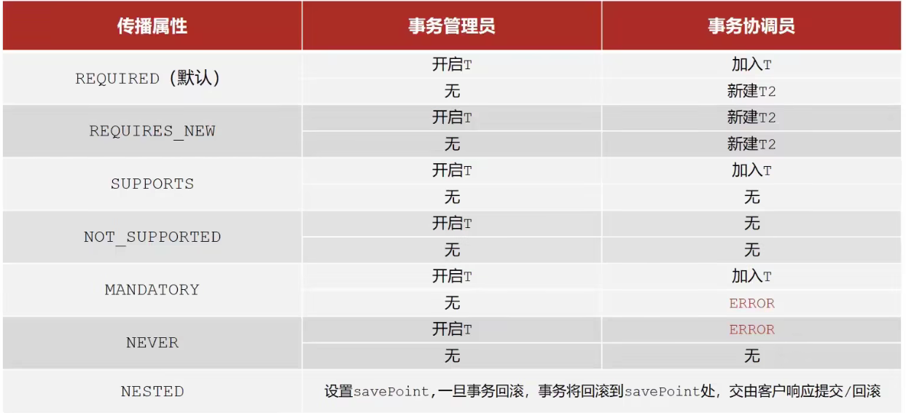

# IOC容器底层原理

## IOC接口

* IOC思想基于IOC容器完成，IOC容器底层就是对象工厂。

* Spring提供IOC容器实现两种方式：（两个接口）

  * BeanFactory：IOC容器的基本实现，是Spring内部使用的接口，不提供开发人员进行使用。

    特点：加载配置文件的时候不会创建对象，只有在获取（使用）对象才会去创建。

  * ApplicationContext：BeanFactory接口的子接口，提供更多更强大的功能，一般由开发人员进行使用。

    特点：加载配置文件的时候就会把配置文件对象进行创建。

* ApplicationContext接口的主要实现类：

  * FileSystemXmlApplicationContext(); 内填绝对路径。
  * ClassPathXmlApplicationContext(); 内填相对于src下的相对路径。

# IOC操作：Bean管理

* 什么是Bean管理？两个操作：
  * Spring创建对象。
  * Spring注入属性。
* 如何实现Bean管理？两种方式：
  * 基于xml配置文件的方式实现。
  * 基于注解的方式实现。

# 基于xml方式实现Bean管理

## 创建对象

* 一、在xml文件中，配置User对象创建：

```xml
<?xml version="1.0" encoding="UTF-8"?>
<beans xmlns="http://www.springframework.org/schema/beans"
       xmlns:xsi="http://www.w3.org/2001/XMLSchema-instance"
       xsi:schemaLocation="http://www.springframework.org/schema/beans http://www.springframework.org/schema/beans/spring-beans.xsd">
    
    <!--配置User对象创建-->
    <bean id="user" class="com.shy.spring_1.User"></bean>

</beans>
```

bean标签中的常用属性：

* id：作为唯一标识。
* class：类全路径。

创建对象时，默认是通过调用无参的构造器进行创建，如果没有无参构造器，则会报错。

* 二、在java代码中加载配置文件，并且创建对象：

~~~java
package com.shy.spring_1;

import org.springframework.context.ApplicationContext;
import org.springframework.context.support.ClassPathXmlApplicationContext;

public class testMain {
    public static void main(String[] args) {
        //加载spring配置文件：
        ApplicationContext context = new ClassPathXmlApplicationContext("bean1.xml");
        //获取配置创建的对象：
        User user = context.getBean("user", User.class);
        user.add();
    }
}
~~~

## 使用工厂创建对象

### 使用静态工厂

* 提供Person类：

```java
package com.shy.beans;

public class Person {
    private String name;
    private int age;
}
```

* 提供创建Person对象的工厂：

```java
package com.shy.staticfactory;

import com.shy.beans.Person;

public class PersonFactory {
    public static Person getPerson(){
        return new Person();
    }
}
```

* 进行配置：

```xml
<?xml version="1.0" encoding="UTF-8"?>
<beans xmlns="http://www.springframework.org/schema/beans"
       xmlns:xsi="http://www.w3.org/2001/XMLSchema-instance"
       xsi:schemaLocation="http://www.springframework.org/schema/beans http://www.springframework.org/schema/beans/spring-beans.xsd">

    <bean id="person" class="com.shy.staticfactory.PersonFactory" factory-method="getPerson"></bean>
</beans>
```

* 测试：

```java
import com.shy.beans.Person;
import org.springframework.context.support.ClassPathXmlApplicationContext;

public class Main {
    public static void main(String[] args) {
        ClassPathXmlApplicationContext classPathXmlApplicationContext = new ClassPathXmlApplicationContext("spring.xml");
        Person person = classPathXmlApplicationContext.getBean("person", Person.class);
        System.out.println(person);
    }
}
```

### 使用实例工厂

* Person的工厂

```java
package com.shy.factory;

import com.shy.beans.Person;

public class PersonFactory {
    public Person getPerson(){
        return new Person();
    }
}
```

* 进行配置

```xml
<?xml version="1.0" encoding="UTF-8"?>
<beans xmlns="http://www.springframework.org/schema/beans"
       xmlns:xsi="http://www.w3.org/2001/XMLSchema-instance"
       xsi:schemaLocation="http://www.springframework.org/schema/beans http://www.springframework.org/schema/beans/spring-beans.xsd">
    <bean id="personFactory" class="com.shy.factory.PersonFactory"></bean>
    <bean id="person" factory-bean="personFactory" factory-method="getPerson" scope="prototype"></bean>
</beans>
```

* 测试：

```java
import com.shy.beans.Person;
import org.springframework.context.support.ClassPathXmlApplicationContext;

public class Main {
    public static void main(String[] args) {
        ClassPathXmlApplicationContext classPathXmlApplicationContext = new ClassPathXmlApplicationContext("spring.xml");
        Person person = classPathXmlApplicationContext.getBean("person", Person.class);
        Person person1 = classPathXmlApplicationContext.getBean("person", Person.class);
        System.out.println(person == person1);
    }
}
```

### FactoryBean

* 为了简化上面的使用实例工厂：

* Spring中有两种类型的Bean，一种是普通Bean，另外一种是工厂Bean。
  * 普通Bean：在配置文件中定义bean类型就是返回类型。
  * FactoryBean：在配置文件中定义bean类型可以和返回类型不同。

* FactoryBean的创建方式：
  * 创建类，让这个类作为工厂bean，实现接口FactoryBean。
  * 实现接口里面的方法，在实现的方法中定义返回的bean类型。

```xml
<bean id="mybean" class="com.shy.FactoryBean.MyBean">
```

```java
package com.shy.FactoryBean;

import org.springframework.beans.factory.FactoryBean;

public class MyBean implements FactoryBean<Person> {
    //该方法用于创建bean
    @Override
    public Person getObject() throws Exception {
        Person person = new Person();
        return person;
    }
	//指明bean的类型
    @Override
    public Class<?> getObjectType() {
        return null;
    }
	//设置bean是否单例
    @Override
    public boolean isSingleton() {
        return false;
    }
}
```

```java
package com.shy.FactoryBean;

import org.springframework.context.support.ClassPathXmlApplicationContext;

public class MainTest {
    public static void main(String[] args) {
        ClassPathXmlApplicationContext classPathXmlApplicationContext = new ClassPathXmlApplicationContext("bean1.xml");
        Person person = classPathXmlApplicationContext.getBean("mybean", Person.class);
        System.out.println(person);
    }
}
```


## 注入属性

### 通过set();注入属性：

```xml
<!--
    使用property完成属性注入：
    name：属性名
    value：属性值
-->
    <bean id="person" class="com.shy.spring_1.Person">
        <property name="name" value="Tom"></property>
        <property name="age" value="23"></property>
    </bean>
```

```xml
<!--
    使用p名称空间完成属性注入：
    p:属性名="属性值"
-->
<?xml version="1.0" encoding="UTF-8"?>
<beans xmlns="http://www.springframework.org/schema/beans"
       xmlns:p="http://www.springframework.org/schema/p"
       xmlns:xsi="http://www.w3.org/2001/XMLSchema-instance"
       xsi:schemaLocation="http://www.springframework.org/schema/beans http://www.springframework.org/schema/beans/spring-beans.xsd">


    <bean id="person" class="com.shy.spring_1.Person" p:name="Tom" p:age="23"></bean>
</beans>
```

Person类必须有相应属性的set();方法：

```java
package com.shy.spring_1;

public class Person {
    private String name;
    private int age;

    public String getName() {
        return name;
    }

    public void setName(String name) {
        this.name = name;
    }

    public int getAge() {
        return age;
    }

    public void setAge(int age) {
        this.age = age;
    }

    @Override
    public String toString() {
        return "Person{" +
                "name='" + name + '\'' +
                ", age=" + age +
                '}';
    }
}
```

```java
package com.shy.spring_1;

import org.springframework.context.ApplicationContext;
import org.springframework.context.support.ClassPathXmlApplicationContext;

public class testMain {
    public static void main(String[] args) {
        //加载spring配置文件：
        ApplicationContext context = new ClassPathXmlApplicationContext("bean1.xml");
        //获取配置创建的对象：
        Person person = context.getBean("person", Person.class);
        System.out.println(person);
    }
}
```

### 通过有参构造器进行注入

```xml
<!--
        使用constructor-arg完成属性注入：
        name：属性名
        value：属性值 也可以用index: 索引进行注入
    -->

    <bean id="person" class="com.shy.spring_1.Person">
        <constructor-arg name="name" value="Tom"></constructor-arg>
        <constructor-arg name="age" value="23"></constructor-arg>
    </bean>
```

Person类必须有相应的构造器：

```java
package com.shy.spring_1;

public class Person {
    private String name;
    private int age;

    public Person(String name, int age) {
        this.name = name;
        this.age = age;
    }

    @Override
    public String toString() {
        return "Person{" +
                "name='" + name + '\'' +
                ", age=" + age +
                '}';
    }
}
```

```java
package com.shy.spring_1;

import org.springframework.context.ApplicationContext;
import org.springframework.context.support.ClassPathXmlApplicationContext;

public class testMain {
    public static void main(String[] args) {
        //加载spring配置文件：
        ApplicationContext context = new ClassPathXmlApplicationContext("bean1.xml");
        //获取配置创建的对象：
        Person person = context.getBean("person", Person.class);
        System.out.println(person);
    }
}
```

### 注入空值

```xml
   <!--向name属性设置为null-->
    <bean id="person2" class="com.shy.spring_1.Person">
        <property name="name">
            <null/>
        </property>
    </bean>
```

### 注入特殊符号

* 方法一：使用转义字符

```xml
<bean id="person" class="com.shy.spring_1.Person">
        <property name="name" value="&lt;&lt;Tom&gt;&gt;"></property>
    	<!--&lt;代表 < &gt;代表 > -->
</bean>
```

* 方法二：把特殊符号的内容写到CDATA中

```xml
    <bean id="person" class="com.shy.spring_1.Person">
        <property name="name">
            <value><![CDATA[<<Tom>>]]></value>
        </property>
    </bean>
```

### 注入属性-注入外部bean

```xml
<!--
    注入DAOImple对象：
    name属性：类里面属性的名称。
    ref属性：创建DAOImple对象bean标签id值
-->
<bean id="service" class="com.shy.servicedao.service">
    <property name="daoImple" ref="DAOImple"></property>
</bean>
    
<bean id="DAOImple" class="com.shy.servicedao.DAOImple"></bean>
```

```java
package com.shy.servicedao;

public class service {
    private DAOImple daoImple;
    public void add(){
        System.out.println("add.....");
        //想在此调用DAO中的DAO方法：
        daoImple.DAO();
    }

    public void setDaoImple(DAOImple daoImple) {
        this.daoImple = daoImple;
    }
}

class DAOImple implements DOA{
    public void DAO(){
        System.out.println("DAO");
    }

}
interface DOA{
}
```

### 注入属性-注入内部bean

```xml
<bean id="emp" class="com.shy.empdept.Emp">
    <property name="name" value="Tom"></property>
    <property name="age" value="23"></property>
    <property name="deptId">
        <bean id="dept" class="com.shy.empdept.Dept">
            <property name="deptId" value="10"></property>
        </bean>
    </property>
</bean>
```

emp类：

```java
package com.shy.empdept;

public class Emp {
    private String name;
    private int age;
    private Dept Dept;

    public void setName(String name) {
        this.name = name;
    }

    public void setAge(int age) {
        this.age = age;
    }

    public void setDeptId(Dept dept) {
        Dept = dept;
    }

    @Override
    public String toString() {
        return "Emp{" +
                "name='" + name + '\'' +
                ", age=" + age +
                ", Dept=" + Dept +
                '}';
    }
}

```

dept类：

```java
package com.shy.empdept;

public class Dept {
    private int deptId;

    public void setDeptId(int deptId) {
        this.deptId = deptId;
    }

    @Override
    public String toString() {
        return "Dept{" +
                "deptId=" + deptId +
                '}';
    }
}
```

### 注入属性-级联赋值

* 写法一：

```xml
<bean id="emp" class="com.shy.empdept.Emp">
    <property name="name" value="Tom"></property>
    <property name="age" value="23"></property>
    <property name="dept" ref="dept"></property>
</bean>

<bean id="dept" class="com.shy.empdept.Dept">
	<property name="DeptId" value="10"></property>
</bean>
```

* 写法二：

```xml
<bean id="emp" class="com.shy.empdept.Emp">
    <property name="age" value="23"></property>
    <property name="name" value="Tom"></property>
    <property name="dept" ref="dept"></property>
    <property name="dept.deptId" value="10"></property>
<!-- 此方法必须提供emp中dept的get方法和Dept类中对应属性的set();   -->
</bean>

    <bean id="dept" class="com.shy.empdept.Dept"></bean>
```

### 注入属性-集合数组类型

```java
package com.shy.array;

import org.springframework.context.support.ClassPathXmlApplicationContext;

public class MainTest {
    public static void main(String[] args) {
        ClassPathXmlApplicationContext classPathXmlApplicationContext = new ClassPathXmlApplicationContext("bean1.xml");
        ArrayListMap arrlistmap = classPathXmlApplicationContext.getBean("arrlistmap", ArrayListMap.class);
        System.out.println(arrlistmap);
    }
}
```

```java
package com.shy.array;

import java.util.Arrays;
import java.util.List;
import java.util.Map;

public class ArrayListMap {
    private String[] strings;
    private List<String> list;
    private Map<String,String> map;

    public void setStrings(String[] strings) {
        this.strings = strings;
    }

    public void setList(List<String> list) {
        this.list = list;
    }

    public void setMap(Map<String, String> map) {
        this.map = map;
    }

    @Override
    public String toString() {
        return "ArrayListMap{" +
                "strings=" + Arrays.toString(strings) +
                ", list=" + list +
                ", map=" + map +
                '}';
    }
}
```

```xml
<bean id="arrlistmap" class="com.shy.array.ArrayListMap">
        <property name="strings">
            <array>
                <value>Tom</value>
                <value>Jim</value>
                <value>Jerry</value>
            </array>
        </property>

        <property name="list">
            <list>
                <value>Tom</value>
                <value>Jerry</value>
                <value>Jim</value>
            </list>
        </property>
        <property name="map">
            <map>
                <entry key="Jim" value="23"></entry>
                <entry key="Jerry" value="18"></entry>
                <entry key="Tom" value="29"></entry>
            </map>
        </property>

    </bean>
```

### 注入属性-集合中注入自定义类型

```java
package com.shy.array;

import org.springframework.context.support.ClassPathXmlApplicationContext;

public class MainTest {
    public static void main(String[] args) {
        ClassPathXmlApplicationContext classPathXmlApplicationContext = new ClassPathXmlApplicationContext("bean1.xml");
        ArrayListMap arrlistmap = classPathXmlApplicationContext.getBean("arrlistmap", ArrayListMap.class);
        System.out.println(arrlistmap);
    }
}
```

```java
package com.shy.array;

import java.util.List;

public class ArrayListMap {
    private List<Course> list;

    public void setList(List<Course> list) {
        this.list = list;
    }

    @Override
    public String toString() {
        return "ArrayListMap{" +
                "list=" + list +
                '}';
    }
}
```

```xml
<bean id="courselist" class="com.shy.array.ArrayListMap">
        <property name="list">s
            <list>
                <ref bean="course1"></ref>
                <ref bean="course2"></ref>
            </list>
        </property>
    </bean>

    <bean id="course1" class="com.shy.array.Course">
        <property name="name" value="Spring"></property>
    </bean>
    <bean id="course2" class="com.shy.array.Course">
        <property name="name" value="MyBatis"></property>
    </bean>
```

### 注入属性-将提取集合注入部分

* 在spring配置文件中引入命名空间util：

```xml
<?xml version="1.0" encoding="UTF-8"?>
<beans xmlns="http://www.springframework.org/schema/beans"
       xmlns:xsi="http://www.w3.org/2001/XMLSchema-instance"
       xmlns:util="http://www.springframework.org/schema/util"
       xsi:schemaLocation="http://www.springframework.org/schema/beans http://www.springframework.org/schema/beans/spring-beans.xsd
                            http://www.springframework.org/schema/util http://www.springframework.org/schema/util/spring-util.xsd">

        
</beans>
```

* 使用util标签提取，并且注入。

```xml
<!--提取-->
    <bean id="course1" class="com.shy.array.Course">
        <property name="name" value="Spring"></property>
    </bean>
    <bean id="course2" class="com.shy.array.Course">
        <property name="name" value="MyBaties"></property>
    </bean>
    <util:list id="courses">
        <ref bean="course1"></ref>
        <ref bean="course2"></ref>
    </util:list>
<!--注入-->
    <bean id="arrlistmap" class="com.shy.array.ArrayListMap">
        <property name="list" ref="courses"></property>
    </bean>
```

```java
package com.shy.array;

import org.springframework.context.support.ClassPathXmlApplicationContext;

public class MainTest {
    public static void main(String[] args) {
        ClassPathXmlApplicationContext classPathXmlApplicationContext = new ClassPathXmlApplicationContext("bean1.xml");
        ArrayListMap arrlistmap = classPathXmlApplicationContext.getBean("arrlistmap", ArrayListMap.class);
        System.out.println(arrlistmap);
    }
}
```

## Bean的作用域

什么是Bean的作用域？

* 在Spring里，设置Bean实例是单实例还是多实例。

* 默认情况下，设置bean为单实例对象。

* 设置多实例对象：

通过bean标签的属性scope来决定Bean的作用域。

常用属性值：

* 默认值为：singleton.
* prototype：多实例对象。
* request...
* session...

singleton和prototype的其他的区别：

* singleton：在加载配置文件的时候单例对象已经创建。
* prototype：在每次getBean(); 时创建一个对象。

## Bean的生命周期

* 通过构造器创建bean实例。
* 为bean的属性设置值和对其他bean引用（调用set方法）
* 调用bean的初始化方法（需要进行配置初始化方法）
* bean进行使用。
* 当容器关闭的时候，调用bean的销毁方法（需要进行配置销毁的方法）

演示Bean的生命周期：

```java
package com.shy.bean;

import org.springframework.context.support.ClassPathXmlApplicationContext;

public class MainTest {
    public static void main(String[] args) {
        ClassPathXmlApplicationContext classPathXmlApplicationContext = new ClassPathXmlApplicationContext("bean1.xml");
        Person person = classPathXmlApplicationContext.getBean("person", Person.class);
        System.out.println("4.获取创建的对象");
        System.out.println(person);
        classPathXmlApplicationContext.close();
    }
}
```

```java
package com.shy.bean;

public class Person {
    private String name;
    private int age;
    public Person(){
        System.out.println("1.通过构造器创建bean的实例");
    }

    public void setName(String name) {
        System.out.println("2.调用set();设置属性值");
        this.name = name;
    }

    public void setAge(int age) {
        this.age = age;
    }
    public void initMethod(){
        System.out.println("3.调用初始化方法");
    }
    public void destroyMethod(){
        System.out.println("5.调用销毁方法");
    }
}
```

```xml
<bean id="person" class="com.shy.bean.Person" init-method="initMethod" destroy-method="destroyMethod"></bean>
```

### 两个接口

* InitializingBean
* DisposableBean

实现这两个接口并且实现对应方法可以直接在bean创建和销毁时执行。

### 关闭容器

* ConfigurationApplicationContext中的close();直接手动关闭
* ConfigurationApplicationContext中的registerShutdownHook();注册关闭钩子，在jvm停止运行前自动关闭。

Bean的后置处理器：

创建和配置Bean的后置处理器：

* 创建：

```java
package com.shy.bean;

import org.springframework.beans.BeansException;
import org.springframework.beans.factory.config.BeanPostProcessor;

public class BeanPost implements BeanPostProcessor {
    @Override
    public Object postProcessBeforeInitialization(Object bean, String beanName) throws BeansException {
        System.out.println("在执行初始化之前的方法");
        return bean;
    }

    @Override
    public Object postProcessAfterInitialization(Object bean, String beanName) throws BeansException {
        System.out.println("在执行初始化之后的方法");
        return bean;
    }
}
```

* 配置：

```xml
<bean id="person" class="com.shy.bean.Person" init-method="initMethod" destroy-method="destroyMethod"></bean>
<bean id="beanpost" class="com.shy.bean.BeanPost"></bean>
```

* 加上Bean的后置处理器后，在上述的第三步前后，会分别进行：
  * postProcessBeforeInitialization();
  * postProcessAfterInitialization();

## 自动装配

根据指定装配规则（属性名或者属性类型），Spring自动将匹配的属性值进行注入。

```xml
<!--
    bean标签属性autowire：配置自动装配
    autowire属性常用的两个值：
    byName：根据属性名注入，emp为注入的对象，emp中有名为dept，可以设置一个外部bean，其id为dept，将其注入。
    byType：根据属性类型注入，相同类型的bean不能定义多个。
-->
    <bean id="emp" class="com.shy.autowire.Emp" autowire="byName"></bean>
    <bean id="dept" class="com.shy.autowire.Dept"></bean>
```

```xml
<bean id="emp" class="com.shy.autowire.Emp" autowire="byType"></bean>
    <bean id="dept" class="com.shy.autowire.Dept"></bean>
```

```java
package com.shy.autowire;

public class Emp {
    private Dept dept;

    public void setDept(Dept dept) {
        this.dept = dept;
    }

    @Override
    public String toString() {
        return "Emp{" +
                "dept=" + dept +
                '}';
    }
}
```

```java
package com.shy.autowire;

public class Dept {

}
```

```java
import com.shy.autowire.Emp;
import org.springframework.context.support.ClassPathXmlApplicationContext;

public class MainTest {
    public static void main(String[] args) {
        ClassPathXmlApplicationContext classPathXmlApplicationContext = new ClassPathXmlApplicationContext("bean1.xml");
        Emp emp = classPathXmlApplicationContext.getBean("emp", Emp.class);
        System.out.println(emp);
    }
}
```

# 基于注解的方式实现Bean管理

## spring针对Bean管理中创建对象和提供注解

* @Component
* @Service
* @Controller
* @Repository

上面的四个注解功能都是一样的，都可以用来创建bean实例，但是习惯对应的注解使用到对应的层，便于开发。

## 准备工作

* 在使用注解之前先引入aop的依赖。
* 使用context名称空间。

```xml
<?xml version="1.0" encoding="UTF-8"?>
<beans xmlns="http://www.springframework.org/schema/beans"
       xmlns:xsi="http://www.w3.org/2001/XMLSchema-instance"
       xmlns:context="http://www.springframework.org/schema/context"
       xsi:schemaLocation="http://www.springframework.org/schema/beans http://www.springframework.org/schema/beans/spring-beans.xsd
                            http://www.springframework.org/schema/context http://www.springframework.org/schema/context/spring-context.xsd
">

</beans>
```

* 开启组件扫码。

```xml
<!--    如果要扫描多个包，使用,隔开-->
    <context:component-scan base-package="spring_2"></context:component-scan>
```

* 使用注解创建对象并且测试。

```java
package spring_2;

import org.springframework.stereotype.Component;
//在注解中value属性可以不写,如果不写，相当于类名的首字母小写作为value的值。

@Component(value = "person")//该操作相当于之前的<bean id="person" value="com...">...
public class Person {
    @Override
    public String toString() {
        return "Person{我是一个人对象}";
    }
}

```

```java
import org.springframework.context.support.ClassPathXmlApplicationContext;
import spring_2.Person;

public class MainTest {
    public static void main(String[] args) {
        ClassPathXmlApplicationContext classPathXmlApplicationContext = new ClassPathXmlApplicationContext("bean.xml");
        Person person = classPathXmlApplicationContext.getBean("person", Person.class);
        System.out.println(person);
    }
}
```

## 组件扫描的两个例子

```xml
<!--扫描含有Controller注解的类-->
<context:component-scan base-package="com.atguigu.springmvc" use-default-filters="false">
	<context:include-filter type="annotation"
           expression="org.springframework.stereotype.Controller"/>
</context:component-scan>

<!--扫描不含有Controller注解的类-->
<context:component-scan base-package="com.atguigu.springmvc">
	<context:exclude-filter type="annotation"
        	expression="org.springframework.stereotype.Controller"/>
</context:component-scan>

```

## 通过注解方式实现属性注入

常用注解：

* @AutoWired：根据属性类型进行自动装配。
* @Qualifier：根据属性名称进行注入。
* @Resource：既可以根据属性，也可以根据名称注入。
* @Value：注入普通类型属性。

### @AutoWired和@Qualifier的使用

```java
package spring_2;

public interface UserDAO {
}
```

```java
package spring_2;

import org.springframework.stereotype.Service;

@Service
public class UserDAOImpl implements UserDAO {
}
```

```java
package spring_2;

import org.springframework.beans.factory.annotation.Autowired;
import org.springframework.stereotype.Service;

@Service
public class UserService {
    //定义DAO类型属性，不需要添加set();
    @Autowired//根据类型进行注入
    private UserDAO userDAO;
}
```

@AutoWired单独使用时，在上述例子中，如果UserDAO接口有多个实现类，则会因为无法方便是哪个实现类因此报错，建议@AutoWired@Qualifier一起使用。

```java
package spring_2;

import org.springframework.beans.factory.annotation.Autowired;
import org.springframework.beans.factory.annotation.Qualifier;
import org.springframework.stereotype.Service;

@Service
public class UserService {
    //定义DAO类型属性，不需要添加set();
    @Autowired//根据类型进行注入
    @Qualifier(value = "userDAOImpl")
    private UserDAO userDAO;
}
```

### @Resource的使用

```java
package spring_2;

import org.springframework.stereotype.Service;

import javax.annotation.Resource;

@Service
public class UserService {
    //定义DAO类型属性，不需要添加set();
    //@Resource//根据类型进行注入
    @Resource(name = "userDAOImpl")
    private UserDAO userDAO;
}
```

@Resource不是spring的包中的是javax中的，建议不适用@Resource。

### @Value的使用

```java
package spring_2;

import org.springframework.beans.factory.annotation.Value;
import org.springframework.stereotype.Service;

@Service
public class UserService {
    @Value(value = "abc")
    private String string;

    @Override
    public String toString() {
        return "UserService{" +
                "string='" + string + '\'' +
                '}';
    }
}
```

## 纯注解开发-用配置类替代配置文件

* 创建配置类

```java
package spring;

import org.springframework.context.annotation.ComponentScan;
import org.springframework.context.annotation.Configuration;

@Configuration
@ComponentScan(basePackages = {"spring_2"})
public class config {
}
```

* 创建待实例化的类

```java
package spring_2;

import org.springframework.beans.factory.annotation.Value;
import org.springframework.stereotype.Service;

@Service
public class UserService {
    @Value(value = "abc")
    private String string;

    @Override
    public String toString() {
        return "UserService{" +
                "string='" + string + '\'' +
                '}';
    }
}
```

* 编写测试类（与使用配置文件时的方式略不同）

```java
import org.springframework.context.annotation.AnnotationConfigApplicationContext;
import spring.SpringConfig;
import spring_2.UserService;

public class MainTest {
    public static void main(String[] args) {
        AnnotationConfigApplicationContext annotationConfigApplicationContext = new AnnotationConfigApplicationContext(SpringConfig.class);
        UserService userService = annotationConfigApplicationContext.getBean("userService", UserService.class);
        System.out.println(userService);

    }
}
```

## 设置bean是否为单例

* @scope

```java
package com.shy.beans;

import org.springframework.context.annotation.Scope;
import org.springframework.stereotype.Component;

@Component
@Scope("prototype")//value = "prototype"  / "singleton"
public class Person {
    private String name;
    private int age;
}
```

## 设置生命周期有关的方法

* @PostConstruct

* @PreDestroy

```java
package com.shy.beans;

import org.springframework.context.annotation.Scope;
import org.springframework.stereotype.Component;

import javax.annotation.PostConstruct;
import javax.annotation.PreDestroy;

@Component
public class Person {
    private String name;
    private int age;
    @PostConstruct
    public void init(){
        System.out.println("init...");
    }
    @PreDestroy
    public void destroy(){
        System.out.println("destroy...");
    }
}
```

## 加载外部资源文件

* @PropertySource

```java
//标注在配置类上，value=文件名，不允许使用*
@Configuration
@ComponentScan("com.shy")
@PropertySource("jdbc.properties")
public class SpringConfig {
}
```

* 配置文件

```properties
jdbc.name=tom
```

* 将配置文件的值注入到bean中：

```java
package com.shy.beans;

import org.springframework.beans.factory.annotation.Value;
import org.springframework.context.annotation.Scope;
import org.springframework.stereotype.Component;

import javax.annotation.PostConstruct;
import javax.annotation.PreDestroy;

@Component
public class Person {
    @Value("${jdbc.name}")
    private String name;
    private int age;

    public String getName(){
        return this.name;
    }
}

```


# 配置数据库连接池

## 基于配置文件

### Druid

```xml
    <dependencies>
        <dependency>
            <groupId>org.springframework</groupId>
            <artifactId>spring-context</artifactId>
            <version>5.3.13</version>
        </dependency>
        <dependency>
            <groupId>com.alibaba</groupId>
            <artifactId>druid</artifactId>
            <version>1.1.10</version>
        </dependency>
        <dependency>
            <groupId>mysql</groupId>
            <artifactId>mysql-connector-java</artifactId>
            <version>5.1.38</version>
        </dependency>
    </dependencies>
```

* 配置xml

```xml
<?xml version="1.0" encoding="UTF-8"?>
<beans xmlns="http://www.springframework.org/schema/beans"
       xmlns:xsi="http://www.w3.org/2001/XMLSchema-instance"
       xsi:schemaLocation="http://www.springframework.org/schema/beans http://www.springframework.org/schema/beans/spring-beans.xsd">
    <bean id="dataSource" class="com.alibaba.druid.pool.DruidDataSource">
        <property name="url" value="jdbc:mysql://localhost:13306/mysql?useUnicode=true&amp;characterEncoding=utf8&amp;useSSL=true"></property>
        <property name="username" value="root"></property>
        <property name="driverClassName" value="com.mysql.jdbc.Driver"></property>
        <property name="password" value="abc123"></property>
    </bean>
</beans>
```

* 测试：

```java
import com.alibaba.druid.pool.DruidDataSource;
import com.shy.beans.Person;
import org.springframework.context.support.ClassPathXmlApplicationContext;

public class Main {
    public static void main(String[] args) {
        ClassPathXmlApplicationContext classPathXmlApplicationContext = new ClassPathXmlApplicationContext("spring.xml");
        DruidDataSource dataSource = classPathXmlApplicationContext.getBean("dataSource", DruidDataSource.class);
        System.out.println(dataSource);
    }
}
```

### c3p0

* 依赖

* 配置xml

```xml
<?xml version="1.0" encoding="UTF-8"?>
<beans xmlns="http://www.springframework.org/schema/beans"
       xmlns:xsi="http://www.w3.org/2001/XMLSchema-instance"
       xsi:schemaLocation="http://www.springframework.org/schema/beans http://www.springframework.org/schema/beans/spring-beans.xsd">
    <bean id="dataSource" class="com.mchange.v2.c3p0.ComboPooledDataSource">
        <property name="driverClass" value="com.mysql.jdbc.Driver"></property>
        <property name="password" value="abc123"></property>
        <property name="user" value="root"></property>
        <property name="jdbcUrl" value="jdbc:mysql://localhost:13306/mysql?useUnicode=true&amp;characterEncoding=utf8"></property>
    </bean>


</beans>
```

* 测试

```java
import com.alibaba.druid.pool.DruidDataSource;
import com.alibaba.druid.pool.DruidPooledConnection;
import com.mchange.v2.c3p0.ComboPooledDataSource;
import org.springframework.context.support.ClassPathXmlApplicationContext;

import javax.sql.CommonDataSource;
import java.sql.Connection;
import java.sql.SQLException;

public class Main {
    public static void main(String[] args) throws SQLException {
        ClassPathXmlApplicationContext classPathXmlApplicationContext = new ClassPathXmlApplicationContext("spring.xml");
        ComboPooledDataSource dataSource = classPathXmlApplicationContext.getBean("dataSource", ComboPooledDataSource.class);
        System.out.println(dataSource);
        Connection connection = dataSource.getConnection();
        System.out.println(connection);
    }
}
```

## 基于注解

```properties
jdbc.driver=com.mysql.jdbc.Driver
jdbc.url=jdbc:mysql://localhost:8080/mysql?useUnicode=true&characterEncoding=utf8
jdbc.username=root
jdbc.password=abc123
```

* 创建配置类

```java
package com.shy.config;

import org.springframework.context.annotation.ComponentScan;
import org.springframework.context.annotation.Configuration;
import org.springframework.context.annotation.PropertySource;

@Configuration
@ComponentScan("com.shy")
@PropertySource("jdbc.properties")
public class SpringConfig {
}
```

* 创建数据库连接池的配置类

```java
package com.shy.config;

import com.alibaba.druid.pool.DruidDataSource;
import org.springframework.beans.factory.annotation.Value;
import org.springframework.context.annotation.Bean;
import org.springframework.context.annotation.Configuration;

import javax.sql.DataSource;

@Configuration
public class DruidConfig {
    @Value("${jdbc.url}")
    private String url;

    @Value("${jdbc.driver}")
    private String driver;

    @Value("${jdbc.username}")
    private String username;

    @Value("${jdbc.password}")
    private String password;

    @Bean
    public DataSource getDataSource(){
        DruidDataSource druidDataSource = new DruidDataSource();
        druidDataSource.setUrl(url);
        druidDataSource.setPassword(password);
        druidDataSource.setDriverClassName(driver);
        druidDataSource.setUsername(username);
        return druidDataSource;
    }
}
```

* 测试

```java
import com.alibaba.druid.pool.DruidDataSource;
import com.alibaba.druid.pool.DruidPooledConnection;
import com.shy.config.SpringConfig;
import org.springframework.context.annotation.AnnotationConfigApplicationContext;

import java.sql.SQLException;

public class Main {
    public static void main(String[] args) throws SQLException {
        AnnotationConfigApplicationContext annotationConfigApplicationContext = new AnnotationConfigApplicationContext(SpringConfig.class);
        DruidDataSource druidDataSource = annotationConfigApplicationContext.getBean(DruidDataSource.class);
        DruidPooledConnection connection = druidDataSource.getConnection();
        System.out.println(connection);
    }
}

```

* 使用@Bean注解创建的bean如果需要其他bean,可在参数列表直接声明：

```java
package com.shy.config;

import com.alibaba.druid.pool.DruidDataSource;
import com.shy.beans.Person;
import org.springframework.beans.factory.annotation.Value;
import org.springframework.context.annotation.Bean;
import org.springframework.context.annotation.ComponentScan;
import org.springframework.context.annotation.Configuration;

import javax.sql.DataSource;

@Configuration
@ComponentScan("com.shy")
public class DruidConfig {
    @Value("${jdbc.url}")
    private String url;

    @Value("${jdbc.driver}")
    private String driver;

    @Value("${jdbc.username}")
    private String username;

    @Value("${jdbc.password}")
    private String password;

    @Bean
    public DataSource getDataSource(Person person){
        System.out.println(person);
        DruidDataSource druidDataSource = new DruidDataSource();
        druidDataSource.setUrl(url);
        druidDataSource.setPassword(password);
        druidDataSource.setDriverClassName(driver);
        druidDataSource.setUsername(username);
        return druidDataSource;
    }
}
```

* 使用@Import

  * 在配置类中导入DruidDataSource的配置：

  ```java
  package com.shy.config;
  
  import org.springframework.context.annotation.ComponentScan;
  import org.springframework.context.annotation.Configuration;
  import org.springframework.context.annotation.Import;
  import org.springframework.context.annotation.PropertySource;
  
  @Configuration
  @ComponentScan("com.shy")
  @Import(DruidConfig.class)
  @PropertySource("jdbc.properties")
  public class SpringConfig {
  }
  ```

# 加载配置文件

```properties
jdbc.url=jdbc:mysql://localhost:13306/mysql?useUnicode=true&characterEncoding=utf8
jdbc.driver=com.mysql.jdbc.Driver
jdbc.username=root
jdbc.password=abc123
```

```xml
<?xml version="1.0" encoding="UTF-8"?>
<beans xmlns="http://www.springframework.org/schema/beans"
       xmlns:xsi="http://www.w3.org/2001/XMLSchema-instance"
       xmlns:context="http://www.springframework.org/schema/context"
       xsi:schemaLocation="http://www.springframework.org/schema/beans http://www.springframework.org/schema/beans/spring-beans.xsd http://www.springframework.org/schema/context https://www.springframework.org/schema/context/spring-context.xsd">
    <context:property-placeholder location="classpath:jdbc.properties"></context:property-placeholder>

    <bean id="dataSource" class="com.mchange.v2.c3p0.ComboPooledDataSource">
        <property name="driverClass" value="${jdbc.driver}"></property>
        <property name="password" value="${jdbc.password}"></property>
        <property name="user" value="${jdbc.username}"></property>
        <property name="jdbcUrl" value="${jdbc.url}"></property>
    </bean>
</beans>
```

# spring整合mybatis

* 需要的依赖

```xml
        <dependency>
            <groupId>mysql</groupId>
            <artifactId>mysql-connector-java</artifactId>
            <version>5.1.38</version>
        </dependency>
        <dependency>
            <groupId>org.springframework</groupId>
            <artifactId>spring-framework-bom</artifactId>
            <version>5.3.18</version>
        </dependency>
        <dependency>
            <groupId>org.mybatis</groupId>
            <artifactId>mybatis</artifactId>
            <version>3.5.9</version>
        </dependency>
        <dependency>
            <groupId>mysql</groupId>
            <artifactId>mysql-connector-java</artifactId>
            <version>5.1.38</version>
        </dependency>
        <dependency>
            <groupId>org.mybatis</groupId>
            <artifactId>mybatis-spring</artifactId>
            <version>2.0.6</version>
        </dependency>

        <dependency>
            <groupId>org.springframework</groupId>
            <artifactId>spring-jdbc</artifactId>
            <version>5.3.18</version>
        </dependency>
```

* spring的配置类

```java
package com.shy.config;

import org.springframework.context.annotation.ComponentScan;
import org.springframework.context.annotation.Configuration;
import org.springframework.context.annotation.Import;

@Configuration
@ComponentScan(basePackages = "com.shy")
@Import({DruidConfig.class,MybatisConfig.class})
public class SpringConfig {
}
```

* 数据库连接池配置

```java
package com.shy.config;

import com.alibaba.druid.pool.DruidDataSource;
import org.springframework.beans.factory.annotation.Value;
import org.springframework.context.annotation.Bean;
import org.springframework.context.annotation.PropertySource;

import javax.sql.DataSource;

@PropertySource("classpath:jdbc.properties")
public class DruidConfig {
    @Value("${jdbc.driver}")
    private String driver;
    @Value("${jdbc.url}")
    private String url;
    @Value("${jdbc.user}")
    private String user;
    @Value("${jdbc.password}")
    private String password;
    @Bean
    public DataSource getDatasource(){
        DruidDataSource druidDataSource = new DruidDataSource();
        druidDataSource.setUsername(user);
        druidDataSource.setDriverClassName(driver);
        druidDataSource.setPassword(password);
        druidDataSource.setUrl(url);
        return druidDataSource;
    }
}
```

* properties

```properties
jdbc.driver=com.mysql.jdbc.Driver
jdbc.url=jdbc:mysql://localhost:13306/project?useUnicode=true&characterEncoding=utf8
jdbc.user=root
jdbc.password=abc123
```

* Mybatis的配置类

```java
package com.shy.config;

import org.mybatis.spring.SqlSessionFactoryBean;
import org.mybatis.spring.mapper.MapperScannerConfigurer;
import org.springframework.context.annotation.Bean;

import javax.sql.DataSource;

public class MybatisConfig {
    @Bean
    public SqlSessionFactoryBean getSqlSessionFactory(DataSource dataSource){
        SqlSessionFactoryBean sqlSessionFactoryBean = new SqlSessionFactoryBean();
        sqlSessionFactoryBean.setDataSource(dataSource);
        sqlSessionFactoryBean.setTypeAliasesPackage("com.shy.beans.User");
        return sqlSessionFactoryBean;
    }
    @Bean
    public MapperScannerConfigurer mapperScannerConfigurer(){
        MapperScannerConfigurer mapperScannerConfigurer = new MapperScannerConfigurer();
        mapperScannerConfigurer.setBasePackage("com.shy.mappers");
        return mapperScannerConfigurer;
    }
}
```

* mapper接口

```java
package com.shy.mappers;

import com.shy.beans.User;
import org.apache.ibatis.annotations.Select;

import java.util.List;

public interface UserMapper {
    @Select("select id,user_name userName,password,email from user")
    List<User> selectAllUser();
}
```

* Service

```java
package com.shy.services.Impl;

import com.shy.beans.User;
import com.shy.mappers.UserMapper;
import com.shy.services.UserService;
import org.springframework.beans.factory.annotation.Autowired;
import org.springframework.stereotype.Service;
import java.util.List;

@Service
public class UserServiceImpl implements UserService {
    @Autowired
    private UserMapper userMapper;

    public List<User> selectAllUser() {
        return userMapper.selectAllUser();
    }
}
```

* User类

```java
package com.shy.beans;

public class User {
    private Integer id;
    private String userName;
    private String password;
    private String email;

    @Override
    public String toString() {
        return "User{" +
                "id=" + id +
                ", userName='" + userName + '\'' +
                ", password='" + password + '\'' +
                ", email='" + email + '\'' +
                '}';
    }
}
```

* 测试

```java
package com.shy;

import com.shy.beans.User;
import com.shy.config.SpringConfig;
import com.shy.services.Impl.UserServiceImpl;
import com.shy.services.UserService;
import org.springframework.context.annotation.AnnotationConfigApplicationContext;

import java.util.Iterator;
import java.util.List;

public class Main {
    public static void main(String[] args) {
        AnnotationConfigApplicationContext annotationConfigApplicationContext = new AnnotationConfigApplicationContext(SpringConfig.class);
        UserServiceImpl userService = annotationConfigApplicationContext.getBean(UserServiceImpl.class);
        List<User> list = userService.selectAllUser();
        Iterator<User> iterator = list.iterator();
        while (iterator.hasNext()){
            System.out.println(iterator.next());
        }
    }
}
```

# spring整合junit

* 需要的依赖

```xml
		<dependency>
            <groupId>junit</groupId>
            <artifactId>junit</artifactId>
            <version>4.12</version>
            <scope>test</scope>
        </dependency>
        <dependency>
            <groupId>org.springframework</groupId>
            <artifactId>spring-test</artifactId>
            <version>5.3.18</version>
        </dependency>
```

* @RunWith：使用spring整合junit专用的类加载器
* @ContextConfiguration：加载spring的配置类

```java
package com.shy;

import com.shy.beans.User;
import com.shy.config.SpringConfig;
import com.shy.services.UserService;
import org.junit.Test;
import org.junit.runner.RunWith;
import org.springframework.beans.factory.annotation.Autowired;
import org.springframework.test.context.ContextConfiguration;
import org.springframework.test.context.junit4.SpringJUnit4ClassRunner;

import java.util.Iterator;
import java.util.List;
@RunWith(SpringJUnit4ClassRunner.class)
@ContextConfiguration(classes = SpringConfig.class)
public class TestUserService {
    @Autowired
    private UserService userService;
    @Test
    public void testUserService(){
        List<User> list = userService.selectAllUser();
        Iterator<User> iterator = list.iterator();
        while (iterator.hasNext()){
            System.out.println(iterator.next());
        }
    }
}
```

# AOP

~~~xml
		<dependency>
            <groupId>org.springframework</groupId>
            <artifactId>spring-context</artifactId>
            <version>5.3.13</version>
        </dependency>
        <dependency>
            <groupId>org.aspectj</groupId>
            <artifactId>aspectjweaver</artifactId>
            <version>1.9.4</version>
        </dependency>
~~~

* 什么是AOP？
  * 面向切面（方面）编程，利用AOP可以对业务逻辑的各个部分进行隔离，从而使得业务逻辑各个部分之间的耦合度降低，提高程序的可复用性，同时提高了开发的效率。
  * 通俗描述：不通过修改源代码的方式，在主干功能里面添加新的功能。

* Spring矿建一般都是基于AspectJ实现AOP操作。
* 什么是AspectJ？
  * AspectJ不是Spring组成部分，独立AOP框架，一般把AspectJ和Spring框架一起使用，进行AOP操作。
* 如何基于AspectJ实现AOP操作？
  * 基于xml配置文件实现。
  * 基于注解方式实现。

# AOP的底层原理-动态代理

## 有接口的JDK动态代理

* 创建接口实现类代理对象，增强类的方法。



* 相关API：
  * java.lang,reflect:Proxy类中的newProxyInstance();
* 该方法的三个参数：
  * 类的加载器
  * 增强方法所在的类的实现的接口，可以支持多个接口。
  * InvocationHandler接口的实现类的对象，将增强的方法声明在invoke();

```java
import com.shy.AOP.UserDao;
import com.shy.AOP.UserDaoImple;

import java.lang.reflect.InvocationHandler;
import java.lang.reflect.Method;
import java.lang.reflect.Proxy;
import java.util.Arrays;

public class MainTest {
    public static void main(String[] args) {
        Class[] classes = {UserDao.class};
        UserDaoImple userDaoImple = new UserDaoImple();
        UserDao proxy = (UserDao)Proxy.newProxyInstance(userDaoImple.getClass().getClassLoader(), classes, new UserDaoProxy(userDaoImple));
        int add = proxy.add(1, 2);
        System.out.println(add);
    }
}

class UserDaoProxy implements InvocationHandler{
    private Object obj;

    public UserDaoProxy(Object obj) {
        this.obj = obj;
    }

    @Override
    public Object invoke(Object proxy, Method method, Object[] args) throws Throwable {
        System.out.println("方法执行之前"+method.getName()+"传递的参数为："+ Arrays.toString(args));
        Object invoke = method.invoke(obj,args);

        System.out.println("方法执行之后"+invoke);
        return invoke;
    }
}
```

```java
package com.shy.AOP;

public class UserDaoImple implements UserDao {

    @Override
    public int add(int a, int b) {
        return a+b;
    }

    @Override
    public void show() {
        System.out.println("UserDaoImple......");
    }
}
```

```java
package com.shy.AOP;

public interface UserDao {
    int add(int a,int b);

    void show();
}
```

## 没有接口的CGLIB动态代理

* 创建子类的代理对象，增强类的方法。



# AOP-操作术语

* 连接点：类里面可以被增强的方法。
* 切入点：实际真正被增强的方法。
* 通知（增强）：实际增强的逻辑部分。
  * 前置通知：@Before
  * 后置通知：@AfterReturning（返回结果之后执行）
  * 环绕通知：@Around（之前之后都可以执行）ProceedingJoinPoint类中的proceed();代表切入点的执行
  * 异常通知 ：@AfterThrowing（有异常执行）
  * 最终通知：@After（方法之后执行，一定会执行）
* 切面：把通知应用到切入点的过程。

# AOP-切入点表达式

* 作用？
  * 知道对哪个类里面的哪个方法进行增强。
* 语法结构：

```txt
execution([权限修饰符][返回类型][类全路径][方法名称](参数列表))
举例：
对com.shy.dao.BookDao类里面的add();增强
execution(*com.shy.dao.BookDao.add(..))  

对com.shy.dao.BookDao中所有方法增强
execution(*com.shy.dao.BookDao.*(..))
对com.shy.dao中所有类及其所有方法增强
execution(*com.shy.dao.*.*(..))
```

# 基于AspectJ注解实现AOP操作

* 创建类，在类中定义方法（被增强的类，代理类）。

```java
package com.shy.AOP;

public class User {
    private void add(){
        System.out.println("add.....");
    }
}
```

* 创建增强类（被代理类），创建不同方法，代表不同通知类型。

* 进行配置

  * 在spring的配置文件中，开启注解扫描,使用aop名称空间。

  ```xml
  <?xml version="1.0" encoding="UTF-8"?>
  <beans xmlns="http://www.springframework.org/schema/beans"
         xmlns:xsi="http://www.w3.org/2001/XMLSchema-instance"
         xmlns:context="http://www.springframework.org/schema/context"
         xmlns:aop="http://www.springframework.org/schema/aop"
         xsi:schemaLocation="http://www.springframework.org/schema/beans http://www.springframework.org/schema/beans/spring-beans.xsd\
                              http://www.springframework.org/schema/context http://www.springframework.org/schema/context/spring-context.xsd
                              http://www.springframework.org/schema/aop http://www.springframework.org/schema/aop/spring-aop.xsd
  ">
  <!--开启组件扫描-->
      <context:component-scan base-package="com.shy.AOP"></context:component-scan>
  </beans>
  ```

  * 使用注解创建User和UserProxy

  ```java
  package com.shy.AOP;
  
  import org.springframework.stereotype.Component;
  
  @Component
  public class User {
      private void add(){
          System.out.println("add.....");
      }
  }
  ```

  ```java
  package com.shy.AOP;
  
  import org.springframework.stereotype.Component;
  
  @Component
  public class UserProxy {
      public void before(){
          System.out.println("before.........");
      }
  }
  ```

  * 在代理类上加上注解，在spring配置文件中开启生成代理对象。

  ```java
  package com.shy.AOP;
  
  import org.aspectj.lang.annotation.Aspect;
  import org.aspectj.lang.annotation.Before;
  import org.springframework.stereotype.Component;
  
  @Component
  @Aspect
  public class UserProxy {
      @Before(value = "execution(* com.shy.AOP.User.add(..))")
      public void before(){
          System.out.println("before.........");
      }
  }
  
  ```

  ```xml
  <?xml version="1.0" encoding="UTF-8"?>
  <beans xmlns="http://www.springframework.org/schema/beans"
         xmlns:xsi="http://www.w3.org/2001/XMLSchema-instance"
         xmlns:context="http://www.springframework.org/schema/context"
         xmlns:aop="http://www.springframework.org/schema/aop"
         xsi:schemaLocation="http://www.springframework.org/schema/beans http://www.springframework.org/schema/beans/spring-beans.xsd\
                              http://www.springframework.org/schema/context http://www.springframework.org/schema/context/spring-context.xsd
                              http://www.springframework.org/schema/aop http://www.springframework.org/schema/aop/spring-aop.xsd
  ">
  <!--开启注解扫描-->
      <context:component-scan base-package="com.shy.AOP"></context:component-scan>
  <!--开启AspectJ生成代理对象-->
      <aop:aspectj-autoproxy></aop:aspectj-autoproxy>
  </beans>
  ```

* 配置不同类型的通知

在代理类里面，在作为通知方法上面添加通知类型注解，使用切入点表达式配置内容。

```java
package com.shy.AOP;

import org.aspectj.lang.annotation.Before;
import org.springframework.stereotype.Component;

@Component
public class UserProxy {
    @Before(value = "execution(*com.shy.AOP.User.add(..))")
    public void before(){
        System.out.println("before.........");
    }
}
```

* 测试

```java
import com.shy.AOP.User;
import org.springframework.context.support.ClassPathXmlApplicationContext;

public class MainTest {
    public static void main(String[] args) {
        ClassPathXmlApplicationContext bean1 = new ClassPathXmlApplicationContext("bean.xml");
        User user = bean1.getBean("user", User.class);
        user.add();
    }
}
```

# 纯注解开发

* 创建切入点

```java
package com.shy.methods;

public class Method1 {
    public void select(){
        System.out.println("select............");
    }
}
```

* 创建通知类

```java
package com.shy.advices;

import org.aspectj.lang.annotation.Aspect;
import org.aspectj.lang.annotation.Before;
import org.aspectj.lang.annotation.Pointcut;
import org.springframework.stereotype.Component;

@Aspect
@Component
public class MyAdvice1 {
    @Pointcut("execution(void com.shy.methods.Method1.select())")
    public void pointCut(){
    }
    @Before("pointCut()")
    public void before(){
        System.out.println("before..........");
    }
}
```

* spring的配置类

```java
package com.shy.config;

import org.springframework.context.annotation.ComponentScan;
import org.springframework.context.annotation.Configuration;
import org.springframework.context.annotation.EnableAspectJAutoProxy;

@Configuration
@ComponentScan(basePackages = {"com.shy"})
@EnableAspectJAutoProxy
public class SpringConfig {
}
```

* 测试

```java
package com.shy;

import com.shy.config.SpringConfig;
import com.shy.methods.Method1;
import org.springframework.context.annotation.AnnotationConfigApplicationContext;

public class Main {
    public static void main(String[] args) {
        AnnotationConfigApplicationContext annotationConfigApplicationContext = new AnnotationConfigApplicationContext(SpringConfig.class);
        Method1 method1 = annotationConfigApplicationContext.getBean(Method1.class);
        method1.select();
    }
}
```


# 增强类的优先级

如果有两个类的before();都队被增强类的某一方法进行增强，则可以设置两个before();的优先级。

* 在增强类上加注解@Order(数字) 数字越小，优先级越高。

```java
package com.shy.AOP;

import org.aspectj.lang.annotation.Aspect;
import org.aspectj.lang.annotation.Before;
import org.aspectj.lang.annotation.Pointcut;
import org.springframework.core.annotation.Order;
import org.springframework.stereotype.Component;

@Component
@Aspect
@Order(1)
public class UserProxy {
    @Pointcut(value = "execution(* com.shy.AOP.User.add(..))")
    public void pointdome(){}


    @Before(value = "pointdome()")
    public void before(){
        System.out.println("before.........");
    }
}
```

# 基于AspectJ配置文件实现AOP操作

* 创建两个类，增强类和被增强类，创建方法
* 在 spring  配置文件中创建两个类对象

```xml
<!--创建对象-->
< bean  id= "book"  class= "com.atguigu.spring5.aopxml.Book"></ bean>
< bean  id= "bookProxy"  class= "com.atguigu.spring5.aopxml.BookProxy"></ bean>
```

* 在 spring  配置文件中配置切入点

```xml
<!--配置 aop 增强-->

< aop :config>
    
	<!--切入点-->
	< aop :pointcut  id= "p"  expression= 			                   "execution(*com.atguigu.spring5.aopxml.Book.buy(..))"/>
    
	<!--配置切面-->
	< aop :aspect  ref= "bookProxy">
        
	<!--增强作用在具体的方法上-->
	< aop :before  method= "before"  pointcut-ref= "p"/>
	</ aop :aspect>
    
</ aop :config>
```

# spring事务

* 配置相关类

```java
package com.shy.config;

import org.springframework.context.annotation.ComponentScan;
import org.springframework.context.annotation.Configuration;
import org.springframework.context.annotation.Import;

@Configuration
@Import({JdbcConfig.class,MybatisConfig.class})
@ComponentScan(basePackages = "com.shy")
public class SpringConfig {
}
```

```java
package com.shy.config;

import com.alibaba.druid.pool.DruidDataSource;
import org.springframework.beans.factory.annotation.Value;
import org.springframework.context.annotation.Bean;
import org.springframework.context.annotation.PropertySource;

@PropertySource("classpath:jdbc.properties")
public class JdbcConfig {
    @Value("${jdbc.driver}")
    private String driver;
    @Value("${jdbc.url}")
    private String url;
    @Value("${jdbc.username}")
    private String username;
    @Value("${jdbc.password}")
    private String password;
    @Bean
    public DruidDataSource getDataSource(){
        DruidDataSource druidDataSource = new DruidDataSource();
        druidDataSource.setDriverClassName(driver);
        druidDataSource.setUrl(url);
        druidDataSource.setUsername(username);
        druidDataSource.setPassword(password);
        return druidDataSource;
    }
}
```

```java
package com.shy.config;

import org.mybatis.spring.SqlSessionFactoryBean;
import org.mybatis.spring.mapper.MapperScannerConfigurer;
import org.springframework.context.annotation.Bean;

import javax.sql.DataSource;

public class MybatisConfig {
    @Bean
    public SqlSessionFactoryBean factoryBean(DataSource dataSource){
        SqlSessionFactoryBean sqlSessionFactoryBean = new SqlSessionFactoryBean();
        sqlSessionFactoryBean.setDataSource(dataSource);
        return sqlSessionFactoryBean;
    }
    @Bean
    public MapperScannerConfigurer mapperScannerConfigurer(){
        MapperScannerConfigurer mapperScannerConfigurer = new MapperScannerConfigurer();
        mapperScannerConfigurer.setBasePackage("com.shy.mappers");
        return mapperScannerConfigurer;
    }
}
```

* mapper接口

```java
package com.shy.mappers;

import org.apache.ibatis.annotations.Param;
import org.apache.ibatis.annotations.Update;

public interface TestMapper {
    @Update("update user_table set balance = (balance + #{money}) where user = #{name}")
    int add(@Param("name") String name, @Param("money") Integer money);
    @Update("update user_table set balance = (balance - #{money}) where user = #{name}")
    int decline(@Param("name") String name, @Param("money") Integer money);
}
```

* service接口及其实现类

```java
package com.shy.services;

public interface TestService {
    void test(String add, String decline, Integer money);
}
```

```java
package com.shy.services.servicesImpl;

import com.shy.mappers.TestMapper;
import com.shy.services.TestService;
import org.springframework.beans.factory.annotation.Autowired;
import org.springframework.stereotype.Service;

@Service
public class TestServiceImpl implements TestService {
    @Autowired
    private TestMapper testMapper;
    public void test(String add, String decline, Integer money) {
        testMapper.add(add,money);
        int a = 1/0;
        testMapper.decline(decline,money);
    }
}
```

* 解决：

  * 在需要开启注解的方法上使用@Transactional，一般在业务层接口方法上

  ```java
  package com.shy.services;
  
  import org.springframework.transaction.annotation.Transactional;
  
  public interface TestService {
      @Transactional
      void test(String add, String decline, Integer money);
  }
  ```

  * 向容器中添加事务管理器：

  ```java
   @Bean
      public PlatformTransactionManager transactionManager(DataSource dataSource){
          DataSourceTransactionManager dataSourceTransactionManager = new DataSourceTransactionManager();
          dataSourceTransactionManager.setDataSource(dataSource);
          return dataSourceTransactionManager;
      }
  ```

  * 在spring的配置类中加上@EnableTransactionManagement

此时在标记@Transactional注解的方法中一旦出现异常，会进行一次回滚到执行方法之前

# spring事务角色

* 事务管理员：发起事务方，在spring中通常指代开启事务的方法。
* 事务协调员：加入事务方，在spring中通常指代数据层方法，也可以是业务层方法。

# spring事务属性

* rollbackfor

  * spring中事务出现某些异常例如：IOException，不会进行回滚

  ```java
  package com.shy.services.servicesImpl;
  
  import com.shy.mappers.TestMapper;
  import com.shy.services.TestService;
  import org.springframework.beans.factory.annotation.Autowired;
  import org.springframework.stereotype.Service;
  
  import java.io.IOException;
  
  @Service
  public class TestServiceImpl implements TestService {
      @Autowired
      private TestMapper testMapper;
      public void test(String add, String decline, Integer money) throws IOException {
          testMapper.add(add,money);
          if(true){
              throw new IOException();
          }
          testMapper.decline(decline,money);
      }
  }
  ```

  * 此时可以设置rollbackFor，当出现IOException时进行回滚

  ```java
  package com.shy.services;
  
  import org.springframework.transaction.annotation.Transactional;
  
  import java.io.IOException;
  
  public interface TestService {
      @Transactional(rollbackFor = IOException.class)
      void test(String add, String decline, Integer money) throws IOException;
  }
  ```

* 其他属性：



# 事务的传播行为

* 上述的转账过程中，在原有的基础上，无论转账失败还是成功，都会在数据库添加一个日志，记录了转账的信息

  * 添加log的语句

  ```java
  	@Insert("insert into log(information)values(#{information})")
      int addLog(@Param("information") String information);
  ```

  * 业务层添加向数据库输入log的语句

  ```java
  package com.shy.services.servicesImpl;
  
  import com.shy.mappers.TestMapper;
  import com.shy.services.TestService;
  import org.springframework.beans.factory.annotation.Autowired;
  import org.springframework.stereotype.Service;
  import java.text.SimpleDateFormat;
  import java.util.Date;
  @Service
  public class TestServiceImpl implements TestService {
      @Autowired
      private TestMapper testMapper;
      public void test(String add, String decline, Integer money) {
          try {
              testMapper.decline(decline,money);
              testMapper.add(add,money);
          } finally {
              testMapper.addLog(new SimpleDateFormat().format(new Date())+":"+decline+"向"+add+"转账"+money+"元");
          }
      }
  }
  ```

  * 但是一旦出现异常，日志也会被回滚
  * 需要在添加日志功能的事务上添加属性，使该事务作为一个新的事务

  ```java
  package com.shy.mappers;
  
  import org.apache.ibatis.annotations.Insert;
  import org.apache.ibatis.annotations.Param;
  import org.apache.ibatis.annotations.Update;
  import org.springframework.transaction.annotation.Propagation;
  import org.springframework.transaction.annotation.Transactional;
  
  public interface TestMapper {
      @Update("update user_table set balance = (balance + #{money}) where user = #{name}")
      int add(@Param("name") String name, @Param("money") Integer money);
  
      @Update("update user_table set balance = (balance - #{money}) where user = #{name}")
      int decline(@Param("name") String name, @Param("money") Integer money);
  
      @Transactional(propagation = Propagation.REQUIRES_NEW)
      @Insert("insert into log(information)values(#{information})")
      int addLog(@Param("information") String information);
  }
  ```

  * 此时，失败日志信息也会被记录

* propagation其他值代表的含义

