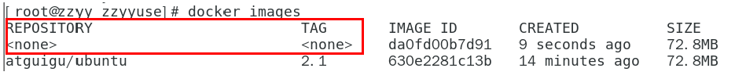

# Docker安装

* docker官网：http://www.docker.com
* Docker Hub官网：https://hub.docker.com

* docker三要素：镜像、容器、仓库

## 旧版本docker的卸载

卸载旧版本

旧版本的Docker被称为`docker`或`docker引擎`. 如果安装了这些，请卸载它们以及相关的依赖项。

```
 $ sudo yum remove docker \
                  docker-client \
                  docker-client-latest \
                  docker-common \
                  docker-latest \
                  docker-latest-logrotate \
                  docker-logrotate \
                  docker-engine
```

如果`yum`报告没有安装这些包。

内容`/var/lib/docker/`，其中包括图像、容器、卷和网络。

## docker安装

* 安装gcc
  * yum -y install gcc
  * yum -y install gcc-c++
* 安装需要的软件包
  * yum install -y yum-utils
* 设置stable镜像仓库
  * yum-config-manager --add-repo https://download.docker.com/linux/centos/docker-ce.repo
  * yum-config-manager --add-repo http://mirrors.aliyun.com/docker-ce/linux/centos/docker-ce.repo
* #更新yum软件包索引
  * yum makecache fast
* 安装DOCKER CE
  * yum -y install docker-ce docker-ce-cli containerd.io
* 启动docker
  * systemctl start docker 


* 运行`hello-world` image

```
docker run hello-world
```


* docker停止
  * systemctl stop docker 

## docker卸载

先停止运行docker

* yum remove docker-ce docker-ce-cli containerd.io
* rm -rf /var/lib/docker
* rm -rf /var/lib/containerd

## 镜像加速器


* 操作文档

```
sudo mkdir -p /etc/docker
sudo tee /etc/docker/daemon.json <<-'EOF'
{
  "registry-mirrors": ["https://u9ft1lw8.mirror.aliyuncs.com"]
}
EOF
sudo systemctl daemon-reload
sudo systemctl restart docker
```

## HelloWorld讲解

* docker run hello-world


输出这段提示以后，hello world就会停止运行，容器自动终止。

* run干了什么？


# Docker常用命令

## 帮助启动类命令

* 启动docker： 

```
systemctl start docker
```

* 停止docker：

```
systemctl stop docker
```

* 重启docker： 

```
systemctl restart docker
```

* 查看docker状态： 

```
systemctl status docker
```

* 开机启动： 

```
systemctl enable docker
```

* 查看docker概要信息： 

```
docker info
```

* 查看docker总体帮助文档：

```
docker --help
```

* 查看docker命令帮助文档： 

```
docker 具体命令 --help
```

## 镜像命令

* 列出本地主机上的镜像

```
docker images
docker images -a :列出本地所有的镜像（含历史映像层）
docker images -q :只显示镜像ID
```

* 镜像搜索

```
docker search redis  #去dockerhub搜索所有redis镜像
docker search --limit 5 redis   #只列出5个
```


* 镜像拉取

```
docker pull redis:版本 #拉取某个镜像，可以没有:默认拉取latest
```

* 查看镜像/容器/数据卷所占的空间

```
docker system df
```

* 删除镜像

```
docker rmi -f 镜像ID或者名字 #删除某个镜像，-f表示强制删除
docker rmi -f 镜像名1:TAG 镜像名2:TAG  #删除多个
docker rmi -f $(docker images -qa) #全部删除
```

* 谈谈docker虚悬镜像是什么？



仓库名、标签都是<none>的镜像，俗称虚悬镜像dangling image

后续Dockerfile章节再介绍，遇到建议直接删除

## 容器命令

有镜像才能创建容器，这是根本前提

* 新建+启动容器：docker run [OPTIONS] IMAGE [COMMAND] [ARG...]

```
 OPTIONS说明（常用）：有些是一个减号，有些是两个减号
 
--name="容器新名字"       为容器指定一个名称；
-d: 后台运行容器并返回容器ID，也即启动守护式容器(后台运行)；
 
-i：以交互模式运行容器，通常与 -t 同时使用；
-t：为容器重新分配一个伪输入终端，通常与 -i 同时使用；
也即启动交互式容器(前台有伪终端，等待交互)；
 
-P: 随机端口映射，大写P
-p: 指定端口映射，小写p

例子：docker run --name=redis1 -p 3306:3306 -d redis
```

* 列出当前运行的容器

```
docker ps

-a :列出当前所有正在运行的容器+历史上运行过的
-l :显示最近创建的容器。
-n：显示最近n个创建的容器。
-q :静默模式，只显示容器编号。
```

* 重启容器

```
docker restart 容器ID或者容器名
```

* 停止容器

```
docker stop 容器ID或者容器名
```

* 强制停止容器

```
docker kill 容器ID或容器名
```

* 退出容器

```
exit         run进去容器，exit退出，容器停止
ctrl+p+q     run进去容器，ctrl+p+q退出，容器不停止
```

* 删除已停止的容器

```
docker rm 容器ID
docker rm -f $(docker ps -a -q)
docker ps -a -q | xargs docker rm
```

* 启动守护式容器(后台服务器)

```
前台交互式启动: docker run -it redis:6.0.8
后台守护式启动: docker run -d redis:6.0.8
```

* 查看容器日志

```
docker logs 容器ID
```

* 查看容器内运行的进程

```
docker top 容器ID
```

* 查看容器内部细节

```
docker inspect 容器ID
```

* 进入容器内部：

```
docker exec -it 容器ID /bin/bash   attach 直接进入容器启动命令的终端，不会启动新的进程
								  用exit退出，会导致容器的停止。
docker attach 容器ID				 exec 是在容器中打开新的终端，并且可以启动新的进程
								  用exit退出，不会导致容器的停止。
```

* 从容器内拷贝文件到主机上

```
docker cp 容器ID:容器内路径 目的主机路径
```

* 导入和导出容器

```
docker export 容器ID > 文件名.tar
cat 文件名.tar | docker import - 镜像用户/镜像名:镜像版本号
```

# Docker镜像

* 镜像
  是一种轻量级、可执行的独立软件包，它包含运行某个软件所需的所有内容，我们把应用程序和配置依赖打包好形成一个可交付的运行环境(包括代码、运行时需要的库、环境变量和配置文件等)，这个打包好的运行环境就是image镜像文件。

  只有通过这个镜像文件才能生成Docker容器实例(类似Java中new出来一个对象)。

* 分层的镜像

  * 以我们的pull为例，在下载的过程中我们可以看到docker的镜像好像是在一层一层的在下载

    

* UnionFS（联合文件系统）
  * UnionFS（联合文件系统）：Union文件系统（UnionFS）是一种分层、轻量级并且高性能的文件系统，它支持对文件系统的修改作为一次提交来一层层的叠加，同时可以将不同目录挂载到同一个虚拟文件系统下(unite several directories into a single virtual filesystem)。Union 文件系统是 Docker 镜像的基础。镜像可以通过分层来进行继承，基于基础镜像（没有父镜像），可以制作各种具体的应用镜像。
  * 特性：一次同时加载多个文件系统，但从外面看起来，只能看到一个文件系统，联合加载会把各层文件系统叠加起来，这样最终的文件系统会包含所有底层的文件和目录

*  Docker镜像加载原理：

  *  docker的镜像实际上由一层一层的文件系统组成，这种层级的文件系统UnionFS。

  * bootfs(boot file system)主要包含bootloader和kernel, bootloader主要是引导加载kernel, Linux刚启动时会加载bootfs文件系统，在Docker镜像的最底层是引导文件系统bootfs。这一层与我们典型的Linux/Unix系统是一样的，包含boot加载器和内核。当boot加载完成之后整个内核就都在内存中了，此时内存的使用权已由bootfs转交给内核，此时系统也会卸载bootfs。

  * rootfs (root file system) ，在bootfs之上。包含的就是典型 Linux 系统中的 /dev, /proc, /bin, /etc 等标准目录和文件。rootfs就是各种不同的操作系统发行版，比如Ubuntu，Centos等等。 

    

  *  平时我们安装进虚拟机的CentOS都是好几个G，为什么docker这里才200M？？

    

  * 对于一个精简的OS，rootfs可以很小，只需要包括最基本的命令、工具和程序库就可以了，因为底层直接用Host的kernel，自己只需要提供 rootfs 就行了。由此可见对于不同的linux发行版, bootfs基本是一致的, rootfs会有差别, 因此不同的发行版可以公用bootfs。

* 为什么 Docker 镜像要采用这种分层结构呢?

  * 镜像分层最大的一个好处就是共享资源，方便复制迁移，就是为了复用。

    比如说有多个镜像都从相同的 base 镜像构建而来，那么 Docker Host 只需在磁盘上保存一份 base 镜像；
    同时内存中也只需加载一份 base 镜像，就可以为所有容器服务了。而且镜像的每一层都可以被共享。

* Docker镜像层都是只读的，容器层是可写的
  当容器启动时，一个新的可写层被加载到镜像的顶部。
  这一层通常被称作“容器层”，“容器层”之下的都叫“镜像层”。

## Docker镜像commit操作案例

* 首先拉取Ubuntu镜像，并且运行一个容器


* 在该容器中，外网连通的情况下，安装vim

```
apt-get update
apt-get -y install vim
```

* 安装完成后，我们commit该镜像

```
docker commit -m="提交的描述信息" -a="作者" 容器ID 要创建的目标镜像名:版本号
```


* 该镜像在原有的基础上多了vim的功能

* 总结

  * Docker中的镜像分层，支持通过扩展现有镜像，创建新的镜像。类似Java继承于一个Base基础类，自己再按需扩展。
    新镜像是从 base 镜像一层一层叠加生成的。每安装一个软件，就在现有镜像的基础上增加一层

  

## 本地镜像发布到阿里云


* 镜像的生成除了commit之外还可以使用dockerfile

* 创建容器镜像实例


* 创建命名空间：shyproject


* 创建镜像仓库


* 根据操作指南完成镜像发布阿里云


## 本地镜像发布到私有库

*  官方Docker Hub地址：https://hub.docker.com/，中国大陆访问太慢了且准备被阿里云取代的趋势，不太主流。
* Dockerhub、阿里云这样的公共镜像仓库可能不太方便，涉及机密的公司不可能提供镜像给公网，所以需要创建一个本地私人仓库供给团队使用，基于公司内部项目构建镜像。
* Docker Registry是官方提供的工具，可以用于构建私有镜像仓库

* 下载镜像Docker Registry

```
docker pull registry 
```

* 运行私有库Registry，相当于本地有个私有Docker hub

```
docker run -d -p 5000:5000  -v /shy/myregistry/:/tmp/registry --privileged=true registry
```

* curl验证私服库上有什么镜像

```
 curl -XGET http://192.168.111.162:5000/v2/_catalog
```


​	可以发现没有任何镜像上传过。

* 将新镜像shyubuntu:1.2修改符合私服规范的Tag

```
docker tag 镜像:Tag Host:Port/Repository:Tag
docker tag shyubuntu:1.2 192.168.78.128:5000/shyubuntu:1.2
```


* 修改配置文件使之支持http

```
vim命令新增如下红色内容：vim /etc/docker/daemon.json

{
  "registry-mirrors": ["https://aa25jngu.mirror.aliyuncs.com"],
  "insecure-registries": ["192.168.111.162:5000"]
}
```

* 重启docker

```
systemctl daemon-reload
systemctl restart docker
```

* push推送到私服库

```
docker push 127.0.0.1:5000/shyubuntu:1.2
```

* curl验证私服库上有什么镜像


# Docker容器数据卷

* --privileged=true

```
如果是CentOS7安全模块会比之前系统版本加强，不安全的会先禁止，所以目录挂载的情况被默认为不安全的行为，
在SELinux里面挂载目录被禁止掉了额，如果要开启，我们一般使用--privileged=true命令，扩大容器的权限解决挂载目录没有权限的问题，也即使用该参数，container内的root拥有真正的root权限，否则，container内的root只是外部的一个普通用户权限。
```

* 是什么?

```
将docker容器内的数据保存进宿主机的磁盘中
运行一个带有容器卷存储功能的容器实例
```

* 命令： docker run -it --privileged=true -v /宿主机绝对路径目录:/容器内目录 镜像名

* 作用：

```
将运用与运行的环境打包镜像，run后形成容器实例运行 ，但是我们对数据的要求希望是持久化的
 
Docker容器产生的数据，如果不备份，那么当容器实例删除后，容器内的数据自然也就没有了。
为了能保存数据在docker中我们使用卷。

特点：
1：数据卷可在容器之间共享或重用数据
2：卷中的更改可以直接实时生效，爽
3：数据卷中的更改不会包含在镜像的更新中
4：数据卷的生命周期一直持续到没有容器使用它为止
```

## 数据卷案例

* 创建并且运行一个Ubuntu实例，并且在容器与宿主机之间实现挂载。

```
 docker run -it --privileged=true -v /宿主机绝对路径目录:/容器内目录      镜像名
```

* 通过docker inspect 容器ID查看挂载相关信息


* 读写规则映射添加说明

  * 读写(默认)

  ```
   docker run -it --privileged=true -v /宿主机绝对路径目录:/容器内目录:rw 镜像名
   默认同上案例，默认就是rw
  ```

  * 只读

  ```
   docker run -it --privileged=true -v /宿主机绝对路径目录:/容器内目录:ro 镜像名
   此时容器内部对数据卷有读的权限，而没有写的权限，宿主机读与写的权限均有
  ```

## 卷的继承和共享

* 卷的继承和共享

```
docker run -it  --privileged=true --volumes-from 父类 镜像名
继承之后该容器与父类的容器数据卷信息是一样的
```

# Docker常规安装

## 安装tomcat

* 从docker hub上拉取tomcat镜像到本地

```
docker pull tomcat
```

* 使用tomcat镜像创建容器实例(也叫运行镜像)

```
docker run -it -p 8080:8080 tomcat
```

* 访问猫首页：发现会出现404

```
localhost:8080
```

* 原因：最新版10.x以后tomcat的webapps内已经置空，无法访问的界面，但是提供了webapps.dist，我们可以使用低版本的tomcat或者删去webapps将webapps.dist改为webapps

```
rm -r webapps
mv webapps.dist webapps
```

* 再次访问localhost:8080---成功

## 安装mysql

* 从docker hub上拉取mysql:5.7镜像到本地

```
docker pull mysql:5.7
```

* 运行容器

```
docker run -p 3306:3306 -e MYSQL_ROOT_PASSWORD=abc123 -d mysql:5.7
```

* 进入容器，客户端连接mysql

```
mysql -uroot -p
```

* 为了避免出现删库的情况，我们要使用数据卷挂载到mysql相关文件

```
docker run -d -p 3306:3306 --privileged=true 
-v /shy/mysql/log:/var/log/mysql 
-v /shy/mysql/data:/var/lib/mysql 
-v /shy/mysql/conf:/etc/mysql/conf.d 
-e MYSQL_ROOT_PASSWORD=123456  --name mysql mysql:5.7
```

## 安装redis

* 从docker hub上拉取redis镜像到本地

```
docker pull redis
```

* 创建redis.conf

```
/app/redis/redis.conf
```

* 运行redis容器

```
docker run  -p 6379:6379 --name myr3 --privileged=true -v /app/redis/redis.conf:/etc/redis/redis.conf -v /app/redis/data:/data -d redis:6.0.8 redis-server /etc/redis/redis.conf
```

