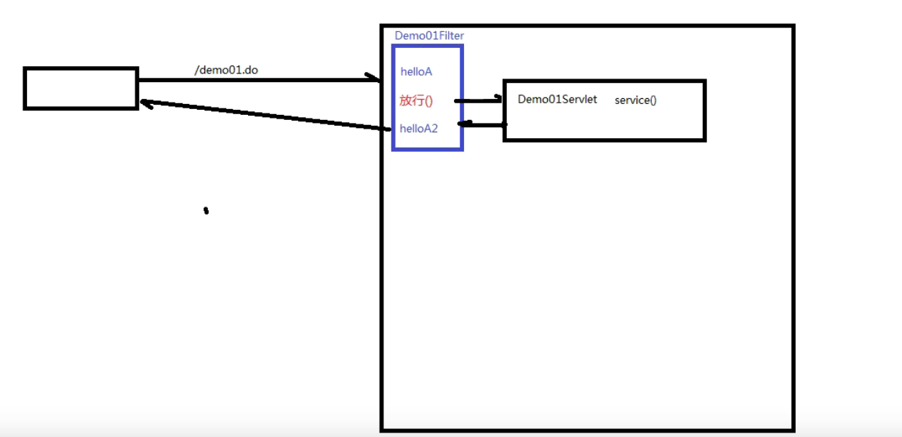

# Http（超文本传输协议）

## 请求数据格式

* 请求数据分为三部分：
  * 请求行： GET / HTTP/1.1	GET表示请求方式,/表示请求资源路径,HTTP/1.1表示协议版本。
  * 请求头：第二行开始，格式为key:value格式，请求头存放了许多浏览器端要告诉服务器的信息，比如：
    * 浏览器型号。
    * 浏览器版本。
    * 我能接收的内容的类型。
    * 我给你发的内容类型。
    * 内容长度。
    * ...
  * 请求体，根据请求方式不同有三种不同情况：
    * get方式：没有请求体，但是有一个queryString。
    * post方式：有请求体。
    * json格式，有请求体，request payload。

```txt
GET / HTTP/1.1
Host:www.itcast.cn
Connection:keep-alive
Cache-Control:max-age=0 Upgrade-Insecure-Requests:1
User-Agent:Mozilla/5.0 Chrome/91.04472.106
...
```

常见的请求头：

* Host：表示请求的主机名。
* User-Agent：浏览器版本。
* Accept：表示浏览器能接收的资源类型。
* ...

POST请求：最后一行用空格隔开。


* GET请求和POST请求的区别：
  * GET请求请求参数在请求行中，没有请求体，POST请求请求参数在请求体中。
  * GET请求请求参数大小有限制，POST没有。

## 响应数据格式

响应数据分为三部分：


* 响应行：

  * 协议版本
  * 响应状态码
  * 响应状态

* 响应头：第二行开始，格式为key：value形式

  响应头中会包含若干个属性，常见的HTTP响应头有:

  ```
  Content-Type：表示该响应内容的类型，例如text/html，image/jpeg；
  Content-Length：表示该响应内容的长度（字节数）；
  Content-Encoding：表示该响应压缩算法，例如gzip；
  Cache-Control：指示客户端应如何缓存，例如max-age=300表示可以最多缓存300秒
  ```

* 响应体： 最后一部分。存放响应数据

  上图中<html>...</html>这部分内容就是响应体，它和响应头之间有一个空行隔开。

### 响应状态码

| 状态码分类 | 说明                                                         |
| ---------- | ------------------------------------------------------------ |
| 1xx        | **响应中**——临时状态码，表示请求已经接受，告诉客户端应该继续请求或者如果它已经完成则忽略它 |
| 2xx        | **成功**——表示请求已经被成功接收，处理已完成                 |
| 3xx        | **重定向**——重定向到其它地方：它让客户端再发起一个请求以完成整个处理。 |
| 4xx        | **客户端错误**——处理发生错误，责任在客户端，如：客户端的请求一个不存在的资源，客户端未被授权，禁止访问等 |
| 5xx        | **服务器端错误**——处理发生错误，责任在服务端，如：服务端抛出异常，路由出错，HTTP版本不支持等 |

状态码大全：https://cloud.tencent.com/developer/chapter/13553 

### 常见的响应状态码

| 状态码 | 英文描述                               | 解释                                                         |
| ------ | -------------------------------------- | ------------------------------------------------------------ |
| 200    | **`OK`**                               | 客户端请求成功，即**处理成功**，这是我们最想看到的状态码     |
| 302    | **`Found`**                            | 指示所请求的资源已移动到由`Location`响应头给定的 URL，浏览器会自动重新访问到这个页面 |
| 304    | **`Not Modified`**                     | 告诉客户端，你请求的资源至上次取得后，服务端并未更改，你直接用你本地缓存吧。隐式重定向 |
| 400    | **`Bad Request`**                      | 客户端请求有**语法错误**，不能被服务器所理解                 |
| 403    | **`Forbidden`**                        | 服务器收到请求，但是**拒绝提供服务**，比如：没有权限访问相关资源 |
| 404    | **`Not Found`**                        | **请求资源不存在**，一般是URL输入有误，或者网站资源被删除了  |
| 428    | **`Precondition Required`**            | **服务器要求有条件的请求**，告诉客户端要想访问该资源，必须携带特定的请求头 |
| 429    | **`Too Many Requests`**                | **太多请求**，可以限制客户端请求某个资源的数量，配合 Retry-After(多长时间后可以请求)响应头一起使用 |
| 431    | **` Request Header Fields Too Large`** | **请求头太大**，服务器不愿意处理请求，因为它的头部字段太大。请求可以在减少请求头域的大小后重新提交。 |
| 405    | **`Method Not Allowed`**               | 请求方式有误，比如应该用GET请求方式的资源，用了POST          |
| 500    | **`Internal Server Error`**            | **服务器发生不可预期的错误**。服务器出异常了，赶紧看日志去吧 |
| 503    | **`Service Unavailable`**              | **服务器尚未准备好处理请求**，服务器刚刚启动，还未初始化好   |
| 511    | **`Network Authentication Required`**  | **客户端需要进行身份验证才能获得网络访问权限**               |

# Servlet

Servlet：server applet（运行在服务器端的小程序）。

Servlet就是一个接口，定义了java类被服务器访问到（tomcat识别）的规则。

* 快速入门：

  * 创建一个web项目，将其部署在tomcat服务器中。
  * 创建一个类，实现Servlet接口，实现相应的方法。

  ```java
  package com.shy.servlets;
  
  import javax.servlet.*;
  import java.io.IOException;
  
  public class demo1 implements Servlet {
      @Override
      public void init(ServletConfig servletConfig) throws ServletException {
  
      }
  
      @Override
      public ServletConfig getServletConfig() {
          return null;
      }
  
      @Override
      public void service(ServletRequest servletRequest, ServletResponse servletResponse) throws ServletException, IOException {
          System.out.println("这次必成功");
      }
  
      @Override
      public String getServletInfo() {
          return null;
      }
  
      @Override
      public void destroy() {
  
      }
  }
  ```

  * 配置servlet。

  ```xml
  <?xml version="1.0" encoding="UTF-8"?>
  <web-app xmlns="http://xmlns.jcp.org/xml/ns/javaee"
           xmlns:xsi="http://www.w3.org/2001/XMLSchema-instance"
           xsi:schemaLocation="http://xmlns.jcp.org/xml/ns/javaee http://xmlns.jcp.org/xml/ns/javaee/web-app_3_1.xsd"
           version="3.1">
      <servlet>
          <servlet-name>demo1</servlet-name>
          <servlet-class>com.shy.servlets.demo1</servlet-class>
      </servlet>
      <servlet-mapping>
          <servlet-name>demo1</servlet-name>
          <url-pattern>/demo1</url-pattern>
      </servlet-mapping>
  </web-app>
  ```

  * 启动tomcat，进行访问。

## Servlet注解配置

```java
@WebServlet(urlPatterns = "/demo1")
//@WebServlet("/demo1")
//多个url@WebServlet({"/demo1"，"ddemo1"})
//@WebServlet("/*")
//@WebServlet("*.do")
public class demo1 implements Servlet{
    service().....
}
```

## Servlet的执行原理

* 当服务器端接受到浏览器端的请求后，会解析URL路径，获取访问的Servlet的资源路径。
* 查找web.xml文件，是否有对应的<url-pattern>标签题内容。
* 如果有，则会找到对应的<servlet-class>全类名。
* tomcat会将字节码文件加载进内存，并且创建其对象。
* 调用相应方法。

## Servlet的继承关系

* javax.servlet.Servlet接口

  * javax.servlet.GenericServlet抽象类
    * javax.servlet.http.HttpServlet抽象子类

* Servlet接口中的相关方法：

  * void init(); 初始化方法

  * void service(request,response); 服务方法

    * 当浏览器端发送请求时tomcat容器会调用service();
    * service(); 会先获取浏览器端的请求方式：String Method = request.getMethod();
    * 使用条件语句判断是哪种请求方式（如post请求方式），调用响应的doXxx();（如doPost();）
    * 在HttpServlet这个抽象类中，doXxx(); 已经重写，所有的doXxx(); 十分类似，会报405错误，例如：

    ~~~java
    protected void doPost(HttpServletRequest req, HttpServletResponse resp) throws ServletException, IOException {
            String protocol = req.getProtocol();
            String msg = lStrings.getString("http.method_post_not_supported");
            if (protocol.endsWith("1.1")) {
                resp.sendError(405, msg);
            } else {
                resp.sendError(400, msg);
            }
    
        }
    ~~~

  * void destory(); 销毁方法

## Servlet的生命周期

Servlet的生命周期对应三个servlet三个方法：init(); service(); destory();

* 默认情况下：
  * 第一次接收请求时，容器会实例化Servlet、初始化、然后服务（调用Servlet的构造器，调用init(); service();）。
  * 从第二次请求开始，每一次都会进行一次服务（调用service();）。
  * 当容器关闭时，其中所有的Servlet实例会被销毁（调用destory();）。

* 默认情况下的优势与劣势：
  * 优点：第一次请求tomcat回去实例化，初始化，再进行服务，可以提高系统的启动速度。
  * 缺点：第一次请求的耗时较长。
  
* 结论：如果需要提高系统的启动速度，使用默认情况，如果需要提高响应速度，一个更改Servlet的初始化时机：

* 修改Servlet的初始化时机：
  
  * 通过<load-on-startup>来设置servlet启动的先后顺序，数字越小，启动越靠前，最小值为0，设置之后，会在容器启动的时候进行Servlet的实例化和初始化，而不是服务器第一次发送请求时进行实例化和初始化。
  
  ```xml
  <?xml version="1.0" encoding="UTF-8"?>
  <web-app xmlns="http://xmlns.jcp.org/xml/ns/javaee"
           xmlns:xsi="http://www.w3.org/2001/XMLSchema-instance"
           xsi:schemaLocation="http://xmlns.jcp.org/xml/ns/javaee http://xmlns.jcp.org/xml/ns/javaee/web-app_3_1.xsd"
           version="3.1">
      <servlet>
          <servlet-name>demo1</servlet-name>
          <servlet-class>com.shy.servlets.demo1</servlet-class>
          <load-on-startup>1</load-on-startup><!-- 默认为-1，如果要在服务器启动时创建，则应该为正数或者0 -->
      </servlet>
      <servlet-mapping>
          <servlet-name>demo1</servlet-name>
          <url-pattern>/demo1</url-pattern>
      </servlet-mapping>
  </web-app>
  ```
  
* Servlet在容器中是：单例的、线程不安全的。

* Servlet接口中的其他方法：

  * ServletConfig(); 获取ServletConfig对象：Servlet的配置信息。
  * getServletInfo(); 获取Servlet的一些信息，版本，作者等。。

## request

### request对象的继承体系结构

* ServletRequest ---接口
  * HttpServletRequest ---接口
    * org.apache.catalina.connector.RequestFacade类（由tomcat帮助我们创建，将请求数据封装在其中）

URL和URI：

* URL：统一资源定位符
* URI：统一资源标识符

### 常用方法

* String getParameter(String name); 根据参数名称获取参数值。
* String getParameterValues(String name); 根据参数名获取所有参数值，返回数组。
* Enumeration<String> String getParameterNames(); 获取所有请求的参数名。
* Map<String,String[]> getParameterMap(); 获取所有参数的map集合。

### 中文乱码问题

* get方式获取到的参数值不会出现乱码问题。

* post方式会发生乱码。

  * 解决乱码问题：

    request.setCharacterEncoding("utf-8");//与页面的编码相同

### request域中的共享数据

域对象：有一个有作用范围的对象，可以在范围内共享数据。

request域：代表一次请求的范围，一般用于请求转发多个资源中的共享数据。

* void setAttribute(String name,Object obj); 存储数据name-obj对。
* Object getAttribute(String name); 通过name获取值。
* void removeAttribute(String name); 通过name移除键值对。

## response

使用response输出内容到浏览器端：

* PrintWriter pw = response.getWriter();
* pw.write("<h1>12345</h1>>");

### response中文乱码问题

* tomcat服务器默认的字符集为IOS-8859-1，浏览器端为GBK。
* 因此在向浏览器端输出数据时必须改变tomcat服务器的字符集。
  * response.setCharacterEncoding("GBK");
* 也可以改变浏览器端的解码方式：
  * response.setHeader("context-type","text/html;charset=utf-8");
  * response.setContextType("text/html;charset=utf-8");

## ServletContext

* 获取：
  * request.getServletContext(); 通过request对象获取。
  * this.getServletContext(); 通过HttpServlet获取。
* 功能：
  * 获取MIME类型.......
  * 作为一个域对象，有相应的三个Attribute(); 对象的作用范围为：所有用户的所有请求。
  * 获取文件服务器路径.............

# Filter



* Filter（过滤器）也属于Servlet规范。
* Filter开发规范：
  * 新建一个类实现Filter接口，实现init(); doFilter(); destroy();
  * 配置Filter：
    * 使用注解@WebFilter(value = "") 
    * 在web.xml中使用标签<filter>和<filter-mapping>

```java
package com.shy.servlets;

import javax.servlet.ServletException;
import javax.servlet.annotation.WebServlet;
import javax.servlet.http.HttpServlet;
import javax.servlet.http.HttpServletRequest;
import javax.servlet.http.HttpServletResponse;
import java.io.IOException;
@WebServlet("/Servlet1")
public class Servlet1 extends HttpServlet {

    @Override
    protected void service(HttpServletRequest request, HttpServletResponse response) throws ServletException, IOException {
        System.out.println("service...");
        request.getRequestDispatcher("index.html").forward(request,response);
    }
}
```

```html
<!DOCTYPE html>
<html lang="en">
<head>
    <meta charset="UTF-8">
    <title>Title</title>
</head>
<body>
<h1>hello!</h1>
</body>
</html>
```

```java
package com.shy.Filters;

import javax.servlet.*;
import javax.servlet.annotation.WebFilter;
import java.io.IOException;
@WebFilter("/Servlet1")
public class Filter1 implements Filter {
    @Override
    public void init(FilterConfig filterConfig) throws ServletException {

    }

    @Override
    public void doFilter(ServletRequest servletRequest, ServletResponse servletResponse, FilterChain filterChain) throws IOException, ServletException {
        //请求放行之前执行的操作。
        System.out.println("filter1......");
        //放行请求
        filterChain.doFilter(servletRequest,servletResponse);
        //响应放行执行的操作
        System.out.println("filter2......");
    }

    @Override
    public void destroy() {

    }
}
```

* 过滤器链：一个Servlet有多个过滤器，会依次进行过滤。

  

  * 默认的执行顺序是按照类名的先后顺序。
  * 在web.xml中注册的过滤器会按照注册的顺序执行。

过滤器一：

```java
package com.shy.Filters;

import javax.servlet.*;
import javax.servlet.annotation.WebFilter;
import java.io.IOException;
@WebFilter("/Servlet1")
public class Filter1 implements Filter {
    @Override
    public void init(FilterConfig filterConfig) throws ServletException {

    }

    @Override
    public void doFilter(ServletRequest servletRequest, ServletResponse servletResponse, FilterChain filterChain) throws IOException, ServletException {
        //请求放行之前执行的操作。
        System.out.println("A1");
        //放行请求
        filterChain.doFilter(servletRequest,servletResponse);
        //响应放行执行的操作
        System.out.println("A2");
    }

    @Override
    public void destroy() {

    }
}
```

过滤器二：

```java
package com.shy.Filters;

import javax.servlet.*;
import javax.servlet.annotation.WebFilter;
import java.io.IOException;

@WebFilter("/Servlet1")
public class Filter2 implements Filter {
    @Override
    public void init(FilterConfig filterConfig) throws ServletException {

    }

    @Override
    public void doFilter(ServletRequest servletRequest, ServletResponse servletResponse, FilterChain filterChain) throws IOException, ServletException {
        //请求放行之前执行的操作。
        System.out.println("B1");
        //放行请求
        filterChain.doFilter(servletRequest,servletResponse);
        //响应放行执行的操作
        System.out.println("B2");
    }

    @Override
    public void destroy() {

    }
}
```

过滤器三：

```java
package com.shy.Filters;

import javax.servlet.*;
import javax.servlet.annotation.WebFilter;
import java.io.IOException;

@WebFilter("/Servlet1")
public class Filter3 implements Filter {
    @Override
    public void init(FilterConfig filterConfig) throws ServletException {

    }

    @Override
    public void doFilter(ServletRequest servletRequest, ServletResponse servletResponse, FilterChain filterChain) throws IOException, ServletException {
        //请求放行之前执行的操作。
        System.out.println("C1");
        //放行请求
        filterChain.doFilter(servletRequest,servletResponse);
        //响应放行执行的操作
        System.out.println("C2");
    }

    @Override
    public void destroy() {

    }
}
```


servlet:

```java
package com.shy.servlets;

import javax.servlet.ServletException;
import javax.servlet.annotation.WebServlet;
import javax.servlet.http.HttpServlet;
import javax.servlet.http.HttpServletRequest;
import javax.servlet.http.HttpServletResponse;
import java.io.IOException;
@WebServlet("/Servlet1")
public class Servlet1 extends HttpServlet {

    @Override
    protected void service(HttpServletRequest request, HttpServletResponse response) throws ServletException, IOException {
        System.out.println("service...");
        request.getRequestDispatcher("index.html").forward(request,response);
    }
}
```

# Listener

* Listener(监听器)：

  * 监听器：专门用于对其他对象身上发生的事件或状态改变进行监听和相应处理的对象，当被监视的对象发生情况时，立即采取相应的行动。 **Servlet监听器**：Servlet规范中定义的一种特殊类，它用于监听Web应用程序中的ServletContext，HttpSession 和HttpServletRequest等域对象的创建与销毁事件，以及监听这些域对象中的属性发生修改的事件。

* 分类：

  ----------------------

  1.ServletContextListener

  作用：监听ServletContext对象的创建与销毁

  | 方法名                                      | 作用                     |
  | ------------------------------------------- | ------------------------ |
  | contextInitialized(ServletContextEvent sce) | ServletContext创建时调用 |
  | contextDestroyed(ServletContextEvent sce)   | ServletContext销毁时调用 |

  ServletContextEvent对象代表从ServletContext对象身上捕获到的事件，通过这个事件对象我们可以获取到ServletContext对象。

  ----------------

  2.HttpSessionListener

  作用：监听HttpSession对象的创建与销毁

  | 方法名                                 | 作用                      |
  | -------------------------------------- | ------------------------- |
  | sessionCreated(HttpSessionEvent hse)   | HttpSession对象创建时调用 |
  | sessionDestroyed(HttpSessionEvent hse) | HttpSession对象销毁时调用 |

  HttpSessionEvent对象代表从HttpSession对象身上捕获到的事件，通过这个事件对象我们可以获取到触发事件的HttpSession对象。

  -------------

  3.ServletRequestListener

  作用：监听ServletRequest对象的创建与销毁

  | 方法名                                      | 作用                         |
  | ------------------------------------------- | ---------------------------- |
  | requestInitialized(ServletRequestEvent sre) | ServletRequest对象创建时调用 |
  | requestDestroyed(ServletRequestEvent sre)   | ServletRequest对象销毁时调用 |

  ServletRequestEvent对象代表从HttpServletRequest对象身上捕获到的事件，通过这个事件对象我们可以获取到触发事件的HttpServletRequest对象。另外还有一个方法可以获取到当前Web应用的ServletContext对象。

  -------------------

  4.ServletContextAttributeListener

  作用：监听ServletContext中属性的创建、修改和销毁

  | 方法名                                               | 作用                                 |
  | ---------------------------------------------------- | ------------------------------------ |
  | attributeAdded(ServletContextAttributeEvent scab)    | 向ServletContext中添加属性时调用     |
  | attributeRemoved(ServletContextAttributeEvent scab)  | 从ServletContext中移除属性时调用     |
  | attributeReplaced(ServletContextAttributeEvent scab) | 当ServletContext中的属性被修改时调用 |

  ServletContextAttributeEvent对象代表属性变化事件，它包含的方法如下：

  | 方法名              | 作用                     |
  | ------------------- | ------------------------ |
  | getName()           | 获取修改或添加的属性名   |
  | getValue()          | 获取被修改或添加的属性值 |
  | getServletContext() | 获取ServletContext对象   |

  ---------------------

  5.HttpSessionAttributeListener

  作用：监听HttpSession中属性的创建、修改和销毁

  | 方法名                                        | 作用                              |
  | --------------------------------------------- | --------------------------------- |
  | attributeAdded(HttpSessionBindingEvent se)    | 向HttpSession中添加属性时调用     |
  | attributeRemoved(HttpSessionBindingEvent se)  | 从HttpSession中移除属性时调用     |
  | attributeReplaced(HttpSessionBindingEvent se) | 当HttpSession中的属性被修改时调用 |

  HttpSessionBindingEvent对象代表属性变化事件，它包含的方法如下：

  | 方法名       | 作用                          |
  | ------------ | ----------------------------- |
  | getName()    | 获取修改或添加的属性名        |
  | getValue()   | 获取被修改或添加的属性值      |
  | getSession() | 获取触发事件的HttpSession对象 |

  -------------------

  6.ServletRequestAttributeListener

  作用：监听ServletRequest中属性的创建、修改和销毁

  | 方法名                                               | 作用                                 |
  | ---------------------------------------------------- | ------------------------------------ |
  | attributeAdded(ServletRequestAttributeEvent srae)    | 向ServletRequest中添加属性时调用     |
  | attributeRemoved(ServletRequestAttributeEvent srae)  | 从ServletRequest中移除属性时调用     |
  | attributeReplaced(ServletRequestAttributeEvent srae) | 当ServletRequest中的属性被修改时调用 |

  ServletRequestAttributeEvent对象代表属性变化事件，它包含的方法如下：

  | 方法名               | 作用                             |
  | -------------------- | -------------------------------- |
  | getName()            | 获取修改或添加的属性名           |
  | getValue()           | 获取被修改或添加的属性值         |
  | getServletRequest () | 获取触发事件的ServletRequest对象 |

  7.HttpSessionBindingListener

  .............

  8.HttpSessionActivationListener

  ..............

# 会话

## session

Http是无状态的理解：

Http无状态：

* 服务器无法判断这两次请求是同一个客户端发过来的，还是不同客户端发过来的。
* 无状态带来的现实问题：第一次请求是添加商品到购物车，第二次请求是结账；如果这两次请求服务器无法区分是同一个用户的，那么就会导致混乱。
* 通过会话跟踪技术解决Http无状态问题。

会话跟踪技术：

* 客户端第一次发请求给服务器，服务器获取session，获取不到，则创建新的，然后响应给服务器端。
* 下次客户端给服务器发请求时，会把sessionID带给服务器。
* 常用方法：
  * request.getSession(); 获取当前的会话，没有则创建一个。
  * request.getSession(true); 效果和不带参数相同。
  * request.getSession(false); 获取当前会话，没有则返回null，不会创建新的。
  * session.getId(); 获取sessionID.
  * session.isNew(); 判断当前session是否为新创建的。
  * session.setMaxInactiveInterval(); 设置session的非激活间隔时长，默认为1800s.
  * session.invalidate(); 让会话失效。

```java
package com.shy.servlets;

import jakarta.servlet.ServletException;
import jakarta.servlet.http.HttpServlet;
import jakarta.servlet.http.HttpServletRequest;
import jakarta.servlet.http.HttpServletResponse;
import jakarta.servlet.http.HttpSession;

import java.io.IOException;

public class demo1 extends HttpServlet {
    @Override
    protected void service(HttpServletRequest request, HttpServletResponse response) throws ServletException, IOException {
        HttpSession session = request.getSession();
        System.out.println(session.getId());

    }
}
```

```xml
	<servlet>
        <servlet-name>demo1</servlet-name>
        <servlet-class>com.shy.servlets.demo1</servlet-class>
    </servlet>
    <servlet-mapping>
        <servlet-name>demo1</servlet-name>
        <url-pattern>/demo1</url-pattern>
    </servlet-mapping>
```

## session保存作用域

* session保存作用域是和具体的某个session对应的。
* 常用的API：
  * void session.setAttribute(k,v);
  * Object session.getAttribute(k);
  * void removeAttribute(k);

~~~java
package com.shy.servlets;

import jakarta.servlet.ServletException;
import jakarta.servlet.http.HttpServlet;
import jakarta.servlet.http.HttpServletRequest;
import jakarta.servlet.http.HttpServletResponse;
import jakarta.servlet.http.HttpSession;

import java.io.IOException;

public class demo2 extends HttpServlet {
    @Override
    protected void service(HttpServletRequest request, HttpServletResponse response) throws ServletException, IOException {
        HttpSession session = request.getSession();
        session.setAttribute("lname","Jerry");
    }
}
~~~

~~~java
package com.shy.servlets;

import jakarta.servlet.ServletException;
import jakarta.servlet.http.HttpServlet;
import jakarta.servlet.http.HttpServletRequest;
import jakarta.servlet.http.HttpServletResponse;

import java.io.IOException;

public class demo3 extends HttpServlet {
    @Override
    protected void service(HttpServletRequest req, HttpServletResponse resp) throws ServletException, IOException {
        Object lname = req.getSession().getAttribute("lname");
        System.out.println(lname);
    }
}
~~~

~~~xml
<servlet>
        <servlet-name>demo2</servlet-name>
        <servlet-class>com.shy.servlets.demo2</servlet-class>
    </servlet>
    <servlet-mapping>
        <servlet-name>demo2</servlet-name>
        <url-pattern>/demo2</url-pattern>
    </servlet-mapping>

    <servlet>
        <servlet-name>demo3</servlet-name>
        <servlet-class>com.shy.servlets.demo3</servlet-class>
    </servlet>
    <servlet-mapping>
        <servlet-name>demo3</servlet-name>
        <url-pattern>/demo3</url-pattern>
    </servlet-mapping>
~~~

## cookie

cookie是客户端会话技术，将数据保存到客户端

简单使用步骤：

* 创建cookie对象，绑定数据。
  * new Cookie(String name,String value);
* 服务器端发送cookie对象。
  * response.addCookie(Cookie cookie);
* 服务器端获取取cookie对象。
  * Cookie[] cookies = request.getCookies();
* cookie的两个方法：
  * getName();
  * getValue();

cookie的注意点：

* 可以创建多个cookie对象，调用response.addCookie(); 发送多个cookie。
* cookie存储与服务器无关，即：服务器关闭cookie可以存在。
* cookie的存活时间：
  * 默认情况下，当浏览器关闭后，cookie数据被销毁。
  * 通过cookie.setMaxAge(int second); 设置cookie的存活时间。
    * 正数：将cookie持久化到硬盘，second秒之后删除cookie数据。
    * 负数：默认情况，关闭浏览器之后cookie被销毁。
    * 零：删除cookie。
* cookie中文乱码问题：
  * tomcat服务器8之后不会出现中文乱码。
  * tomcat服务器8之前不支持：
    * 需要进行转码..........
* 同一个tomcat服务器下部署多个web项目的cookie的共享问题：
  * 默认情况下：多个web项目之间不能共享cookie。
  * cookie.setPath("/"); 设置之后在多个web项目之间可以共享该cookie。

# 服务器端转发和客户端重定向

* 服务器端的转发操作：request.getReyuestDispatcher("...").forward(request,response);

  * 该过程只是一次请求响应的过程，对于浏览器端而言，内部经过了多少次转发，浏览器端是不知道的，

    因此浏览器端的url是没有变化的。

* 客户端重定向操作：response.sendRedirect("...");

  * 两次请求响应的过程，浏览器端知道URL有变化，因此地址栏有变化。

web.xml中进行注册：

~~~xml
	<servlet>
        <servlet-name>demo1</servlet-name>
        <servlet-class>com.shy.servlets.demo1</servlet-class>
    </servlet>
    <servlet-mapping>
        <servlet-name>demo1</servlet-name>
        <url-pattern>/demo1</url-pattern>
    </servlet-mapping>
    <servlet>
        <servlet-name>demo2</servlet-name>
        <servlet-class>com.shy.servlets.demo2</servlet-class>
    </servlet>
    <servlet-mapping>
        <servlet-name>demo2</servlet-name>
        <url-pattern>/demo2</url-pattern>
    </servlet-mapping>
~~~

服务器端的转发操作：服务器端dome1接收请求并且转发至dome2。

客户端重定向操作：服务器端dome1收到请求，返回给浏览器端，让其向服务器端的dome2发送请求。

~~~java
package com.shy.servlets;

import javax.servlet.ServletException;
import javax.servlet.http.HttpServlet;
import javax.servlet.http.HttpServletRequest;
import javax.servlet.http.HttpServletResponse;
import java.io.IOException;

public class demo1 extends HttpServlet {
    @Override
    protected void service(HttpServletRequest request, HttpServletResponse response) throws ServletException, IOException {
        
        //System.out.println("服务器内部转发至demo2");
        //request.getRequestDispatcher("demo2").forward(request,response);
        
        System.out.println("服务器响应浏览器端让浏览器端向dome2发送请求");
        response.sendRedirect("demo2");
    }
}
~~~

demo2收到请求转发至此。

~~~java
package com.shy.servlets;

import javax.servlet.ServletException;
import javax.servlet.http.HttpServlet;
import javax.servlet.http.HttpServletRequest;
import javax.servlet.http.HttpServletResponse;
import java.io.IOException;

public class demo2 extends HttpServlet {
    @Override
    protected void service(HttpServletRequest request, HttpServletResponse response) throws ServletException, IOException {
        System.out.println("被转发至此");
    }
}
~~~

# AJAX简单使用

```javascript
//核心对象的创建
var xhttp;
if (window.XMLHttpRequest) {
    xhttp = new XMLHttpRequest();
    } else {
    // code for IE6, IE5
     xhttp = new ActiveXObject("Microsoft.XMLHTTP");
}

//发送请求
xhttp.open("请求方式", "请求路径", true);//true为异步请求，false为同步请求
xhttp.send();

//获取响应
xhttp.onreadystatechange = function() {
        if (this.readyState == 4 && this.status == 200) {
            //获取完响应进行的操作
            if(this.responseText="true")...
       }
    };
```

# Axios简单使用

* 引入axios.js文件。

```html
<script src="js/axiox-0.18.0.js"></script>
```

* 示例一：发送get请求：

```javascript
axios({
    method:"get",
    url:"路径"
    }).then(function(response){//response为响应的数据
    //...一系列操做
    })
```

* 发送post请求：

```javascript
axios({
    method:"post",
    url:"路径"
    data:"响应体：username=zhangsan"
    }).then(function(response){//response为响应的数据
    //...一系列操做
    })
```

## 使用Axios的别名发送请求

* 发送get请求：

```javascript
axios.get("url")
    .then(function(response){//response为响应的数据
    var data = response.data;
    //...一系列操做
    })
```

* 发送post请求：

```javascript
axios.post("url","请求参数：username=zhangsan")
    .then(function(response){//response为响应的数据
    var data = response.data;
    //...一系列操做
    })
```

# JSON

## JSON对象的定义与调用

```javascript
//定义json对象
var josn = {
    "name":"zhangsan",
    "age":23,
    "address":["西安","北京","上海"]
};

//调用json对象的属性：
var name = josn.name;
alert(name);
```

## JSON数据和java对象之间的转换

* 引入fastjson依赖

```xml
<dependency>
    <groupId>com.alibaba</groupId>
    <artifactId>fastjson</artifactId>
    <version>1.2.75</version>
</dependency>
```

* 创建java对象

```java
package com.shy.beans;

public class Person {
    private String name;
    private Integer age;

    @Override
    public String toString() {
        return "Person{" +
                "name='" + name + '\'' +
                ", age=" + age +
                '}';
    }

    public Person(String name, Integer age) {
        this.name = name;
        this.age = age;
    }

    public String getName() {
        return name;
    }

    public void setName(String name) {
        this.name = name;
    }

    public Integer getAge() {
        return age;
    }

    public void setAge(Integer age) {
        this.age = age;
    }
}
```

* 测试

```java
package com.shy.test;

import com.alibaba.fastjson.JSON;
import com.shy.beans.Person;

public class MainTest1 {
    public static void main(String[] args) {
        Person person = new Person("Tom", 23);
        //转换为JSON的字符串
        String jsonString = JSON.toJSONString(person);
        System.out.println(jsonString);//{"age":23,"name":"Tom"}
        //将JSON的字符串转换为java对象
        Person person1 = JSON.parseObject(jsonString, Person.class);
        System.out.println(person1);//Person{name='Tom', age=23}
    }
}
```

# vue简单使用

```html
<!DOCTYPE html>
<html lang="en">
<head>
    <meta charset="UTF-8">
    <title>Title</title>
</head>
<body>
<div id="app">
    <input v-model="username">
<!--插值表达式-->
    {{username}}
</div>

<!--/引入vue.js-->
<script src="js/vue.js"></script>
<script>
    var vue = new Vue({
        el:"#app",
        data:{
            username:""
        }
    });


</script>
</body>
</html>
```

## vue常用指令

* v-bind：为html标签绑定属性值，如href，css样式等。
* v-bind可以省略

```html
<!DOCTYPE html>
<html lang="en">
<head>
    <meta charset="UTF-8">
    <title>Title</title>
</head>
<body>
<div id="app">
    <input type="text" v-bind:value="username">
</div>


<script src="js/vue.js"></script>
<script>
    var vue = new Vue({
        el:"#app",
        data:{
            username:"123"
        }
    });

</script>
</body>
</html>
```

* v-model：双向绑定
* :value可以省略

```html
<!DOCTYPE html>
<html lang="en">
<head>
    <meta charset="UTF-8">
    <title>Title</title>
</head>
<body>
<div id="app">
    <input type="text" v-model:value="username">
    <p>{{username}}</p>
</div>


<script src="js/vue.js"></script>
<script>
    var vue = new Vue({
        el:"#app",
        data:{
            username:"123"
        }
    });

</script>
</body>
</html>
```

* v-if
* v-else
* v-if与v-else之间不能有其他节点。

```html
<!DOCTYPE html>
<html lang="en">
<head>
    <meta charset="UTF-8">
    <title>Title</title>
</head>
<body>
<div id="app">
    <input type="text" v-model="num">
    <div v-if="num%2==0" style="width:200px;height:200px;background-color: black">&nbsp;</div>
    <div v-else="num%2==0" style="width:200px;height:200px;background-color: black">&nbsp;</div>

</div>

<script src="js/vue.js"></script>
<script>
    var vue = new Vue({
        el:"#app",
        data:{
            username:"123",
            num:2
        }
    });

</script>
</body>
</html>
```

* v-show：通过display控制标签的是否展示，标签实际都存在。

```html
<!DOCTYPE html>
<html lang="en">
<head>
    <meta charset="UTF-8">
    <title>Title</title>
</head>
<body>
<div id="app">
    <input type="text" v-model="num">
    <div v-show="num%2==0" style="width:200px;height:200px;background-color: black">&nbsp;</div>
</div>

<script src="js/vue.js"></script>
<script>
    var vue = new Vue({
        el:"#app",
        data:{
            username:"123",
            num:2
        }
    });

</script>
</body>
</html>
```

* v-for：用于循环。

```html
<!DOCTYPE html>
<html lang="en">
<head>
    <meta charset="UTF-8">
    <title>Title</title>
</head>
<body>
<div id="app">
    <table>
        <tr v-for="fruit in fruitList">
            <td>{{fruit.fname}}</td>
            <td>{{fruit.price}}</td>
            <td>{{fruit.count}}</td>
            <td>{{fruit.remark}}</td>
        </tr>
    </table>
</div>

<script src="js/vue.js"></script>
<script>
    var vue = new Vue({
        el:"#app",
        data:{
            username:"123",
            num:2,
            fruitList:[
                {fname:"苹果",price:5,count:100,remark:"苹果很好吃"},
                {fname:"香蕉",price:3,count:102,remark:"香蕉很好吃"},
                {fname:"樱桃",price:1,count:120,remark:"樱桃很好吃"},
                {fname:"西瓜",price:4,count:103,remark:"西瓜很好吃"}
            ]
        }
    });
</script>
</body>
</html>
```

* v-on:为标签绑定事件

```html
<!DOCTYPE html>
<html lang="en">
<head>
    <meta charset="UTF-8">
    <title>Title</title>
</head>
<body>
<div id="app">
    <input type="button" value="我是一个按钮" v-on:click="show">
</div>

<script src="js/vue.js"></script>
<script>
    var vue = new Vue({
        el:"#app",
        data:{
            username:""
        },
        methods:{
            show:function () {
                alert("我被点击了")
            }
        }
    });
</script>
</body>
</html>
```

