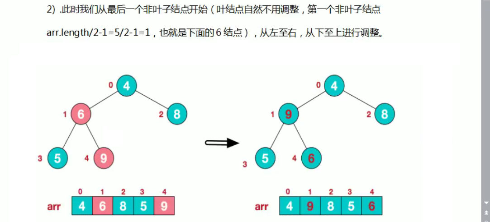
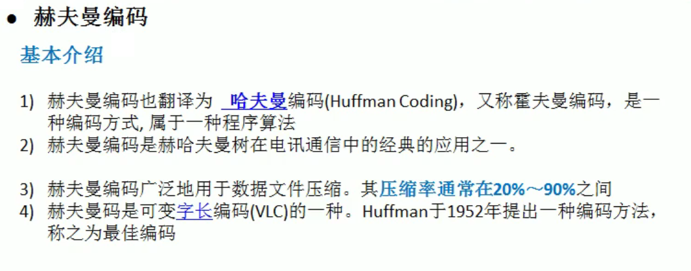

# 算法空间与时间复杂度

* 大O记法
  * 用常数1取代运行时间中的所有加法常数；
  * 在修改后的运行次数中，只保留高阶项；
  * 如果最高阶项存在，且常数因子不为1，则去除与这个项相乘的常数；

* 由于java中有内存垃圾回收机制，并且jvm对程序的内存占用也有优化（例如即时编译），我们无法精确的评估一个java程序的内存占用情况，但是了解了java的基本内存占用，使我们可以对java程序的内存占用情况进行估算。
* 由于现在的计算机设备内存一般都比较大，基本上个人计算机都是4G起步，大的可以达到32G，所以内存占用一般情况下并不是我们算法的瓶颈，普通情况下直接说复杂度，默认为算法的时间复杂度。但是，如果你做的程序是嵌入式开发，尤其是一些传感器设备上的内置程序，由于这些设备的内存很小，一般为几kb，这个时候对算法的空间复杂度就有要求了，但是一般做java开发的，基本上都是服务器开发，一般不存在这样的问题。

# 排序

## 冒泡排序

```java
import java.util.Arrays;

public class Bubble {
    public static void main(String[] args) {
        Integer[] integers = {9, 2, 3, 9, 1};
        Comparable[] comparables = bubble(integers);
        System.out.println(Arrays.toString(comparables));
    }


    public static Comparable[] bubble(Comparable[] comparables) {
        for (int i = 0; i < comparables.length - 1; i++) {
            for (int j = 0; j < comparables.length - 1 - i; j++) {
                if(compare(comparables[j],comparables[j+1])){
                    change(comparables,j,j+1);
                }
            }
        }
        return comparables;
    }

    private static boolean compare(Comparable a,Comparable b) {
        return a.compareTo(b)>0;
    }

    private static void change(Comparable[] comparables,int i,int j) {
        Comparable tmp;
        tmp = comparables[i];
        comparables[i] = comparables[j];
        comparables[j] = tmp;
    }
}
```

* 时间复杂度：O(n^2)

## 选择排序

```java
import java.util.Arrays;

public class Selection {
    public static void main(String[] args) {
        Integer[] integers = {9, 2, 324, 12, 5};
        Comparable[] comparables = selection(integers);
        System.out.println(Arrays.toString(comparables));
    }


    public static Comparable[] selection(Comparable[] comparables) {
        for (int i = 0; i < comparables.length - 1; i++) {
            int minIndex = i;
            for (int j = i+1; j < comparables.length; j++) {
                if (compare(comparables[minIndex],comparables[j])){
                    minIndex = j;
                }
            }
            change(comparables,i,minIndex);
        }
        return comparables;
    }

    private static boolean compare(Comparable a,Comparable b) {
        return a.compareTo(b)>0;
    }

    private static void change(Comparable[] comparables,int i,int j) {
        Comparable tmp;
        tmp = comparables[i];
        comparables[i] = comparables[j];
        comparables[j] = tmp;
    }
}
```

* 时间复杂度O(n^2)

## 插入排序

```java
import java.util.Arrays;

public class Insertion {
    public static void main(String[] args) {
        Integer[] integers = {9, 2, 324, 12, 5};
        Comparable[] comparables = insertion(integers);
        System.out.println(Arrays.toString(comparables));
    }


    public static Comparable[] insertion(Comparable[] comparables) {
        for (int i = 1; i < comparables.length; i++) {
            for (int j = i; j > 0 ; j--) {
                if(compare(comparables[j-1],comparables[j])){
                    change(comparables,j-1,j);
                }
            }
        }
        return comparables;
    }

    private static boolean compare(Comparable a,Comparable b) {
        return a.compareTo(b)>0;
    }

    private static void change(Comparable[] comparables,int i,int j) {
        Comparable tmp;
        tmp = comparables[i];
        comparables[i] = comparables[j];
        comparables[j] = tmp;
    }
}
```

* 时间复杂度：O(n^2)


# 稀疏数组

* 稀疏数组为n+1行（n为数组中不为0的个数），3列。
* 稀疏数组的第一行分别为数组的 行数、列数、不为0的元素个数
* 从第二行开始记录每一个不为0元素的 行号、列号、值


* 用数组表示棋盘
  * 0表示无子
  * 1表示黑子
  * 2表示蓝子

```java
package test;

import java.util.HashMap;

public class Main {
	public static void main(String[] args) {
		//创建二维数组并赋值
		int[][] chessArr1 = new int[11][11];
		chessArr1[1][2] = 1;
		chessArr1[2][3] = 2;
		//打印出二维数组
		for (int i = 0; i < chessArr1.length; i++) {
			for (int j = 0; j < chessArr1[i].length; j++) {
				System.out.print(chessArr1[i][j] + " ");
			}
			System.out.println();
		}
		//记录二维数组中不为0的个数
		int num = 0;
		for (int i = 0; i < chessArr1.length; i++) {
			for (int j = 0; j < chessArr1[i].length; j++) {
				if (chessArr1[i][j]!=0) {
					num++;
				}
			}
		}
		//创建稀疏数组
		int[][] chessArr2 = new int[num+1][3];
		//为稀疏数组第一行赋值
		chessArr2[0][0] = chessArr1.length;
		chessArr2[0][1] = chessArr1[0].length;
		chessArr2[0][2] = num;
		//为稀疏数组其他行赋值
		int sum = 0;
		for (int i = 0; i < chessArr1.length; i++) {
			for (int j = 0; j < chessArr1.length; j++) {
				if (chessArr1[i][j]!=0) {
					sum++;	
					chessArr2[sum][0] = i;
					chessArr2[sum][1] = j;
					chessArr2[sum][2] = chessArr1[i][j];
				}
			}
		}
		for (int i = 0; i < chessArr2.length; i++) {
			for (int j = 0; j < chessArr2[i].length; j++) {
				System.out.print(chessArr2[i][j]+"\t");
			}
			System.out.println();
		}
		//通过稀疏数组创建二维数组
		int[][] chessArr3 = new int[chessArr2[0][0]][chessArr2[0][1]];
		for (int i = 1; i < chessArr2.length; i++) {
			chessArr3[chessArr2[i][0]][chessArr2[i][1]] = chessArr2[i][2];
		}
		//遍历二维数组
		for (int i = 0; i < chessArr3.length; i++) {
			for (int j = 0; j < chessArr3[i].length; j++) {
				System.out.print(chessArr3[i][j] + " ");
			}
			System.out.println();
		}
	}
}
```

# 线性表

* 特征：
  * 数据元素之间有种一对一的逻辑关系
  * 最后一个元素无后继，称为尾结点
  * 第一个元素无前继，称为头结点
  * 其他元素仅仅有一个前节点和后节点
  * A元素的前一个元素称为前驱元素，后一个称为后驱元素
* 分类：
  * 顺序存储称为顺序表：地址连续
  * 链式存储称为链表：地址可以不连续

## 顺序表

* 数组
* 自定义线性表遍历方式：

```java
import java.util.Iterator;

public class MyArray<T> implements Iterable{

    private T[] t;
    private int num;

    @Override
    public Iterator iterator() {
        return new MyIterator();
    }

    private class MyIterator implements Iterator {

        private int cur;

        @Override
        public boolean hasNext() {
            return cur<num;
        }

        @Override
        public Object next() {
            return t[cur++];
        }
    }
}
```

* 此时即可使用foreach或者迭代器进行遍历
* 时间复杂度分析：
  * get(); O(1)
  * remove(int i); O(n)
  * insert(int i ); O(n)

## 链表

java中用一个类的对象作为一个链表的节点

```java
package test;

public class Person {
	private String name;
	private int age;
	private Person next;
}
```

* 时间复杂度分析：
  * get(); O(1)
  * remove(int i); O(n)
  * insert(int i ); O(n)
* 使用建议：
  * 查询操作较多时使用顺序表
  * 增删改操作比较多时使用链表

## 栈

* Stack类的常用方法：
  * push(T t);
  * pop;
  * peek(); 查询栈顶元素
  * search();

## 队列

* 队列是一个有序列表，可以用数组或链表实现
* 遵循先进先出原则

### 数组实现队列

思路：

* 几个属性：
  * maxSize：队列的最大容量
  * rear：记录队列后端下标
  * front：记录队列前端下标-1

```java
class ArrayQueue{
	//队列及几个属性的声明
	private int maxSize;
	private int rear;
	private int front;
	private int[] arr;
	//创建队列的构造器,给定一个指定的大小
	public ArrayQueue(int maxSize) {
		this.maxSize = maxSize;
		this.arr = new int[maxSize];
		this.rear = -1;
		this.front = -1;
	}
	//判断队列是否满
	public boolean isFull() {
		return rear == maxSize - 1;
	}
	//判断队列是否空
	public boolean isEmpty() {
		return rear == front;
	}
	//添加数据到队列
	public void add(int a) {
		if(isFull()) {
			System.out.println("队列已经满了");
			return;
		}
		rear++;
		this.arr[rear] = a;
	}
	//查看头元素
	public int showfirst() {
		if(isEmpty()) {
			throw new RuntimeException("队列是空的");
		}
		return arr[front+1];
	}
	//查看尾元素
	public int showlast() {
		if(isEmpty()) {
			throw new RuntimeException("队列是空的");
		}
		return arr[rear];
	}
	
	//获取队列数据,即让数据出队列
	public int get() {
		if (isEmpty()) {
			System.out.println("队列是空的");
			throw new RuntimeException("队列已经满了");
		}
		front++;
		return this.arr[front];	
	}
	
	public void show() {
		if(isEmpty()) {
			System.out.println("队列是空的");
			return;
		}
		for (int i = front+1; i <= rear; i++) {
			System.out.print(arr[i]+" ");
		}
		System.out.println();
	}
}
```

### 数组实现队列测试

```java
package test;

import java.util.Scanner;

public class Main {
	public static void main(String[] args) {
		ArrayQueue arrayQueue = new ArrayQueue(3);//创建一个队列对象
		char c;//用于接收输入的字符
		Scanner scanner = new Scanner(System.in);
		boolean b = true;
		while(b) {
			System.out.println("s:显示队列");
			System.out.println("e:退出程序");
			System.out.println("a:添加数据到队列");
			System.out.println("g:取出队列中的数据");
			System.out.println("f:查看第一个元素");
			System.out.println("l:查看最后一个元素");
			c = scanner.next().charAt(0);
			switch (c) {
			case 's':
				arrayQueue.show();
				break;
				
			case 'e':
				b = false;
				break;
				
			case 'a':
				System.out.println("请输入一个数");
				int nextInt = scanner.nextInt();
				arrayQueue.add(nextInt);
				break;
				
			case 'g':
				int i = arrayQueue.get();
				System.out.println(i);
				break;
			case 'f':
				int showlast = arrayQueue.showlast();
				System.out.println(showlast);
				break;
			case 'l':
				int showlast2 = arrayQueue.showlast();
				System.out.println(showlast2);
				break;
				
			default:
				System.out.println("error");
				break;
			}
		}
		System.out.println("程序退出");
		scanner.close();
	}
	
}
```

* 使用此方法实现的队列不能重复使用，当加满数据后，如果再次取出数据，再加数据时会显示已经满的提示。

### 使用数组实现环形队列

* 对环形队列做一个约定：
  * 队列实际有8个元素，但数组的大小为9，预留的位置为rear指向的位置。

* 对rear和front的含义进行调整
  * rear：指向队列最后一个元素的后一个位置，初始值为0.
  * front：指向队列的第一个元素，初始值为0.
* 队列为满的条件：
  * （rear+1）% maxSize == front
* 队列为空的条件：
  * rear == front
* 队列中的有效元素个数：
  * （rear + maxSize - front）% maxSize

具体实现如下：

```java
package test;

import java.util.Scanner;

public class Main {
	public static void main(String[] args) {
		ArrayQueue arrayQueue = new ArrayQueue(4);//创建一个队列对象
		char c;//用于接收输入的字符
		Scanner scanner = new Scanner(System.in);
		boolean b = true;
		while(b) {
			System.out.println("s:显示队列");
			System.out.println("e:退出程序");
			System.out.println("a:添加数据到队列");
			System.out.println("g:取出队列中的数据");
			System.out.println("f:查看第一个元素");
			System.out.println("l:查看最后一个元素");
			c = scanner.next().charAt(0);
			switch (c) {
			case 's':
				arrayQueue.show();
				break;
				
			case 'e':
				b = false;
				break;
				
			case 'a':
				System.out.println("请输入一个数");
				int nextInt = scanner.nextInt();
				arrayQueue.add(nextInt);
				break;
				
			case 'g':
				int i = arrayQueue.get();
				System.out.println(i);
				break;
			case 'f':
				int showlast = arrayQueue.showlast();
				System.out.println(showlast);
				break;
			case 'l':
				int showlast2 = arrayQueue.showlast();
				System.out.println(showlast2);
				break;
				
			default:
				System.out.println("error");
				break;
			}
		}
		System.out.println("程序退出");
		scanner.close();
	}
	
}

class ArrayQueue{
	//队列及几个属性的声明
	private int maxSize;
	private int rear;
	private int front;
	private int[] arr;
	//创建队列的构造器,给定一个指定的大小
	public ArrayQueue(int maxSize) {
		this.maxSize = maxSize;
		this.arr = new int[maxSize];
	}
	//判断队列是否满
	public boolean isFull() {
		return (rear+1)%maxSize == front;
	}
	//判断队列是否空
	public boolean isEmpty() {
		return rear == front;
	}
	//添加数据到队列
	public void add(int a) {
		if(isFull()) {
			System.out.println("队列已经满了");
			return;
		}
		arr[rear] = a;
		rear = (rear+1)%maxSize;
	}
	//查看头元素
	public int showfirst() {
		if(isEmpty()) {
			throw new RuntimeException("队列是空的");
		}
		return arr[front];
	}
	//查看尾元素
	public int showlast() {
		if(isEmpty()) {
			throw new RuntimeException("队列是空的");
		}
		return arr[rear-1];
	}
	
	//获取队列数据,即让数据出队列
	public int get() {
		if (isEmpty()) {
			System.out.println("队列是空的");
			throw new RuntimeException("队列已经满了");
		}
		int num = this.arr[front];
		front = (front+1)%maxSize;
		return num;	
	}
	
	public void show() {
		if(isEmpty()) {
			System.out.println("队列是空的");
			return;
		}
		for (int i = front; i < front + (rear+maxSize-front)%maxSize; i++) {
			System.out.print(arr[i%maxSize]+" ");
		}
		System.out.println();
	}
}
```

# 哈希表（散列）

* 他是通过关键码值而直接进行数据访问，通过把关键码值映射到表中一个位置来访问记录，以加快查找的速度。这个映射函数叫做散列函数，存放记录的数组叫散列表


# 符号表

* key-value的存储方式
* key具有唯一性

# 二叉树

* 特殊的二叉树：
  * 满二叉树：一棵树的深度为k并且有2^k-1个节点的二叉树
  * 完全二叉树：
    * 二叉树的所有叶子节点都在最后一层或者导数第二层，而且最后一层叶子节点在左边连续，倒数第二层的叶子节点在右边连续，称为完全二叉树
    * 深度为k的具有n个节点的二叉树，当且仅当其每一个节点都与深度为k的满二叉树中编号为1-n的节点一一对应，称为完全二叉树

## 二叉树的实现

```java
class BinaryNode{
	private Object element;
	private BinaryNode left;
	private BinaryNode right;
}
```

## 二叉树的遍历

* 前序遍历：先输出父节点，再输出左子树，再输出右子树
* 中序遍历：先输出左子树，再输出父节点，再输出右子树
* 后序遍历：先输出左子树，再输出右子树，再输出父节点

```java
class BinaryNode{
    private Integer element;
    private BinaryNode left;
    private BinaryNode right;
    //前序遍历
    public void preOrder() {
        System.out.println(this);
        if(this.left != null){
            this.left.preOrder();
        }
        if (this.right != null){
            this.right.preOrder();
        }
    }
    //中序遍历
    public void midOrder(){
        if(this.left != null){
            this.left.preOrder();
        }
        System.out.println(this);
        if (this.right != null){
            this.right.preOrder();
        }
    }
    //后序遍历
    public void postOrder(){
        if(this.left != null){
            this.left.preOrder();
        }
        if (this.right != null){
            this.right.preOrder();
        }
        System.out.println(this);
    }

    @Override
    public String toString() {
        return "BinaryNode{" +
                "element=" + element +
                '}';
    }
}
```

* 由遍历序列确定二叉树：
  * 二叉树的各个节点均不相同，则一个二叉树可以唯一确定一个先序序列，中序序列和一个后序序列。
  * 由二叉树的先序序列和中序序列，或者由后序序列和中序序列可以确定一个唯一的二叉树，但是先序序列和一个后序序列，不能确定一个唯一的二叉树

## 二叉树的查找

```java
class BinaryNode{
    private Integer element;
    private BinaryNode left;
    private BinaryNode right;

    //前序查找
    public BinaryNode preOrderSearch(Integer no){
        if(this.element == no){
            return this;
        }
        BinaryNode result = null;
        if (this.left!=null){
            result = this.left.preOrderSearch(no);
        }
        if(result != null){
            return result;
        }
        if(this.right != null){
            result = this.right.preOrderSearch(no);
        }
        return result;
    }
    //中序查找
    public BinaryNode midOrderSearch(Integer no){
        BinaryNode result = null;
        if (this.left!=null){
            result = this.left.midOrderSearch(no);
        }
        if(result != null){
            return result;
        }
        if(this.element == no){
            return this;
        }
        if(this.right != null){
            result = this.right.midOrderSearch(no);
        }
        return result;
    }
    //后序查找
    public BinaryNode postOrderSearch(Integer no){
        BinaryNode result = null;
        if (this.left!=null){
            result = this.left.postOrderSearch(no);
        }
        if(result != null){
            return result;
        }
        if(this.right != null){
            result = this.right.postOrderSearch(no);
        }
        if(result != null){
            return result;
        }
        if(this.element == no){
            return this;
        }
        return result;
    }

    @Override
    public String toString() {
        return "BinaryNode{" +
                "element=" + element +
                '}';
    }
}
```

## 二叉树的删除

* 此时的对二叉树的删除做以下定义
  * 如果节点为叶子节点直接删去
  * 若为非叶子节点，则删去该节点为根的整个树结构

```java
class BinaryNode{
    private Integer element;
    private BinaryNode left;
    private BinaryNode right;

    public void deleteNode(Integer no){
        //假设当前根节点不是被删除的节点
        if(this.left != null && this.left.element == no){
            this.left = null;
            return;
        }
        if(this.right != null && this.right.element == no){
            this.right = null;
            return;
        }
        if (this.left != null){
            this.left.deleteNode(no);
        }
        if (this.right != null){
            this.right.deleteNode(no);
        }
    }

    @Override
    public String toString() {
        return "BinaryNode{" +
                "element=" + element +
                '}';
    }
}
```

## 顺序存储二叉树

* 按满二叉树的结点层次编号，依次存放二叉树的数据元素


* 空着的位置存放0即可
* 顺序二叉树在存放单支树等的时候空间浪费严重：


* 顺序存储二叉树的遍历：我们将二叉树以数组的顺序表示出来，但我们对这个数组仍然想进行二叉树一样的前序中序与后序遍历


* 在这里我们只讨论完全二叉树
* 特点：
  * 第n个元素的左子节点为2*n+1
  * 第n个元素的右子节点为2*n+2
  * 第n个元素的父节点为（n-1）/ 2 去掉小数点

* 对顺序存储二叉树进行前序遍历：

```java
/***
 * @author shy
 * @date 2022-07-10 22:38
 */
public class TreeTest {
    //给定一个顺序存储二叉树，进行二叉树前序遍历
    public static void main(String[] args) {
        int arr[] = {1,2,3,4,5,6,7};
        new ArrBinaryTree(arr).preOrder();//1 2 4 5 3 6 7 
    }
}

class ArrBinaryTree{
    private int[] arr;

    //进行重载
    public void preOrder(){
        preOrder(0);
    }

    public void preOrder(int index){
        if(arr == null || arr.length == 0){
            throw new RuntimeException("数组长度为0或为null");
        }
        System.out.print(arr[index]+ " ");
        if(2*index+1 < arr.length){
            preOrder(2*index+1);
        }
        if(2*index+2 < arr.length){
            preOrder(2*index+2);
        }
    }

    public ArrBinaryTree(int[] arr) {
        this.arr = arr;
    }
}
```

## 二叉树的非递归遍历

* 我们采用栈的思想进行遍历，以中序遍历的方式进行遍历
* 先创建一个栈，和一个节点对象，将二叉树的根A作为该节点对象，将节点对象入栈，节点对象改为左子树，如果左子树为空，此时应该访问B，即将B进行出栈，接着当前节点改为右子树D，将D入栈，访问D的左子树，左子树为空，将D出栈，访问D的右子树，右子树为空，将A出栈，访问A的右子树，右子树C入栈，访问C的左子树，左子树为空，C出栈，访问C右子树，为空，此时应该继续出栈一个元素，但栈已经为空，因此程序结束


```java
/**
 * Definition for a binary tree node.
 * public class TreeNode {
 *     int val;
 *     TreeNode left;
 *     TreeNode right;
 *     TreeNode() {}
 *     TreeNode(int val) { this.val = val; }
 *     TreeNode(int val, TreeNode left, TreeNode right) {
 *         this.val = val;
 *         this.left = left;
 *         this.right = right;
 *     }
 * }
 */
class Solution {
    public List<Integer> inorderTraversal(TreeNode root) {
        ArrayList<Integer> list = new ArrayList<>();
        if(root == null){
            return list;
        }
        Stack<TreeNode> stack = new Stack<>();
        while(root != null || !stack.empty()){
            if(root != null){
                stack.push(root);
                root = root.left;
            }else{
                root = stack.pop();
                list.add(root.val);
                root = root.right;
            }
        }
        return list;
    }
}
```

## 二叉树的层次遍历


* 一层一层的遍历，先遍历第一层a，再第二层bf，第三层...
* 代码实现思路：
  * 创建一个队列将根节点入队列。
  * 开始循环，直到队列为空。
  * 每次都将一个元素出队列进行遍历，出队列后，将该元素的左右节点入队列。

## 线索化二叉树

* n个节点的二叉树中，有n+1个指针域为空，为了充分利用，以某种遍历方式，如果某个节点的左孩子为空，则让其指向前驱，右孩子为空，让其指向后继，这个过程称为二叉树的线索化，线索化后构成了线索化二叉树。
* 可以分为前序线索化二叉树、中序..、后序..。


* 为了区分某个节点的左右指向到底是左孩子、前驱还是右孩子、后驱，因此在每个节点添加两个变量ltag，rtag来区分


* 我们还可以为线索化二叉树设置一个头结点，二叉树的根的前驱和遍历的最后一个节点的后继指向该头结点。

# 树的应用

## 堆排序

### 大顶堆与小顶堆

* 大顶堆：每个节点的值都大于等于其左右孩子的值


* 小顶堆：每个节点的值都小于等于其左右孩子的值


* 对于堆排序，一般排升序使用大顶堆，排降序使用小顶堆

### 堆排序的思路

* 以排升序为例
  * 得到一个数组的顺序存储二叉树
  * 排成大顶堆，此时根节点就是最大的元素
  * 将该元素放到数组的最后一个位置
  * 将剩下n-1个元素看做新数组，再排成大顶堆....





## 哈夫曼树

### 哈夫曼基本概念及其实现原理


* 构建步骤


### 哈夫曼树的代码实现

```java
import lombok.AllArgsConstructor;
import lombok.Data;
import lombok.Getter;
import lombok.Setter;

import java.util.ArrayList;
import java.util.Arrays;
import java.util.Collections;

/***
 * @author shy
 * @date 2022-07-20 0:10
 */
public class HuffmanTreeTest {
    public static void main(String[] args) {
        int[] arr = {2,3,1,7,5,9};//所有叶子节点的值
        ArrayList<Node> list = new ArrayList<Node>();
        for (int i = 0; i < arr.length; i++) {
            list.add(new Node(arr[i]));
        }//遍历数组，创建所有的叶子节点并且放到ArrayList中
        while (list.size() != 1){
            Collections.sort(list);//将所有节点从小到大排序
            Node left = list.get(0);
            Node right = list.get(1);
            list.remove(left);
            list.remove(right);
            Node parentNode = new Node(left.getVal() + right.getVal(),left,right);
            list.add(parentNode);
        }
        proOrder(list.get(0));
    }
    public static void proOrder(Node node){
        System.out.println(node);
        if(node.getLeftNode() != null){
            proOrder(node.getLeftNode());
        }
        if (node.getRightNode() != null){
            proOrder(node.getRightNode());
        }

    }
}
@AllArgsConstructor
@Getter
@Setter
class Node implements Comparable<Node>{
    private Integer val;
    private Node leftNode;
    private Node rightNode;

    public Node(Integer val){
        this.val = val;
    }

    public int compareTo(Node o) {
        return this.val - o.getVal();
    }

    @Override
    public String toString() {
        return "Node{" +
                "val=" + val +
                '}';
    }
}
```

## 哈夫曼编码

### 基本介绍



* 通信领域的编码方式


### 哈夫曼编码的实现原理

* 获取传送的字符串：'i like like like java do you like a java'

* 统计上述字符串所有字符出现的次数：

  

* 将每一个字符对应一颗树的叶子节点，出现的次数作为权值构建哈夫曼树

  

* 计算每一个叶子结点对应字符的编码：

  * 从根节点出发，向左边向下一个节点记一个0，右边记一个1，最终到达对应节点的所有0、1组合成这个字符的编码

  

* 通过上面获得的编码，将字符串进行编码：


* 优点：
  * 相比定长编码进行了明显的压缩
  * 相比变长编码哈夫曼编码是一种前缀编码，解决了二义性的问题
  * 哈夫曼编码进行压缩是一种无损的压缩
* 缺点：
  * 如果节点的权出现的重复，不同方式的排列会造成哈夫曼树的不同，但是不同哈夫曼树最终编码的长度是一样的。

## 二叉搜索树


### 二叉搜索树的创建及其遍历

```java
class BinarySearchTree{
    Node root;

    public void add(Node node){
        if (root == null){
            this.root = node;
        }else {
            root.add(node);
        }
    }

    public void midOrder(){
        if (root == null){
            throw new RuntimeException("该树为空");
        }else {
            root.midOrder();
        }
    }
}
@Setter
@Getter
class Node{
    int val;
    Node right;
    Node left;

    public Node(int val){
        this.val = val;
    }

    @Override
    public String toString() {
        return "Node{" +
                "val=" + val +
                '}';
    }
    //添加一个节点
    public void add(Node node){
        if (node == null){
            return;
        }
        if(node.val < this.val){
            if (this.left == null){
                this.left = node;
            }else {
                this.left.add(node);
            }
        }
        if(node.val > this.val){
            if (this.right == null){
                this.right = node;
            }else {
                this.right.add(node);
            }
        }
    }
    //中序遍历
    public void midOrder(){
        if (this.left != null){
            this.left.midOrder();
        }
        System.out.println(this);
        if (this.right != null){
            this.right.midOrder();
        }
    }
}
```

### 二叉搜索树的删除

* 思路：

  

  * 如果删除的是叶子节点

  * 如果删除的不是叶子节点，但是只有一颗子树

    * 目标节点是父节点的左子节点，目标节点有一个左子节点：

      parent.left == target.left

    * 目标节点是父节点的左子节点，目标节点有一个右子节点：

      parent.left == target.right

    * 目标节点是父节点的右子节点，目标节点有一个左子节点：

      parent.right== target.left

    * 目标节点是父节点的右子节点，目标节点有一个右子节点：

      parent.right== target.right

  * 如果删除的不是叶子节点，有两颗子树

    * 方法一：以要删除的节点为根节点，找到左子树中的最大节点，将根节点的值改为该最大节点的值，并且删除该最大节点
    * 方法二：以要删除的节点为根节点，找到右子树中的最小节点，将根节点的值改为该最小节点的值，并且删除该最小节点

```java
import lombok.Getter;
import lombok.Setter;

/***
 * @author shy
 * @date 2022-07-22 16:48
 */
public class BinarySearchTreeTest {
    public static void main(String[] args) {
        int[] arr = {7, 3, 10, 12, 5, 1, 9, 2};
        BinarySearchTree binarySearchTree = new BinarySearchTree();
        for (int i = 0; i < arr.length; i++) {
            binarySearchTree.add(new Node(arr[i]));
        }
        binarySearchTree.midOrder();
        binarySearchTree.delete(7);
        System.out.println("---------------");
        binarySearchTree.midOrder();
    }
}
class BinarySearchTree{
    Node root;

    //找到指定节点
    public Node searchNode(int val){
        if (this.root == null){
            throw new RuntimeException("此树为空");
        }else {
            return root.searchNode(val);
        }
    }
    //找到指定节点的父节点
    public Node searchNodeParent(int val){
        if (this.root == null){
            throw new RuntimeException("此树为空");
        }else {
            return root.searchNodeParent(val);
        }
    }
    //删除指定节点右子树中的最小节点并且返回该节点的值
    public int deleteMinRightNode(Node node){
        Node target = node.right;
        while (target.left != null){
            target = target.left;
        }
        delete(target.val);
        return target.val;
    }
    //删除指定节点
    public void delete(int val){
        if (root == null){
            throw new RuntimeException("该树为空");
        }
        if (root.left == null && root.left == null){
            root = null;
            return;
        }
        Node target = searchNode(val);//找到删除的节点
        if (target == null){
            return;
        }
        Node targetParent = searchNodeParent(val);
        if (target.left == null && target.right == null){//如果是叶子节点
            if (targetParent.left != null && targetParent.left.val == val){
                targetParent.left = null;
            }else {
                targetParent.right = null;
            }
        }else if(target.left != null && target.right != null){//删除的节点有两个子节点
            int i = deleteMinRightNode(target);
            target.val = i;
        }else {
            if (targetParent.left == target){//删除的节点只有一个子节点
                if (target.left != null){
                    targetParent.left = target.left;
                }else {
                    targetParent.left = target.right;
                }
            }else {
                if (target.left != null){
                    targetParent.right = target.left;
                }else {
                    targetParent.right = target.right;
                }
            }
        }
    }

    public void add(Node node){
        if (root == null){
            this.root = node;
        }else {
            root.add(node);
        }
    }

    public void midOrder(){
        if (root == null){
            throw new RuntimeException("该树为空");
        }else {
            root.midOrder();
        }
    }
}
@Setter
@Getter
class Node{
    int val;
    Node right;
    Node left;

    public Node(int val){
        this.val = val;
    }

    @Override
    public String toString() {
        return "Node{" +
                "val=" + val +
                '}';
    }
    //查找指定节点
    public Node searchNode(int val){
        if (this.val == val){
            return this;
        }else if(val < this.val){
            if (this.left != null){
                return this.left.searchNode(val);
            }
            return null;
        }else if (val > this.val){
            if (this.right != null){
                return this.right.searchNode(val);
            }
            return null;
        }
        return null;
    }
    //找到指定节点的父节点
    public Node searchNodeParent(int val){
        if ((this.left != null && this.left.val == val) || (this.right != null && this.right.val == val)){
            return this;
        }else if (val < this.val && this.left != null){
            return this.left.searchNodeParent(val);
        }else if (val > this.val && this.right != null){
            return this.right.searchNodeParent(val);
        }else {
            return null;
        }
    }

    //添加一个节点
    public void add(Node node){
        if (node == null){
            return;
        }
        if(node.val < this.val){
            if (this.left == null){
                this.left = node;
            }else {
                this.left.add(node);
            }
        }
        if(node.val > this.val){
            if (this.right == null){
                this.right = node;
            }else {
                this.right.add(node);
            }
        }
    }
    //中序遍历
    public void midOrder(){
        if (this.left != null){
            this.left.midOrder();
        }
        System.out.println(this);
        if (this.right != null){
            this.right.midOrder();
        }
    }
}
```

## 平衡二叉树

### 计算一棵树的最大高度

```java
public class AVLTree {
    public static void main(String[] args) {
        int arr[] = {7, 3, 10, 12, 5, 1, 9, 2};
        BinarySearchTree binarySearchTree = new BinarySearchTree();
        for (int i = 0; i < arr.length; i++) {
            binarySearchTree.add(new Node(arr[i]));
        }
        int i = maxHeight(binarySearchTree.root);
        System.out.println(i);
    }

    public static int maxHeight(Node root){
        return root == null ? 
            0 : Math.max(maxHeight(root.left),maxHeight(root.right)) + 1;
    }
}
```

### 平衡二叉树的概念


### 平衡二叉树左旋转思路及其实现


* 思路：当根节点的左子树与右子树的高度只差大于1时，他不是平衡二叉树，使用左旋转进行处理
  * 创建一个新的节点newNode，值与根节点保持一致
  * 将新节点的左子树设置为根节点的左子树
  * 根节点的值换位右子节点的值
  * 根节点的右子树设置为右子树的右子树
  * 根节点的左子树设置为新节点


### 平衡二叉树左旋转思路及其实现

