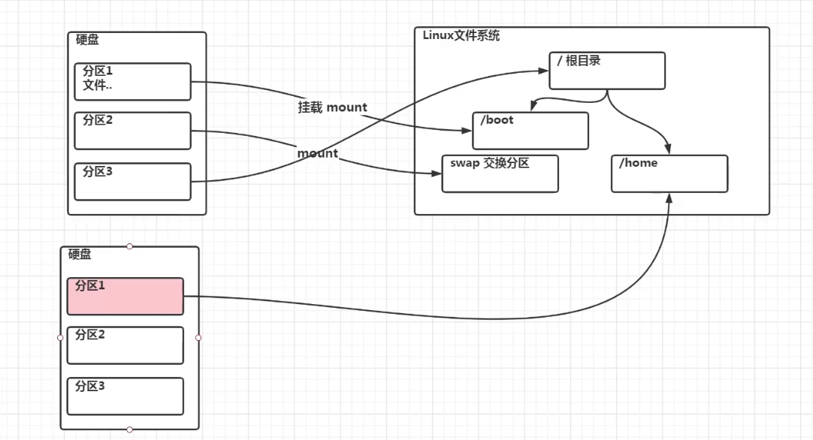
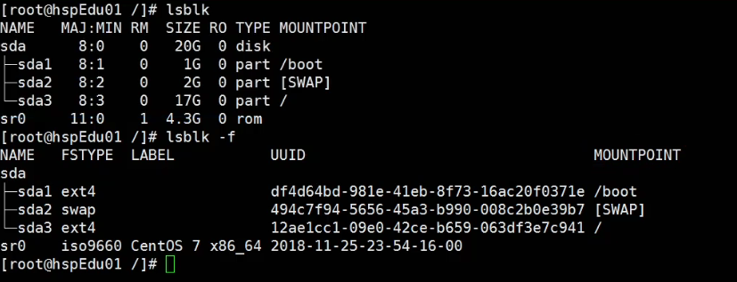

# 安装vmtools

* 安装vmtools后，可以让我们在windows下更好的管理vm虚拟机
* 可以设置windows和centos的共享文件夹

## 安装步骤

* 弹出光驱

* 安装vmtools

* 将上述文件复制到/opt文件目录下

* 在终端对文件进行解压

  * 进入opt目录

  

  * 解压

  

* 进入安装

* 进行安装

* 一直按回车,安装成功

* 新建文件夹：D:\develop_tools_data\linuxshare

* 在虚拟机设置中进行设置

* 在/mnt目录下即可找到共享文件夹

# linux的目录结构

* 在linux中，一切皆文件，例如linux将cpu映射为了一个文件，cpu下有几个内核，就映射了几个文件。
* linux的文件系统是采用级层式的树状目录结构，在此结构中的最上层是根目录“/”，然后在此目录下再创建其他的目录。

## 常用的目录结构

* /bin：存放常用命令
* /sbin：存放的是系统管理员使用的系统管理程序
* /home：存放普通用户的主目录
* root：系统管理员的主目录
* /lib：应用程序需要用到的共享库
* /lost+found：这个目录一般情况下是空的，当系统非法关机后，这里就存放了一些文件
* /etc：所有的系统管理所需要的配置文件和子目录,比如安装mysql数据库my.conf
* /usr：这是一个非常重要的目录，用户的很多应用程序和文件都放在这个目录下，类似与windows下的programfiles目录。
* /boot：存放的是启动Linux时使用的一些核心文件，包括一些连接文件以及镜像文件
* ...

# 远程登录与远程文件传输

## 远程登录

* 在公司实际开发时，linux服务器是开发小组共享的，因此程序员需要远程登录到linux进行项目管理和开发。
* 使用x-shell进行远程登录

* 通过ping命令检测本机能否与虚拟机联通

* 成功后即可使用xshell远程登录

## 远程文件传输

* 使用xfpt可以实现在windows系统上远程对linux或者unix系统进行文件传输。

* 创建会话同xshell

* 解决乱码问题：

* 进行文件传输

# vi与vim

## 三种模式

* 正常模式：使用vim即可进入，也就是默认模式，使用上下左右移动光标，使用删除字符或者删除整行来进行处理档案内容，也可以使用复制粘贴来处理文件数据
* 插入模式：使用 i I o O a A r R 从正常模式即可进入，一般用i
* 命令行模式：从正常模式进入命令行模式直接输入:  从插入模式进入命令行模式先esc再 :   例如:wq  写入并且保存
  * wq:退出并且保存
  * q:退出，不保存，但会提示
  * q!:强制退出不保存

## 常用快捷键

* 正常模式下复制粘贴： yy复制 5yy表示复制光标开始的那一行往下一共5行 p表示在光标下一行开始粘贴
* 删除：dd 5dd删除5行
* 查找某个单词：在命令模式下，输入/关键字 回车 按n切换下一个
* 显示行号：在命令行模式下 set nu 取消行号 set nonu
* 跳转到行头/行末：正常模式下直接gg/G
* 撤销：在正常模式下 u
* 快速转到某行：行号 shift + g

# 关机&重启&登录&注销

* shutdown -h now：立刻关机
* shutdown -h 1：1分钟后关机
* shutdown -r now：立刻重启
* halt：立刻关机
* reboot：立刻重启
* sync：把内存的数据同步到磁盘

* su - 用户名：登录用户（从用户权限高的用户登录到用户权限低的用户不需要密码，反之需要）
* logout：注销用户（该操作只能在shell 中使用）

# 用户管理

## 添加用户

* useradd admin

  使用该操作会创建一个用户admin，并且在 /home/ 下创建一个admin的文件夹。

* useradd -d 文件名 用户名

  将用户的文件夹创建在指定文件夹处。

* passwd admin

  给用户设置密码，如果不加用户名，则是给当前用户设置密码

* pwd

  显示当前目录

## 删除用户

* userdel tom

  删除tom但是不删除家目录

* userdel -r tom

  删除tom并且删除家目录

## 查询用户信息

* id tom

  查询tom用户的相关信息：uid=1000(tom) gid=1000(tom) 组=1000(tom)

* whoami

  查询自己是哪个用户（第一次登录的用户信息）

## 用户组

* 用户组可以对具有统一权限的用户进行管理

* groupadd group1

  添加一个用户组名为group1

* groupdel group1

  删除group1组

* 在创建一个用户时会自动创建一个与用户同名的组，将用户放在该组

* 创建指定组，在创建用户时将用户放在指定组：

  groupadd group                创建一个group组

  useradd -g group tom      创建一个用户tom放在group组

* usermod -g group tom 

  将tom用户放到group组中

### 用户和组的相关文件

* /etc/passwd 文件中记录了用户的配置信息

  用户名:口令:用户标识号:组标识号:注释性描述:主目录:登录shell

  root​`:x:`​0:0:root:/root:/bin/bash

* /etc/shadow 口令配置文件（大多进行加密）

* /etc/group 组配置文件大多进行加密）

# 运行级别

linux有7种运行级别

* 0：关机
* 1：单用户（找回丢失密码）
* 2：多用户没有网络服务
* 3：多用户有网络服务
* 4：系统未使用留给用户
* 5：图形界面
* 6：系统重启
* 常用的运行级别是3、5，默认系统启动的运行级别是5
* 使用 init 级别 切换运行级别
* 在/etc/inittab中记录了各种运行级别：
  * multi-user.target   3
  * graphical.target     5
* 获取当前默认运行级别：systemctl get-default
* 设置默认的运行级别：systemctl get-default 运行级别（multi-user.target ）

## 使用单用户运行级别找回root密码

* 输入ctrl+x
* 在光标紧接着的地方输入mount -o remount,rw /
* 换行输入passwd
* 换行输入新密码
* 换确认密码

* 换行输入touch /.autorelabel
* 换行输入exec /sbin/init
* 耐心等待
* 系统重启

# 帮助指令

* man 命令或者配置文件
  * man ls    查看ls命令的帮助信息
* help 命令       获取shell内置命令的帮助信息

# 文件目录指令

## 绝对路径与相对路径

进入  /home/tom/a.txt

* 在/下使用绝对路径：vim /home/tom/a.txt
* 在home下使用相对路径：vim tom/a.txt
  * cd ../../表示当前目录的上一级的上一级目录

## 相关指令

* pwd：显示当前所在的目录
* ls：显示当前目录下的文件和文件目录
  * -a显示包含隐藏文件
  * -l以列的方式显示：简写ll

* cd：进入指定目录
  * 直接加相对路径或者绝对路径
  * cd ~：回到当前用户的家目录
  * cd ..：回到上一级目录
* mkdir：创建目录
  * mkdir /home/dog：在home下创建dog目录
  * mkdir -p /home/animal/dog：在home目录下创建animal目录在animal目录下创建dog目录
* rmdir：删除目录
  * rmdir /home/animal/：删除animal目录，animal目录必须为空目录才能删除
  * rmdir -rf /home/animal/：强制删除
* touch：创建空文件
  * touch hello.txt：在当前目录下创建一个空文件hello.txt
* cp：拷贝文件
  * cp hello.txt /home/tom：将当前目录下的hello.txt拷贝到/home/tom/中
  * cp -r /home/tom/ /opt/：将home下的整个tom文件夹拷贝到opt目录下
  * 注意，在拷贝时如果出现名字重复的情况下，系统会提示是否覆盖 y/n，如果不需要系统提示，只需要在cp前面加\   \cp ......
* rm：删除文件或文件夹
  * rm 文件：删除指定文件提示
  * rm -f 文件：删除指定文件不提示
  * rm -r  文件夹：删除指定文件夹提示
  * rm -fr 文件夹：删除指定文件夹不提示
* mv：移动文件夹或者改命
  * mv pig.txt cat.txt 将当前目录下的pig.txt改命为cat.txt
  * mv /home/animal /opt/   将home下的animal移动到opt目录下
* cat：浏览文件，需要行号加上-n
  * cat Hello.java

* more：一个基于vi编辑器的文本过滤器，它以全屏幕的方式按页显示文本内容，more指令中内置了若干快捷键（交互指令）

| 操作   | 功能                     |
| ------ | ------------------------ |
| space  | 向下一页                 |
| enter  | 向下一行                 |
| q      | 代表离开                 |
| ctrl+f | 滚动下一屏               |
| ctrl+b | 返回上一屏               |
| =      | 输出当前行的行号         |
| :f     | 输出文件名和当前行的行号 |

* cat 与 more共同使用：
  * cat 文件 | more：查看文件交给more处理。可以使用more的交互指令

* less：与more的指令类似，但是比more更加强大，支持各种显示终端。less指令在显示文件内容时，并不是一次将整个文件加载之后才显示，而是根据显示需要加载内容，对于显示大型文件具有较高的效率

| 操作     | 功能                                          |
| -------- | --------------------------------------------- |
| space    | 向下翻动一页                                  |
| pagedown | 向下翻动一页                                  |
| pageup   | 向上翻动一页                                  |
| /字符串  | 向下搜寻字符串的功能；n：向下查找 N：向上查找 |
| ?字符串  | 向上搜寻字符串的功能；n：向上查找 N：向下查找 |
| q        | 离开                                          |

* echo：输出相关内容
  * echo $PATH：输出环境变量
  * echo $HOSTNAME：输出主机名
  * echo "hello world"：在终端输出hello world
* head：查看文件的前指定行
  * head hello.txt：默认看文件的前10行
  * head -n 5 hello.txt：看文件前5行
* tail：与head相对
* tail -f 文件：监控文件（ctrl+C退出监控）

* 输出重定向和追加：>/>>
  * echo "hello" 代表向终端输出hello
  * echo "hello" > 文件：用hello覆盖指定文件中的内容
  * echo "hello" >> 文件：在指定文件后追加hello
  * ls -l > 文件：将当前目录下的结构按列重写指定文件
  * cat 文件1 > 文件2：将指定文件1中的内容重写指定文件2

* 软链接（符号链接）：类似于快捷方式
  * ln -s /root /home/myroot(在home下创建myroot文件，点击相当于进入root目录)
* history
  * history：查看历史执行的命令
  * history 10：查看最近10条命令
  * history !5：执行历史中编号为5的命令

## 日期时间类

* date：
  * date：显示当前时间
  * date +%Y：显示当前年份
  * date +%m：显示当前月份
  * date +%d：显示当前日
  * date "+%Y-%m-%d %H:%M:%S"：按照指定格式输出日期
  * date -s "2010-12-12 12:12:12"：设置时间
* cal：
  * cal：显示当月的日历
  * cal 2020：显示2020年年历

## 搜索查找类

* find 搜索范围 选项：在指定范围查找指定的文件
  * find /home -name hello.txt：在/home下查找名为hello.txt的文件

| 选项           | 功能                                                        |
| -------------- | ----------------------------------------------------------- |
| -name 文件名   | 查找指定文件名的文件                                        |
| -user 用户名   | 查询指定用户的所有文件                                      |
| -size 文件大小 | 查找指定文件大小的文件：+200大于200M的文件 -200小于 200等于 |

* locate：快速定位文件路径，其利用事先建立的系统中所有文件名称及路径的locate数据库实现快速定位给定的文件，locate指令无需遍历整个文件系统，查询速度快，但是为了保证查询结果的准确性，管理员必须定期更新locate数据库
  * 使用前使用 updatedb更新数据库
  * locate hello.txt：查询hello.txt所在的路径
* which：查询指定指令对应的文件所在的目录
  * which ls：查询ls指令对应文件所在目录
* grep：在指定文件里面查询指定内容所在行的内容
  * 使用管道符号|：其含义为将|前的指令的结果交给后面的指令处理
  * 使用管道符号的写法：cat /home/hello.txt | grep -n "yes"
  * 不使用管道符号的写法：grep -n yes /home/hello.txt

## 文件压缩与解压

* gzip 文件名 压缩文件
* gunzip 文件名 解压文件
* zip：压缩文件夹
  * zip -r myhome.zip /home：将home文件夹进行解压
* unzip：解压文件夹
  * unzip -d /opt /home/myhome.zip：将home下的myhome.zip解压到opt目录下
* tar：指令为打包，打包后的文件是.tar.gz的文件

| 选项 | 功能               |
| ---- | ------------------ |
| -C   | 产生.tar打包文件   |
| -v   | 显示详细信息       |
| -f   | 指定压缩后的文件名 |
| -z   | 打包同时压缩       |
| -x   | 解包.tar文件       |

* tar -zcvf pc.tar.gz /home/hello.txt /home/hi.txt
  * 将home下的hello.txt和hi.txt打包压缩为pc.tar.gz
* tar -zcvf myhome.tar.gz /home/
  * 将home目录解压打包为myhome.tar.gz
* tar -zxvf pc.tar.gz
  * 将pc.tar.gz解压
* tar -zxvf /home/pc.tar.gz -C /opt
  * 将home下的pc.tar.gz解压到opt目录下

# 权限管理

## linux的组

* 所有者
* 所在组
* 其他组

## 文件/目录的所有者

* groups：查看所有组

* ls -ahl：查看当前目录下的目录/文件的信息（包含所有者的信息）
* chown 用户名 文件名：将指定文件修改某个用户为所有者
* chgrp 组名 文件名：将指定文件的组修改为指定组
* usermod -d 目录名 用户名：修改指定用户的登录目录。（一定要注意该用户一定要能够进入该目录）

## rwx权限

* 使用ll展示数据：

* 第一组数据
  * 
    * -代表普通文件
    * l代表链接（快捷方式）
    * c代表字符设备：鼠标、键盘...
    * b代表块设备，比如硬盘
    * d代表目录
  * 文件拥有者对该文件的操作权限
  * 
    * r：代表可读
    * w：代表可写
    * x：代表可执行
  * 所在组其他用户对该文件的操作权限
  * 
  * 其他组用户对该文件的操作权限
  * 

* rwx权限作用到文件
  * r：可以读取，查看
  * w：可以修改，但是不代表可以删除文件，删除一个文件的前提条件是对该文件所在的目录有写权限，才能删除该文件
  * x：代表文件可执行
* rwx权限作用到文件夹
  * r：代表可读，ls
  * w：可以修改，对目录中的文件/文件夹进行创建+删除+重命名目录操作
  * x：代表可以进入该目录

* 其他代表含义

* 如果是文件就是1；如果是文件夹，则代表文件夹中所含的文件个数。
* tom：代表所有者
* person：代表所在组
* 0：文件大小
* 时间：最后一次修改的日期

## rwx权限修改

* 使用chmod进行修改
* 第一种修改权限：
  * u：所有者   g：所有组   o：其他人   a：所有人（u+g+o）
  *  +/-/=：进行权限增加删除赋予
    * chmod u=rwx,g=rwx,o=rwx 文件名
    * chmod g-x,o-wx 文件名
    * chmod g+x,o+wx 文件名
* 使用数字修改权限
  * r=4 w=2 x=1
  * rw=6 rwx=7 ....
    * chmod u=rwx,g=rw,o=r 文件名    相当于    chmod 761 文件名

## 修改文件所有者

* 使用chown
  * chown 用户名 文件（如果文件夹中含有多个文件，加上-R递归修改）
  * chown 用户名:所在组 文件（如果文件夹中含有多个文件，加上-R递归修改）

# 定时任务调度

* 使用 crontab 进行定时任务调度

* 概述

  * 任务调度：是指系统在某个时间执行的特定的命令或程序
  * 任务调度分类：
    * 系统工作：有些重要的工作必须周而复始的进行，比如病毒扫描
    * 个别用户工作，用户可能希望执行某些程序，比如时刻对数据库的备份

* 基本语法：

  * crontab 选项

    | 选项                  | 功能                          |
    | --------------------- | ----------------------------- |
    | -e                    | 编辑crontab定时任务           |
    | -l                    | 查询crontab任务               |
    | -r                    | 删除当前用户所有的crontab任务 |
    | service crond restart | 重启任务调度                  |

## crond快速入门

* 相关的文件：

  * /etc/crontab

* 案例：每隔一分钟，将/etc/ 目录的内容拷贝到 /opt/to.txt文件中：

  * 执行指令：crontab -e
  * 将该内容写入：`*/1 * * * *` ls -l /etc/ > /opt/to.txt
  * 保存退出

  5个占位符的详细说明

  | 占位符 | 含义               | 范围              |
  | ------ | ------------------ | ----------------- |
  | 第一个 | 一小时中的第几分钟 | 0-59              |
  | 第二个 | 一天中的第几小时   | 0-23              |
  | 第三个 | 一个月中的第几天   | 1-31              |
  | 第四个 | 一年中的第几个月   | 1-12              |
  | 第五个 | 一周中的星期几     | 0-7（0=7=星期天） |

  * 其他特殊符号

    | 符号 | 含义                                                         |
    | ---- | ------------------------------------------------------------ |
    | *    | 代表任何时间，比如第一个*就代表一小时中每分钟执行一次        |
    | ,    | 代表不连续的时间，比如   0 8,12,16, * * *    每天的8.00 12.00 16.00都执行一次 |
    | -    | 代表连续的时间范围。比如 0 5 * * 1-6 代表周一到周六的5.00执行 |
    | */n  | 代表多久执行一次，1/* * * * * 每隔一分钟执行一次             |

## 使用shell脚本

* 创建一个shell脚本，每隔一分钟调用一次，将当前时间追加到/opt/time.txt
  * 创建shell脚本：写入要执行的内容：date >> /opt/time.txt
  * 将该脚本设置为可执行文件（当前用户）
  * 使用crontab定时调度该文件：*/1 * * * * shell脚本名

## at定时任务

* at命令是一次性定时任务计划，at的守护进程atd会以后台默认运行，检查作业队列来运行。
* 默认情况下，atd守护进程每60秒检查作业队列，有作业时，会检查作业运行时间，如果时间与当前时间匹配，则运行此作业。
* at命令是一次性定时计划任务，执行完一个任务后不再执行此任务了。
* 在使用at命令时，一定要保证atd进程启动，可以用相关指令，来查看。
  * ps -ef | grep atd
* 使用atp命令查看系统有没有工作任务
* at命令格式
  * at 选项 时间（回车）
  * 要执行的命令
  * 两次ctrl+d

* at命令选项

* at指定时间
  * hh:mm（4:00，在今天4.00执行，如果已经过去，在明天4.00执行）
  * 使用midnight、noon、teatime、today、tomorrow等模糊的词
  * 使用12小时制：12pm、3am
  * 具体日期：04:00 2021-02-02
  * 相对计时法：now + 5 minutes（hours、days、weeks...）
* 删除指定任务：
  * atrm 编号

# linux磁盘分区、挂载

* linux的硬盘说明

* 硬盘、分区、挂载

* 查看所有设备挂载情况：
  * lsblk
  * lsblk -l

## 增加硬盘并且挂载

* 虚拟机增加硬盘（添加后重启系统）

  

  

  

* 为新硬盘sdb添加分区
  * fdisk /dev/sdb
  * （m回车查看帮助）
  * n回车（添加分区）
  * p回车（主分区）
  * 1回车（设置分区号）
  * 两次回车
  * w回车（写入并且保存）

  

* 格式化分区

  * mkfs -t ext4 /dev/sdb1

* 将分区挂载到指定目录下（/newdisk）

  * mount /dev/sdb1 /newdisk

* 卸载分区：

  * umount /dev/sdb1    或者   umount /newdisk

* 注意：

  * 使用该挂载方式在系统重启后挂载会失效。

  * 永久生效：

    * 修改文件：etc/fstab

    

    * reboot

## 磁盘情况查询

* df -h（查询磁盘情况）

* du -h 文件名（查询指定目录的磁盘占用情况，不写文件名为当前目录）

  | 其他选项      | 功能                     |
  | ------------- | ------------------------ |
  | -s            | 指定目录占用大小         |
  | -h            | 带计量单位               |
  | -a            | 含文件                   |
  | --max-depth=1 | 子目录深度为1            |
  | -c            | 列出明细同时，增加汇总值 |

  * du -hac --max-depth=1 /opt

  

## 其他常用指令

# 进程

* linux中，每个程序执行都叫一个进程，每个进程都有一个id号（pid，进程号）
* 进程有两种方式存在：前台和后台
* 一般系统的服务都是以后台方式运行，常驻在系统，直到关机结束。

## ps指令

ps指令用来查看当前系统有哪些进程在执行，以及一些执行情况。

| 常用选项 | 作用                     |
| -------- | ------------------------ |
| -a       | 显示终端所有进程信息     |
| -u       | 以用户的格式显示进程信息 |
| -x       | 显示后台进程运行的参数   |
| -e       | 显示所有进程             |
| -f       | 全格式                   |

* ps -aux：

## 父子进程

* ps -ef可以查看父进程
* 父进程进程号：ppid

## 终止进程

* kill 选项 进程号
* killall 进程名

| 选项 | 功能                             |
| ---- | -------------------------------- |
| -9   | 强制终止一个进程（强制终止终端） |

## 进程树

* pstree：将进程以树状结构显示出来

| 选项 | 功能               |
| ---- | ------------------ |
| -p   | 显示进程的PID      |
| -u   | 显示进程的所属用户 |

## 服务管理

服务（service）本质就是进程，但是是在后台运行的，通常都会监听某个端口，等待其他程序的请求，比如（mysqld，sshd，防火墙...），因此又称守护进程。

## service管理服务

* service 服务名 start/stop/restart/reload/status
* 在centos7后，很多服务不再支持service，改为systemctl
* service管理的服务可在/etc/init.d中查看

* 使用setup可以查看系统服务

## chkconfig指令

* 通过chkconfig命令可以给服务的各个运行级别设置自启动/关闭
* chkconfig指令管理的服务同样也是在/etc/init.d中查看
* 同样的centos7后，很多服务使用systemctl管理

* 查看服务：

  * chkconfig （--list）

  

  * chkconfig --level 运行级别 on/off
    * 设置某个服务在某个运行级别是自启动/关闭
  * 设置后要reboot

## systemctl指令

* systemctl start/stop/restart/status 服务名

* systemctl指令管理的服务在 /usr/lib/systemd/system 查看

* 视图systemctl设置运行级别自启动/关闭

  * systemctl list-unit-files（查看服务开机 "运行级别3和5" 自启动状态）

  

  *  systemctl is-enabled 服务名（查询某个服务开机"运行级别3和5" 自启动状态）

  

  * systemctl enable 服务名（设置服务开机自启动）
  * systemctl disabled 服务名（设置服务开机不启动）

## firewall

* 查看端口协议：

  * netstat -anp

  

* 打开端口：
  
  * firewall-cmd --permanent --add-port=端口号/协议
* 关闭端口
  
  * firewall-cmd --permanent --remove-port=端口号/协议
* 重新载入生效：
  
  * firewall-cmd --reload
* 查询端口是否开放
  
  * firewall-cmd --permanent --query-port=端口号/协议

## 动态监控进程

* top指令：与ps很相似，但是top是动态更新显示的进程的。

| 选项    | 功能                                       |
| ------- | ------------------------------------------ |
| -d 秒数 | 每隔指定秒数更新一次进程，默认为3s         |
| -i      | 不显示任何闲置或僵死进程                   |
| -p      | 通过指定监控进程id来仅仅监控某个进程的状态 |

* 交互说明：

| 操作            | 功能                            |
| --------------- | ------------------------------- |
| P               | 以cpu使用率排序，默认使用该方式 |
| M               | 以内存使用率排序                |
| N               | 以pid排序                       |
| q               | 退出                            |
| u回车用户名回车 | 监控与指定用户相关的进程        |
| k回车pid回车    | 终止指定pid的进程               |

# rpm与yum

## rpm

* rpm用于互联网下载包的打包及安装工具，包含在某些linux发行版中，它生成具有.RPM扩展名的文件。

* 查询已经安装的rpm列表：

  * rpm -qa

  * 查询是否安装了firefox：

    * rpm -qa | grep firefox

    

* rpm包全路径名称在光驱中含有

## yam

# 配置javaEE环境

## 安装jdk

* 将jdk-8u261-linux-x64.tar.gz传输到/opt/jdk目录下
* 解压到/usr/local/java/
* 添加path环境变量：
  * 修改环境变量相关文件：vim /etc/profile
  * 在最后添加
    * export JAVA_HOME=/usr/local/java/jdk1.8.0_261
    * export PATH=$JAVA_HOME/bin:$PATH
  * 刷新环境变量：source /etc/profile
* 测试：
  * 创建java文件
  * 编译
  * 运行

## 安装tomcat

* 将apache-tomcat-8.5.59.tar.gz传输到/opt/tomcat目录下
* 解压到/usr/local/tomcat/
* 打开8080端口：
  * systemctl start firewalld
  * firewall-cmd --permanent --add-port=8080/tcp
  * firewall-cmd --reload
* 启动tomcat
  * ./startup.sh
* 访问/linux:8080

## 安装idea

* 将ideaIU-2019.2.4.tar.gz传输到/opt/idea目录下
* 解压到/usr/local/idea/
* 在bin目录下执行idea.sh