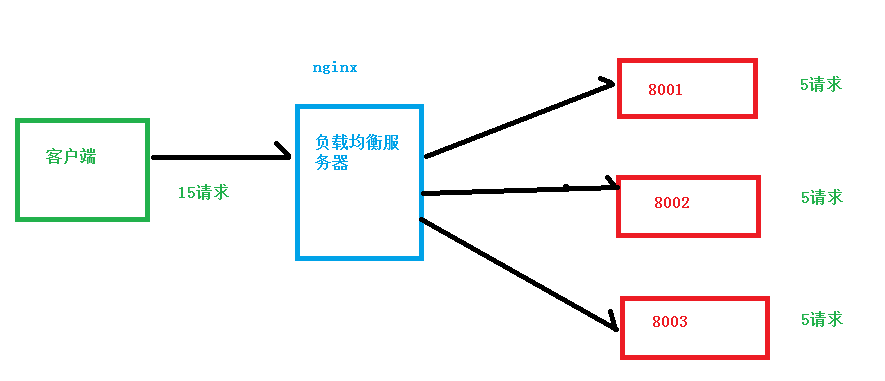

# Nginx简介

* 什么是nginx：

  Nginx 是高性能的 HTTP 和反向代理的服务器，处理高并发能力是十分强大的，能经受高负

  载的考验,有报告表明能支持高达 50,000 个并发连接数。

# 反向代理

## 正向代理

需要在客户端配置代理服务器进行指定网站访问


## 反向代理

暴露的是代理服务器地址，隐藏了真实服务器IP地址。


# 负载均衡

增加服务器的数量，然后将请求分发到各个服务器上，将原先请求集中到单个服务器上的

情况改为将请求分发到多个服务器上，将负载分发到不同的服务器，也就是我们所说的负

载均衡



# 动静分离


# linux环境下安装Nginx

* 在安装之前需要的几个依赖：

```
c语言编译器gcc：
yum install -y gcc

安装perl库
yum install -y pcre pcre-devel

安装zlib库
yum install -y zlib zlib-devel
```

* 解压缩文件 -zxvf ...
* 进入解压后的目录

* ./configure --prefix=/usr/local/nginx
* make
* make install
* 进入安装好的目录/usr/local/nginx/sbin
* 启动

```
./nginx -v 查看nginx版本号
./nginx 启动
./nginx -s stop 快速停止
./nginx -s quit 优雅关闭，在退出前完成已经接受的连接请求
./nginx -s reload 重新加载配置
```

* 查看地址端口 ip addr

# Nginx的目录结构

* sbin：主程序启动的文件
* html：访问站点的默认页面
  * index.html：欢迎页
* conf：存放了nginx的主要配置文件
  * nginx.conf：主配置
* logs：记录日志
  * access.log：记录访问日志
  * error.log：用户访问错误时记录日志
  * nginx.pid：记录nginx的主进程的pid

# Nginx的配置文件

* 位置在nginx/conf/nginx.conf

* 内容可以分为三部分：

  * 全局块：配置服务器整体运行的配置指令

    * worker_processes：处理并发数的配置，值越大，可处理的数量就越多

  * events块：影响 Nginx服务器与用户的网络连接

    * worker_connections：设置最大的连接数

  * http块：这算是 Nginx 服务器配置中最频繁的部分，代理、缓存和日志定义等绝大多数功能和第三方模块的配置都在这里，其中包括括http 全局块**、**server 块。

    * http 全局块：http 全局块配置的指令包括文件引入、MIME-TYPE 定义、日志自定义、连接超时时间、单链接请求数上限等

    * server块：这块和虚拟主机有密切关系，虚拟主机从用户角度看，和一台独立的硬件主机是完全一样的，该技术的产生是为了节省互联网服务器硬件成本。

       每个 http 块可以包括多个 server 块，而每个 server 块就相当于一个虚拟主机。

       而每个 server 块也分为全局 server 块，以及可以同时包含多个 locaton 块。

      * 全局 server 块

         最常见的配置是本虚拟机主机的监听配置和本虚拟主机的名称或 IP 配置。

      * **location 块**

         一个 server 块可以配置多个 location 块。

         这块的主要作用是基于 Nginx 服务器接收到的请求字符串（例如 server_name/uri-string），对虚拟主机名称

        （也可以是 IP 别名）之外的字符串（例如 前面的 /uri-string）进行匹配，对特定的请求进行处理。地址定向、数据缓

        存和应答控制等功能，还有许多第三方模块的配置也在这里进行

## 最小配置解读

```
worker_processes  1;                  #创建的子进程的数量，由CPU等决定

events {
    worker_connections  1024;         #每个子进程的最大连接数
}


http {
    include       mime.types;                #include表示包含某个文件，mine.types中定义了众多后												#缀名结尾的文件发送给浏览器端后浏览器端的处理方式：展											    #示？下载？
    
    default_type  application/octet-stream;  #其他的后缀名文件的默认处理方式

    sendfile        on;                      #开启零拷贝

    keepalive_timeout  65;                   #超时时间

#一个虚拟主机vhost的配置，nginx可以配置多个虚拟主机
    server {
        listen       80;
        server_name  localhost;   #主机名或者域名

        location / {
            root   html;
            index  index.html index.htm;
        }

        error_page   500 502 503 504  /50x.html;
        location = /50x.html {
            root   html;
        }

    }

}
```

## 虚拟主机原理

* 防止服务器资源过剩，因此为一个主机配置多个域名，不同域名访问该主机返回不同目录下的资源


## 使用hosts解析文件域名


## 公网域名配置

* 在阿里云购买域名并且解析


## 虚拟主机域名配置


* 配置不同的虚拟主机目录
* 注意：listen+server_name需要唯一


* 访问

## server_name的多种匹配方式

* 在进行匹配时会先按照配置文件的顺序进行匹配，若没匹配到，则会访问第一个

# Nginx的执行流程

* 启动nginx后，会启动master主进程，主进程不负责请求的处理，而是配合子进程完成请求的处理


# 反向代理实现

## 反向代理访问一个tomcat服务器

* 实现效果：在本机上通过域名www.123.com访问虚拟机中的linux系统的80端口，可以响应linux中的tomcat服务器

  

* 配置域名与地址的映射


* 在linux中启动tomcat服务器
* 在nginx进行请求转发的配置（反向代理）


* 启动nginx并且测试

## 反向代理访问两个tomcat服务器

* 启动两个tomcat服务器端口号分别为8080和8081
* 在webapps下创建index1/index.html  index1/index.html内容分别为一行8080与8081
* 在nginx中进行配置

```
    server {
        listen       9001;
        server_name  192.168.239.128;

        location ~ /index1/ {
            proxy_pass http://127.0.0.1:8080;
        }
        location ~ /index2/ {
            proxy_pass http://127.0.0.1:8081;
        }
    }
```

* 启动nginx并且进行测试

# 负载均衡实现

* 在上述过程中配置nginx时添加

```
http{
...
	upstream myserver{
		ip_hash;
		server 192.168....:8080 weight=1;
		server 192.168....:8081 weight=1;
		fair;
	}
...
	server{
	...
		location / {
			proxy_pass http://myserver;
		}
	}
}
```

* 两个index.html的路径应该相同


* 多次访问返回的页面既有8080也有8081

## 负载均衡策略

* 轮询（默认策略）
  * 每个请求按时间顺序逐一分配到不同的后端服务器，如果后端服务器down掉，能自动剔除
* weight
  * weight代表权重，权重默认为1，权重越高，分配的客户端越多
* ip_hash
  * 每个请求按照访问ip的hash结果分配，这样每个访客固定一个后端服务器，可以解决session的问题
* fair
  * 按照后端服务器的响应时间来分配请求，响应时间短的优先分配