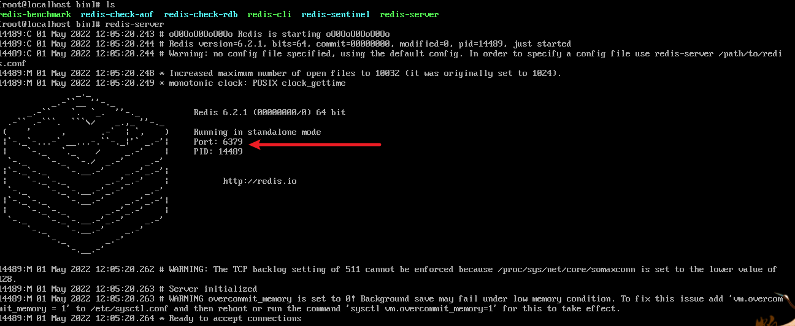
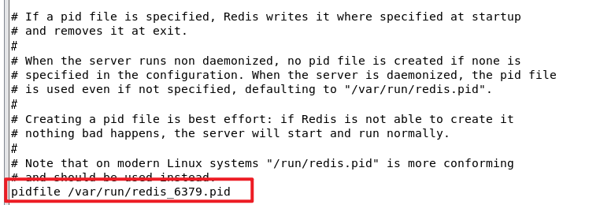
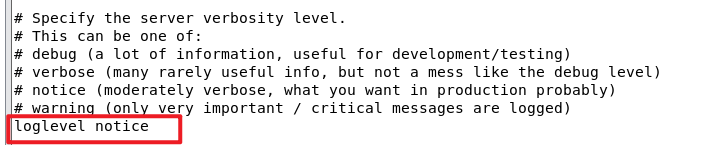
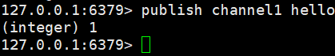
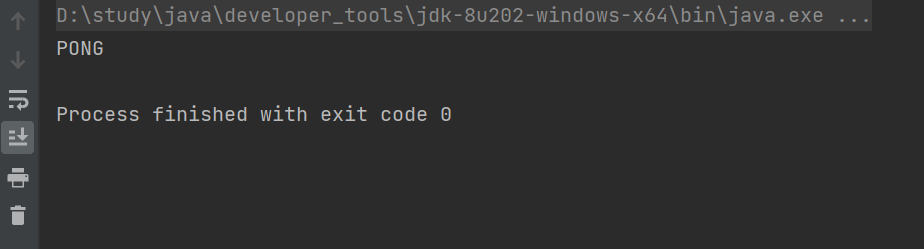
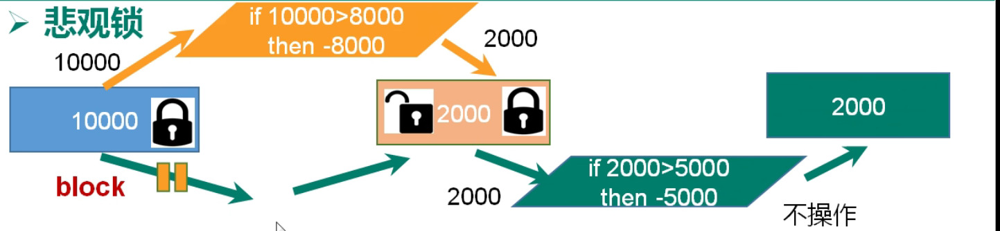

# linux环境下安装redis

* 将redis-6.2.1.tar.gz上传至/opt/

* 安装环境需要gcc

* 解压

* 进入文件redis-6.2.1

* make（编译）

* make install（安装）

* 默认安装在/usr/local/bin 

* bin下的几个文件：

  * redis-benchmark:性能测试工具，可以在自己本子运行，看看自己本子性能如何
  * redis-check-aof：修复有问题的AOF文件，rdb和aof后面讲
  * redis-check-dump：修复有问题的dump.rdb文件
  * redis-sentinel：Redis集群使用
  * redis-server：Redis服务器启动命令
  * redis-cli：客户端，操作入口

* 启动redis

  * 前台启动：redis-server（不推荐使用，启动后此会话不能进行其他操作，ctrl+c停止）

  

  * 后台启动：

    * 修改redis.config(daemonize no改为yes)
    * 启动redis：redis-server /usr/local/.../redis.conf
    * 查看相关信息：ps -ef | grep redis

    

    * 用客户端访问：redis-cli

    

    * 测试验证：ping

    

* 关闭redis：

  * 在客户端访问：shutdown 
  * 在客户端访问：exit                  +             ps -ef | grep redis（查看进程）+ kill 进程号

# 相关基础知识

* redis的默认端口号为6379
* redis默认有16个数据库，从下标0开始，默认处于0号数据库。
  * 通过select 1 切换数据库
  * 所有的数据库密码相同
* redis是单线程+多路io复用


# 常用命令

* keys *0：查看0号库所有的key，不加0为当前库
* exists k1：查看当前库是否存在k1
* type k1：查看k1的类型
* del k1：删除k1
* unlink k1：删除k1
* expire k1 10：给k1设置过期时间10s
* ttl k1：查看k1还有多长时间过期，-1代表永不过期，-2代表已经过期
* dbsize：查看当前库的key个数
* flushdb：清空当前库
* flushall：清空所有库

# 常用数据类型

## String

* String类型是二进制安全的，意味着可以包含任何数据类型，比如jpg，序列化的对象
* 一个String的value最多可以是512M

### 常用命令

* append k1 值：在已经存在的k1上追加值
* strlen k1：得到k1的长度
* incr k1：k1++
* decr k1：k1--
* incrby k1 10：k1+10
* decrby k1 10：k1-10
* set k1 值：设置键值对 k1 值
* get k1：获取键k1的值，设置已经存在的键会覆盖
* setnx k1 值：若k1存在，不发生改变，若不存在，设置k1的值
* mset k1 v1 k2 v2：批量设置多个
* mget k1 k2 k3：批量获取
* msetnx k1 v1 k2 v2：k1 k2都不存在才能成功
* getrange k1 0 3：获取字符串k1前四个位置的值
* setrange k1 3 abc：从3号位置开始覆盖为abc
* setex age 20 value 30：设置age=30过期时间20s
* getset k1 tom：获取k1，并且设置k1为tom

## 列表List

* 简单的字符串列表，按照插入顺序排序，可以插入一个数据到头部或者尾部
* 底层是双向链表，对两端容易操作，操作中间元素性能较差


* 底层原理
  * 如果元素少，多个元素放在一个ziplist中，元素多后，ziplist连起来称为一个quicklist


### 常用命令

* lpush/rpush： k1 v1 v2 v3：从左边/右边一个一个放v1 v2 v3
* lpop/rpop k1：从左边/右边去除一个值
* rpoplpush k1 k2：从k1的右边取出一个值加到k2的左边
* lrange k1 0 1：查看k1中0-1的值，0 -1代表全部
* lindex k1 1：获取1号位置的元素
* llen k1：获取k1的长度
* linsert k1 before/after v1 v2：在v1之前/之后添加值v2
* lrem k1 3 v1：将k1从左到右删除3个v1
* lset k1 1 v2：修改

## 集合Set

* Set是String类型的无序集合，底层是value为null的Hash表

### 常用命令

* sadd k1 v1 v2 v3：添加，已经存在的元素会被忽略
* smenber k1：取出k1中的所有元素
* sismenber k1 v1：判断k1中是否含有v1，有返回1，没有返回0
* scard k1：查看集合元素个数
* srem k1 v1 v2：删除k1中的v1 v2
* spop k1：从k1中随机取出一个值
* srandmenber k1 n：从k1中取出n个值，不会删除
* smove k1 k2 v1：将k1中的v1移动到k2
* sinter k1 k2：返回k1k2的交集
* sunion k1 k2：返回k1k2的并集
* sdiff k1 k2：返回k1k2的差集

## Hash

* 是一个键值对集合
* 是一个string类的filed和value的映射表，特别适合存储对象。

### 常用命令

* hset k1 f1 v1：向k1中添加键值对 f1 v1
* hget k1 f1：取出k1中f1对应的v1
* hmset k1 f1 v1 f2 v2：批量添加
* hexists k1 f1：查看k1中f1是否存在
* hkeys k1：查看k1中所有的f
* hvals k1：查看k1中所有的v
* hincrby k1 f1 n：给k1中的f1加上n
* hsetnx k1 f1 v1：存在不添加，不存在添加

## Zset

* 与set相似，但是是有序的。

* 每个成员都关联了一个评分，这个评分被用来按照从高到低的方式排序集合中的成员，集合成员是唯一的，但是评分可以是重复的。

* Zset底层使用了Hash和跳跃表：

  * 跳跃表在于给value排序，根据score的范围获取元素列表
  * 从第一层开始找，从上至下

  

### 常用命令

* zadd k1 s1 v1 s2 v2：向k1中添加v1 v2 评分分别为s1 s2
* zrange topn 0 1：返回排序 0-1的元素（排序按照score从小到大），0 -1代表全部
* zrangebyscore k1 min max （withscores）：返回score介于min-max之间的元素
* zrevrangebyscore k1 max min （withscores）：返回score介于min-max之间的元素倒叙排。
* zincrby k1 50 v1：给k1中的v1的score+50
* zrem k1 v1：删除
* zcount k1 min max：统计个数
* zrank k1 v1：查看v1排名

# 配置文件

* 单位的表示方式，不支持1k对应1000bytes


* 包含的其他文件


* bind
  * 设置只允许本机访问
  * 注释掉后可以通过其他地址远程访问


* protected-mode
  * 保护模式改为no
  * 此时即可支持其他地址访问


* tcp-backlog
  * backlog是一个连接队列， ===  未完成三次握手队列+已经完成三次握手队列（默认511）


* timeout（默认为0永不超时）
  * 设置一个超时时间，长时间没有数据交互超时后，连接断开，需要重新连接redis


* tcp-keepalive

  * 心跳时间，默认300，每隔300秒检测一次，连接是否存活，如果存活继续服务，不存活，释放服务

  

* daemonize

  * 是否支持后台启动

  

* pidfile
  
  * redis每次启动时设置进程号



* loglevel（日志级别）
  * debug：最详细的信息
  * verbose：较为有用的信息
  * notice：生产环境中使用
  * warning：一些最重要的信息



* logfile

  * 设置日志的输出路径（默认为空）

  

* databases

  * 默认的数据库个数

  

* requirepass（设置密码）
  * 打开注释，密码设置在后面
  * 也可以通过指令设置


* maxclients
  * 设置最大客户端连接个数


* 设置最大内存


# redis的发布与订阅

* redis的发布与订阅（pub/sub）是一种消息通信模式：发布者（pub）发送消息，订阅者（sub）接收消息

* redis客户端可以订阅任意数量的频道

* 操作演示：

  * 打开一个客户端，订阅一个频道channel1

    * subscribe channel1

    

  * 打开另外一个客户端，向频道channel1发送消息hello

    * publish channel1 hello

    

  * 订阅的客户端可以接收到消息

  

# redis中的新数据类型

## Bitmaps

* 该数据类型可以实现位操作。
* 其本身不是一种数据类型，实际上是字符串，但是他可以对字符串的位进行操作。
* 可以把bitmaps想象成一个以位为单位的数组，数组每个单元只能放0和1，数组的下标叫做偏移量


### 常用命令

* setbit k1 0 1：第一个数组元素设置为1
* getbit k1 0：获取k1偏移量为0的元素的值
* bitcount k1：统计k1中1的值
* bitcount k1 start end：


* bittop operation destkey key1 key2
  * operation可以取：
    * and 交集
    * or 并集
    * not 非
    * xor 异或
  * 以and为例
    * key1：00000101
    * key2：10100110
    * 会生成一个destkey：00000100

### bitmap的优点与不足


## HyperLogLog

* HyperLogLog来处理重复的元素问题。
* 只要解决基数问题

### 常用命令

* pfadd k1 v1 v2：添加v1 v2到k1中，重复元素不会添加
* pfcount k1 k2...：计算k1 k2中所有不重复元素的个数
* pfmerge destkey sourcekey1 sourcekey2：将sourcekey1 sourcekey2元素合并到destkey

## Geospatial

* redis3.2中增加了对geo类型的支持，是地理信息的缩写，该类型，就是元素的2维坐标，在地图上就是经纬度，redis基于该类型，提高了经纬度设置，查询，范围查询，距离查询，经纬度Hash等常见操作

### 常用命令

* geoadd k1 经度 维度 v1 经度 维度 v2
  * 已经添加的数据不能再次添加
  * 有效经度从-180 --- +180，有效维度从-85.05112878 --- 85.05112878
* geopos k1 v1
  * 取得指定k1中的v1的经度和维度
* geodist k1 v1 v2 单位
  * 获取k1中v1与v2的距离
  * 单位有：
    * km
    * m
    * mi
    * ft
* georadius k1 经度 维度 距离 单位
  * 从k1中取得，以经度维度为中心，距离为半径，方圆距离以内的所有元素

# jedis

* 是redis的一个客户端工具，通过java操作redis，类似于jdbc技术

## 测试连接

* 在本机连接虚拟机上的redis时需要有一下要求

  * 打开端口号：6379
  * bind
    * 设置只允许本机访问
    * 注释掉后可以通过其他地址远程访问

  

  * protected-mode

    * 保护模式改为no
    * 此时即可支持其他地址访问

    


* firewall-cmd --reload（重新载入生效）
* 创建maven工程，导入jedis坐标

```xml
        <dependency>
            <groupId>redis.clients</groupId>
            <artifactId>jedis</artifactId>
            <version>3.3.0</version>
		</dependency>
```

* 进行测试：

```java
import redis.clients.jedis.Jedis;

public class Main {
    public static void main(String[] args) {
        Jedis jedis = new Jedis("192.168.232.128",6379);
        String ping = jedis.ping();
        System.out.println(ping);
    }
}
```

* 成功



## 测试对redis的操作

* keys *

```java
import redis.clients.jedis.Jedis;

import java.util.Set;

public class Main {
    public static void main(String[] args) {
        Jedis jedis = new Jedis("192.168.184.128",6379);
        Set<String> keys = jedis.keys("*");
        System.out.println(keys);
        jedis.close();
    }
}
```

* 操作字符串

```java
import redis.clients.jedis.Jedis;

public class Main {
    public static void main(String[] args) {
        Jedis jedis = new Jedis("192.168.184.128",6379);
        jedis.set("name","tom");
        String name = jedis.get("name");
        System.out.println(name);
        jedis.close();
    }
}
```

## 案例：模拟验证码发送

要求：

* 输入手机号，发送后生成6位验证码，2分钟有效
* 输入验证码，返回成功或者失败
* 每个手机每天只能发送三次

```java


import redis.clients.jedis.Jedis;

import java.util.HashMap;
import java.util.Random;

public class Main {
    public static void main(String[] args) {
        sendCode("18220471294");

    }
    //对验证码进行校验
    public static void test(String phoneNumber,String code){
        Jedis jedis = new Jedis("192.168.255.128", 6379);
        String s = jedis.get("code" + phoneNumber);
        if(s.equals(code)){
            System.out.println("成功");
        }else {
            System.out.println("失败");
        }
    }
    //发送验证码
    public static void sendCode(String phoneNumber){
        Jedis jedis = new Jedis("192.168.255.128", 6379);
        String s = jedis.get("code" + phoneNumber);
        String s1 = jedis.get("times" + phoneNumber);
        if(s==null){
            String code = getCode();
            System.out.println("验证码是"+code);
            jedis.setex("code" + phoneNumber,120,code);
            jedis.set("times"+phoneNumber,"1");
        }else if(Integer.parseInt(s1)==1||Integer.parseInt(s1)==2){
            String code = getCode();
            System.out.println("验证码是"+code);
            jedis.setex("code" + phoneNumber,120,code);
            jedis.incr("times" + phoneNumber);
        }else {
            System.out.println("今日发送次数超过三次");
            return;
        }
        jedis.close();
    }
    //生成验证码
    public static String getCode(){
        Random random = new Random();
        String str = "";
        for (int i = 0; i < 6; i++) {
            int i1 = random.nextInt(10);
            str+=i1;
        }
        return str;
    }
}
```

# springboot整合redis

* 创建springboot项目，导入相关依赖

```xml
		<dependency>
            <groupId>org.springframework.boot</groupId>
            <artifactId>spring-boot-starter-data-redis</artifactId>
        </dependency>

        <dependency>
            <groupId>org.apache.commons</groupId>
            <artifactId>commons-pool2</artifactId>
            <version>2.6.0</version>
        </dependency>
```

* 在springboot配置文件中导入redis相关配置

```properties
#redis服务器地址
spring.redis.host=192.168.
#redis数据库端口号
spring.redis.port=6379
#redis数据库端口号索引
spring.redis.database=0
#连接超时时间
spring.redis.timeout=1800000
#连接池最大连接数（负数表示没有限制）
spring.redis.lettuce.pool.max-active=20
#最大阻塞等待时间（负数表示没有限制）
spring.redis.lettuce.pool.max-wait=-1
#连接池中的最大空闲连接
spring.redis.lettuce.pool.max-idle=5
#连接池中的最小空闲连接
spring.redis.lettuce.pool.min-idle=0
```

* redis的自动配置类

```java
@EnableCaching
@Configuration
public class RedisConfig extends CachingConfigurerSupport {

    @Bean
    public RedisTemplate<String, Object> redisTemplate(RedisConnectionFactory factory) {
        RedisTemplate<String, Object> template = new RedisTemplate<>();
        RedisSerializer<String> redisSerializer = new StringRedisSerializer();
        Jackson2JsonRedisSerializer jackson2JsonRedisSerializer = new Jackson2JsonRedisSerializer(Object.class);
        ObjectMapper om = new ObjectMapper();
        om.setVisibility(PropertyAccessor.ALL, JsonAutoDetect.Visibility.ANY);
        om.enableDefaultTyping(ObjectMapper.DefaultTyping.NON_FINAL);
        jackson2JsonRedisSerializer.setObjectMapper(om);
        template.setConnectionFactory(factory);
//key序列化方式
        template.setKeySerializer(redisSerializer);
//value序列化
        template.setValueSerializer(jackson2JsonRedisSerializer);
//value hashmap序列化
        template.setHashValueSerializer(jackson2JsonRedisSerializer);
        return template;
    }

    @Bean
    public CacheManager cacheManager(RedisConnectionFactory factory) {
        RedisSerializer<String> redisSerializer = new StringRedisSerializer();
        Jackson2JsonRedisSerializer jackson2JsonRedisSerializer = new Jackson2JsonRedisSerializer(Object.class);
//解决查询缓存转换异常的问题
        ObjectMapper om = new ObjectMapper();
        om.setVisibility(PropertyAccessor.ALL, JsonAutoDetect.Visibility.ANY);
        om.enableDefaultTyping(ObjectMapper.DefaultTyping.NON_FINAL);
        jackson2JsonRedisSerializer.setObjectMapper(om);
// 配置序列化（解决乱码的问题）,过期时间600秒
        RedisCacheConfiguration config = RedisCacheConfiguration.defaultCacheConfig()
                .entryTtl(Duration.ofSeconds(600))
                .serializeKeysWith(RedisSerializationContext.SerializationPair.fromSerializer(redisSerializer))
                .serializeValuesWith(RedisSerializationContext.SerializationPair.fromSerializer(jackson2JsonRedisSerializer))
                .disableCachingNullValues();
        RedisCacheManager cacheManager = RedisCacheManager.builder(factory)
                .cacheDefaults(config)
                .build();
        return cacheManager;
    }
}
```

* 创建一个Controller

```java
package com.shy.springbootredis.controllers;

import org.springframework.beans.factory.annotation.Autowired;
import org.springframework.data.redis.core.RedisTemplate;
import org.springframework.web.bind.annotation.RequestMapping;
import org.springframework.web.bind.annotation.ResponseBody;

@org.springframework.stereotype.Controller
public class Controller {
    @Autowired
    private RedisTemplate redisTemplate;

    @RequestMapping("/")
    @ResponseBody
    public String redis(){
        redisTemplate.opsForValue().set("k","value");
        Object k = redisTemplate.opsForValue().get("k");
        return (String) k;
    }
}
```

* 测试

```java
package com.shy.springbootredis;

import org.springframework.boot.SpringApplication;
import org.springframework.boot.autoconfigure.SpringBootApplication;

@SpringBootApplication
public class SpringbootRedisApplication {
    public static void main(String[] args) {
        SpringApplication.run(SpringbootRedisApplication.class, args);
    }
}
```

# redis事务

* redis事务是一个单独的隔离操作，事务的所有命令都会序列化，按顺序执行，事务在执行过程中，不会被其他客户端发来的命令请求所打断。

## Multi、Exec、discard

* 使用Multi后，开启组队阶段，命令会依次派对。
* 使用Exec后，派对号的命令会依次执行，事务即会结束。
* 上述过程中Exec之前如果想终止，可以使用discard命令。


## 事务的错误处理

* Multi中某个命令出现错误，在Exec时，所有的命令都会被取消


* 在Mulit时，所有命令正常，在Exec时，某个命令出现错误，只有出现错误的命令不会执行，其他命令正常执行，不会回滚


## 事务的冲突问题


### 悲观锁

* 悲观锁：每次去拿数据的时候都认为别人会对数据进行修改，因此在每次修改数据之前都会上锁，此时其他人不能再拿到数据，直到拿到数据的人修改后，锁会进行释放。
* 一次只能有一个人操作数据，效率低



### 乐观锁

* 乐观锁：每次有人拿数据时认为别人不会对进行数据修改，因此不会上锁，但是如果有数据修改，会判断在此期间其他人有没有去更新数据，可以使用版本号等控制。
* 多人可以同时操作数据，效率高


## WATCH key

* 在执行multi之前，先执行watch key1 key2 ... 可以监视一个或多个key，如果在事务执行之前这个或这些key被其他命令所改动，那么事务将被打断


* unwatch key1 key2...：取消对key1 key2...的监视

## redis中事务的三个特性

* 单独的隔离操作：事务中所有的命令都会序列化、按顺序地执行，事务在执行过程中，不会被其他客户端发送过来的请求所打断
* 没有隔离级别概念：队列中的命令没有提交之前都不会实际执行，因为事务提交前任何指令都不会被实际执行
* 不保证原子性：事务中有一条命令执行失败，其后的命令仍然会被执行，没有回滚

# 持久化操作

## RDB

* RDB：在指定的时间内将内存中的数据集快照写入磁盘

* RDB底层原理：

  * Redis会单独创建（fork）一个子进程来进行持久化，会先将数据写入到 一个临时文件中，待持久化过程都结束了，再用这个临时文件替换上次持久化好的文件。 整个过程中，主进程是不进行任何IO操作的，这就确保了极高的性能 如果需要进行大规模数据的恢复，且对于数据恢复的完整性不是非常敏感，那RDB方式要比AOF方式更加的高效。***\*RDB的缺点是\*******\*最后一次持久化后的数据可能丢失\****。

  * **\*Fork\***

    Fork的作用是复制一个与当前进程一样的进程。新进程的所有数据（变量、环境变量、程序计数器等） 数值都和原进程一致，但是是一个全新的进程，并作为原进程的子进程

    在Linux程序中，fork()会产生一个和父进程完全相同的子进程，但子进程在此后多会exec系统调用，出于效率考虑，Linux中引入了“***\*写时复制技术\****”

    ***\*一般情况父进程和子进程会共用同一段物理内存\****，只有进程空间的各段的内容要发生变化时，才会将父进程的内容复制一份给子进程。

* ***\*RDB持久化流程\****


### 配置文件相关内容

* ***\*dump.rdb文件\****

  

* stop-writes-on-bgsave-error yes

  

* ***\*rdbcompression\**** :yes，对redis储存到磁盘的快照进行压缩（lzf算法）

  

* ***\*rdbchecksum\**** ***\*检查完整性\****

   

  在存储快照后，还可以让redis使用CRC64算法来进行数据校验，

  但是这样做会增加大约10%的性能消耗，如果希望获取到最大的性能提升，可以关闭此功能

  推荐yes.

* save：
  * 以：save 20 3   为例
  * 在第一个20秒内，进行了三次set，第三次set时进行一次持久化操作，进行第四次操作、第五次操作都会进行持久化操作；第二个20秒开始后又从1开始计数，第三个set进行持久化操作.......


