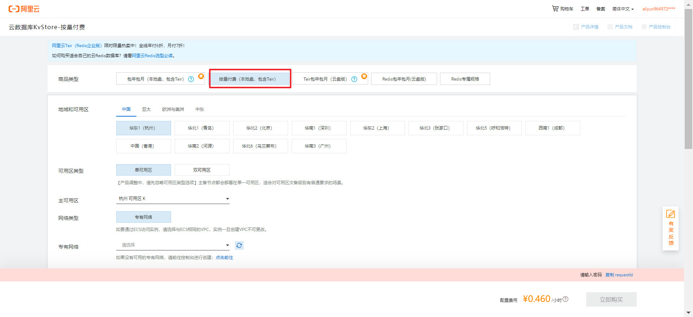

# springboot入门

## 创建maven工程，导入依赖

```xml
<?xml version="1.0" encoding="UTF-8"?>
<project xmlns="http://maven.apache.org/POM/4.0.0"
         xmlns:xsi="http://www.w3.org/2001/XMLSchema-instance"
         xsi:schemaLocation="http://maven.apache.org/POM/4.0.0 http://maven.apache.org/xsd/maven-4.0.0.xsd">
    <modelVersion>4.0.0</modelVersion>

    <groupId>com.shy</groupId>
    <artifactId>springboot1</artifactId>
    <version>1.0-SNAPSHOT</version>

    <parent>
        <groupId>org.springframework.boot</groupId>
        <artifactId>spring-boot-starter-parent</artifactId>
        <version>2.3.4.RELEASE</version>
    </parent>


    <dependencies>
        <dependency>
            <groupId>org.springframework.boot</groupId>
            <artifactId>spring-boot-starter-web</artifactId>
        </dependency>
    </dependencies>

</project>
```

## 创建主程序

```java
package com.shy.test;

import org.springframework.boot.SpringApplication;
import org.springframework.boot.autoconfigure.SpringBootApplication;

@SpringBootApplication
public class MainTest {

    public static void main(String[] args) {
        SpringApplication.run(MainTest.class,args);
    }
}
```

## 编写业务类

```java
package com.shy.test.controllers;

import org.springframework.web.bind.annotation.RequestMapping;
import org.springframework.web.bind.annotation.RestController;

//@Controller
//@ResponseBody
@RestController//=@Controller+@ResponseBody
public class Controller1 {
    @RequestMapping("/hello")
    public String hello(){
        return "hello,springboot";
    }
}

```

* 运行主函数：

* 访问localhost:8080/hello
* 注意：
  * controller类必须是主函数所在类的所在包的类或者子包的类。

## 简化配置

* 创建资源文件
  * application.properties

```properties
#将tomcat服务器端口号改为8888
server.port=8888
```

## 简化部署

导入插件，使用插件，直接将项目打成jar包。

```xml
 	<build>
        <plugins>
            <plugin>
                <groupId>org.springframework.boot</groupId>
                <artifactId>spring-boot-maven-plugin</artifactId>
            </plugin>
        </plugins>
    </build>
```

# 底层注解

## @Configuration详解

* 创建Pet类

```java
package com.shy.test.beans;

public class Pet {
    private String name;

    @Override
    public String toString() {
        return "Pet{" +
                "name='" + name + '\'' +
                '}';
    }

    public String getName() {
        return name;
    }

    public void setName(String name) {
        this.name = name;
    }
}
```

* 创建Person类，内含有Pet类的对象。

```java
package com.shy.test.beans;

public class Person {
    private String name;
    private Integer age;
    private Pet pet;


    public String getName() {
        return name;
    }

    public void setName(String name) {
        this.name = name;
    }

    public Integer getAge() {
        return age;
    }

    public void setAge(Integer age) {
        this.age = age;
    }

    public Pet getPet() {
        return pet;
    }

    public void setPet(Pet pet) {
        this.pet = pet;
    }

    public Person() {
    }

    public Person(String name, Integer age, Pet pet) {
        this.name = name;
        this.age = age;
        this.pet = pet;
    }
}
```

* 使用注解创建配置类，将上述两个组件添加到ioc容器中,并且获取bean：

```java
package com.shy.test;

import com.shy.test.beans.Person;
import org.springframework.boot.SpringApplication;
import org.springframework.boot.autoconfigure.SpringBootApplication;
import org.springframework.context.ConfigurableApplicationContext;

@SpringBootApplication
public class MainTest {
    public static void main(String[] args) {
        //获取ioc容器的实例
        ConfigurableApplicationContext run = SpringApplication.run(MainTest.class, args);
        //查看容器中的组件名
        String[] beanDefinitionNames = run.getBeanDefinitionNames();
        for (String str: beanDefinitionNames){
            System.out.println(str);
        }

        Person person1 = run.getBean("personBean", Person.class);
        Person person2 = run.getBean("personBean", Person.class);

        System.out.println("两次获取到的bean是否一样："+ (person1==person2));
    }
}
```

* 默认情况下，与spring中一致，返回的都是单实例的对象。

* 配置类本身也是一个组件：

```java
package com.shy.test;

import com.shy.test.beans.Person;
import com.shy.test.config.MyConfig;
import org.springframework.boot.SpringApplication;
import org.springframework.boot.autoconfigure.SpringBootApplication;
import org.springframework.context.ConfigurableApplicationContext;

@SpringBootApplication
public class MainTest {
    public static void main(String[] args) {
        //获取ioc容器的实例
        ConfigurableApplicationContext run = SpringApplication.run(MainTest.class, args);
        //查看容器中的组件名
        String[] beanDefinitionNames = run.getBeanDefinitionNames();
        for (String str: beanDefinitionNames){
            System.out.println(str);
        }
        System.out.println("---------------------");

        MyConfig myConfig = run.getBean(MyConfig.class);
        System.out.println(myConfig);
    }
}
```

### @Configuration中的proxyBeanMethods属性

* 默认值为true

* 前面通过ioc容器直接拿到了容器中的实例，我们也可以通过配置类调用方法拿到对应的实例。
* proxyBeanMethods属性设置为true时，是通过代理类对象调用方法，springboot总会检查这个方法对应的实例，是否在容器中有，返回这个单实例的对象：

```java
package com.shy.test;

import com.shy.test.beans.Person;
import com.shy.test.config.MyConfig;
import org.springframework.boot.SpringApplication;
import org.springframework.boot.autoconfigure.SpringBootApplication;
import org.springframework.context.ConfigurableApplicationContext;

@SpringBootApplication
public class MainTest {
    public static void main(String[] args) {
        //获取ioc容器的实例
        ConfigurableApplicationContext run = SpringApplication.run(MainTest.class, args);
        //获取配置类的实例
        MyConfig myConfig = run.getBean(MyConfig.class);
        Person person1 = myConfig.personBean();
        Person person2 = myConfig.personBean();
        System.out.println(person1==person2);//true
    }
}
```

* proxyBeanMethods=false

```java
package com.shy.test.config;

import com.shy.test.beans.Person;
import com.shy.test.beans.Pet;
import org.springframework.context.annotation.Bean;
import org.springframework.context.annotation.Configuration;

@Configuration(proxyBeanMethods = false)//告诉springboot这是一个配置类
public class MyConfig {
    @Bean//给容器中添加组件，以方法名作为组件的id，返回类型就是组件类型，返回的值，就是组件在容器中的实例。
    public Person personBean(){
        return new Person("person1",23,null);
    }
    @Bean//如果想给组件一个自定义名字，通过value属性设置：@Bean(value = "petbean")
    public Pet petBean(){
        return new Pet("cat");
    }
}
```

* 此时调用配置类对象的方法获取的实例

```java
package com.shy.test;

import com.shy.test.beans.Person;
import com.shy.test.config.MyConfig;
import org.springframework.boot.SpringApplication;
import org.springframework.boot.autoconfigure.SpringBootApplication;
import org.springframework.context.ConfigurableApplicationContext;

@SpringBootApplication
public class MainTest {
    public static void main(String[] args) {
        //获取ioc容器的实例
        ConfigurableApplicationContext run = SpringApplication.run(MainTest.class, args);
        //获取配置类的实例
        MyConfig myConfig = run.getBean(MyConfig.class);
        Person person1 = myConfig.personBean();
        Person person2 = myConfig.personBean();
        System.out.println(person1==person2);//false
    }
}
```

proxyBeanMethods 代理bean的方法

可以解决的场景：

* 组件依赖：

Person的对象有一个Pet：通过myConfig类获取到的

```java
package com.shy.test.config;

import com.shy.test.beans.Person;
import com.shy.test.beans.Pet;
import org.springframework.context.annotation.Bean;
import org.springframework.context.annotation.Configuration;

@Configuration//告诉springboot这是一个配置类
public class MyConfig {
    @Bean//给容器中添加组件，以方法名作为组件的id，返回类型就是组件类型，返回的值，就是组件在容器中的实例。
    public Person personBean(){
        return new Person("person1",23,this.petBean());
    }
    @Bean//如果想给组件一个自定义名字，通过value属性设置：@Bean(value = "petbean")
    public Pet petBean(){
        return new Pet("cat");
    }
}
```

在true情况下：获取到的对象就是ioc容器中的对象。

```java
package com.shy.test;

import com.shy.test.beans.Person;
import com.shy.test.beans.Pet;
import com.shy.test.config.MyConfig;
import org.springframework.boot.SpringApplication;
import org.springframework.boot.autoconfigure.SpringBootApplication;
import org.springframework.context.ConfigurableApplicationContext;

@SpringBootApplication
public class MainTest {
    public static void main(String[] args) {
        //获取ioc容器的实例
        ConfigurableApplicationContext run = SpringApplication.run(MainTest.class, args);

        Pet petBean = run.getBean("petBean", Pet.class);

        Person personBean = run.getBean("personBean", Person.class);
        Pet pet = personBean.getPet();
        System.out.println(pet == petBean);//true
    }
}
```

在false情况下：获取到的对象不是ioc容器中的对象。

* Full(proxyBeanMethods = true)：
* Lite(proxyBeanMethods =false)：轻量级模式：不会检查ioc容器，速度比较快

## @Import

在spring中的

@Component @Service @Repository @Controller 可以正常使用

* 在容器的任何一个组件的类上标注@Import注解，可以导入组件，组件默认的名字就是全类名
* 导入组件时创建对象的方法是无参的构造器。

```java
package com.shy.test.config;

import com.shy.test.beans.Person;
import com.shy.test.beans.Pet;
import org.springframework.context.annotation.Bean;
import org.springframework.context.annotation.Configuration;
import org.springframework.context.annotation.Import;

@Import({Person.class})
@Configuration(proxyBeanMethods = false)
public class MyConfig {
    @Bean
    public Person personBean(){
        return new Person("person1",23,this.petBean());
    }
    @Bean
    public Pet petBean(){
        return new Pet("cat");
    }
}
```

```java
package com.shy.test;

import com.shy.test.beans.Person;
import org.springframework.boot.SpringApplication;
import org.springframework.boot.autoconfigure.SpringBootApplication;
import org.springframework.context.ConfigurableApplicationContext;


@SpringBootApplication
public class MainTest {
    public static void main(String[] args) {
        //获取ioc容器的实例
        ConfigurableApplicationContext run = SpringApplication.run(MainTest.class, args);

        String[] beanNamesForType = run.getBeanNamesForType(Person.class);

        for (String str :beanNamesForType){
            System.out.println(str);//两个：personBean com.shy.test.beans.Person
        }
    }
}
```

## @Conditional条件装配

* 条件装配：满足Conditional指定的条件，则进行组件注入
* @Conditional及其派生注解：

* * 

* 以@ConditionalOnBean为例：

```java
package com.shy.test.config;

import com.shy.test.beans.Person;
import com.shy.test.beans.Pet;
import org.springframework.boot.autoconfigure.condition.ConditionalOnBean;
import org.springframework.context.annotation.Bean;
import org.springframework.context.annotation.Configuration;


@Configuration
public class MyConfig {

    @Bean("petBean")
    public Pet petBean(){
        return new Pet("cat");
    }

    @Bean
    @ConditionalOnBean(name = "petBean")//根据ioc中是否含有id=petBean的组件，如果有则创建personBean的组件
    public Person personBean(){
        return new Person("person1",23,this.petBean());
    }
}
```

```java
package com.shy.test;

import org.springframework.boot.SpringApplication;
import org.springframework.boot.autoconfigure.SpringBootApplication;
import org.springframework.context.ConfigurableApplicationContext;


@SpringBootApplication
public class MainTest {
    public static void main(String[] args) {
        //获取ioc容器的实例
        ConfigurableApplicationContext run = SpringApplication.run(MainTest.class, args);
        //判断容器中是否含有id=personBean的组件
        boolean personBean = run.containsBean("personBean");
        boolean petBean = run.containsBean("petBean");

        System.out.println("personBean:"+personBean+"     petBean:"+petBean);//true true

    }
}
```

* 注意personBean和petBean的先后顺序。

* @ConditionalOnBean还可以标注在类上：

```java
package com.shy.test.config;

import com.shy.test.beans.Person;
import com.shy.test.beans.Pet;
import org.springframework.boot.autoconfigure.condition.ConditionalOnBean;
import org.springframework.context.annotation.Bean;
import org.springframework.context.annotation.Configuration;


@ConditionalOnBean(name = "petBean")//如果有petBean组件。才会创建下面几个组件
@Configuration
public class MyConfig {

    @Bean("petBean")
    public Pet petBean(){
        return new Pet("cat");
    }

    @Bean

    public Person personBean(){
        return new Person("person1",23,this.petBean());
    }
}
```

## @ImportResource导入spring.xml

在spring的配置文件中的组件可以通过该注解导入：

```java
package com.shy.test.config;

import com.shy.test.beans.Person;
import com.shy.test.beans.Pet;
import org.springframework.boot.autoconfigure.condition.ConditionalOnBean;
import org.springframework.context.annotation.Bean;
import org.springframework.context.annotation.Configuration;

@ImportResource("classpath:spring.xml")
@ConditionalOnBean(name = "petBean")//如果有petBean组件。才会创建下面几个组件
@Configuration
public class MyConfig {

    @Bean("petBean")
    public Pet petBean(){
        return new Pet("cat");
    }

    @Bean

    public Person personBean(){
        return new Person("person1",23,this.petBean());
    }
}
```

## @ConfigurationProperties配置绑定

该注解的作用是讲application.properties文件中的配置绑定到javaBean中

举例：

* 创建Car类

```java
package com.shy.test.beans;

public class Car {
    private Integer price;
    private String name;

    public Integer getPrice() {
        return price;
    }

    public void setPrice(Integer price) {
        this.price = price;
    }

    public String getName() {
        return name;
    }

    public void setName(String name) {
        this.name = name;
    }

    public Car() {
    }

    public Car(Integer price, String name) {
        this.price = price;
        this.name = name;
    }
}
```

* 在资源文件中编写汽车名字和汽车的价格

```properties
car.name=BYD
car.price=10000
```

```java
package com.shy.test.beans;

import org.springframework.boot.context.properties.ConfigurationProperties;
import org.springframework.stereotype.Component;

@Component
@ConfigurationProperties(prefix = "car")//Car类中的属性，将被资源文件中car为前缀的对应属性名的值对对应的属性赋值
public class Car {
    private Integer price;
    private String name;

    @Override
    public String toString() {
        return "Car{" +
                "price=" + price +
                ", name='" + name + '\'' +
                '}';
    }

    public Integer getPrice() {
        return price;
    }

    public void setPrice(Integer price) {
        this.price = price;
    }

    public String getName() {
        return name;
    }

    public void setName(String name) {
        this.name = name;
    }

    public Car() {
    }

    public Car(Integer price, String name) {
        this.price = price;
        this.name = name;
    }
}
```

* 进行测试：访问/car

```java
package com.shy.test.controllers;

import com.shy.test.beans.Car;
import org.springframework.beans.factory.annotation.Autowired;
import org.springframework.web.bind.annotation.RequestMapping;
import org.springframework.web.bind.annotation.RestController;

//@Controller
//@ResponseBody
@RestController//=@Controller+@ResponseBody
public class Controller1 {
    @Autowired//根据类型注入
    private Car car;

    @RequestMapping("/car")
    public String car() {
        return car.toString();
    }

}
```

使用场景：配置数据库相关内容

* 其他实现方式：使用EnableConfigurationProperties(Car.class)，此时不需要在Car类上添加@Componet

* 使用场景，导入第三方jar包中的类

```java
package com.shy.test.beans;

import org.springframework.boot.context.properties.ConfigurationProperties;
import org.springframework.stereotype.Component;


@ConfigurationProperties(prefix = "car")//Car类中的属性，将被资源文件中car为前缀的对应属性名的值对对应的属性赋值
public class Car {
    private Integer price;
    private String name;

    @Override
    public String toString() {
        return "Car{" +
                "price=" + price +
                ", name='" + name + '\'' +
                '}';
    }

    public Integer getPrice() {
        return price;
    }

    public void setPrice(Integer price) {
        this.price = price;
    }

    public String getName() {
        return name;
    }

    public void setName(String name) {
        this.name = name;
    }

    public Car() {
    }

    public Car(Integer price, String name) {
        this.price = price;
        this.name = name;
    }
}
```

* 在配置类中添加@EnableConfigurationProperties注解

```java
package com.shy.test.config;

import com.shy.test.beans.Car;
import com.shy.test.beans.Person;
import com.shy.test.beans.Pet;
import org.springframework.boot.autoconfigure.condition.ConditionalOnBean;
import org.springframework.boot.context.properties.EnableConfigurationProperties;
import org.springframework.context.annotation.Bean;
import org.springframework.context.annotation.Configuration;


@EnableConfigurationProperties(Car.class)//注解中写上类名。包含了@Component的功能
@Configuration
public class MyConfig {

    @Bean("petBean")
    public Pet petBean(){
        return new Pet("cat");
    }

    @Bean
    @ConditionalOnBean(name = "petBean")//根据ioc中是否含有id=petBean的组件，如果有则创建personBean的组件
    public Person personBean(){
        return new Person("person1",23,this.petBean());
    }
}
```

# 开发小技巧

## Lombok

* 简化javaBean的开发：
* 引入依赖

```xml
<dependency>
    <groupId>org.projectlombok</groupId>
    <artifactId>lombok</artifactId>
    <version>1.18.12</version>
    <scope>provided</scope>
</dependency>
```

* 安装lombok插件

https://blog.csdn.net/lilydfghh/article/details/107304471

几个注解的使用：

@Data：生成get();set();

@ToString：生成toString();

@AllArgsConstructor：生成所有参数的构造器

@NoArgsConstructor：生成空参构造器

@EqualsAndHashCode：生成equals();hashCode();

@Slf4j

```java
package com.shy.test.controllers;

import lombok.extern.slf4j.Slf4j;
import org.springframework.web.bind.annotation.RequestMapping;
import org.springframework.web.bind.annotation.RestController;

@Slf4j
@RestController
public class Controller1 {


    @RequestMapping("/car")
    public String car() {
        log.info("请求就来了");
        return "hello springboot!";
    }

}
```

## dev-tools

* 引入依赖
* 作用：自动更新，非热部署。

```xml
<dependency>
    <groupId>org.springframework.boot</groupId>
    <artifactId>spring-boot-devtools</artifactId>
    <optional>true</optional>
</dependency>
```

* 通过ctrl+f9实现热部署

## spring initailizr（项目初始化向导）


 

# 配置文件-ymal的使用

* 用法：同properties

* 简介：YAML 是 "YAML Ain't Markup Language"（YAML 不是一种标记语言）的递归缩写。在开发的这种语言时，YAML 的意思其实是："Yet Another Markup Language"（仍是一种标记语言）。 

* 基本语法：
  * key: value；kv之间有空格
  * 大小写敏感
  * 使用缩进表示层级关系
  * 缩进不允许使用tab，只允许空格
  * 缩进的空格数不重要，只要相同层级的元素左对齐即可
  * '#'表示注释
  * 字符串无需加引号，如果要加，''与""表示字符串内容 会被 转义/不转义

* 各种数据类型的写法：

  * 字面量：单个的、不可再分的值。date、boolean、string、number、null

  ```yaml
  k: v
  #注意有一个空格
  ```

  * 对象：map，object

  ```yaml
  #行内写法：大括号内为json格式的写法。
  k: {k1: v1,k2: v2,k3: v3}
  #行外写法：
  k:
    k1: v1
    k2: v2
    k3: v3
  ```

  * 数组：array、list、set

  ```yaml
  #行内写法：
  k: [v1,v2,v3]
  #行外写法：
  k:
    - v1
    - v2
    - v3
  ```

* 示例：

  * 创建Person类与Pet类：

  ```java
  package com.shy.springboot2.beans;
  
  import lombok.Data;
  import lombok.ToString;
  
  import java.util.Date;
  import java.util.List;
  import java.util.Map;
  import java.util.Set;
  @Data
  @ToString
  public class Person {
      private String userName;
      private Boolean boss;
      private Date birth;
      private Integer age;
      private Pet pet;
      private String[] interests;
      private List<String> animal;
      private Map<String, Object> score;
      private Set<Double> salary;
      private Map<String, List<Pet>> allPets;
  }
  ```

  ```java
  package com.shy.springboot2.beans;
  
  import lombok.Data;
  import lombok.ToString;
  
  @Data
  @ToString
  public class Pet {
      private String name;
      private Double weight;
  }
  ```

  * 配置yaml

  ```yaml
  person:
    username: zhangsan
  boss: true
    birth: 1970/01/01
    age: 23
    pet:
      name: 阿猫
      weight: 88.88
    interests: [篮球,足球]
    animal:
      - 阿猫
      - 阿狗
  #  score:
  #    english: 80
  #    math: 90
    score: {english: 80,math: 90}
    salary:
      - 9999
      - 8888
    allPets:
      sick:
        - {name: 阿猫,weight: 99}
        - name: 阿花
          weight: 88
      health: [{name: 阿花,weight: 199},{name: 阿明,weight: 188}]
  ```
  
  * 测试对象：
  
  ```java
  package com.shy.springboot1;
  
  import com.shy.springboot1.beans.Person;
  import org.springframework.boot.SpringApplication;
  import org.springframework.boot.autoconfigure.SpringBootApplication;
  import org.springframework.context.ConfigurableApplicationContext;
  
  @SpringBootApplication
  public class Springboot1Application {
  
      public static void main(String[] args) {
          ConfigurableApplicationContext run = SpringApplication.run(Springboot1Application.class, args);
          Person person = run.getBean("person", Person.class);
          System.out.println(person);
      }
  
  }
  ```

* 注意：
  * 字符串可以不加单引号或者双引号，默认为双引号。
  * 双引号会正常使用转义字符：例如字符串中有\n，对结果输出会有换行的作用。
  * 而单引号会将转义字符变成正常的字符串，不会有换行的作用，会输出\n字符串。

* yaml数据的读取
  * 可以通过 @Value("${}") 直接注入yaml中的数据
  * 也可以通过@Autowired 注入Environment类的对象获取yaml中所有的数据
  * 使用@ConfigurationProperties

## 自定义类绑定的配置提示

* 导入依赖

```xml
        <dependency>
            <groupId>org.springframework.boot</groupId>
            <artifactId>spring-boot-configuration-processor</artifactId>
            <optional>true</optional>
        </dependency>
```

* 提示信息的依赖在打包时不要加入，通过修改springboot的插件可以实现该功能

```xml
    <build>
        <plugins>
            <plugin>
                <groupId>org.springframework.boot</groupId>
                <artifactId>spring-boot-maven-plugin</artifactId>
                <configuration>
                    <excludes>
                        <exclude>
                            <groupId>org.springframework.boot</groupId>
                            <artifactId>spring-boot-configurationprocessor</artifactId>
                        </exclude>
                    </excludes>
                </configuration>
            </plugin>
        </plugins>
    </build>
```

# web开发

## 静态资源访问

* 在springboot中，将静态资源放在静态资源目录下就可以访问到

### 静态资源目录

* called
* static
* public
* resources
* META-INF/resources


访问： 当前项目根路径/静态资源名  即可访问到。

springboot如何区分访问的是动态的请求还是静态的资源?:

* 静态映射/**
* 当请求发送到服务器端，先去找controller看其是否可以处理，不能处理交给静态资源处理器，静态资源也找不到会报404.

### 静态资源访问前缀

* 默认情况下无前缀:当前项目根路径/静态资源名

* 指定前缀需要配置：当前项目根路径/static-path-pattern/静态资源名

```properties
spring.mvc.static-path-pattern=/resources/**
```

```yaml
spring:
  mvc:
    static-path-pattern: /resources/**
```

* 指定静态资源的存放位置:此时只有mystatic路径下的静态资源可以访问到。

```yaml
spring:
  mvc:
    static-path-pattern: /resources/**
  web:
    resources:
      static-locations: classpath:/called
```

### 欢迎页支持

* 在静态资源路径下存在 index.html
  * 可以配置静态资源路径
  * 不能配置静态资源访问前缀，否则直接访问根目录不会出现欢迎页
* 存在controller能够处理/index

此时访问根目录，即可展示index.html的欢迎页

### 自定义Favicon

* 当我们在静态资源路径下有一个favicon.ico的图片文件时，我们访问任何的静态资源，该静态资源的图标都会显示为该图片：
  * 注意，依然不能配置静态资源前缀


## 请求处理

* 以前对各种类型的请求：
  * /getUser 获取用户
  * /deleteUser 删除用户
  * ...
* 使用restful风格处理各种请求：对用户的各种请求统一用/user进行处理
  * GET-获取用户
  * DELETE-删除用户
  * PUT-修改用户
  * POST-保存用户
* springboot已经帮我们配置了HiddenHttpMethodFilter,我们只需要加上配置：

```yaml
spring:
  mvc:
    hiddenmethod:
      filter:
        enabled: true #开启表单页面的rest功能
```

### 普通参数与基本注解

* @PathVariable：对请求路径中的参数通过@PathVariable注解在控制器方法的参数列表中获取：

```java
package com.shy.springboot.controllers;

import org.springframework.web.bind.annotation.*;

import java.util.HashMap;
import java.util.Map;

@RestController
public class Controller1 {
    @GetMapping("/car/{id}/owner/{username}")
    public Map<String,Object> getCar(@PathVariable("id") Integer id,@PathVariable("username") String username){
        HashMap<String, Object> hashMap = new HashMap<>();
        hashMap.put("id",id);
        hashMap.put("username",username);
        return hashMap;
    }
}
```

```xml
<!DOCTYPE html>
<html lang="en">
<head>
    <meta charset="UTF-8">
    <title>Title</title>
</head>
<body>
<p>welcome,shy</p>
<a href="/car/3/owner/lisi">测试@PathVariable</a>
</body>
</html>
```

也可以将所有的请求参数放在一个map集合中：

```java
package com.shy.springboot.controllers;

import org.springframework.web.bind.annotation.*;
import java.util.Map;

@RestController
public class Controller1 {
    @GetMapping("/car/{id}/owner/{username}")
    public Map<String,Object> getCar(@PathVariable Map<String,Object> map){
        return map;
    }
}
```

* RequestHeader：获取请求头信息

```java
package com.shy.springboot.controllers;

import org.springframework.web.bind.annotation.*;

import java.util.HashMap;
import java.util.Map;

@RestController
public class Controller1 {
    @GetMapping("/car/{id}/owner/{username}")
    public Map<String,Object> getCar(@RequestHeader("User-Agent") String userAgent,@RequestHeader Map<String,Object> map){
        HashMap<String, Object> hashMap = new HashMap<>();
        hashMap.put("User-Agent",userAgent);
        hashMap.put("allRequestHeader",map);
        return hashMap;
    }
}
```

(@RequestHeader("User-Agent") String userAgent   //获取请求头中的浏览器信息

,@RequestHeader Map<String,Object> map)  //获取请求头中的全部信息,可以通过一个Map集合，MultiValueMap，HttpHeaders拿到全部信息，这里以Map为例

* @RequestParam：获取请求参数

```java
    @GetMapping("/person")
    public Map<String,Object> getInterests(@RequestParam("id")Integer id, @RequestParam("interest")List<String> interests,
    @RequestParam Map<String,String> map){
        HashMap<String, Object> hashMap = new HashMap<>();
        hashMap.put("id",id);
        hashMap.put("interests",interests);
        hashMap.put("all",map);
        return hashMap;
    }
}
```

```html
@<!DOCTYPE html>
<html lang="en">
<head>
    <meta charset="UTF-8">
    <title>Title</title>
</head>
<body>
<p>welcome,shy</p>
<a href="/person?id=1&interest=篮球&interest=足球">测试@RequestParam</a>
</body>
</html>
```

* @CookieValue
* @RequestBody
* @RequestAttribute
* @MatrixVariable
* ....

# Thymeleaf

* 导入依赖

```xml
        <dependency>
            <groupId>org.springframework.boot</groupId>
            <artifactId>spring-boot-starter-thymeleaf</artifactId>
        </dependency>
```

* springboot已经配好了视图解析器。
  * 默认前缀为classpath:/templates/
  * 后缀为.html

# junit5在springboot中的使用

* 相关依赖

```xml
        <dependency>
            <groupId>org.springframework.boot</groupId>
            <artifactId>spring-boot-starter-test</artifactId>
            <scope>test</scope>
        </dependency>
```

* spring initailizr已经为我们提供了测试类，我们需要在测试方法所在类上加@SpringBootTest，在测试方法加上@Test即可进行单元测试。
* @SpringBoot：测试时使用springboot中的功能，如自动注入等...


* 注意：

  SpringBoot 2.4 以上版本移除了默认对Vintage 的依赖。如果需要兼容junit4需要自行引入（不能使用junit4的功能 @Test）

  JUnit 5’s Vintage Engine Removed from spring-boot-starter-test,如果需要继续兼容junit4需要自行引入vintage

```xml
<dependency>
    <groupId>org.junit.vintage</groupId>
    <artifactId>junit-vintage-engine</artifactId>
    <scope>test</scope>
    <exclusions>
        <exclusion>
            <groupId>org.hamcrest</groupId>
            <artifactId>hamcrest-core</artifactId>
        </exclusion>
    </exclusions>
</dependency>
```

## junit5中的其他常用注解

* @DisPlayName：为单元测试起名字

* @BeforeEach：在每次测试之前执行
* @AfterEach：在每次测试之后执行
* @BeaforeAll：在所有测试之前执行，标注所在方法必须是静态方法。
* @AfterAll：在所有测试之后执行，标注所在方法必须是静态方法。

* @Disabled：禁用标注的单元测试。
* @Timeout：设置测试方法多长时间为超时，超时抛出异常。

* @RepeatedTest：设置重复的测试

```java
package com.shy.springboot;

import org.junit.jupiter.api.*;
import org.springframework.boot.test.context.SpringBootTest;

import java.util.concurrent.TimeUnit;

class SpringbootApplicationTests {

    @DisplayName("这是第一个junit测试")
    @Test
    public void test1() {
        System.out.println(1);
    }
    @Test
    @DisplayName("这是第二个junit测试")
    public void test2(){
        System.out.println(2);
    }
    @Disabled
    @Test
    @DisplayName("这是第三个junit测试")
    public void test3(){
        System.out.println(3);
    }
    @Timeout(value = 500,unit = TimeUnit.MILLISECONDS)
    @Test
    @DisplayName("这是第四个junit测试")
    public void test4(){
        try {
            Thread.sleep(1000);
        } catch (InterruptedException e) {
            e.printStackTrace();
        }
        System.out.println(4);
    }

    @RepeatedTest(5)
    @Test
    @DisplayName("这是第五个junit测试")
    public void test5(){
        System.out.println(5);
    }
    @BeforeEach
    public void beforeEach(){
        System.out.println("一个测试就要开始了");
    }

    @AfterEach
    public void afterEach(){
        System.out.println("一个测试就要结束了");
    }
    @BeforeAll
    public static void beforeAll(){
        System.out.println("所有的测试就要开始了");
    }
    @AfterAll
    public static void afterAll(){
        System.out.println("所有的测试就要结束了");
    }
}
```

## 断言

* 断言（assertions）是测试方法中的核心部分，用来对测试需要满足的条件进行验证。这些断言方法都是 org.junit.jupiter.api.Assertions 的静态方法。
* JUnit 5 内置的断言可以分成如下几个类别：检查业务逻辑返回的数据是否合理。所有的测试运行结束以后，会有一个详细的测试报告；

### 简单断言

用来对单个值进行简单的验证。如：

| 方法            | 说明                                 |
| --------------- | ------------------------------------ |
| assertEquals    | 判断两个对象或两个原始类型是否相等   |
| assertNotEquals | 判断两个对象或两个原始类型是否不相等 |
| assertSame      | 判断两个对象引用是否指向同一个对象   |
| assertNotSame   | 判断两个对象引用是否指向不同的对象   |
| assertTrue      | 判断给定的布尔值是否为 true          |
| assertFalse     | 判断给定的布尔值是否为 false         |
| assertNull      | 判断给定的对象引用是否为 null        |
| assertNotNull   | 判断给定的对象引用是否不为 null      |

* assertEquals();演示：

```java
package com.shy.springboot;

import org.junit.jupiter.api.Assertions;
import org.junit.jupiter.api.DisplayName;
import org.junit.jupiter.api.Test;

public class AssertTest {
    @DisplayName("测试简单断言")
    @Test
    public void testAssert(){
        int add = add(2, 3);
        Assertions.assertEquals(6,add);
    }

    public int add(int a,int b){
        return a+b;
    }
}
```

* assertSame();演示

```java
package com.shy.springboot;

import org.junit.jupiter.api.Assertions;
import org.junit.jupiter.api.DisplayName;
import org.junit.jupiter.api.Test;

public class AssertTest {
    @DisplayName("测试简单断言")
    @Test
    public void testAssert(){
        Object obj1 = new Object();
        Object obj2 = new Object();
        Assertions.assertSame(obj1,obj2,"两个对象的引用不一样");//自定义断言的错误信息
    }

}
```

* 注意，断言一旦错误，后面的代码均不会执行。

### 数组断言

通过 assertArrayEquals 方法来判断两个对象或原始类型的数组是否相等

```java
@Test
@DisplayName("array assertion")
public void array() {
 assertArrayEquals(new int[]{1, 2}, new int[] {1, 2});
}
```

### 组合断言

assertAll 方法接受多个 org.junit.jupiter.api.Executable 函数式接口的实例作为要验证的断言，可以通过 lambda 表达式很容易的提供这些断言

* 测试assertAll();

```java
package com.shy.springboot;

import org.junit.jupiter.api.Assertions;
import org.junit.jupiter.api.DisplayName;
import org.junit.jupiter.api.Test;

public class AssertTest {
    @Test
    @DisplayName("assert all")
    public void all() {
        Assertions.assertAll("为组合断言起名字",
                () -> Assertions.assertEquals(2, 1 + 1),
                () -> Assertions.assertTrue(true)
        );
    }

}
```

### 异常断言

在JUnit4时期，想要测试方法的异常情况时，需要用**@Rule**注解的ExpectedException变量还是比较麻烦的。而JUnit5提供了一种新的断言方式**Assertions.assertThrows()** ,配合函数式编程就可以进行使用。

```java
@Test
@DisplayName("异常测试")
public void exceptionTest() {
    ArithmeticException exception = Assertions.assertThrows(
           //扔出断言异常
            ArithmeticException.class, 
        () -> System.out.println(1 % 0)
    );

}
```

### 超时断言

Junit5还提供了**Assertions.assertTimeout()** 为测试方法设置了超时时间

```java
@Test
@DisplayName("超时测试")
public void timeoutTest() {
    //如果测试方法时间超过1s将会异常
    Assertions.assertTimeout(Duration.ofMillis(1000), () -> Thread.sleep(500));
}
```

### 快速失败

通过 fail 方法直接使得测试失败

```java
@Test
@DisplayName("fail")
public void shouldFail() {
 fail("This should fail");
}
```

## 前置条件（assumptions）

JUnit 5 中的前置条件（**assumptions【假设】**）类似于断言，不同之处在于**不满足的断言会使得测试方法失败**，而不满足的**前置条件只会使得测试方法的执行终止**。前置条件可以看成是测试方法执行的前提，当该前提不满足时，就没有继续执行的必要。

```java
@DisplayName("前置条件")
public class AssumptionsTest {
 private final String environment = "DEV";
 
 @Test
 @DisplayName("simple")
 public void simpleAssume() {
    assumeTrue(Objects.equals(this.environment, "DEV"));
    assumeFalse(() -> Objects.equals(this.environment, "PROD"));
 }
 
 @Test
 @DisplayName("assume then do")
 public void assumeThenDo() {
    assumingThat(
       Objects.equals(this.environment, "DEV"),
       () -> System.out.println("In DEV")
    );
 }
}
```

assumeTrue 和 assumFalse 确保给定的条件为 true 或 false，不满足条件会使得测试执行终止。assumingThat 的参数是表示条件的布尔值和对应的 Executable 接口的实现对象。只有条件满足时，Executable 对象才会被执行；当条件不满足时，测试执行并不会终止。

## 参数化测试

参数化测试是JUnit5很重要的一个新特性，它使得用不同的参数多次运行测试成为了可能，也为我们的单元测试带来许多便利。

利用**@ValueSource**等注解，指定入参，我们将可以使用不同的参数进行多次单元测试，而不需要每新增一个参数就新增一个单元测试，省去了很多冗余代码。

**@ValueSource**: 为参数化测试指定入参来源，支持八大基础类以及String类型,Class类型

**@NullSource**: 表示为参数化测试提供一个null的入参

**@EnumSource**: 表示为参数化测试提供一个枚举入参

**@CsvFileSource**：表示读取指定CSV文件内容作为参数化测试入参

**@MethodSource**：表示读取指定方法的返回值作为参数化测试入参(注意方法返回需要是一个流)


当然如果参数化测试仅仅只能做到指定普通的入参还达不到让我觉得惊艳的地步。让我真正感到他的强大之处的地方在于他可以支持外部的各类入参。如:CSV,YML,JSON 文件甚至方法的返回值也可以作为入参。只需要去实现**ArgumentsProvider**接口，任何外部文件都可以作为它的入参。

```java
@ParameterizedTest
@ValueSource(strings = {"one", "two", "three"})
@DisplayName("参数化测试1")
public void parameterizedTest1(String string) {
    System.out.println(string);
    Assertions.assertTrue(StringUtils.isNotBlank(string));
}


@ParameterizedTest//指明该测试为参数化测试
@MethodSource("method")    //指定方法名
@DisplayName("方法来源参数")
public void testWithExplicitLocalMethodSource(String name) {
    System.out.println(name);
    Assertions.assertNotNull(name);
}

static Stream<String> method() {
    return Stream.of("apple", "banana");
}
```

## 嵌套测试

JUnit 5 可以通过 Java 中的内部类和@Nested 注解实现嵌套测试，从而可以更好的把相关的测试方法组织在一起。在内部类中可以使用@BeforeEach 和@AfterEach 注解，而且嵌套的层次没有限制。

```java
@DisplayName("A stack")
class TestingAStackDemo {

    Stack<Object> stack;

    @Test
    @DisplayName("is instantiated with new Stack()")
    void isInstantiatedWithNew() {
        new Stack<>();
    }

    @Nested
    @DisplayName("when new")
    class WhenNew {

        @BeforeEach
        void createNewStack() {
            stack = new Stack<>();
        }

        @Test
        @DisplayName("is empty")
        void isEmpty() {
            assertTrue(stack.isEmpty());
        }

        @Test
        @DisplayName("throws EmptyStackException when popped")
        void throwsExceptionWhenPopped() {
            assertThrows(EmptyStackException.class, stack::pop);
        }

        @Test
        @DisplayName("throws EmptyStackException when peeked")
        void throwsExceptionWhenPeeked() {
            assertThrows(EmptyStackException.class, stack::peek);
        }

        @Nested
        @DisplayName("after pushing an element")
        class AfterPushing {

            String anElement = "an element";

            @BeforeEach
            void pushAnElement() {
                stack.push(anElement);
            }

            @Test
            @DisplayName("it is no longer empty")
            void isNotEmpty() {
                assertFalse(stack.isEmpty());
            }

            @Test
            @DisplayName("returns the element when popped and is empty")
            void returnElementWhenPopped() {
                assertEquals(anElement, stack.pop());
                assertTrue(stack.isEmpty());
            }

            @Test
            @DisplayName("returns the element when peeked but remains not empty")
            void returnElementWhenPeeked() {
                assertEquals(anElement, stack.peek());
                assertFalse(stack.isEmpty());
            }
        }
    }
}
```

# springboot整合

## 整合mybatis

* 勾选mybatis、mysql的场景

* 导入Druid的依赖

```xml
        <dependency>
            <groupId>com.alibaba</groupId>
            <artifactId>druid</artifactId>
            <version>1.2.8</version>
        </dependency>
```

* 在yaml中进行配置（若不配置type，则springboot内置有默认的数据库连接池）

```yaml
spring:
  datasource:
    driver-class-name: com.mysql.cj.jdbc.Driver
    url: jdbc:mysql//localhost:13306/project
    password: abc123
    username: root
    type: com.alibaba.druid.pool.DruidDataSource
```

* 创建mapper接口，使用@Mapper

```java
package com.shy.springbootmybatis.mappers;

import com.shy.springbootmybatis.entity.User;
import org.apache.ibatis.annotations.Mapper;
import org.apache.ibatis.annotations.Select;

import java.util.List;
@Mapper
public interface UserMapper {
    @Select("select id,password,user_name userName,email from t_user")
    List<User> selectAll();
}
```

* 进行测试

```java
package com.shy.springbootmybatis;

import com.shy.springbootmybatis.entity.User;
import com.shy.springbootmybatis.mappers.UserMapper;
import org.junit.jupiter.api.Test;
import org.springframework.beans.factory.annotation.Autowired;
import org.springframework.boot.test.context.SpringBootTest;

import java.util.Iterator;
import java.util.List;

@SpringBootTest
class SpringbootMybatisApplicationTests {
    @Autowired
    private UserMapper userMapper;
    @Test
    void contextLoads() {
        List<User> list = userMapper.selectAll();
        Iterator<User> iterator = list.iterator();
        while (iterator.hasNext()){
            System.out.println(iterator.next());
        }
    }
}
```

## springboot整合redis

### 准备阿里云redis环境



* 设置redis访问密码
* 申请公网访问地址
* 将白名单修改为所有人都可以访问：0.0.0.0/0

### springboot整合redis

* 引入redis的起步依赖

* 配置redis相关数据

  ```yaml
  spring:
    redis:
      host: 
      port: 
      password: 
      client-type: #声明客户端类型，默认lettuce，使用jedis还需要起步依赖
  ```

  

* springboot提供了jedis和lettuce两个连接工厂

* 使用RedisTemplate<Object,Object>和StringRedisTemplate<String,String>对redis进行操作