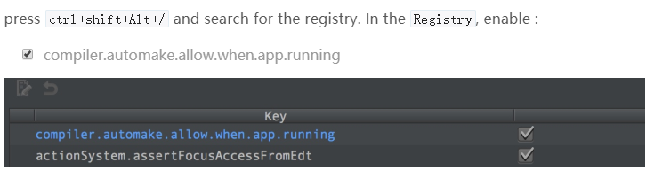
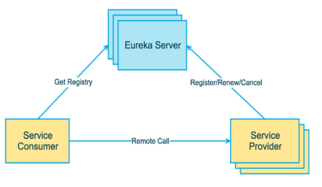
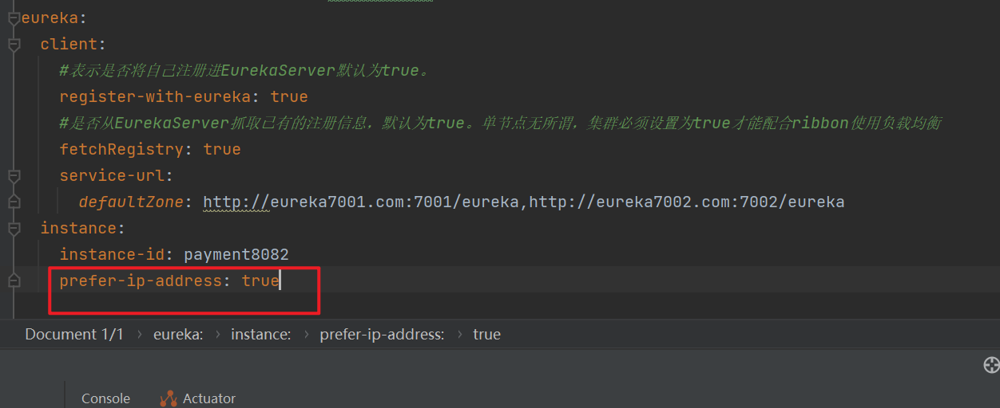
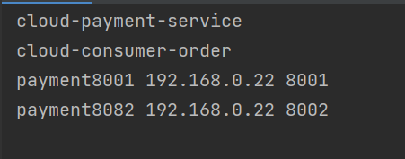
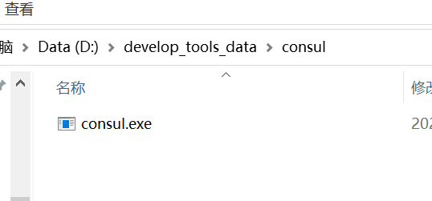
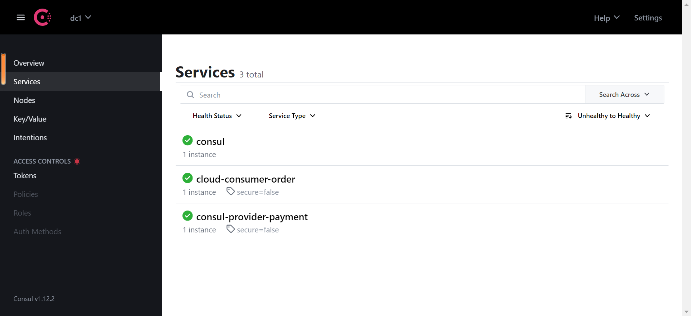
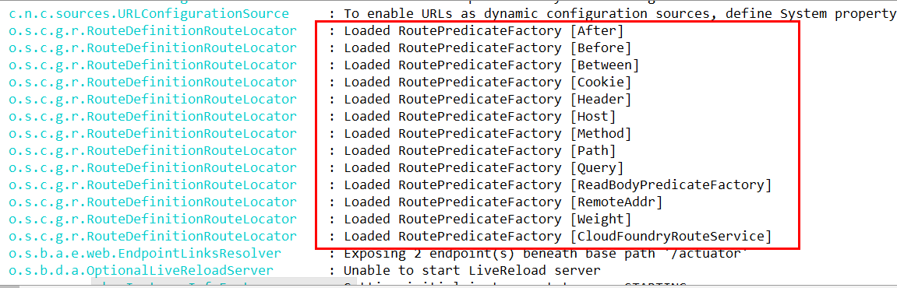
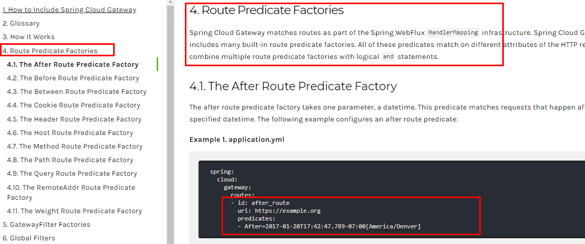
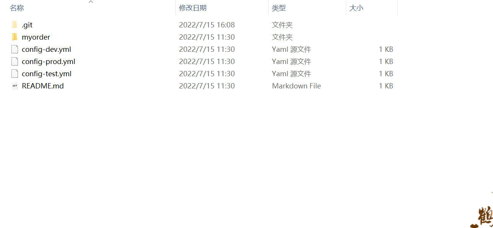

# 环境搭建

## 父工程pom编写

```xml
<?xml version="1.0" encoding="UTF-8"?>

<project xmlns="http://maven.apache.org/POM/4.0.0" xmlns:xsi="http://www.w3.org/2001/XMLSchema-instance"
         xsi:schemaLocation="http://maven.apache.org/POM/4.0.0 http://maven.apache.org/xsd/maven-4.0.0.xsd">
    <modelVersion>4.0.0</modelVersion>

    <groupId>com.atguigu.springcloud</groupId>
    <artifactId>mscloud03</artifactId>
    <version>1.0-SNAPSHOT</version>
    <packaging>pom</packaging>
 
    <!-- 统一管理jar包版本 -->
    <properties>
        <project.build.sourceEncoding>UTF-8</project.build.sourceEncoding>
        <maven.compiler.source>1.8</maven.compiler.source>
        <maven.compiler.target>1.8</maven.compiler.target>
        <junit.version>4.12</junit.version>
        <log4j.version>1.2.17</log4j.version>
        <lombok.version>1.16.18</lombok.version>
        <mysql.version>5.1.47</mysql.version>
        <druid.version>1.1.16</druid.version>
        <mybatis.spring.boot.version>1.3.0</mybatis.spring.boot.version>
    </properties>
 
    <!-- 子模块继承之后，提供作用：锁定版本+子modlue不用写groupId和version  -->
    <dependencyManagement>
        <dependencies>
            <!--spring boot 2.2.2-->
            <dependency>
                <groupId>org.springframework.boot</groupId>
                <artifactId>spring-boot-dependencies</artifactId>
                <version>2.2.2.RELEASE</version>
                <type>pom</type>
                <scope>import</scope>
            </dependency>
            <!--spring cloud Hoxton.SR1-->
            <dependency>
                <groupId>org.springframework.cloud</groupId>
                <artifactId>spring-cloud-dependencies</artifactId>
                <version>Hoxton.SR1</version>
                <type>pom</type>
                <scope>import</scope>
            </dependency>
            <!--spring cloud alibaba 2.1.0.RELEASE-->
            <dependency>
                <groupId>com.alibaba.cloud</groupId>
                <artifactId>spring-cloud-alibaba-dependencies</artifactId>
                <version>2.1.0.RELEASE</version>
                <type>pom</type>
                <scope>import</scope>
            </dependency>
            <dependency>
                <groupId>mysql</groupId>
                <artifactId>mysql-connector-java</artifactId>
                <version>${mysql.version}</version>
            </dependency>
            <dependency>
                <groupId>com.alibaba</groupId>
                <artifactId>druid</artifactId>
                <version>${druid.version}</version>
            </dependency>
            <dependency>
                <groupId>org.mybatis.spring.boot</groupId>
                <artifactId>mybatis-spring-boot-starter</artifactId>
                <version>${mybatis.spring.boot.version}</version>
            </dependency>
            <dependency>
                <groupId>junit</groupId>
                <artifactId>junit</artifactId>
                <version>${junit.version}</version>
            </dependency>
            <dependency>
                <groupId>log4j</groupId>
                <artifactId>log4j</artifactId>
                <version>${log4j.version}</version>
            </dependency>
            <dependency>
                <groupId>org.projectlombok</groupId>
                <artifactId>lombok</artifactId>
                <version>${lombok.version}</version>
                <optional>true</optional>
            </dependency>
        </dependencies>
    </dependencyManagement>

    <build>
        <plugins>
            <plugin>
                <groupId>org.springframework.boot</groupId>
                <artifactId>spring-boot-maven-plugin</artifactId>
                <configuration>
                    <fork>true</fork>
                    <addResources>true</addResources>
                </configuration>
            </plugin>
        </plugins>
    </build>

</project>
```

## 支付模块构建

* 创建子模块：cloud-provider-payment8001
* 引入依赖

```xml
	 <parent>
        <artifactId>springcloud</artifactId>
        <groupId>com.shy</groupId>
        <version>1.0-SNAPSHOT</version>
    </parent>
    <modelVersion>4.0.0</modelVersion>

    <artifactId>cloud-provider-payment8001</artifactId>

    <dependencies>
        <dependency>
            <groupId>org.springframework.boot</groupId>
            <artifactId>spring-boot-starter-web</artifactId>
        </dependency>
        <dependency>
            <groupId>org.springframework.boot</groupId>
            <artifactId>spring-boot-starter-actuator</artifactId>
        </dependency>
        <dependency>
            <groupId>org.mybatis.spring.boot</groupId>
            <artifactId>mybatis-spring-boot-starter</artifactId>
        </dependency>
        <dependency>
            <groupId>com.alibaba</groupId>
            <artifactId>druid-spring-boot-starter</artifactId>
            <version>1.1.10</version>
        </dependency>
        <!--mysql-connector-java-->
        <dependency>
            <groupId>mysql</groupId>
            <artifactId>mysql-connector-java</artifactId>
        </dependency>
        <!--jdbc-->
        <dependency>
            <groupId>org.springframework.boot</groupId>
            <artifactId>spring-boot-starter-jdbc</artifactId>
        </dependency>
        <dependency>
            <groupId>org.springframework.boot</groupId>
            <artifactId>spring-boot-devtools</artifactId>
            <scope>runtime</scope>
            <optional>true</optional>
        </dependency>
        <dependency>
            <groupId>org.projectlombok</groupId>
            <artifactId>lombok</artifactId>
            <optional>true</optional>
        </dependency>
        <dependency>
            <groupId>org.springframework.boot</groupId>
            <artifactId>spring-boot-starter-test</artifactId>
            <scope>test</scope>
        </dependency>
    </dependencies>
</project>
```

* yaml文件的编写

```yaml
 server:
  port: 8001

spring:
  application:
    name: cloud-payment-service
  datasource:
    type: com.alibaba.druid.pool.DruidDataSource            # 当前数据源操作类型
    driver-class-name: org.gjt.mm.mysql.Driver              # mysql驱动包 com.mysql.jdbc.Driver
    url: jdbc:mysql://localhost:3306/db2019?useUnicode=true&characterEncoding=utf-8&useSSL=false
    username: root
    password: abc123

mybatis:
  mapperLocations: classpath:mapper/*.xml
  type-aliases-package: com.shy.springcloud.entities    # 所有Entity别名类所在包
```

* 主启动类的编写

```java
package com.shy.springcloud;

import org.springframework.boot.SpringApplication;
import org.springframework.boot.autoconfigure.SpringBootApplication;

/***
 * @author shy
 * @date 2022-06-28 17:20
 */
@SpringBootApplication
public class PaymentMain8001 {
    public static void main(String[] args) {
        SpringApplication.run(PaymentMain8001.class,args);
    }
}
```

* 数据库表设计

```mysql
CREATE TABLE `payment` (
  `id` bigint(20) NOT NULL AUTO_INCREMENT COMMENT 'ID',
  `serial` varchar(200) DEFAULT '',
  PRIMARY KEY (`id`)
) ENGINE=InnoDB AUTO_INCREMENT=1 DEFAULT CHARSET=utf8;
```

* 实体类的设计

```java
package com.shy.springcloud.entities;

import lombok.AllArgsConstructor;
import lombok.Data;
import lombok.NoArgsConstructor;

import java.io.Serializable;

/***
 * @author shy
 * @date 2022-06-28 17:34
 */
@Data
@NoArgsConstructor
@AllArgsConstructor
public class Payment implements Serializable {
    private Long id;
    private String serial;
}
```

* 结果集的设计

```java
package com.shy.springcloud.entities;

import lombok.AllArgsConstructor;
import lombok.Data;
import lombok.NoArgsConstructor;

/***
 * @author shy
 * @date 2022-06-28 18:07
 */
@AllArgsConstructor
@NoArgsConstructor
@Data
public class Result <T> {
    private Integer code;
    private String message;
    private T t;
}
```

* 编写mapper、service、controller...测试发送请求

## 热部署Devtools

* 在需要的微服务中引入依赖

```xml
<dependency>
    <groupId>org.springframework.boot</groupId>
    <artifactId>spring-boot-devtools</artifactId>
    <scope>runtime</scope>
    <optional>true</optional>
</dependency>
```

* 在父工程中安装插件

```xml
<build>
    <finalName>你自己的工程名字</finalName>
    <plugins>
        <plugin>
            <groupId>org.springframework.boot</groupId>
            <artifactId>spring-boot-maven-plugin</artifactId>
            <configuration>
                <fork>true</fork>
                <addResources>true</addResources>
            </configuration>
        </plugin>
    </plugins>
</build>
```

* 开启自动编译


* Update the value of




* 重启idea

## 消费者订单模块构建

* 注入RestTemplate

```java
@Configuration
public class ApplicationContextConfig {
    @Bean
    public RestTemplate getRestTemplate(){
        return new RestTemplate();
    }
}
```

* 使用RestTemplate进行服务调用

```java
package com.shy.springcloud.controller;

import com.shy.springcloud.entities.Payment;
import com.shy.springcloud.entities.Result;
import org.springframework.beans.factory.annotation.Autowired;
import org.springframework.web.bind.annotation.*;
import org.springframework.web.client.RestTemplate;

/***
 * @author shy
 * @date 2022-07-04 13:43
 */
@RestController
@RequestMapping("/consumer")
public class OrderController {
    @Autowired
    private RestTemplate restTemplate;

    @PostMapping("/insert")
    public Result<Payment> insert(@RequestBody Payment payment){
        return restTemplate.postForObject("http://localhost:8001/payment/insert",payment,Result.class);
    }

    @GetMapping("/select/{id}")
    public Result<Payment> select(@PathVariable Long id){
        return restTemplate.getForObject("http://localhost:8001/payment/select/"+id,Result.class);
    }
}
```

## 工程重建

* 支付模块与消费者模块共有的entity与其他部分提取为一个模块供其他模块过程为工程重建

```xml
<dependencies>
        <dependency>
            <groupId>org.springframework.boot</groupId>
            <artifactId>spring-boot-devtools</artifactId>
            <scope>runtime</scope>
            <optional>true</optional>
        </dependency>
        <dependency>
            <groupId>org.projectlombok</groupId>
            <artifactId>lombok</artifactId>
            <optional>true</optional>
        </dependency>
        <dependency>
            <groupId>cn.hutool</groupId>
            <artifactId>hutool-all</artifactId>
            <version>5.1.0</version>
        </dependency>
    </dependencies>
```

* 进行clean与install


* 在需要的微服务中引入共有模块的依赖

```xml
		<dependency><!-- 引入自己定义的api通用包，可以使用Payment支付Entity -->
            <groupId>com.shy</groupId>
            <artifactId>cloud-commons-api</artifactId>
            <version>${project.version}</version>
        </dependency>
```

# 服务的注册与发现

## eureka

*   什么是服务注册与发现

  Eureka采用了CS的设计架构，Eureka Server 作为服务注册功能的服务器，它是服务注册中心。而系统中的其他微服务，使用 Eureka的客户端连接到 Eureka Server并维持心跳连接。这样系统的维护人员就可以通过 Eureka Server 来监控系统中各个微服务是否正常运行。
  在服务注册与发现中，有一个注册中心。当服务器启动的时候，会把当前自己服务器的信息 比如 服务地址通讯地址等以别名方式注册到注册中心上。另一方（消费者|服务提供者），以该别名的方式去注册中心上获取到实际的服务通讯地址，然后再实现本地RPC调用RPC远程调用框架核心设计思想：在于注册中心，因为使用注册中心管理每个服务与服务之间的一个依赖关系(服务治理概念)。在任何rpc远程框架中，都会有一个注册中心(存放服务地址相关信息(接口地址))



* Eureka包含两个组件：Eureka Server和Eureka Client
  * Eureka Server提供服务注册服务
    各个微服务节点通过配置启动后，会在EurekaServer中进行注册，这样EurekaServer中的服务注册表中将会存储所有可用服务节点的信息，服务节点的信息可以在界面中直观看到。
  * EurekaClient通过注册中心进行访问
    是一个Java客户端，用于简化Eureka Server的交互，客户端同时也具备一个内置的、使用轮询(round-robin)负载算法的负载均衡器。在应用启动后，将会向Eureka Server发送心跳(默认周期为30秒)。如果Eureka Server在多个心跳周期内没有接收到某个节点的心跳，EurekaServer将会从服务注册表中把这个服务节点移除（默认90秒）

## 单机eureka构建

* 创建新的模块cloud-eureka-server7001
* 在该模块引入eureka的服务端依赖

```xml
<dependency>
    <groupId>org.springframework.cloud</groupId>
    <artifactId>spring-cloud-starter-netflix-eureka-server</artifactId>
</dependency>
```

* 其他可能需要的依赖

```xml
		<dependency>
            <groupId>com.atguigu.springcloud</groupId>
            <artifactId>cloud-api-commons</artifactId>
            <version>${project.version}</version>
        </dependency>
        <!--boot web actuator-->
        <dependency>
            <groupId>org.springframework.boot</groupId>
            <artifactId>spring-boot-starter-web</artifactId>
        </dependency>
        <dependency>
            <groupId>org.springframework.boot</groupId>
            <artifactId>spring-boot-starter-actuator</artifactId>
        </dependency>
        <!--一般通用配置-->
        <dependency>
            <groupId>org.springframework.boot</groupId>
            <artifactId>spring-boot-devtools</artifactId>
            <scope>runtime</scope>
            <optional>true</optional>
        </dependency>
        <dependency>
            <groupId>org.projectlombok</groupId>
            <artifactId>lombok</artifactId>
        </dependency>
        <dependency>
            <groupId>org.springframework.boot</groupId>
            <artifactId>spring-boot-starter-test</artifactId>
            <scope>test</scope>
        </dependency>
        <dependency>
            <groupId>junit</groupId>
            <artifactId>junit</artifactId>
        </dependency>
```

* 编写yaml

```yaml
server:
  port: 7001

eureka:
  instance:
    hostname: localhost #eureka服务端的实例名称
  client:
    #false表示不向注册中心注册自己。
    register-with-eureka: false
    #false表示自己端就是注册中心，我的职责就是维护服务实例，并不需要去检索服务
    fetch-registry: false
    service-url:
    #设置与Eureka Server交互的地址查询服务和注册服务都需要依赖这个地址。
      defaultZone: http://${eureka.instance.hostname}:${server.port}/eureka/
```

* 在主启动类上使用@EnableEurekaServer
* 启动服务，访问localhost:7001

* 将消费支付模块注册进该服务注册注册中心
* 引入客户端依赖

```xml
		<dependency>
            <groupId>org.springframework.cloud</groupId>
            <artifactId>spring-cloud-starter-netflix-eureka-client</artifactId>
        </dependency>
```

* 添加相关配置

```yaml
eureka:
  client:
    #表示是否将自己注册进EurekaServer默认为true。
    register-with-eureka: true
    #是否从EurekaServer抓取已有的注册信息，默认为true。单节点无所谓，集群必须设置为true才能配合ribbon使用负载均衡
    fetchRegistry: true
    service-url:
      defaultZone: http://localhost:7001/eureka
```

* 在主启动类上使用@EnableEurekaClient

* 启动项目，在注册中心即可观察到相关微服务


## eureka集群构建

* EurekaServer集群环境构建
  * 创建两个EurekaServer 7001 7002

* 两个eurekaserver相互注册

```yaml
server:
  port: 7001

eureka:
  instance:
    hostname: eureka7001.com #eureka服务端的实例名称
  client:
    #false表示不向注册中心注册自己。
    register-with-eureka: false
    #false表示自己端就是注册中心，我的职责就是维护服务实例，并不需要去检索服务
    fetch-registry: false
    service-url:
      #设置与Eureka Server交互的地址查询服务和注册服务都需要依赖这个地址。
      defaultZone: http://eureka7002.com:7002/eureka/
```

```yaml
server:
  port: 7002

eureka:
  instance:
    hostname: eureka7002.com #eureka服务端的实例名称
  client:
    #false表示不向注册中心注册自己。
    register-with-eureka: false
    #false表示自己端就是注册中心，我的职责就是维护服务实例，并不需要去检索服务
    fetch-registry: false
    service-url:
      #设置与Eureka Server交互的地址查询服务和注册服务都需要依赖这个地址。
      defaultZone: http://eureka7001.com:7001/eureka/
```

* 启动两个EurekaServer

* 将支付模块与消费者订单模块分别注册到两个EurekaServer

```yaml
server:
  port: 8001
spring:
  application:
    name: cloud-payment-service
  datasource:
    type: com.alibaba.druid.pool.DruidDataSource            # 当前数据源操作类型
    driver-class-name: org.gjt.mm.mysql.Driver              # mysql驱动包 com.mysql.jdbc.Driver
    url: jdbc:mysql://localhost:13306/springcloud?useUnicode=true&characterEncoding=utf-8&useSSL=false
    username: root
    password: abc123

mybatis:
  mapperLocations: classpath:mapper/*.xml
  type-aliases-package: com.shy.springcloud.entities    # 所有Entity别名类所在包

eureka:
  client:
    #表示是否将自己注册进EurekaServer默认为true。
    register-with-eureka: true
    #是否从EurekaServer抓取已有的注册信息，默认为true。单节点无所谓，集群必须设置为true才能配合ribbon使用负载均衡
    fetchRegistry: true
    service-url:
      defaultZone: http://eureka7001.com:7001/eureka,http://eureka7002.com:7002/eureka
```

```yaml
server:
  port: 8001
spring:
  application:
    name: cloud-payment-service
  datasource:
    type: com.alibaba.druid.pool.DruidDataSource            # 当前数据源操作类型
    driver-class-name: org.gjt.mm.mysql.Driver              # mysql驱动包 com.mysql.jdbc.Driver
    url: jdbc:mysql://localhost:13306/springcloud?useUnicode=true&characterEncoding=utf-8&useSSL=false
    username: root
    password: abc123

mybatis:
  mapperLocations: classpath:mapper/*.xml
  type-aliases-package: com.shy.springcloud.entities    # 所有Entity别名类所在包

eureka:
  client:
    #表示是否将自己注册进EurekaServer默认为true。
    register-with-eureka: true
    #是否从EurekaServer抓取已有的注册信息，默认为true。单节点无所谓，集群必须设置为true才能配合ribbon使用负载均衡
    fetchRegistry: true
    service-url:
      defaultZone: http://eureka7001.com:7001/eureka,http://eureka7002.com:7002/eureka
```

* 消费者订单模块的远程调用的支付模块不能写死，要改成支付模块的名字，并且在添加RestTemplateBean的方法上使用@LoadBalance

```java
@Configuration
public class ApplicationContextConfig {
    @LoadBalanced
    @Bean
    public RestTemplate getRestTemplate(){
        return new RestTemplate();
    }
}
```

## 使用actuator完善微服务信息

* 相关依赖

```xml
<dependency>
    <groupId>org.springframework.boot</groupId>
    <artifactId>spring-boot-starter-actuator</artifactId>
</dependency>
```

* 添加instance-id


* 启动服务


* 显示访问ip地址




## 使用Discovery进行服务发现

* 某个微服务的实例如果想要获取/遍历注册在eureka上的所有实例/微服务，可以使用Discover进行服务发现

* 直接声明进行注入


* 进行遍历

```java
@GetMapping("/discover")
    public DiscoveryClient discoveryClient(){
        //对所有微服务进行遍历
        List<String> services = discoveryClient.getServices();
        for (String service : services) {
            System.out.println(service);
        }
        //获取某个微服务的所有实例
        List<ServiceInstance> instances = discoveryClient.getInstances("CLOUD-PAYMENT-SERVICE");
        for (ServiceInstance serviceInstance : instances){
            System.out.println(serviceInstance.getInstanceId() + " " + serviceInstance.getHost() + " "
            + serviceInstance.getPort());
        }
        return discoveryClient;
    }
```

* 在主启动类上使用@EnableDiscoveryClient

```java
@SpringBootApplication
@EnableDiscoveryClient
@EnableEurekaClient
public class OrderMain80 {}
```




## Eureka自我保护机制

* 观察到以下文字代表eureka开启了自我保护机制


* 保护模式主要用于一组客户端和Eureka Server之间存在网络分区场景下的保护。一旦进入保护模式，
  Eureka Server将会尝试保护其服务注册表中的信息，不再删除服务注册表中的数据，也就是不会注销任何微服务。

* 为什么会产生Eureka自我保护机制？
  为了防止EurekaClient可以正常运行，但是 与 EurekaServer网络不通情况下，EurekaServer不会立刻将EurekaClient服务剔除
* 什么是自我保护模式？
  默认情况下，如果EurekaServer在一定时间内没有接收到某个微服务实例的心跳，EurekaServer将会注销该实例（默认90秒）。但是当网络分区故障发生(延时、卡顿、拥挤)时，微服务与EurekaServer之间无法正常通信，以上行为可能变得非常危险了——因为微服务本身其实是健康的，此时本不应该注销这个微服务。Eureka通过“自我保护模式”来解决这个问题——当EurekaServer节点在短时间内丢失过多客户端时（可能发生了网络分区故障），那么这个节点就会进入自我保护模式。


* eureka.server.enable-self-preservation = false可以禁用自我保护模式

## Consul

* 下载与安装



* 启动：在控制台输入   consul agent -dev
* 默认的端口号是8500，访问


## 单机consul构建

* 新建支付模块cloud-providerconsul-payment8006

* 相关依赖

```xml

    <dependencies>
        <!--SpringCloud consul-server -->
        <dependency>
            <groupId>org.springframework.cloud</groupId>
            <artifactId>spring-cloud-starter-consul-discovery</artifactId>
        </dependency>
        <!-- SpringBoot整合Web组件 -->
        <dependency>
            <groupId>org.springframework.boot</groupId>
            <artifactId>spring-boot-starter-web</artifactId>
        </dependency>
        <dependency>
            <groupId>org.springframework.boot</groupId>
            <artifactId>spring-boot-starter-actuator</artifactId>
        </dependency>
        <!--日常通用jar包配置-->
        <dependency>
            <groupId>org.springframework.boot</groupId>
            <artifactId>spring-boot-devtools</artifactId>
            <scope>runtime</scope>
            <optional>true</optional>
        </dependency>
        <dependency>
            <groupId>org.projectlombok</groupId>
            <artifactId>lombok</artifactId>
            <optional>true</optional>
        </dependency>
        <dependency>
            <groupId>org.springframework.boot</groupId>
            <artifactId>spring-boot-starter-test</artifactId>
            <scope>test</scope>
        </dependency>
    </dependencies>

```

* 配置文件

```yaml
###consul服务端口号
server:
  port: 8007

spring:
  application:
    name: consul-provider-payment
  ####consul注册中心地址
  cloud:
    consul:
      host: localhost
      port: 8500
      discovery:
        #hostname: 127.0.0.1
        service-name: ${spring.application.name}
```

* 启动类，启动项目



# Ribbon负载均衡

* Spring Cloud Ribbon是基于Netflix Ribbon实现的一套客户端       负载均衡的工具。

* 简单的说，Ribbon是Netflix发布的开源项目，主要功能是提供客户端的软件负载均衡算法和服务调用。Ribbon客户端组件提供一系列完善的配置项如连接超时，重试等。简单的说，就是在配置文件中列出Load Balancer（简称LB）后面所有的机器，Ribbon会自动的帮助你基于某种规则（如简单轮询，随机连接等）去连接这些机器。我们很容易使用Ribbon实现自定义的负载均衡算法。

* Ribbon目前也进入维护模式

* Ribbon就是：负载均衡+RestTemplate调用

* 相关依赖,eureka等依赖已经引入，不需要我们再引入

```xml
<dependency>
    <groupId>org.springframework.cloud</groupId>
    <artifactId>spring-cloud-starter-netflix-ribbon</artifactId>
</dependency>
```

* Ribbon的负载均衡规则是一个叫做IRule的接口来定义的，每一个接口都是一种规则：


* 每个接口具体策略：默认为ZoneAvoidanceRule


* 向容器中添加相应的bean即可实现对应的负载均衡策略
* 官方文档明确给出了警告：
  这个自定义配置类不能放在@ComponentScan所扫描的当前包下以及子包下，
  否则我们自定义的这个配置类就会被所有的Ribbon客户端所共享，达不到特殊化定制的目的了。


* 在主启动类上添加@RibbonClient


* 启动，多次测试消费者模块

# Feign

* Feign是一个声明式WebService客户端。使用Feign能让编写Web Service客户端更加简单。
  它的使用方法是定义一个服务接口然后在上面添加注解。Feign也支持可拔插式的编码器和解码器。Spring Cloud对Feign进行了封装，使其支持了Spring MVC标准注解和HttpMessageConverters。Feign可以与Eureka和Ribbon组合使用以支持负载均衡
*  Feign能干什么
  Feign旨在使编写Java Http客户端变得更容易。
  前面在使用Ribbon+RestTemplate时，利用RestTemplate对http请求的封装处理，形成了一套模版化的调用方法。但是在实际开发中，由于对服务依赖的调用可能不止一处，往往一个接口会被多处调用，所以通常都会针对每个微服务自行封装一些客户端类来包装这些依赖服务的调用。所以，Feign在此基础上做了进一步封装，由他来帮助我们定义和实现依赖服务接口的定义。在Feign的实现下，我们只需创建一个接口并使用注解的方式来配置它(以前是Dao接口上面标注Mapper注解,现在是一个微服务接口上面标注一个Feign注解即可)，即可完成对服务提供方的接口绑定，简化了使用Spring cloud Ribbon时，自动封装服务调用客户端的开发量。
* Feign集成了Ribbon
  利用Ribbon维护了Payment的服务列表信息，并且通过轮询实现了客户端的负载均衡。而与Ribbon不同的是，通过feign只需要定义服务绑定接口且以声明式的方法，优雅而简单的实现了服务调用

## 使用Feign进行远程调用

* 新建cloud-consumer-feign-order80

* openfeign的依赖

```xml
		<dependency>
            <groupId>org.springframework.cloud</groupId>
            <artifactId>spring-cloud-starter-openfeign</artifactId>
        </dependency>
```

* 配置文件

```yaml
server:
  port: 80

eureka:
  client:
    register-with-eureka: false
    service-url:
      defaultZone: http://eureka7001.com:7001/eureka/,http://eureka7002.com:7002/eureka/
```

* 在主启动类上使用@EnableFeignClients

* 编写OpenFegin客户端

```java
package com.shy.springcloud.service;

import com.shy.springcloud.entities.Payment;
import com.shy.springcloud.entities.Result;
import org.springframework.cloud.openfeign.FeignClient;
import org.springframework.web.bind.annotation.GetMapping;
import org.springframework.web.bind.annotation.PathVariable;

@FeignClient("CLOUD-PAYMENT-SERVICE")
public interface PaymentFeignService {
    @GetMapping("/payment/select/{id}")
    Result<Payment> select(@PathVariable("id") Long id);
}
```

* 注入PaymentFeignService进行远程调用

```java
    @Autowired
    private PaymentFeignService paymentFeignService;

    @GetMapping("/select/{id}")
    public Result<Payment> select(@PathVariable Long id){
        return paymentFeignService.select(id);
    }
```

## Feign的超时控制

* 超时报错演示:

  * payment8001的业务层时间超过了三秒

  ```java
  @GetMapping("/feign/timeout")
      public String timeOutTest(){
          try {
              Thread.sleep(3000);
          } catch (InterruptedException e) {
              throw new RuntimeException(e);
          }
          return "TimeOutTest";
      }
  ```

  * 在消费者模块编写feign客户端调用payment8001该业务

  ```java
  @FeignClient("CLOUD-PAYMENT-SERVICE")
  public interface PaymentFeignService {
      @GetMapping("/payment/select/{id}")
      Result<Payment> select(@PathVariable("id") Long id);
  
      @GetMapping("/payment/feign/timeout")
      String timeOutTest();
  }
  ```

  * 消费者模块调用feign客户端

  ```java
    @GetMapping("/feign/timeout")
      public String timeOutTest(){
          return paymentFeignService.timeOutTest();
      }
  ```

  * 调用报错：Read timed out executing GET http://CLOUD-PAYMENT-SERVICE/payment/feign/timeout

  * OpenFeign默认等待1秒钟，超过后报错 

* 我们可以通过修改该默认时间解决该报错问题

```yaml
#设置feign客户端超时时间(OpenFeign默认支持ribbon)
ribbon:
#指的是建立连接后从服务器读取到可用资源所用的时间
  ReadTimeout: 5000
#指的是建立连接所用的时间，适用于网络状况正常的情况下,两端连接所用的时间
  ConnectTimeout: 5000
```

## Feign的日志增强

* Feign 提供了日志打印功能，我们可以通过配置来调整日志级别，从而了解 Feign 中 Http 请求的细节。
  说白了就是对Feign接口的调用情况进行监控和输出
* 日志级别：
  * NONE：默认的，不显示任何日志；
  * BASIC：仅记录请求方法、URL、响应状态码及执行时间；
  * HEADERS：除了 BASIC 中定义的信息之外，还有请求和响应的头信息；
  * FULL：除了 HEADERS 中定义的信息之外，还有请求和响应的正文及元数据。

* 开启日志功能需要以下步骤：

  * 配置日志bean

  ```java
  package com.shy.springcloud.config;
  
  import feign.Logger;
  import org.springframework.context.annotation.Bean;
  import org.springframework.context.annotation.Configuration;
  
  @Configuration
  public class FeignConfig
  {
      @Bean
      Logger.Level feignLoggerLevel()
      {
          return Logger.Level.FULL;
      }
  }
  ```

  * 配置开启日志的feign客户端

  ```yaml
  logging:
    level:
      # feign日志以什么级别监控哪个接口
      com.shy.springcloud.service.PaymentFeignService: debug
  ```

  * 启动

  

# Hystrix

分布式系统面临的问题
复杂分布式体系结构中的应用程序有数十个依赖关系，每个依赖关系在某些时候将不可避免地失败。


服务雪崩
多个微服务之间调用的时候，假设微服务A调用微服务B和微服务C，微服务B和微服务C又调用其它的微服务，这就是所谓的“扇出”。如果扇出的链路上某个微服务的调用响应时间过长或者不可用，对微服务A的调用就会占用越来越多的系统资源，进而引起系统崩溃，所谓的“雪崩效应”.

对于高流量的应用来说，单一的后端依赖可能会导致所有服务器上的所有资源都在几秒钟内饱和。比失败更糟糕的是，这些应用程序还可能导致服务之间的延迟增加，备份队列，线程和其他系统资源紧张，导致整个系统发生更多的级联故障。这些都表示需要对故障和延迟进行隔离和管理，以便单个依赖关系的失败，不能取消整个应用程序或系统。
所以，
通常当你发现一个模块下的某个实例失败后，这时候这个模块依然还会接收流量，然后这个有问题的模块还调用了其他的模块，这样就会发生级联故障，或者叫雪崩。

* 服务降级
  * 服务器忙，请稍后再试，不让客户端等待并立刻返回一个友好提示，fallback
  * 哪些情况会出发降级？
    * 程序运行异常
    * 超时
    * 服务熔断触发服务降级
    * 线程池/信号量打满也会导致服务降级
* 服务熔断
  * 类比保险丝达到最大服务访问后，直接拒绝访问，拉闸限电，然后调用服务降级的方法并返回友好提示
* 服务限流
  * 秒杀高并发等操作，严禁一窝蜂的过来拥挤，大家排队，一秒钟N个，有序进行

## hystrix案例

* 新建cloud-provider-hystrix-payment8001
* 依赖

```xml
<dependencies>
        <!--hystrix-->
        <dependency>
            <groupId>org.springframework.cloud</groupId>
            <artifactId>spring-cloud-starter-netflix-hystrix</artifactId>
        </dependency>
        <!--eureka client-->
        <dependency>
            <groupId>org.springframework.cloud</groupId>
            <artifactId>spring-cloud-starter-netflix-eureka-client</artifactId>
        </dependency>
        <!--web-->
        <dependency>
            <groupId>org.springframework.boot</groupId>
            <artifactId>spring-boot-starter-web</artifactId>
        </dependency>
        <dependency>
            <groupId>org.springframework.boot</groupId>
            <artifactId>spring-boot-starter-actuator</artifactId>
        </dependency>
        <dependency><!-- 引入自己定义的api通用包，可以使用Payment支付Entity -->
            <groupId>com.shy</groupId>
            <artifactId>cloud-commons-api</artifactId>
            <version>1.0-SNAPSHOT</version>
        </dependency>
        <dependency>
            <groupId>org.springframework.boot</groupId>
            <artifactId>spring-boot-devtools</artifactId>
            <scope>runtime</scope>
            <optional>true</optional>
        </dependency>
        <dependency>
            <groupId>org.projectlombok</groupId>
            <artifactId>lombok</artifactId>
            <optional>true</optional>
        </dependency>
    </dependencies>
```

* 配置文件

```yaml
server:
  port: 8001
spring:
  application:
    name: cloud-provider-hystrix-payment
eureka:
  client:
    register-with-eureka: true
    fetch-registry: true
    service-url:
      #defaultZone: http://eureka7001.com:7001/eureka,http://eureka7002.com:7002/eureka
      defaultZone: http://eureka7001.com:7001/eureka
```

* 主启动类

```java
@SpringBootApplication
@EnableEurekaClient
public class PaymentHystrixMain8001 {
    public static void main(String[] args) {
        SpringApplication.run(PaymentHystrixMain8001.class,args);
    }
}
```

* 业务类

```java
@Service
public class PaymentService {
    //正常访问，没有设置阻塞时间
    public String paymentOk(Integer id){
        return Thread.currentThread().getName() + " " + "ok,id = " + id;
    }
    //设置阻塞时间
    public String paymentTimeOut(Integer time){
        try {
            Thread.sleep(time * 1000);
        } catch (InterruptedException e) {
            throw new RuntimeException(e);
        }
        return Thread.currentThread().getName() + " " + "ok,time = " + time;
    }
}
```

```java
@RestController
@RequestMapping("/payment")
public class PaymentController {

    @Autowired
    private PaymentService paymentService;

    @GetMapping("/ok/{id}")
    public String paymentOk(@PathVariable("id") Integer id){
        return paymentService.paymentOk(id);
    }

    @GetMapping("/timeout/{time}")
    public String paymentTimeOut(@PathVariable("time") Integer time){
        return paymentService.paymentTimeOut(time);
    }
}
```

* 使用Jmeter测试

* 每秒发送200条请求http://localhost:8001/payment/timeout/3，循环100次
* 此时我们进行访问http://localhost:8001/payment/ok/3，可以发现，响应速度异常缓慢

* 新建   cloud-consumer-feign-hystrix-order80   进行测试

```yaml
server:
  port: 80

eureka:
  client:
    register-with-eureka: false
    service-url:
      defaultZone: http://eureka7001.com:7001/eureka/
#设置feign客户端超时时间(OpenFeign默认支持ribbon)
ribbon:
  #指的是建立连接后从服务器读取到可用资源所用的时间
  ReadTimeout: 5000
  #指的是建立连接所用的时间，适用于网络状况正常的情况下,两端连接所用的时间
  ConnectTimeout: 5000
```

```java
package com.shy.springcloud.service;

import org.springframework.cloud.openfeign.FeignClient;
import org.springframework.web.bind.annotation.GetMapping;
import org.springframework.web.bind.annotation.PathVariable;

@FeignClient(value = "CLOUD-PROVIDER-HYSTRIX-PAYMENT")
public interface PaymentHystrixService {
    @GetMapping("/payment/ok/{id}")
    String paymentOk(@PathVariable("id") Integer id);

    @GetMapping("/payment/timeout/{time}")
    String paymentTimeOut(@PathVariable("time") Integer time);
}

```

```java
package com.shy.springcloud.controller;

import com.shy.springcloud.service.PaymentHystrixService;
import org.springframework.beans.factory.annotation.Autowired;
import org.springframework.web.bind.annotation.GetMapping;
import org.springframework.web.bind.annotation.PathVariable;
import org.springframework.web.bind.annotation.RequestMapping;
import org.springframework.web.bind.annotation.RestController;

@RestController
@RequestMapping("/order")
public class OrderHystirxController {
    @Autowired
    private PaymentHystrixService paymentHystrixService;

    @GetMapping("/ok/{id}")
    public String paymentOk(@PathVariable("id") Integer id){
        return paymentHystrixService.paymentOk(id);
    }

    @GetMapping("/timeout/{time}")
    public String paymentTimeOut(@PathVariable("time") Integer time){
        return paymentHystrixService.paymentTimeOut(time);
    }
}
```

* 2W个线程压8001
* 消费端80微服务再去访问正常的Ok微服务8001地址
  * 要么转圈圈等待
  * 要么消费端报超时错误

## 服务降级

* 上述如何解决？解决的要求
  * 超时导致服务器变慢(转圈)：超时不再等待
  * 出错(宕机或程序运行出错)：出错要有兜底
* 解决
  * 对方服务(8001)超时了，调用者(80)不能一直卡死等待，必须有服务降级
  * 对方服务(8001)down机了，调用者(80)不能一直卡死等待，必须有服务降级
  * 对方服务(8001)OK，调用者(80)自己出故障或有自我要求（自己的等待时间小于服务提供者），自己处理降级
* 8001先从自身找问题
  * 设置自身调用超时时间的峰值，峰值内可以正常运行，
    超过了需要有兜底的方法处理，作服务降级fallback

```java
   @HystrixCommand(fallbackMethod = "paymentInfo_TimeOutHandler", commandProperties = {
            @HystrixProperty(name = "execution.isolation.thread.timeoutInMilliseconds", value = "3000")
    })
    public String paymentTimeOut(Integer time) {
        //或者此处发生异常
        //int a = 10 / 0;
        try {
            Thread.sleep(time * 1000);
        } catch (InterruptedException e) {
            throw new RuntimeException(e);
        }
        return Thread.currentThread().getName() + " " + "ok,time = " + time;
    }

    public String paymentInfo_TimeOutHandler(Integer time) {
        return "/(ㄒoㄒ)/调用支付接口超时或异常：\t" + "\t当前线程池名字" + Thread.currentThread().getName();
    }
```

* 在主启动类上添加@EnableCircuitBreaker
* 启动项目测试

* 80订单微服务，也可以更好的保护自己，自己也依样画葫芦进行客户端降级保护

* 使用feign进行服务降级在yaml中需要添加配置

```yaml
feign:
  hystrix:
    enabled: true
```

* 在主启动类上添加@EnableHystrix

* 给业务层添加服务降级策略

```java
@HystrixCommand(fallbackMethod = "paymentTimeOutFallbackMethod",commandProperties = {
        @HystrixProperty(name="execution.isolation.thread.timeoutInMilliseconds",value="3000")
})
@GetMapping("/timeout/{time}")
public String paymentTimeOut(@PathVariable("time") Integer time){
    return paymentHystrixService.paymentTimeOut(time);
}
public String paymentTimeOutFallbackMethod(@PathVariable("id") Integer id)
{
    return "我是消费者80,对方支付系统繁忙请10秒钟后再试或者自己运行出错请检查自己,o(╥﹏╥)o";
}
```

* 上述实现过程中代码较为凌乱，耦合度高。

* 我们可以为所有的请求都配置一个公共的服务降级策略
  * 在OrderController上添加  @DefaultProperties(defaultFallback = "")

```java
@RestController
@RequestMapping("/order")
@DefaultProperties(defaultFallback = "payment_Global_FallbackMethod")
public class OrderHystirxController {
    @Autowired
    private PaymentHystrixService paymentHystrixService;

    @GetMapping("/ok/{id}")
    public String paymentOk(@PathVariable("id") Integer id){
        return paymentHystrixService.paymentOk(id);
    }

    @HystrixCommand
    @GetMapping("/timeout/{time}")
    public String paymentTimeOut(@PathVariable("time") Integer time){
        return paymentHystrixService.paymentTimeOut(time);
    }
    public String payment_Global_FallbackMethod()
    {
        return "Global异常处理信息，请稍后再试，/(ㄒoㄒ)/~~";
    }
}
```

* 和业务逻辑混一起？？？混乱
* 创建新的类实现feign客户端的接口

```java
@Component
public class PaymentHystrixServiceImpl implements PaymentHystrixService{
    @Override
    public String paymentOk(Integer id) {
        return "服务调用失败，提示来自：cloud-consumer-feign-order80 paymentOk";
    }

    @Override
    public String paymentTimeOut(Integer time) {
        return "服务调用失败，提示来自：cloud-consumer-feign-order80 paymentTimeOut";
    }
}
```

* 在fallback进行指定

```java
@FeignClient(value = "CLOUD-PROVIDER-HYSTRIX-PAYMENT",fallback = PaymentHystrixServiceImpl.class)
public interface PaymentHystrixService {
    @GetMapping("/payment/ok/{id}")
    String paymentOk(@PathVariable("id") Integer id);

    @GetMapping("/payment/timeout/{time}")
    String paymentTimeOut(@PathVariable("time") Integer time);
}
```

* 当8001服务宕机超时运行异常，80客户端就会返回上述PaymentHystrixServiceImpl的信息

```yaml
feign:
  hystrix:
    enabled: true
```

* 该配置必须开启

## 服务熔断

* 熔断机制概述
  熔断机制是应对雪崩效应的一种微服务链路保护机制。当扇出链路的某个微服务出错不可用或者响应时间太长时，会进行服务的降级，进而熔断该节点微服务的调用，快速返回错误的响应信息。当检测到该节点微服务调用响应正常后，恢复调用链路。
* 在Spring Cloud框架里，熔断机制通过Hystrix实现。Hystrix会监控微服务间调用的状况，
  当失败的调用到一定阈值，缺省是5秒内20次调用失败，就会启动熔断机制。熔断机制的注解是@HystrixCommand。

* cloud-provider-hystrix-payment8001

* 在PaymentService中添加

```java
    //=========服务熔断
    @HystrixCommand(fallbackMethod = "paymentCircuitBreaker_fallback",commandProperties = {
            @HystrixProperty(name = "circuitBreaker.enabled",value = "true"),
            @HystrixProperty(name = "circuitBreaker.requestVolumeThreshold",value = "10"),//十次
            @HystrixProperty(name = "circuitBreaker.sleepWindowInMilliseconds",value = "10000"),//时间内
            @HystrixProperty(name = "circuitBreaker.errorThresholdPercentage",value = "60"),//错误率
    })
    public String paymentCircuitBreaker(@PathVariable("id") Integer id)
    {
        if(id < 0)
        {
            throw new RuntimeException("******id 不能负数");
        }
        return Thread.currentThread().getName()+"\t"+"调用成功，流水号: " + new Random().nextInt();
    }
    public String paymentCircuitBreaker_fallback(@PathVariable("id") Integer id)
    {
        return "id 不能负数，请稍后再试，/(ㄒoㄒ)/~~   id: " +id;
    }
```

* 输入正数程序正常运行，输入错误程序抛出异常，会服务降级
* PaymentController

```java
@GetMapping("/payment/circuit/{id}")
public String paymentCircuitBreaker(@PathVariable("id") Integer id)
{
    String result = paymentService.paymentCircuitBreaker(id);
    return result;
}
```

* 自测cloud-provider-hystrix-payment8001
  * 一次正确一次错误trytry
  * 多次错误，然后慢慢正确，发现刚开始不满足条件，就算是正确的访问地址也不能进行

* 熔断类型
  * 熔断打开：请求不再进行调用当前服务，内部设置时钟一般为MTTR（平均故障处理时间)，当打开时长达到所设时钟则进入半熔断状态
  * 熔断关闭：熔断关闭不会对服务进行熔断
  * 熔断半开：部分请求根据规则调用当前服务，如果请求成功且符合规则则认为当前服务恢复正常，关闭熔断
* 断路器在什么情况下开始起作用？
  * 
  * 涉及到断路器的三个重要参数：快照时间窗、请求总数阀值、错误百分比阀值。
    * 1：快照时间窗：断路器确定是否打开需要统计一些请求和错误数据，而统计的时间范围就是快照时间窗，默认为最近的10秒。
    * 2：请求总数阀值：在快照时间窗内，必须满足请求总数阀值才有资格熔断。默认为20，意味着在10秒内，如果该hystrix命令的调用次数不足20次，即使所有的请求都超时或其他原因失败，断路器都不会打开。
    * 3：错误百分比阀值：当请求总数在快照时间窗内超过了阀值，比如发生了30次调用，如果在这30次调用中，有15次发生了超时异常，也就是超过50%的错误百分比，在默认设定50%阀值情况下，这时候就会将断路器打开。
* 断路器开启或者关闭的条件
  * 当满足一定的阀值的时候（默认10秒内超过20个请求次数）
  * 当失败率达到一定的时候（默认10秒内超过50%的请求失败）
  * 到达以上阀值，断路器将会开启
  * 当开启的时候，所有请求都不会进行转发
  * 一段时间之后（默认是5秒），这个时候断路器是半开状态，会让其中一个请求进行转发。
    如果成功，断路器会关闭，若失败，继续开启。重复4和5
* 断路器打开之后
  * 1：再有请求调用的时候，将不会调用主逻辑，而是直接调用降级fallback。通过断路器，实现了自动地发现错误并将降级逻辑切换为主逻辑，减少响应延迟的效果。
  * 2：原来的主逻辑要如何恢复呢？
    对于这一问题，hystrix也为我们实现了自动恢复功能。
    当断路器打开，对主逻辑进行熔断之后，hystrix会启动一个休眠时间窗，在这个时间窗内，降级逻辑是临时的成为主逻辑，
    当休眠时间窗到期，断路器将进入半开状态，释放一次请求到原来的主逻辑上，如果此次请求正常返回，那么断路器将继续闭合，
    主逻辑恢复，如果这次请求依然有问题，断路器继续进入打开状态，休眠时间窗重新计时。

## 服务监控hystrixDashboard

* 除了隔离依赖服务的调用以外，Hystrix还提供了准实时的调用监控（Hystrix Dashboard），Hystrix会持续地记录所有通过Hystrix发起的请求的执行信息，并以统计报表和图形的形式展示给用户，包括每秒执行多少请求多少成功，多少失败等。Netflix通过hystrix-metrics-event-stream项目实现了对以上指标的监控。Spring Cloud也提供了Hystrix Dashboard的整合，对监控内容转化成可视化界面。

* 新建cloud-consumer-hystrix-dashboard9001

* pom

```xml
   <dependencies>
        <dependency>
            <groupId>org.springframework.cloud</groupId>
            <artifactId>spring-cloud-starter-netflix-hystrix-dashboard</artifactId>
        </dependency>
        <dependency>
            <groupId>org.springframework.boot</groupId>
            <artifactId>spring-boot-starter-actuator</artifactId>
        </dependency>

        <dependency>
            <groupId>org.springframework.boot</groupId>
            <artifactId>spring-boot-devtools</artifactId>
            <scope>runtime</scope>
            <optional>true</optional>
        </dependency>
    </dependencies>
```

* yaml

```yaml
server:
  port: 9001
spring:
  application:
    name: cloud-consumer-hystrix-dashboard
```

* 在主启动类上添加@EnableHystrixDashboard

```java
@SpringBootApplication
@EnableHystrixDashboard
public class HystrixDashboardMain9001 {
    public static void main(String[] args) {
        SpringApplication.run(HystrixDashboardMain9001.class,args);
    }
}
```

* Payment一定要添加actuator监控信息完善

```xml
   <!-- actuator监控信息完善 -->
<dependency>
    <groupId>org.springframework.boot</groupId>
    <artifactId>spring-boot-starter-actuator</artifactId>
</dependency>
```

* 启动9001    http://localhost:9001/hystrix


* 断路器演示(服务监控hystrixDashboard)
* 修改cloud-provider-hystrix-payment8001
* 添加bean

```java
@Bean
public ServletRegistrationBean getServlet() {
    HystrixMetricsStreamServlet streamServlet = new HystrixMetricsStreamServlet();
    ServletRegistrationBean registrationBean = new ServletRegistrationBean(streamServlet);
    registrationBean.setLoadOnStartup(1);
    registrationBean.addUrlMappings("/hystrix.stream");
    registrationBean.setName("HystrixMetricsStreamServlet");
    return registrationBean;
}
```

* 启动服务监控payment以及eureka

* 填写监控地址http://localhost:8001/hystrix.stream


* 如何看？


# Gateway网关

## 三大核心概念

* Route(路由)
  * 路由是构建网关的基本模块，它由ID，目标URI，一系列的断言和过滤器组成，如果断言为true则匹配该路由
* Predicate(断言)
  * 参考的是Java8的java.util.function.Predicate
    开发人员可以匹配HTTP请求中的所有内容(例如请求头或请求参数)，如果请求与断言相匹配则进行路由
* Filter(过滤)
  * 指的是Spring框架中GatewayFilter的实例，使用过滤器，可以在请求被路由前或者之后对请求进行修改。


web请求，通过一些匹配条件，定位到真正的服务节点。并在这个转发过程的前后，进行一些精细化控制。
predicate就是我们的匹配条件；
而filter，就可以理解为一个无所不能的拦截器。有了这两个元素，再加上目标uri，就可以实现一个具体的路由了

## Getway执行流程

* 客户端向 Spring Cloud Gateway 发出请求。然后在 Gateway Handler Mapping 中找到与请求相匹配的路由，将其发送到 Gateway Web Handler。
* Handler 再通过指定的过滤器链来将请求发送到我们实际的服务执行业务逻辑，然后返回。
  过滤器之间用虚线分开是因为过滤器可能会在发送代理请求之前（“pre”）或之后（“post”）执行业务逻辑。
* Filter在“pre”类型的过滤器可以做参数校验、权限校验、流量监控、日志输出、协议转换等，
  在“post”类型的过滤器中可以做响应内容、响应头的修改，日志的输出，流量监控等有着非常重要的作用。

## 案例演示

* 新建网关模块cloud-gateway-gateway9527
* pom：注意一定不要引入web模块的依赖

```xml
    <dependencies>
        <!--gateway-->
        <dependency>
            <groupId>org.springframework.cloud</groupId>
            <artifactId>spring-cloud-starter-gateway</artifactId>
        </dependency>
        <!--eureka-client-->
        <dependency>
            <groupId>org.springframework.cloud</groupId>
            <artifactId>spring-cloud-starter-netflix-eureka-client</artifactId>
        </dependency>
        <!--一般基础配置类-->
        <dependency>
            <groupId>org.springframework.boot</groupId>
            <artifactId>spring-boot-devtools</artifactId>
            <scope>runtime</scope>
            <optional>true</optional>
        </dependency>
    </dependencies>
```

* yaml

```yaml
server:
  port: 9527

spring:
  application:
    name: cloud-gateway

eureka:
  instance:
    hostname: cloud-gateway-service
  client: #服务提供者provider注册进eureka服务列表内
    service-url:
      register-with-eureka: true
      fetch-registry: true
      defaultZone: http://eureka7001.com:7001/eureka
```

* 主启动类

```java
@SpringBootApplication
@EnableEurekaClient
public class GateWayMain9527 {
    public static void main(String[] args) {
        SpringApplication.run(GateWayMain9527.class,args);
    }
}
```

* 9527网关如何做路由映射?
  * 我们目前不想暴露8001端口，希望在8001外面套一层9527
* YML新增网关配置

```yaml
spring:
  application:
    name: cloud-gateway
  cloud:
    gateway:
      routes:
        - id: payment_routh #payment_route    #路由的ID，没有固定规则但要求唯一，建议配合服务名
          uri: http://localhost:8001          #匹配后提供服务的路由地址
          predicates:
            - Path=/payment/get/**         # 断言，路径相匹配的进行路由

        - id: payment_routh2 #payment_route    #路由的ID，没有固定规则但要求唯一，建议配合服务名
          uri: http://localhost:8001          #匹配后提供服务的路由地址
          predicates:
            - Path=/payment/lb/**         # 断言，路径相匹配的进行路由
```

* payment业务层添加

```java
@GetMapping("/lb")
    public String lb(){
        return serverPort;
    }
```

* 启动payment、eureka、getway

* 添加网关前   http://localhost:8001/payment/select/31
* 添加网关后   http://localhost:9527/payment/select/31

* Gateway网关路由有两种配置方式：

  * 在配置文件yml中配置
  * 代码中注入RouteLocator的Bean

  ```java
  /**
       * 配置了一个id为route-name的路由规则，
       * 当访问地址 http://localhost:9527/guonei时会自动转发到地址：
       										http://news.baidu.com/guonei
       * @param builder
       * @return
       */
  
  	@Bean
      public RouteLocator customRouteLocator(RouteLocatorBuilder builder)
      {
          RouteLocatorBuilder.Builder routes = builder.routes();
  
          routes.route("path_route_shy1", r -> r.path("/guonei").uri("http://news.baidu.com/guonei")).build();
  
          return routes.build();
  
      }
      @Bean
      public RouteLocator customRouteLocator2(RouteLocatorBuilder builder)
      {
          RouteLocatorBuilder.Builder routes = builder.routes();
          routes.route("path_route_shy2", r -> r.path("/guoji").uri("http://news.baidu.com/guoji")).build();
          return routes.build();
      }
  ```

## 通过微服务名实现动态路由

* 默认情况下Gateway会根据注册中心注册的服务列表，
  以注册中心上微服务名为路径创建动态路由进行转发，从而实现动态路由的功能
* yaml
  * 需要注意的是uri的协议为lb，表示启用Gateway的负载均衡功能。

```yaml
server:
  port: 9527

spring:
  application:
    name: cloud-gateway
  cloud:
    gateway:
      discovery:
        locator:
          enabled: true #开启从注册中心动态创建路由的功能，利用微服务名进行路由
      routes:
        - id: payment_routh #payment_route    #路由的ID，没有固定规则但要求唯一，建议配合服务名
          # uri: http://localhost:8001          #匹配后提供服务的路由地址
          uri: lb://cloud-payment-service #匹配后提供服务的路由地址
          predicates:
            - Path=/payment/get/**         # 断言，路径相匹配的进行路由

        - id: payment_routh2 #payment_route    #路由的ID，没有固定规则但要求唯一，建议配合服务名
          # uri: http://localhost:8001          #匹配后提供服务的路由地址
          uri: lb://cloud-payment-service #匹配后提供服务的路由地址
          predicates:
            - Path=/payment/lb/**         # 断言，路径相匹配的进行路由

eureka:
  instance:
    hostname: cloud-gateway-service
  client: #服务提供者provider注册进eureka服务列表内
    service-url:
      register-with-eureka: true
      fetch-registry: true
      defaultZone: http://eureka7001.com:7001/eureka
 
```

* 测试http://localhost:9527/payment/lb
* 两个端口来回切换

## Predicate的使用

* 是什么？
  * 在启动网关时可以发现：





*  Spring Cloud Gateway将路由匹配作为Spring WebFlux HandlerMapping基础架构的一部分。
  Spring Cloud Gateway包括许多内置的Route Predicate工厂。所有这些Predicate都与HTTP请求的不同属性匹配。多个Route Predicate工厂可以进行组合
* Spring Cloud Gateway 创建 Route 对象时， 使用 RoutePredicateFactory 创建 Predicate 对象，Predicate 对象可以赋值给 Route。 Spring Cloud Gateway 包含许多内置的Route Predicate Factories。
* 所有这些谓词都匹配HTTP请求的不同属性。多种谓词工厂可以组合，并通过逻辑and。

* 以After Route Predicate为例，我们可以设置指定时间之后才可以访问

  * 如何获得时间的格式？

  ```java
  import java.time.ZonedDateTime;
  
  public class GetTime {
      public static void main(String[] args) {
          ZonedDateTime zbj = ZonedDateTime.now(); // 默认时区
          System.out.println(zbj);//2022-07-12T18:06:48.136+08:00[Asia/Shanghai]
      }
  }
  ```

  * 配置yaml

  ```yaml
   - id: payment_routh2 #payment_route    #路由的ID，没有固定规则但要求唯一，建议配合服务名
            # uri: http://localhost:8001          #匹配后提供服务的路由地址
            uri: lb://cloud-payment-service #匹配后提供服务的路由地址
            predicates:
         - Path=/payment/lb/**         # 断言，路径相匹配的进行路由
         - After=2020-02-05T15:10:03.685+08:00[Asia/Shanghai]         # 断言，路径相匹配的进行路由
  ```

  * 其他断言工厂

# Cofig

## Config服务端配置与测试

* 在GitHub上新建一个名为springcloud-config的新Repository
* 创建本地仓库，提交相关文件，并且推送到远程仓库



* 新建配置Module模块 cloud-config-center-3344

```xml
<dependencies>
    <dependency>
        <groupId>org.springframework.cloud</groupId>
        <artifactId>spring-cloud-config-server</artifactId>
    </dependency>
    <dependency>
        <groupId>org.springframework.cloud</groupId>
        <artifactId>spring-cloud-starter-netflix-eureka-client</artifactId>
    </dependency>
    <dependency>
        <groupId>org.springframework.boot</groupId>
        <artifactId>spring-boot-starter-web</artifactId>
    </dependency>
    <dependency>
        <groupId>org.springframework.boot</groupId>
        <artifactId>spring-boot-starter-actuator</artifactId>
    </dependency>
    <dependency>
        <groupId>org.springframework.boot</groupId>
        <artifactId>spring-boot-devtools</artifactId>
        <scope>runtime</scope>
        <optional>true</optional>
    </dependency>
    <dependency>
        <groupId>org.springframework.boot</groupId>
        <artifactId>spring-boot-starter-test</artifactId>
        <scope>test</scope>
    </dependency>
</dependencies>
```
* 在hosts文件中添加 127.0.0.1  config-3344.com

* 启动类添加

  ```java
  @SpringBootApplication
  @EnableEurekaClient
  @EnableConfigServer
  ```

* 配置文件

```yaml
server:
  port: 3344

spring:
  application:
    name:  cloud-config-center #注册进Eureka服务器的微服务名
  cloud:
    config:
      server:
        git:
          uri: https://github.com/shyprojects/springcloud-config.git #GitHub上面的git仓库名字
          ####搜索目录
          search-paths:
            - springcloud-config
      ####读取分支
      label: master

#服务注册到eureka地址
eureka:
  client:
    service-url:
      defaultZone: http://localhost:7001/eureka
```

* 启动微服务3344,测试通过Config微服务是否可以从GitHub上获取配置内容

* 访问：http://config-3344.com:3344/master/config-dev.yml


## Config客户端配置与测试

bootstrap.yml介绍：


applicaiton.yml是用户级的资源配置项
bootstrap.yml是系统级的，优先级更加高

Spring Cloud会创建一个“Bootstrap Context”，作为Spring应用的`Application Context`的父上下文。初始化的时候，`Bootstrap Context`负责从外部源加载配置属性并解析配置。这两个上下文共享一个从外部获取的`Environment`。

`Bootstrap`属性有高优先级，默认情况下，它们不会被本地配置覆盖。 `Bootstrap context`和`Application Context`有着不同的约定，所以新增了一个`bootstrap.yml`文件，保证`Bootstrap Context`和`Application Context`配置的分离。

要将Client模块下的application.yml文件改为bootstrap.yml,这是很关键的，
因为bootstrap.yml是比application.yml先加载的。bootstrap.yml优先级高于application.yml

 

* 新建 cloud-config-client-3355

```xml
    <dependencies>
        <dependency>
            <groupId>org.springframework.cloud</groupId>
            <artifactId>spring-cloud-starter-config</artifactId>
        </dependency>
        <dependency>
            <groupId>org.springframework.cloud</groupId>
            <artifactId>spring-cloud-starter-netflix-eureka-client</artifactId>
        </dependency>
        <dependency>
            <groupId>org.springframework.boot</groupId>
            <artifactId>spring-boot-starter-web</artifactId>
        </dependency>
        <dependency>
            <groupId>org.springframework.boot</groupId>
            <artifactId>spring-boot-starter-actuator</artifactId>
        </dependency>

        <dependency>
            <groupId>org.springframework.boot</groupId>
            <artifactId>spring-boot-devtools</artifactId>
            <scope>runtime</scope>
            <optional>true</optional>
        </dependency>
        <dependency>
            <groupId>org.springframework.boot</groupId>
            <artifactId>spring-boot-starter-test</artifactId>
            <scope>test</scope>
        </dependency>
    </dependencies>
```

* 新建 bootstrap.yml

```yaml
server:
  port: 3355

spring:
  application:
    name: config-client
  cloud:
    #Config客户端配置
    config:
      label: master #分支名称
      name: config #配置文件名称
      profile: dev #读取后缀名称   上述3个综合：master分支上config-dev.yml的配置文件被读取http://config-3344.com:3344/master/config-dev.yml
      uri: http://localhost:3344 #配置中心地址k

#服务注册到eureka地址
eureka:
  client:
    service-url:
      defaultZone: http://localhost:7001/eureka
```

# Nacos

* 为什么叫Nacos?
  
  * 前四个字母分别为Naming和Configuration的前两个字母，最后的s为Service。
* 是什么?
  * 一个更易于构建云原生应用的动态服务发现、配置管理和服务管理平台。
  * Nacos就是注册中心 + 配置中心的组合 等价于 Eureka+Config +Bus

* 相关网站
  * https://github.com/alibaba/Nacos
  * https://nacos.io/zh-cn/index.html
  * https://spring-cloud-alibaba-group.github.io/github-pages/greenwich/spring-cloud-alibaba.html#_spring_cloud_alibaba_nacos_discovery

* nacos启动：

  * 下载完压缩包后解压，进入bin

  

  * 在命令行输入 startup.cmd -m standalone    启动命令(standalone代表着单机模式运行，非集群模式)
  * 访问：http://localhost:8848/nacos
  * 用户名密码均为 nacos

## Nacos服务注册与发现

* 新建Module：cloudalibaba-provider-payment9001

* 在父工程中添加pom

```xml
            <dependency>
                <groupId>com.alibaba.cloud</groupId>
                <artifactId>spring-cloud-alibaba-dependencies</artifactId>
                <version>2.1.0.RELEASE</version>
                <type>pom</type>
                <scope>import</scope>
            </dependency>
```

* 新模块的依赖

```xml
    <dependencies>
        <!--SpringCloud ailibaba nacos -->
        <dependency>
            <groupId>com.alibaba.cloud</groupId>
            <artifactId>spring-cloud-starter-alibaba-nacos-discovery</artifactId>
        </dependency>
        <!-- SpringBoot整合Web组件 -->
        <dependency>
            <groupId>org.springframework.boot</groupId>
            <artifactId>spring-boot-starter-web</artifactId>
        </dependency>
        <dependency>
            <groupId>org.springframework.boot</groupId>
            <artifactId>spring-boot-starter-actuator</artifactId>
        </dependency>
        <!--日常通用jar包配置-->
        <dependency>
            <groupId>org.springframework.boot</groupId>
            <artifactId>spring-boot-devtools</artifactId>
            <scope>runtime</scope>
            <optional>true</optional>
        </dependency>
        <dependency>
            <groupId>org.projectlombok</groupId>
            <artifactId>lombok</artifactId>
            <optional>true</optional>
        </dependency>
        <dependency>
            <groupId>org.springframework.boot</groupId>
            <artifactId>spring-boot-starter-test</artifactId>
            <scope>test</scope>
        </dependency>
    </dependencies>
```

* 配置文件

```yaml
server:
  port: 9001

spring:
  application:
    name: nacos-payment-provider
  cloud:
    nacos:
      discovery:
        server-addr: localhost:8848 #配置Nacos地址

management:  #可以不添加
  endpoints:
    web:
      exposure:
        include: '*'
```

* 主启动，可以只添加一个@SpringBootApplication
* 编写业务类

```java
@RestController
@RequestMapping("/nacos")
public class PaymentController {

    @Value("${server.port}")
    private String serverPort;

    @GetMapping("/payment/{id}")
    public String getPayment(@PathVariable("id") Integer id){
        return "nacos registry, serverPort: "+ serverPort+"\t id"+id;
    }
}
```

* 启动项目访问。

* 查看Nacos服务中心


* 编写9002，可以直接拷贝虚拟端口映射


* 启动访问


* 创建消费者模块 cloudalibaba-consumer-nacos-order83
* 配置文件

```yaml
server:
  port: 83

spring:
  application:
    name: nacos-order-consumer
  cloud:
    nacos:
      discovery:
        server-addr: localhost:8848

#消费者将要去访问的微服务名称(注册成功进nacos的微服务提供者),可以不添加。
service-url:
  nacos-user-service: http://nacos-payment-provider
```

* 启动类，顺便注入RestTemplate的Bean

* 编写业务类

```java
@RestController
@RequestMapping("/nacos")
public class OrderNacosController {
    @Autowired
    private RestTemplate restTemplate;

    @Value("${service-url.nacos-user-service}")
    private String serverURL;

    @GetMapping("/consumer/{id}")
    public String paymentInfo(@PathVariable("id") Integer id){
        return restTemplate.getForObject(serverURL + "/nacos/payment/" + id,String.class);
    }
}
```

* 启动访问