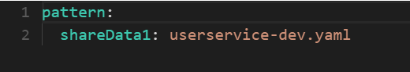

#  服务拆分及远程调用

* 拆分注意事项：
  * 不同微服务不能重复开发相同业务
  * 微服务数据独立，不要访问其他微服务的数据库
  * 微服务可以将自己的业务暴露为接口，供其他微服务调用


* 用户模块可以查询到用户信息：


* 订单模块可以查到订单信息但是查不到订单对应的用户信息：


* 此时就需要订单模块需要向用户模块发请求获取用户信息

* spring提供了RestTemplate实现各个微服务之间发送请求的需求

* 实现步骤：

  * 向订单模块的ioc容器中注入RestTemplate对象

  ```java
  package cn.itcast.order;
  
  import org.mybatis.spring.annotation.MapperScan;
  import org.springframework.boot.SpringApplication;
  import org.springframework.boot.autoconfigure.SpringBootApplication;
  import org.springframework.context.annotation.Bean;
  import org.springframework.web.client.RestTemplate;
  
  @MapperScan("cn.itcast.order.mapper")
  @SpringBootApplication
  public class OrderApplication {
  
      public static void main(String[] args) {
          SpringApplication.run(OrderApplication.class, args);
      }
  
      @Bean
      public RestTemplate restTemplate(){
          return new RestTemplate();
      }
  
  }
  ```

  * 订单信息在service中查询到，在service层中将用户信息查询到并且封装到订单信息中：

  ```java
  package cn.itcast.order.service;
  
  import cn.itcast.order.mapper.OrderMapper;
  import cn.itcast.order.pojo.Order;
  import cn.itcast.order.pojo.User;
  import org.springframework.beans.factory.annotation.Autowired;
  import org.springframework.stereotype.Service;
  import org.springframework.web.client.RestTemplate;
  
  @Service
  public class OrderService {
  
      @Autowired
      private OrderMapper orderMapper;
  
      //1.注入RestTemplate
      @Autowired
      private RestTemplate restTemplate;
  
      public Order queryOrderById(Long orderId) {
          // 2.查询订单
          Order order = orderMapper.findById(orderId);
          //3.使用RestTemplate向用户模块发送请求接收用户信息
          String url = "http://localhost:8081/user/" + order.getUserId();
          User user = restTemplate.getForObject(url, User.class);
          //4.将查询到的用户封装到订单中
          order.setUser(user);
          // 5.返回
          return order;
      }
  }
  ```

  * 此时用户信息以及封装在订单中

  

# Eureka

* 上述案例中order称为服务消费者，user称为服务提供者


## Eureka环境搭建

* 创建新maven的模块，引入服务端依赖

```xml
<dependency>
    <groupId>org.springframework.cloud</groupId>
    <artifactId>spring-cloud-starter-netflix-eureka-server</artifactId>
</dependency>
```

* 编写配置类，使用@EnableEurekaServer

```java
package cn.itcast.eureka;

import org.springframework.boot.SpringApplication;
import org.springframework.boot.autoconfigure.SpringBootApplication;
import org.springframework.cloud.netflix.eureka.server.EnableEurekaServer;

@SpringBootApplication
@EnableEurekaServer
public class EurekaApplication {
    public static void main(String[] args) {
        SpringApplication.run(EurekaApplication.class, args);
    }
}
```

* 在yaml中进行相关配置
  * 服务的端口号
  * 服务名称
  * 服务的地址信息

```yaml
server:
  port: 10086 
spring:
  application:
    name: eureka-server
eureka:
  client:
    service-url: 
      defaultZone: http://127.0.0.1:10086/eureka
```

* 启动项目

## Eureka服务注册

* 在order与user模块引入Eureka服务端依赖

```xml
<dependency>
    <groupId>org.springframework.cloud</groupId>
    <artifactId>spring-cloud-starter-netflix-eureka-client</artifactId>
</dependency>
```

* 在配置文件中进行配置

```yaml
spring:
  application:
    name: userservice
eureka:
  client:
    service-url:
      defaultZone: http://127.0.0.1:10086/eureka
```

* 启动项目,成功注册


* 注册多个userservice实例：


* 启动项目：有两个userservice的实例

## Eureka服务发现

* 使用服务名代替地址：使用userservice代替localhost:8081、localhost:8082

```java
package cn.itcast.order.service;

import cn.itcast.order.mapper.OrderMapper;
import cn.itcast.order.pojo.Order;
import cn.itcast.order.pojo.User;
import org.springframework.beans.factory.annotation.Autowired;
import org.springframework.stereotype.Service;
import org.springframework.web.client.RestTemplate;

@Service
public class OrderService {

    @Autowired
    private OrderMapper orderMapper;

    //1.注入RestTemplate
    @Autowired
    private RestTemplate restTemplate;

    public Order queryOrderById(Long orderId) {
        // 2.查询订单
        Order order = orderMapper.findById(orderId);
        //3.使用RestTemplate向用户模块发送请求接收用户信息
        String url = "http://userservice/user/" + order.getUserId();
        User user = restTemplate.getForObject(url, User.class);
        //4.将查询到的用户封装到订单中
        order.setUser(user);
        // 5.返回
        return order;
    }
}
```

* 在获取RestTemplate实例的方法上添加@LoadBalance

```java
package cn.itcast.order;

import org.mybatis.spring.annotation.MapperScan;
import org.springframework.boot.SpringApplication;
import org.springframework.boot.autoconfigure.SpringBootApplication;
import org.springframework.cloud.client.loadbalancer.LoadBalanced;
import org.springframework.context.annotation.Bean;
import org.springframework.web.client.RestTemplate;

@MapperScan("cn.itcast.order.mapper")
@SpringBootApplication
public class OrderApplication {

    public static void main(String[] args) {
        SpringApplication.run(OrderApplication.class, args);
    }

    @LoadBalanced
    @Bean
    public RestTemplate restTemplate(){
        return new RestTemplate();
    }
}
```

* 启动项目，多次访问/order/id/，会访问不同的user/id/

# Ribbon负载均衡

## 负载均衡流程


## 负载均衡策略

* Ribbon的负载均衡规则是一个叫做IRule的接口来定义的，每一个接口都是一种规则：


* 每个接口具体策略：默认为ZoneAvoidanceRule


* 具体生成策略

  * 方法一：向ioc容器中添加相应的bean
  * 特点：添加后对所有的微服务调用都会采取该策略

  ```java
      @Bean
      public IRule getRule(){
          return new RandomRule();
      }
  ```

  * 方法二：在yaml文件中配置指定的微服务的负载均衡策略
  * 特点：可以指定个别的微服务调用策略

  ```yaml
  userservice:
    ribbon:
      NFLoadBalanceRuleClassName: com.netflix.loadbalancer.RandomRule
  ```


## 饥饿加载

* Ribbon默认采用懒加载，即第一次访问时才会创建LoadBalanceClient，请求时间会比较长，而饥饿加载则会在项目启动时创建，降低第一次访问的耗时，通过下面配置开启饥饿加载

```yaml
ribbon: 
  eager-load: 
  	enabled: true #开启饥饿加载
  	clients: #指定饥饿加载的微服务名称list
  	  - userserver
```

# Nacos注册管理

## Nacos的安装与启动

## Nacos服务注册与发现

* 在父工程中导入alibaba的管理依赖

```xml
<dependency>
    <groupId>com.alibaba.cloud</groupId>
    <artifactId>spring-cloud-alibaba-dependencies</artifactId>
    <version>2.2.5.RELEASE</version>
    <type>pom</type>
    <scope>import</scope>
</dependency>
```

* 在子工程中导入nacos的客户端依赖

```xml
<!-- nacos客户端依赖包 -->
<dependency>
    <groupId>com.alibaba.cloud</groupId>
    <artifactId>spring-cloud-starter-alibaba-nacos-discovery</artifactId>
</dependency>
```

* 在配置文件中配置

```yaml
spring:
  application:
    name: userservice
spring:
  cloud:
    nacos:
      server-addr: localhost:8848 #这里可以不进行配置，默认8848
```

* 对服务进行观测管理


## Nacos分级存储

### 模型

* 一级是服务，例如userserver
* 二级是集群，例如杭州、上海
* 三级是实例，例如杭州某机房部署了userservice的服务器


### 设置实例的集群属性

* 修改配置文件

```yaml
spring:
  cloud:
    nacos:
      server-addr: localhost:8848
      discovery:
        cluster-name: HZ
```


## NacosRule负载均衡规则

* userservice1的集群：HZ
* userservice2的集群：BJ
* orderservice的集群：HZ
* 规则：
  * orderservice会优先访问本地集群中的userservice服务（随机访问），若没有本地该服务则会跨集群访问，出现跨集群访问时会进行warning

* 配置该负载均衡规则

```java
	@Bean
    public IRule iRule(){
        return new NacosRule();
    }
```


* 此时停止8081的服务，进行访问会访问8082，但是会warning因为进行了跨集群访问

## 服务实例的权重设置

* 在HZ集群下，对userservice的调用是采用随机的方式，在实际生产环境考虑到不同服务器的质量等，我们可以设置不同实例的访问权重


* 可以在此设置实例的权重：值为0-1
* 同集群的多个实例，权重越高，访问频率越高
* 设置0时该实例不会被访问

## 环境隔离

* nacos中服务存储和数量的最外层都是一个名为namespace的东西，用来做最外层隔离


* namespace用来做环境隔离
* 每个namespace都有唯一的id
* 不同namespace下的服务不可见

* 创建一个namespace：


* 在项目的yaml文件中配置ID

```yaml
spring:
  cloud:
    nacos:
      discovery:
        namespace: 47379e5f-bbd1-45ea-b03d-a1a9dc35dd9d
```


* 此时orderservice无法访问userservice

# Nacos配置管理

* Nacos不仅可以做统一的注册管理，还可以做统一的配置管理


## 添加配置管理


* 配置中一般写入可变的配置，像数据库连接相关配置一般不会这样配置因为不可变

## 配置拉取


* 引入Nacos的配置管理客户端依赖

```xml
        <dependency>
            <groupId>com.alibaba.cloud</groupId>
            <artifactId>spring-cloud-starter-alibaba-nacos-config</artifactId>
        </dependency>
```

* 在userservice中的resource中添加bootstrap.yaml文件,并且进行nacos的相关配置，这个文件是引导文件，优先级高于application.yaml

```yaml
spring:
  application:
    name: userservice # 服务名称
  profiles:
    active: dev #开发环境，这里是dev 
  cloud:
    nacos:
      server-addr: localhost:8848 # Nacos地址
      config:
        file-extension: yaml # 文件后缀名
```

* 测试是否能读取到nacos配置文件

```java
    @Value("${pattern.dateformat}")//测试nacos配置文件中信息能否读取
    private String dateformat;

    @GetMapping("/time")
    public String getTime(){
        Date date = new Date();
        SimpleDateFormat simpleDateFormat = new SimpleDateFormat(dateformat);
        String format = simpleDateFormat.format(date);
        return format;
    }
```

## 配置热更新

* nacos配置更新更改后，微服务可以实现热更新，有两种方式：

  * 方式一：通过@Value注入的值，可以配合@RefreshScope使用

  

  * 方式二：直接使用@ConfigurationProperties

  ```java
  package cn.itcast.user;
  
  import lombok.Data;
  import org.springframework.boot.context.properties.ConfigurationProperties;
  import org.springframework.stereotype.Component;
  
  @Data
  @Component
  @ConfigurationProperties(prefix = "pattern")
  public class Config {
      private String dateformat;
  }
  ```

  将该类的属性作为值

  ```java
  package cn.itcast.user.web;
  
  @Slf4j
  @RestController
  @RequestMapping("/user")
  public class UserController {
      @Autowired
      private Config config;
  
      @GetMapping("/time")
      public String getTime(){
          Date date = new Date();
          SimpleDateFormat simpleDateFormat = new SimpleDateFormat(config.getDateformat());
          String format = simpleDateFormat.format(date);
          return format;
      }
  }
  ```


## 多环境配置共享

* 微服务启动时会从nacos中读取多个配置文件，加上本地的配置文件，一共有三个
  * userservice-dev.yaml
  * userservice.yaml
  * application.yaml
* 其中userservice.yaml多所有的userservice实例都会读取到。
* 而userservice-dev.yaml只能被dev环境下的userservice实例读取到
* application.yaml只能被本userservice实例读取到

* 测试几个配置文件中的信息：

  * 提供dev与test环境的userservice实例

  

  * 在userservice-dev.yaml提供共享数据

  

  * 在userservice.yaml中提供共享数据

  
  * 分别启动test环境和dev环境下的userservice实例读取shareData1、shareData2

    

    

* 三个配置文件的优先级：当三个配置文件有相同的属性时，会按照一下优先级进行读取
  * userservice-dev.yaml
  * userservice.yaml
  * application.yaml

# Nacos集群搭建

# Feign

* 之前使用RestTemplate发起远程调用存在以下问题：

  * 代码可读性差，编程体验不统一
  * 参数复杂URL难以维护

* Feign是一个声明式http客户端，其作用是帮助我们优雅的实现http请求的发送，解决以上问题

* 使用Fegin的步骤如下

  * 引入相关依赖

  ```xml
          <dependency>
              <groupId>org.springframework.cloud</groupId>
              <artifactId>spring-cloud-starter-openfeign</artifactId>
          </dependency>
  ```

  * 在启动类上添加@EnableFeignClients开启Fegin功能
  * 编写Fegin客户端

  ```java
  @FeignClient("userservice")
  public interface UserClient {
      @GetMapping("/user/{id}")
      User getUser(@PathVariable Long id);
  }
  ```

  * 在业务层使用Fegin发起远程调用

  ```java
  package cn.itcast.order.service;
  
  import cn.itcast.order.client.UserClient;
  import cn.itcast.order.mapper.OrderMapper;
  import cn.itcast.order.pojo.Order;
  import cn.itcast.order.pojo.User;
  import org.springframework.beans.factory.annotation.Autowired;
  import org.springframework.stereotype.Service;
  
  @Service
  public class OrderService {
  
      @Autowired
      private OrderMapper orderMapper;
  
      //1.注入UserClient
      @Autowired
      private UserClient userClient;
      public Order queryOrderById(Long orderId) {
          // 2.查询订单
          Order order = orderMapper.findById(orderId);
          //3.使用UserClient发起远程调用获取User对象
          User user = userClient.getUser(order.getUserId());
          //4.将查询到的用户封装到订单中
          order.setUser(user);
          // 5.返回
          return order;
      }
  }
  ```

  * 进行测试：可以发现Feign还实现了负载均衡

## Feign的超时控制

* 超时报错演示:

  * payment8001的业务层时间超过了三秒

  ```java
  @GetMapping("/feign/timeout")
      public String timeOutTest(){
          try {
              Thread.sleep(3000);
          } catch (InterruptedException e) {
              throw new RuntimeException(e);
          }
          return "TimeOutTest";
      }
  ```

  * 在消费者模块编写feign客户端调用payment8001该业务

  ```java
  @FeignClient("CLOUD-PAYMENT-SERVICE")
  public interface PaymentFeignService {
      @GetMapping("/payment/select/{id}")
      Result<Payment> select(@PathVariable("id") Long id);
  
      @GetMapping("/payment/feign/timeout")
      String timeOutTest();
  }
  ```

  * 消费者模块调用feign客户端

  ```java
    @GetMapping("/feign/timeout")
      public String timeOutTest(){
          return paymentFeignService.timeOutTest();
      }
  ```

  * 调用报错：Read timed out executing GET http://CLOUD-PAYMENT-SERVICE/payment/feign/timeout

  * OpenFeign默认等待1秒钟，超过后报错 

* 我们可以通过修改该默认时间解决该报错问题

```yaml
#设置feign客户端超时时间(OpenFeign默认支持ribbon)
ribbon:
#指的是建立连接后从服务器读取到可用资源所用的时间
  ReadTimeout: 5000
#指的是建立连接所用的时间，适用于网络状况正常的情况下,两端连接所用的时间
  ConnectTimeout: 5000
```


## Feign自定义配置


## 对日志的级别进行自定义配置

* Feign 提供了日志打印功能，我们可以通过配置来调整日志级别，从而了解 Feign 中 Http 请求的细节。
  说白了就是对Feign接口的调用情况进行监控和输出
* 日志级别：
  * NONE：默认的，不显示任何日志；
  * BASIC：仅记录请求方法、URL、响应状态码及执行时间；
  * HEADERS：除了 BASIC 中定义的信息之外，还有请求和响应的头信息；
  * FULL：除了 HEADERS 中定义的信息之外，还有请求和响应的正文及元数据。

* 使用配置文件配置：

```yaml
#全局配置
feign: 
  client: 
    config: 
      default: # 这里default就是全局配置，如果写服务名称，就是针对某个微服务的配置
      	loggerLevel: FULL # 日志级别
```

```yaml
#局部配置
feign: 
  client: 
    config: 
      userservice:
      	loggerLevel: FULL # 日志级别
```

* 使用注解进行配置1

  * 首先配置Bean

  

  * 进行全局配置/局部配置

    全局配置：放在启动类的@EnableFeignClients中

    

    局部配置：放在接口中的@FeignClient中

    

## Feign性能优化

* Feign底层可以使用不同的客户端
  * URLConnection是JDK内自带的


* 使用HttpClient进行实现

  * 导入HttpClient依赖

  ~~~xml
  <dependency>
      <groupId>io.github.openfeign</groupId>
      <artifactId>fegin-httpclient</artifactId>
  </dependency>
  ~~~

  * 配置连接池

  ```yaml
  fegin:
    client: 
    	config:
    	  ...
    httpclient:
      enabled: true #开启feign对HttpClient的支持
      max-connections: 200 #最大连接数
      max-connections-per-route: 50 # 每个路径的最大连接数
  ```


## feign-api

* 多个模块都需要用到feign客户端时，防止重复编写因此将feign客户端模块独立出来

* 具体做法：

  * 创建新的module：feign-api，引入feign的starter依赖

  ```xml
          <dependency>
              <groupId>org.springframework.cloud</groupId>
              <artifactId>spring-cloud-starter-openfeign</artifactId>
          </dependency>
  ```

  * 将UserClient、User等移动到feign-api中

  * 在orderservice中引入feign-api的依赖

  ```xml
          <dependency>
              <groupId>cn.itcast.demo</groupId>
              <artifactId>feign-api</artifactId>
              <version>1.0</version>
          </dependency>
  ```

  * 在orderservice中引入相关类

  * 由于UserClient不在orderservice中，因此ioc容器中不含UserClient的bean

    * 方案一：指定FeignClient所在的包

    ```java
    @EnableFeignClients(basePackages = "com.shy.client")
    ```

    * 方案二：指定FeginClient的类

    ```java
    @EnableFeignClients(clients = UserClient.class)
    ```

  * 启动项目测试

# Gateway网关

网关的功能：

* 身份认证和权限校验
* 服务路由、负载均衡
* 请求限流

## 搭建网关服务

* 创建新的springboot项目，引入相关依赖

```xml
        <dependency>
            <groupId>com.alibaba.cloud</groupId>
            <artifactId>spring-cloud-starter-alibaba-nacos-discovery</artifactId>
        </dependency>
        <dependency>
            <groupId>org.springframework.cloud</groupId>
            <artifactId>spring-cloud-starter-gateway</artifactId>
        </dependency>
```

* 配置文件

```yaml
server:
  port: 10010
spring:
  application:
    name: getway
  cloud:
    nacos:
      server-addr: localhost:8848
    gateway:
      routes: #网关路由配置
        - id: user-service #路由id，自定义，唯一即可
          uri: lb://userservice #路由的目标地址 lb就是负载均衡，后面跟服务名称
          #也可以：http:127.0.0.1:8081 指定服务
          predicates: #路由断言，判断请求是否符合规则
            - Path=/user/**
```

* 启动项目访问 localhost:10010/user/1

## 路由断言工程

* predicates：路由断言，判断请求是否符合要求，符合则转发到路由目的地

* 路由断言工程：

  * 在配置文件中的规则只是字符串，这些字符串会被Predicate Factory读取并且处理，转变路由条件。
  * 比如Path=/user/** 是由PathRoutePredicateFactory类来处理
  * 类似的断言工厂还有10多个：

  

* 如果断言判断出来是否，则会响应404

## 路由过滤器

* GatewayFilter是网关中提供的一种过滤器，可以对进入网关的请求和微服务返回的响应做处理：


* spring提供 了31种网关过滤器：


* AddRequestHeader：添加后，为userservice的服务请求添加了一对响应头：
  * Truth=Itcast is freaking awesome!


* default-filters：对所有的路由请求添加默认过滤器


* 全局过滤器

# Docker入门

## 镜像操作

* 镜像名称由两部分组成：mysql:5.7
  * 若不指定版本默认为latest为最新版本6

* 操作命令：
  * 查看docker文档
    * docker --help：查看所有帮助文档
    * docker images --help：查看images：查看images指令的相关文档
  * docker pull nginx：拉取镜像
  * docker rmi 镜像名称或者id：删除本地镜像
  * docker images：查看本地镜像
  * docker save -o nginx.tar nginx:latest：到处镜像到nginx.tar中
  * docker load -i /usr/nginx.tar：加载nginx.tar到镜像

## 容器操作


* docker run --name containerName -p 80:80 -d nginx

  * docker run：创建容器
  * --name containerName：起名
  * -p 80:80：将宿主机端口与容器端口映射，冒号左侧是主机端口，右侧是容器端口

  

  * -d：后台运行容器
  * nginx：镜像名


* 创建后会得到唯一的ID
* docker ps：查看运行中所有容器
  * docker ps -a：查看所有的容器
* docker logs name：查看指定名的docker容器
  * docker logs -f name：进入持续输出日志 ctrl+z退出
* docker exec相关的进入容器：不建议使用
* docker rm 容器名/id：删除指定非运行状态容器
  * -f：强制删除

## 数据卷操作

* 数据卷是一个虚拟目录，指向宿主机文件中的某个目录

* 数据卷的作用：

  * 将容器与数据分离，解耦合，方便操作容器内数据，保证数据安全

  

* docker volume create 数据卷名：创建一个数据卷
* docker volume ls：查看所有数据卷
* docker volume inspect 数据卷名：查看指定数据卷的详细信息
* docker volume prune：删除所有未使用的数据卷
* docker volume rm 数据卷名：删除指定数据卷

* docker run --name nginxcontainer -p 80:80 -v html:/usr/share/nginx/html -d nginx：创建容器并且将/usr/share/nginx/html挂载到html数据卷下
  
  * 当数据卷不存在时，docker会自动创建

## 练习

创建并且运行一个mysql容器，将宿主机目录直接挂载到容器

* 目录挂载：

  * -v 宿主机目录:容器内目录
  * -v 宿主机文件:容器内文件
    * 此时宿主机的文件会直接覆盖容器内文件

* 实现过程：

  * 加载mysql镜像
  * 创建/tmp/mysql/data：作为数据库存储文件
  * 创建/tmp/mysql/conf：作为数据库配置文件
    * 将相关配置放入该文件夹
  * 创建并且运行mysql容器

  ```
  docker run \
   --name mysqlcontainer \
   -e MYSQL_ROOT_PASSWORD=abc123 \
   -p 13306:13306 \
   -v /tmp/mysql/conf/hmy.cnf:/etc/mysql/conf.d/hmy.cnf \
   -v /tmp/mysql/data:/var/lib/mysql \
   -d  \
   mysql:5.7.25
  ```


## Dockerfile自定义镜像

* 镜像是将应用程序及其需要的系统函数库、环境、配置、依赖打包而成
* 镜像是分层结构，每一层称为一个Layer
  * BaseImage层：包含基本的系统库函数、环境变量、系统文件
  * Entrypoint：入口，是镜像中应用启动的命令
  * 其他：在BaseImage基础上添加依赖、安装程序、完成整个应用的安装和配置

# MQ入门

## 同步通讯与异步通讯

微服务间通讯有同步和异步两种方式：

同步通讯：就像打电话，需要实时响应。

异步通讯：就像发邮件，不需要马上回复。


两种方式各有优劣，打电话可以立即得到响应，但是你却不能跟多个人同时通话。发送邮件可以同时与多个人收发邮件，但是往往响应会有延迟。

### 同步通讯

我们之前学习的Feign调用就属于同步方式，虽然调用可以实时得到结果，但存在下面的问题：


总结：

同步调用的优点：

- 时效性较强，可以立即得到结果

同步调用的问题：

- 耦合度高
- 性能和吞吐能力下降
- 有额外的资源消耗
- 有级联失败问题

### 异步通讯

异步调用则可以避免上述问题：

我们以购买商品为例，用户支付后需要调用订单服务完成订单状态修改，调用物流服务，从仓库分配响应的库存并准备发货。

在事件模式中，支付服务是事件发布者（publisher），在支付完成后只需要发布一个支付成功的事件（event），事件中带上订单id。

订单服务和物流服务是事件订阅者（Consumer），订阅支付成功的事件，监听到事件后完成自己业务即可。

为了解除事件发布者与订阅者之间的耦合，两者并不是直接通信，而是有一个中间人（Broker）。发布者发布事件到Broker，不关心谁来订阅事件。订阅者从Broker订阅事件，不关心谁发来的消息。


Broker 是一个像数据总线一样的东西，所有的服务要接收数据和发送数据都发到这个总线上，这个总线就像协议一样，让服务间的通讯变得标准和可控。

好处：

- 吞吐量提升：无需等待订阅者处理完成，响应更快速

- 故障隔离：服务没有直接调用，不存在级联失败问题
- 调用间没有阻塞，不会造成无效的资源占用
- 耦合度极低，每个服务都可以灵活插拔，可替换
- 流量削峰：不管发布事件的流量波动多大，都由Broker接收，订阅者可以按照自己的速度去处理事件

缺点：

- 架构复杂了，业务没有明显的流程线，不好管理
- 需要依赖于Broker的可靠、安全、性能

好在现在开源软件或云平台上 Broker 的软件是非常成熟的，比较常见的一种就是我们今天要学习的MQ技术。

## MQ技术对比

MQ，中文是消息队列（MessageQueue），字面来看就是存放消息的队列。也就是事件驱动架构中的Broker。

比较常见的MQ实现：

- ActiveMQ
- RabbitMQ
- RocketMQ
- Kafka

几种常见MQ的对比：

|            | **RabbitMQ**            | **ActiveMQ**                   | **RocketMQ** | **Kafka**  |
| ---------- | ----------------------- | ------------------------------ | ------------ | ---------- |
| 公司/社区  | Rabbit                  | Apache                         | 阿里         | Apache     |
| 开发语言   | Erlang                  | Java                           | Java         | Scala&Java |
| 协议支持   | AMQP，XMPP，SMTP，STOMP | OpenWire,STOMP，REST,XMPP,AMQP | 自定义协议   | 自定义协议 |
| 可用性     | 高                      | 一般                           | 高           | 高         |
| 单机吞吐量 | 一般                    | 差                             | 高           | 非常高     |
| 消息延迟   | 微秒级                  | 毫秒级                         | 毫秒级       | 毫秒以内   |
| 消息可靠性 | 高                      | 一般                           | 高           | 一般       |

追求可用性：Kafka、 RocketMQ 、RabbitMQ

追求可靠性：RabbitMQ、RocketMQ

追求吞吐能力：RocketMQ、Kafka

追求消息低延迟：RabbitMQ、Kafka

## docker下RabbitMQ的安装

* 拉取镜像

```
docker pull rabbitmq:3-management
```

* 创建启动容器
  * 15672端口是管理平台的端口
  * 5672端口是消息通信的端口
  * hostname是主机名，集群部署必须配，单机可以不配

```
docker run \
 -e RABBITMQ_DEFAULT_USER=shy \
 -e RABBITMQ_DEFAULT_PASS=abc123 \
 --name mq \
 --hostname mq1 \
 -p 15672:15672 \
 -p 5672:5672 \
 -d \
 rabbitmq:3-management
```

* 访问15672端口
  * 用户名密码就是在创建启动容器时候设置的用户名密码


## MQ的基本结构：


RabbitMQ中的一些角色：

- publisher：生产者
- consumer：消费者
- exchange个：交换机，负责消息路由
- queue：队列，存储消息
- virtualHost：虚拟主机，隔离不同租户的exchange、queue、消息的隔离